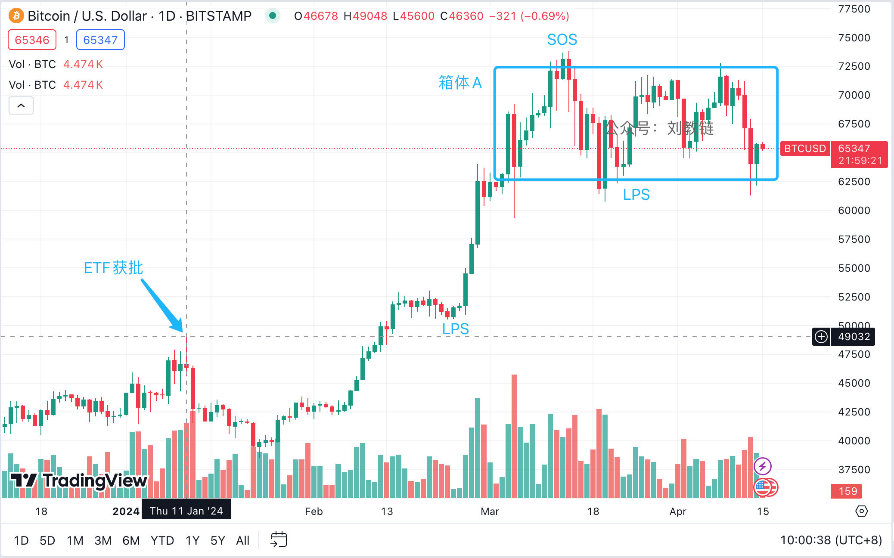

# 赢x5

* * *

东风夜放花千树，更吹落，星如雨。

伊报复以，出乎诸多专家事前分析的意料之外，乃直击本土。185架无人机，110枚地对地导弹，36枚巡航导弹。以说：99%都被拦截，漏网几枚，仅对建筑物造成轻伤，成功防御，我方赢了。伊说：报复行动已完成，成功实现目标，赢了。美说：伊没打我军事基地，所以我绝不会和伊开打，我没有被以拖下水，嘿嘿，我也赢了。巴说：为了防御伊，以撤退了，我们也赢了。逢跌加仓的投资者说：《炮弹击沉仓位》时，我趁机抄底，危机一天就解除，市场迅速反弹，BTC已回升至65k以上，我也赢麻了，哈哈。

赢赢赢赢赢。五赢。大家都赢麻了。

但是，有句经典的话言犹在耳：如果你入了一个局，却不知道谁是输家，那么你就是那个输家。一个牌桌上，怎么会都是赢家呢？

这场行动，表面上是一次军事行动，其实是一次政治行动。所考验的，是各方的政治智慧。

* * *

1958年7月27日彭、黄收到教员一封信：“睡不着觉，想了一下。打金门停止若干天似较适宜。目前不打，看一看形势。彼方换防不打，不换防也不打；等彼方无理进攻，再行反攻；中东问题的解决，需要有时间，我们是有时间的，何必急呢？暂时不打，总有打之一日。彼方如攻漳、汕、福州、杭州，那就最妙了。这个主意，你看如何？找几个同志议一议如何？政治挂帅，反复推敲，极为有益。一鼓作气，往往想得不周，我就往往如此，有时难免失算。你意如何？如彼来攻，等几天，考虑明白，再作攻击。以上种种，是不是算得运筹帷幄之中，制敌千里之外，我战则克，较有把握呢？不打无把握之仗的原则，必须坚持。如你同意，将此信电告叶飞，过细考虑一下，以其意见见告。”

后，又据叶飞上将回忆：“金门向台湾告急，蒋介石便请求美国军舰护航。这样，事情就搅复杂了。怎样对付美国人护航呢？美国的军舰左右配置，国民党军的舰只夹在中间，而且间隔只有二海里。毛主席下令，‘只准打蒋舰，不准打美舰。’要我们避开美舰护航，等蒋舰到港口后才能开炮，还要我们每半小时向北京报告一次。这个指示可难执行了，不好掌握。我们又请示一个问题：如果护航的美舰向我们开炮怎么办？毛主席马上答复：‘如果美舰开炮，不准还炮。’我怕是电话里没有传清楚，又重复问了三遍，答复是‘不准还击’。于是，我向各炮群下达主席的命令。这个时候，蒋舰已进至港口卸货，再不打不行了。我马上请示北京，才下令开炮。我们一顿密集的炮击，一下子击沉了一艘蒋舰。我们的炮声一响，美舰不但没有还击，反而掉转头就跑，大出洋相！美舰一跑，蒋舰孤孤单单的，完全暴露在我炮火之下，向台湾告急。台湾方面问：朋友呢？蒋舰说：什么朋友不朋友，早就逃跑了。他们互相指责，骂美国人混蛋。事后我才明白，毛主席这个动作很高明。主席的意图是要摸美国人的底。美国人表面上气势汹汹，究竟敢不敢和我们打？原来美国是只纸老虎，一打起来就跑了。金门炮战，是我们与美国互相摸底的一出戏，一出很紧张很有意思的戏。”

几十年前讲过的话，如今誊抄一份，直接寄出去，似乎都毫无违和。这就是穿越时空的永恒经典。

* * *

有一种说法，称空头誓要把现货BTC ETF获批以来的涨幅都给打回去。

现在多空双方激烈博弈，此前的楔形收敛形态已经破坏。以62500-72500组合起来成为一个箱体，如下图。

教链把ETF获批的时间点标注在了图上。总体而言，自ETF获批以来，BTC的走势大体上是 50000(获批) - 40000(Test) - 50000(LPS) - 62500(LPS) - 72500(SOS) - 振荡，这很像一个wyckoff积累模式的右侧。不妨对照一下教链3.26文章《比特币再破7万刀》中的图：（术语解释：LPS - 最后支撑点；SOS - 强势信号）

而这个wyckoff模式的阻力区，正是现在62500-72500的箱体，其所对应的wyckoff模式的左侧A阶段的高点是哪里呢？2021年的牛顶。

最多的人，要在强势信号出现后的洗盘中，下车离场，从而与后半场无缘。

经得住历史车轮剧烈颠簸的人，才会是最后的赢家。

