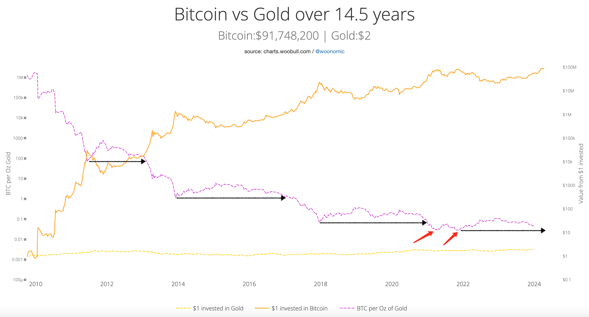

# 比特币前方只有一条路，那就是向上

号外：教链内参4.15《香港批准BTC和ETH现货ETF》

* * *

现在的加密市场，就像乍暖还寒的北方初春，突然有那么几天热得要命，等你刚减了衣服，马上跟上几天冷得要死，没有及时加衣的人甚至要被这气温的忽上忽下折腾地生了病。

老话儿说得好，春捂秋冻。春天的人，刚刚从冬天的寒冷中过来，还不能突然适应，稍微穿暖一点儿，宁热勿冷，避免节节攀升的气温突然杀个回马枪，感了风寒。

减衣如加仓。

刚刚过去这一轮，3万刀以下，那是严冬。时间上自2022年6月份起，至2023年10月份止。

3万刀到6万多刀，乃至于突破了2021年前高，时间上2023年10月份至今2024年4月，马上就要产量减半，这是刚刚冬去春来，步入了冷热相交的初春。

蒌蒿满地芦芽短，正是河豚欲上时。

减衣要慢慢地减，加仓要慢慢地加。别一看到气温蹭地上去了，中午晌儿的大太阳照着，户外一活动，就要流汗，于是便一把脱了外套和毛衣，直接穿起了短袖T恤。更有甚者直接脱个精光，一个猛子扎到仍然刺骨的海水里去游泳。这就很容易着凉。

戒急用忍八字诀。（参阅教链2023.7.21文章《梭哈不如八字诀》，2023.3.25图文《不动如山八字诀》）

不必焦虑，不要急躁。春天已经来了，夏天还会远吗？

极目远眺，在BTC（比特币）的前方，蜿蜒崎岖的，只有一条路，那就是向上。

挫折是暂时的，而胜利是必然的。

上小学的娃儿问我“信念”这个词是什么意思。我说，信念的意思就是你坚定地相信，一定会成功，一定会取得胜利。

偶然看到有人谈论黄金和BTC的比值（汇率）。目前BTC/t.oz（金衡盎司）大约是 $2384 / $63400 = 0.0376。这个汇率的历史极值是0.028。时间点想必大家也能猜到，正是2021年的两个小牛顶附近，即2021年4月和11月。

上图中，紫色虚线便是过去近15年来黄金和BTC的汇率走势。两个红色箭头，指出了2021年4月和11月两次到达历史新低。在过去，如图中黑色箭头所指示的那样，每次该汇率重新跌破此前极值点，就会引发一波BTC的暴涨，从而将汇率推到一个新低的水平。

有人曾表示担心。担心美元如果真的不行了，那么BTC岂不是无法计价了？

这种思维，简直就和担心“没了企业家，那么岂不是没人给打工人发工资”，或者“没了地主，那么岂不是没人把地租给农民耕种”一样脑袋生锈。这种人的脑袋里，非得有一个“皇帝”不可。

没了张屠户，还吃带毛猪？

AI要颠覆上层建筑，而不是经济基础。你看看，黎巴嫩都搞出来世界上第一位AI（人工智能）总统了。AI都正式当总统了，离取代企业家和经理人还远吗？

关键是，这个AI不能是“中心化”的，即不能被一个幕后老板或者单一利益集团所控制，它必须是“去中心化”的，代表整体的利益，而不能只代表某个利益集团或某个人的特殊利益。

就像BTC。BTC不代表矿工集团的单方面利益，不代表开发者们的单方面利益，也不代表任何一个单一群体的单方面利益。BTC代表的，是整个BTC生态全体参与者的整体利益。

曾有企业家朋友扬言说，未来AI要淘汰全部的底层劳动者，届时他这样的老板们则有AI给他们不眠不休地干活，爽歪歪。依我看，这实在是属于资产阶级立场的胡思乱想。我敢大胆地推测，就算等到AI全面取代和消灭整个企业家及其代理人阶层的时候，可能掏粪工、清洁工和水管工都还不会失业。

人类迟早发现，在统御全局和战略决策上面，人不如计算机。

在货币政策问题上，美联储的几个老头一开会，就决定全世界的命运。我相信，他们几个人类的决策，一定比不上BTC这样不受任何人干扰的计算发行。

美元衰退是历史的必然。这符合天道。没有什么东西，能够不盛极而衰。

当世界习惯了几十年的价值参照物衰退的时候，各种法币、各类资产，势必要重新寻找价值锚点。

美元的锚是什么？

1971年布雷顿森林体系解体前，美元的锚是黄金。有多少黄金，才能发行多少美元。

布雷顿森林解体后，美元的锚是什么？有人说是石油。甚至编造出石油美元的说法。

但是，显然，石油美元和黄金美元根本不是一个意思。黄金美元，是按照黄金的储备量来决定美元的发行量。石油美元，却是强制只有美元才能购买石油。

在960万平方公里内，只有人民币才能买馒头。但我们不能说人民币的锚是馒头吧？

石油美元，是一个构词法的障眼法。美元的锚不是石油本身，而是强制石油必须以美元结算的强制力 —— 美国对全世界的强制力，本质上，就是武力。武力本质是军力，军力本质是暴力。

脱锚黄金的美元，从一个和平货币蜕变成了一个暴力货币。

黄金美元是和平的，因为黄金是和平的。黄金是和平的，因为黄金不能生息。

黄金不能自动增殖自身。金原子不能生出小金原子。黄金不能天然生息，因此它没有“租”。黄金没有“租”，也就没有暴力和剥削。

BTC也不能生息。1 BTC恒等于1 BTC。因此，BTC也是和平的，而不是暴力的和剥削的。（相反的，PoS代币的存币生息，终极意义就是暴力剥削，若无暴力可保证剥削，那么其价值必然衰落）

BTC的锚从来都不是美元。只是因为现在大家拿美元换BTC，所以习惯上用美元来计价而已。BTC的锚是能量。这能量，最终来自于宇宙中的恒星。（参阅教链3.7文章《比特币不只是人类自由的定价，而是对人类宇宙文明等级的精确测量》）

BTC锚定能量的方式，也完全不同于当年美元锚定黄金的方式。

当年美元锚定黄金，是把黄金保存在仓库中，据此发行等量的美元。问题就是，当黄金亏空，或者美元过量时，资产负债表就成为一纸谎言。换句话说，会计学根本就约束不了人性欲望和权力力量，资产负债表必然沦为谎言。信用背书的结局必定是信用破产。当1971年尼克松总统单方面宣布中止美元和黄金的兑换时，美元就踏上了信用破产的道路，一骑绝尘。

BTC锚定能量的方式，不是把能量保存起来，却是把能量消耗掉。这样，能量还给宇宙，负熵注入BTC。这里没有资产负债表，也没有信用背书，也就压根儿不存在信用破产问题。（参阅教链2020.11.28文章《比特币永不破产》）

所以，本质上讲，当我们谈论BTC的上涨时，其实我们谈论的是法币和其他资产（比如黄金）的跌落。（参阅教链2021.6.30《小杂感》）

从BTC本位的角度讲，BTC从来就没有什么上涨。1 BTC永远是1 BTC。只不过，1美元所能兑换的BTC数量，越来越少，1盎司黄金所能兑换的BTC数量，也越来越少罢了。

