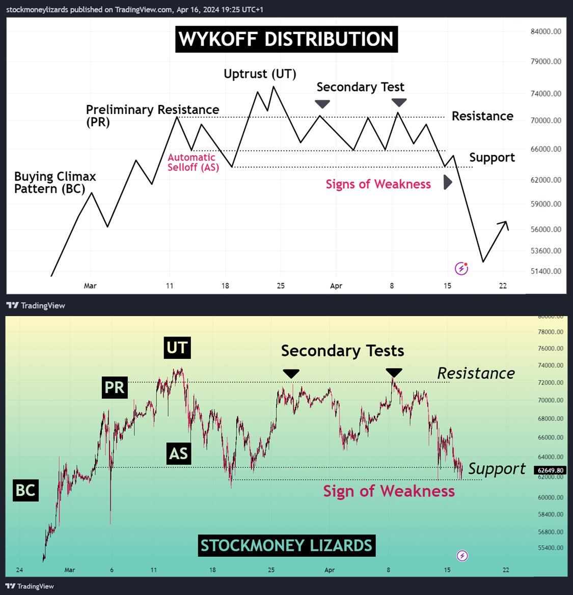
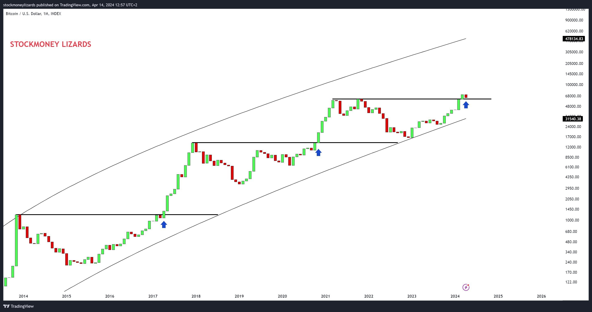
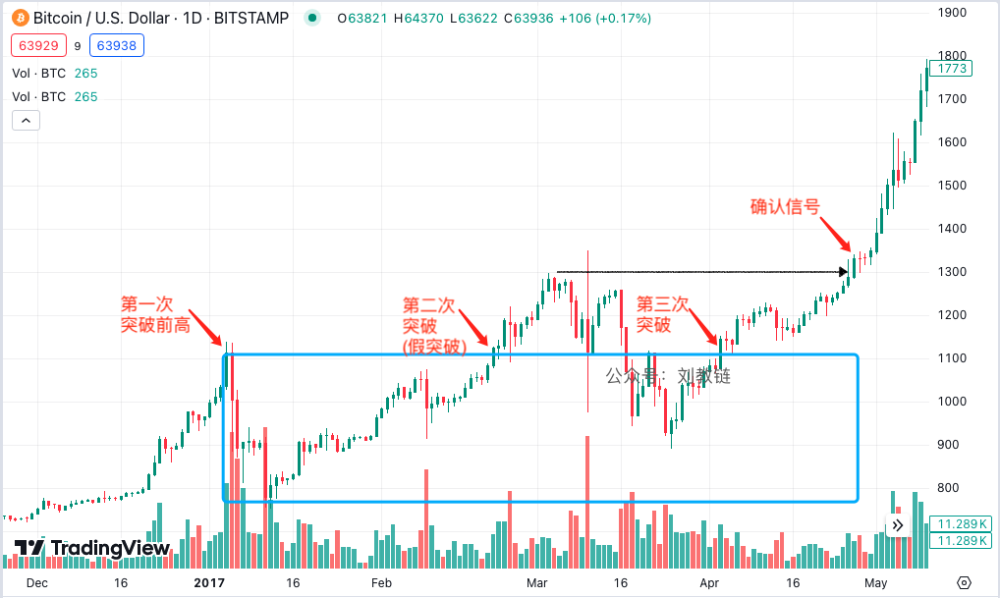
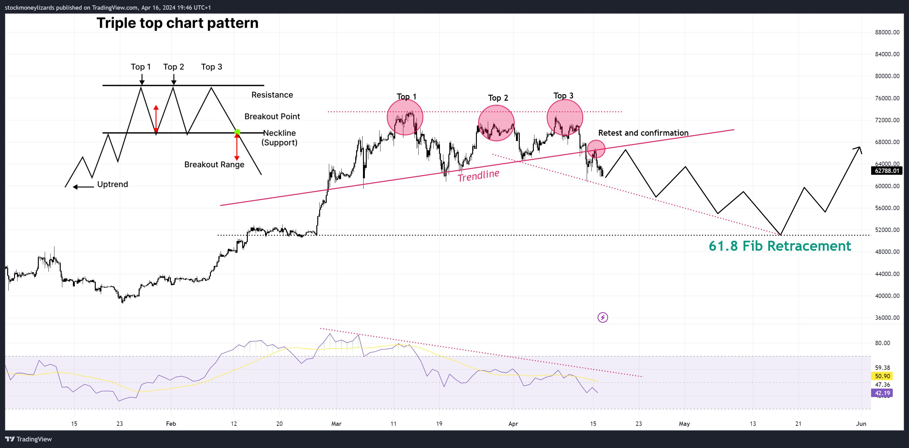
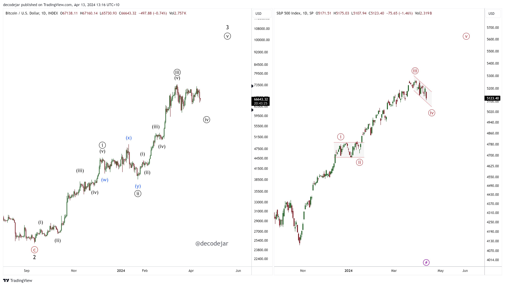
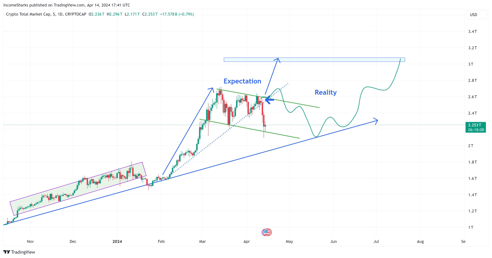
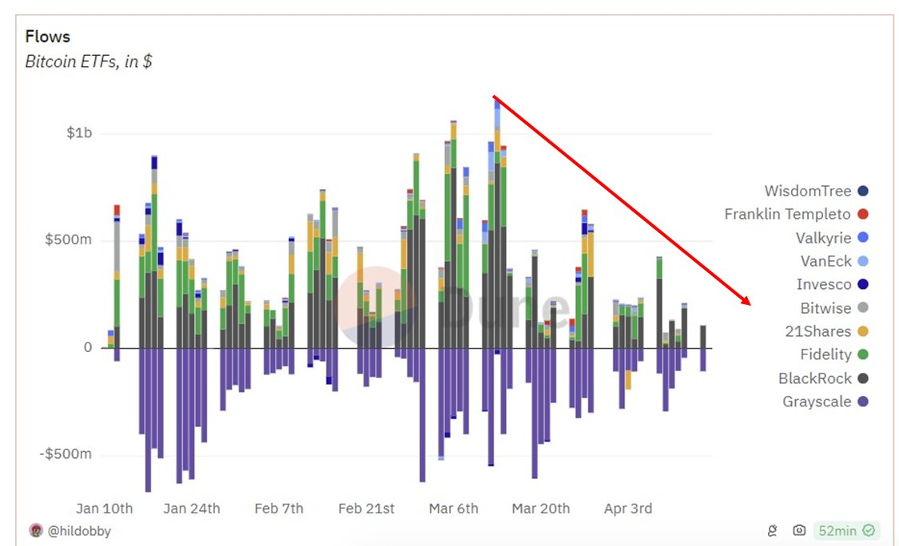
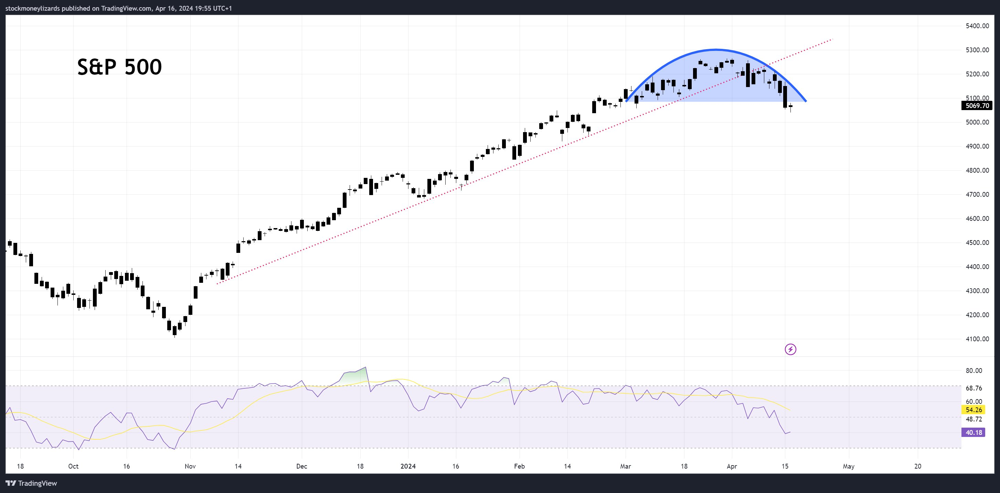
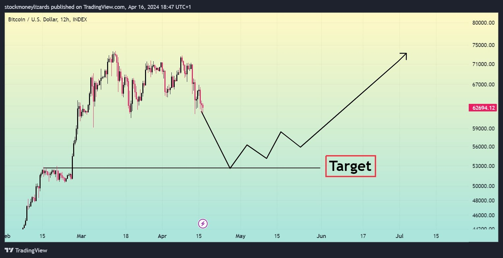
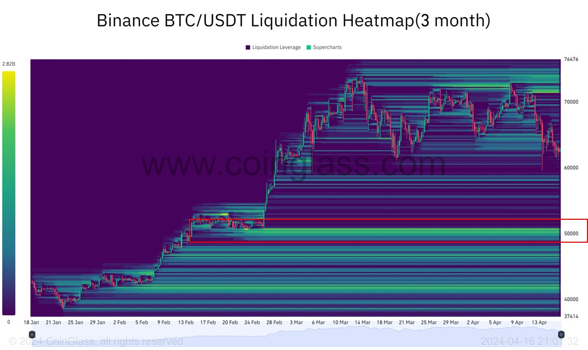

# 早期洗盘还是中期走熊？

号外：教链内参4.16《牛市早期大洗盘》

* * *

星桥鹊驾，经年才见，想离情、别恨难穷。牵牛织女，莫是离中。甚霎儿晴，霎儿雨，霎儿风。

无论市场阴晴、风雨变幻，囤饼人心中只有BTC（比特币）。 前日4.15文章《赢x5》，说到现在是wyckoff积累模式尾端洗盘。昨夜4.16教链内参《牛市早期大洗盘》，提到有诸研究机构认为目前是牛市早期阶段的洗盘，亦暗合4.15教链内参《香港批准BTC和ETH现货ETF》中的判断。

已故的投资大师芒格说过，看一个人智商高低，就要看他是否能容纳两套完全相反的观点在脑子里而仍能从容行事。我们也要时刻注意，保持开放心态，容许任何有益的、讲道理的反对观点进入自己的视线和脑海。网友Stockmoney Lizards就对当前的市场形势提出了一些别样的见解。

目前而言，从宏观角度，人们遑遑于相反的牛熊因素：三战，归零？BTC产量减半，上天？新高，开启牛市？美经济形势良好，继续加息，归零？…… 实在是冰火两重天。

该网友的看法是，目前BTC正在走出一个wyckoff顶部派发模式。见下图：

技术图形总是后知后觉的 —— 只有当市场走完了这个形态，人们才能看清楚这是一个什么形态。

那么目前，BTC正处在悬崖边上：62k支撑一旦跌穿，三顶下跌可是够多头喝上一大壶的。

吓人吗？吓人。吓人就对了。这就叫“不战而屈人之兵”。

如果多头被吓到了，主动撤了杠杆。市场也就不会跌那么多。因为空头砸盘也是有代价的，最主要的代价就是砸下去被囤币党给捡了便宜，截胡了筹码。

但如果多头不愿意自己体面，仍然冒险放置高杠杆。那么市场也绝对不会客气，一定会帮多头体面。

总之，爆掉多头杠杆的收益，一定要比打折抛售损失筹码的代价要高，这才是一笔划算的买卖。

该网友随后分析了几个方面的因素：

首先，宏观经济方面：核心零售数据升高，显示通胀升高。美联储不想降息。人们担心美联储继续加息。这是看熊因素。

其次，地缘局势方面：伊打小以让市场紧张，担心局势升级。三战成为热搜。如果局势果真升级，市场可能会进一步回调。

第三，技术图形方面：（A）在历史上，当BTC突破“前高”之际，往往都会继续攀升。（B）产量减半后，BTC通常都会攀升。

但是，教链提醒各位读者注意，他说的前一点其实并不准确。典型例子就是2017年1月突破2013年底“前高”1100刀之后，振荡洗盘了近4个月，才真正开启了2017年的牛市之旅。看一下当年的图表就很清楚了：

第一次突破前高后，立马来了个深度回调，回撤幅度近乎-30%。

而当前这次2024年3月初突破2021年“前高”之后，也才振荡了一个半月余，最大回撤仅-15%左右。

当然，2017年的回撤洗盘，其实总体趋势还是向上，而不是横盘或者下跌。而根据该网友的看法，“鉴于我们目前在宏观方面看到的一切，当前的图表形态遵循典型的wyckoff派发模式，表明我们肯定会看到另一次修正性下跌，更多负面消息可能会助长这种走势”，因此，他的结论是市场或将进入中期熊市。

另外，他还从图表上找到了其他的一些“信号”，比如：三重顶；RSI显示正在衰减的动能；颈线的破位和重新测试，等。如下图所示：

还有艾略特波浪理论：

以及各种画线：

注意上面这个图是加密市场总市值，不是BTC的图线。对于这些，教链就不予置评了。

该网友还注意到了现货ETF方面。他说：大机构停止了买入。ETF流入大幅放缓。

教链此处又要更正一下。在3.19教链内参《加密瀑布，利空扑面而来》中就曾提到：「根据 Eric Balchunas 的数据，全球最大的资产管理公司贝莱德发行的 iShares 比特币信托基金（IBIT）每天平均有 25 万笔交易。平均交易规模为 326 股，约合 13,000 美元，这表明这些交易是由非专业投资者进行的。」

所以，并不是“大机构”停止了买入，而是“散户”停止了买入。对于散户而言，往往是买涨不买跌，就像房市也是类似。ETF买入放缓，是价格下跌的结果而非原因。

最后他提到，美股也在走出一个顶部下跌信号：圆顶，趋势线跌破。这可能也会对加密市场造成影响。

他最终的结论有两点：

第一，尽管有明显的看涨迹象（减半、新高），但有一些强烈的信号表明，我们可能会看到中期修正。根据新闻事件流，这可能会或多或少地突然发生。BTC 的主导地位将上升，山寨币将下降。

第二，尽管马上就要产量减半了，我们预计仍将继续调整。一个潜在的目标将是 61.8 斐波那契回调位（5万多美元的低点，那里有大量杠杆可以清算）。牛市没有结束。只是在休息。在经历了 1 年只涨不跌的走势后，这波回调也是可以接受的。

