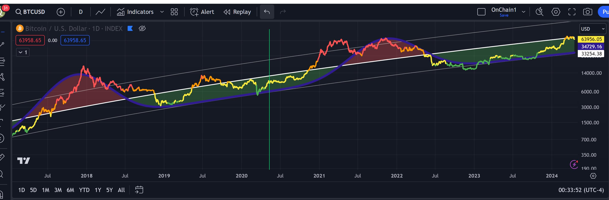

# 在这个信用破产的时代

号外：教链内参4.17《伯恩斯坦称，减半后恢复看涨轨迹》

* * *

国破山河在，城春草木深。感时花溅泪，恨别鸟惊心。

仿佛是减半前症候，BTC（比特币）继续回撤，隔夜一度破位6万刀。这到底是给了逢跌加仓的囤饼党打折加仓的机会。从7万3到6万1，妥妥的八五折。有人说能跌到5万去，那就是7折，简直不要太爽。

看看2024年底，下轨3.5万刀，中轨10万刀，上轨37万刀。所以说，4万概率很小，5万概率不大，6万，嗯，就是目前的位置。

为什么说4万概率很小？为什么不能像2019-2020年那一轮，熊市中期冲个小高点，然后再深扎一个猛子？

因为“呼吸理论”（参考教链2023.12.6文章《【十年之约#13】比特币在呼吸》）。这一次BTC在中轨水面以下待的时间太久了。目测它现在根本就不具备向下深潜的实力。（参考教链2024.3.16文章《BTC现阶段或不具备长期下跌基础》）

当然，作为一个科学的理论，呼吸理论也是可以被证伪的。和任何一个科学理论一样，它只有在未被证伪之前，以及在未被证伪的场合，才是有效的。

耶伦二次摸底回去之后，鲍威尔就讲话说，“鉴于迄今为止劳动力市场的强劲和通胀方面的进展，让限制性政策有更多时间发挥作用，让数据和不断变化的前景来指引我们是合适的。”（参考3.17教链内参《伯恩斯坦称，减半后恢复看涨轨迹》）

这样子吓唬人，竟然很像是，胡萝卜招降又失败了，于是又不得不挥起大棒。

可是这大棒举得久了，一方面是难免会胳膊酸腰疼，另一方面则是万一不小心高举的大棒掉下来，恐怕是要砸伤自己的脚的。

鲍威尔和美联储为什么紧盯着物价通胀率？而且，为什么盯紧的目标是2%？

从一方面说，2%这个数字还是比较科学的。因为据研究，整个世界的长期平均生产力增长速度大约就是2%。

从二方面说，只要通过货币政策（比如利率、QE/QT等工具）把终端通胀控制在2%水平，那么源头端的印钞机就可以想怎么印、就怎么印。而美债对美元发行的约束力只是形式上的，实际上总是可以突破限制。

超发的美元流入了非生产性部门，推高了金融资产价格。资产收益远远跑赢劳动收益，就是这一事实的有力证明。

货币是分配器。社会总财富是100，当一群人和另一群人手里各有50货币的时候，各自占有50%的财富；当一群人拿到了超发的50，手里的货币变成100，财富分配就变化了，一群人占有2/3，另一群人只占有1/3了。

生产力进步的意思是说，现在我一天能生产100个馒头，明年这时候我一天就能生产102个馒头了。对于买馒头的人来说，如果货币没有增多，今天1个货币买1个馒头，明年1个货币就能买1.02个馒头了。因为总共用于消费馒头的货币只有100，生产的馒头越多，每个馒头就越便宜。这就是生产力进步带来价值的跌落。无论是今天的AI，还是上世纪中叶的纺织业，都逃不过这个经济的基本规律。

悖论在于，对人、对社会而言，生产力进步是一件好事，因为可以生产出更多的使用价值（例如馒头），但是对于资本家而言，生产力进步却是一件坏事，因为更多的投资却不能带来更高的回报。所以，作为资本家的巴菲特痛定思痛，果断卖掉了伯克希尔的纺织业务，全面转型为只投资具有垄断属性的、生产力进步缓慢的业务（比如可口可乐）。

你说不对呀？书上说资本家追求生产力进步，才导致了今天科技日新月异的发展。这里你就被骗了。书是资本主义意识形态的，自然是把结果说成原因，把丑的描成美的。首先，生产力是原因，而生产关系是结果，至于社会分工、角色以及阶级，那是生产关系的产物。其次，资本家追求生产力进步，是被逼无奈。被什么逼得？自由竞争。

把垄断和进步作为两个维度，可以把行业（投资标的）分成四类：1）垄断性低，生产力进步快，这是新兴产业，比如新能源汽车；2）垄断性高，生产力进步快，这是重点产业，比如移动通信、火箭发射；3）垄断性低，生产力进步慢，这是成熟产业，比如餐饮业；4）垄断性高，生产力进步慢，这是垄断产业，比如烟草、可口可乐。

著名风险投资家Peter Thiel主张要寻找从第1类脱颖而出变成第2类的投资机会，为此他专门写了一本书叫做《从0到1》。老钱巴菲特则主张要投资于第4类机会。Peter Thiel想的太美。巴菲特更务实。不过他们一致同意避开第3类。

BTC是二象性的，或者二律背反的：比特币采矿业属于第1类：竞争极其自由和充分，消灭一切超额利润；算力以摩尔定律速度进化，不逊于任何科技行业。但比特币本身则属于第4类：具有高度的天然垄断性，其心智模式越来越牢固，越来越难以被颠覆；生产速度每4年减半，很快增量就要微乎其微，无论再怎么努力，也不能多生产出一点儿。也就是说，BTC在垄断性最低的同时，垄断性又最高，生产力进步最快的同时，生产力进步又最慢。

资本追求的只是赚到更多的钱，而不是生产出更多馒头。如果明年生产102个馒头，每个馒头的售价却跌到了0.98个货币，那么资本家会疯掉的。这就是经济学人士拿出来吓唬人的“通缩”。于是凯恩斯跳了出来，打上了补丁：只要我们让市场上的钱多出来一些，102个馒头，102个货币，那么也就还是1个货币买1个馒头，消费者没有多花钱，馒头商多蒸多卖了馒头、多赚了钱。

但是很抱歉，馒头不属于生产力进步的产业。消费者的饭量也不太会逐年增加。所以明年还是100个馒头，但是对应102个货币，于是每个馒头涨价到1.02个货币，这就形成了物价的通胀，消费者多花了钱，馒头商没有多蒸多卖馒头，但却多赚了钱。

问题是，如果我们不允许使用任意超发的货币呢？如果我们使用BTC来衡量馒头的价值，那么今年卖100个馒头能换回1个BTC，明年可能同样卖100个馒头只能换会0.98个BTC了。但是这又如何？蒸馒头的老王并不会为明年只换到0.98个BTC而苦恼，只要这0.98个BTC能换到其他财货的数量不少于甚至多于今年1个BTC能换到的数量就可以了。

人民是断然不怕通缩的。只有当这个经济循环中存在金融中介的时候，他们才最害怕通缩。

一通缩，资本家就要裁员。一通缩，信托就要暴雷。一通缩，美债美元体系就要崩溃。

说白了，金融本身是不具备生产力的。但是它又是空洞的，只关注价值的增长，而不关注使用价值的生产。于是它要装作自己有生产力，就只能用数字的增长来伪装。

今天美国财长耶伦卖给你100万美元的美债，每年必然是要支付利息的，这样才能让100万美元明年变成102万甚至105万美元，否则，是没有人会去买她这个美债的。当面对数字的时候，不会有人觉得，今年1美元只能买一个馒头，明年能买1.02个馒头，所以我们就可以接受今年100万美元借给耶伦用，明年她只需要还100万美元。

金融行为的背后是信用（credit）。是信用早晚都会破产的。

资本家基于未来企业的发展来扩招员工，一旦企业发展受阻，就要大肆裁员。信托基于底层资产未来增长的预测来承诺收益、吸引投资，一旦底层资产暴雷，便无法兑付广大投资者。美债则更是赤裸裸地刚性承诺未来的收益率，虽然纸面上一定可以印出美元兑付，但是如果未来美国国力增长不足以支撑美元价值，那就是账面兑付、实质违约。

信用是对未来价值的承诺。

BTC不是信用——未来的价值。BTC从不承诺未来的价值。BTC只是现金（cash）——现在的价值。所以中本聪比特币白皮书标题说，BTC是“电子现金”（electronic cash）而不是“电子信用”（electronic credit）。

在这个信用破产的时代，不是信用、不会破产的东西，才更值得我们信赖。
