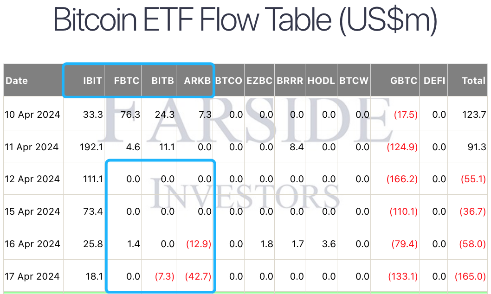
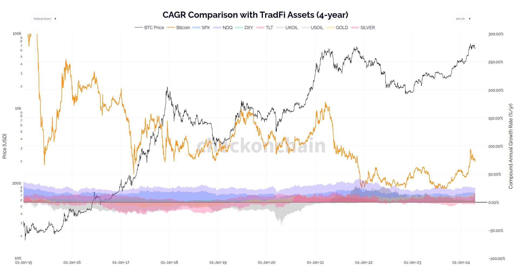

# 储蓄比特币：4年复合年化增长率72%

号外：教链内参4.18[《2024一季度加密市场报告，7个亮点》](http://rd.liujiaolian.com/i/20240418)

* * *

要说这大多数的散户，甚至包括一些机构，都是追涨杀跌来着。这一点从现货比特币ETF的流入数据就能看到一二。这几日BTC（比特币）接连下挫，短短10天工夫，就从72k速降1万刀至62k，并一度击穿6万刀关口。随着价格的下行，现货比特币ETF的“四大”有三个直接熄火了，BITB和ARKB甚至逆转为净流出。这四缸发动机就只剩下贝莱德一个缸还在勉力工作，那动力自然就弱了太多。

实话说，目前这个6万左右的位置，真的已经是比较安全了。穿越2025，来到2026年底，就算2年多以后出现2022年底那种击穿“前高”的情况，最低也就是7万刀。换句话说，2026年底的7万刀，相当于2022年底的1.6万刀。这也意味着，如果你的资金能够坚持三年不动（无论主观意愿上还是客观条件上都能坚持住），那么穿越牛熊，就算没有进行所谓的“逃顶”，死拿BTC到2026年底，也大概率不会亏损。

知道自己仓位的底线在哪里。知道底线不会亏损。这才有了追求更高收益的基础和资本。很多人就是因为没搞明白底线在哪里，就去盲目追求高收益，追求什么暴富，最后亏得个底朝天。

巴菲特说，投资最重要的就是不要亏损。

张三和李四都从100万的本金开始。张三每年稳定增长40%。李四一年大赚200%，一年亏损60%，如此循环。10年之后，二人的差距有多少呢？

张三十年后：100万 x (1 + 40%)^10 = 2892万

李四十年后：100万 x (1 + 200%)^5 x (1 - 60%)^5 = 249万

答案：两人身价差10倍。

那么如果时间拉长到30年呢？数字可能会让你惊掉下巴。

张三30年：100万 x (1 + 40%)^30 = 242亿

李四30年：100万 x (1 + 200%)^15 x (1 - 60%)^15 = 1540万

这下子两人已经完全不是一个财富阶层的人了。再比较他们身价的差距已经没有意义。

而如果你再对比一下二人这10年或者这30年是怎么度过的，可能会更有感慨。

张三这10年-30年：囤BTC，拿着不动。花时间教育孩子、陪伴家人，做自己喜欢做的事，旅游，养生，锻炼身体，著书立说，等等。

李四这10年-30年：高抛低吸，加杠杆，时刻神经紧张地盯盘，密切关注新币新项目，冲土狗，撸空投，薅羊毛；被爆仓，被盗币，被项目方PUA；无心关注孩子学习，爱人感情，父母年迈；没有时间和心情锻炼身体，健康状况每况愈下；神经麻木，已经不知道自己除了炒币还有什么爱好，也提不起兴趣做任何脚踏实地慢慢挣钱的工作；外出旅行也时刻盯盘，脑子无法放空，身心无法放松；等等。

娃儿在小学要读课外书，我便送给他一本《洛克菲勒留给儿子的38封信》让他读。他就每日在课后课间阅读，放学时和我交流感想。昨天他告诉我最新读的一篇是说，人要做金钱的主人，不要做金钱的奴隶。

是啊。投资本就是个人的一场修行。投资也不外乎是自己人生的一部分。在回答我们要做什么样的投资这个问题之前，我们必须先想想清楚，我们想要过什么样的人生。否则，我们就要忘却了初心，沦为金钱的奴隶。

那么，技术性的问题是，囤BTC实现每年40%的回报率难不难？下面这张图是比特币4年周期的CAGR（复合年化增长率），以及于其他一些传统资产的对比图。

图中橙色曲线是BTC的4年CAGR，对应的数值看右侧Y轴。可以看到，除了2022.1-2024.1这两年，4年CAGR在25-50%之间，其他时间都在50%以上。今年3月份以来，随着BTC升至6-7万刀，4年CAGR又重新回升到了72%以上。

不过呢，大多数人都是一边挣钱，一边投资，那么就会在4年中的各个时间点持续加仓。在这种定投的情况下，好处是会磨平一些波动性，不好处则是仓位的实际CAGR会比起点一次性投入的CAGR要低不少。大概要低一半吧。如此，若BTC的4年增长折合CAGR是80%，那么定投的CAGR大概能做到40%就很不错了。

那么现在随着BTC回撤，4年CAGR折合72%的话，定投CAGR也就是35%左右的水平。

教链实盘，近6年从2018至今，八字诀坚持定投、逢跌加仓，CAGR算下来大概是28%左右。偏低的原因有三个：一是2018年是试探性地投，没有重仓，但是仍然算1年时间，拉低了数值；二是2021年牛市上头了，在高位区间加大了投入力度，导致头重脚轻；三是2023年加仓资金受到客观因素制约，投入量偏低。总之呢，理论很丰满，现实很骨感。实际操作下来，要主观上做到常年坚持不懈，客观上也能够不拖后腿（比如不失业、不降薪、不生病、不花大钱），实在是很难做到完美。

很多人对CAGR的复利力量没有概念。

2021年那会儿，教链说过，BTC近两轮周期能投出CAGR 40%就很不错了。这个目标并不起眼，相对也算是有一定的实现可能性。

两轮周期就是8年。8年CAGR 40%，100万 就会变成 100万 x (1 + 40%)^8 = 1475万。

倒过来讲，8年赚1375万，折合每个月赚14万，年赚170万。月薪14万，年入170万，就是放在一线城市，也能算得上是高收入群体了吧？

料敌从宽。考虑到实际操作下来不会那么理想，以及增长速度肯定会有所衰减，那么就按CAGR 20%好了。这大致相当于巴菲特老爷子的水平。

8年CAGR 20%，100万 x (1 + 20%)^8 = 430万。

折合成月薪3.4万，年入41万。一线城市白领收入水平。

就把它当成是一种储蓄好了。或者说像是每年给保险交保费。储蓄BTC，就是给自己的人生上一道保险。

积少成多，积沙成塔。很快，复利效应的威力就会显现出来。

除了BTC，你说其他的币有没有具备长期复利的品种？说实话，我还真没看出来。向那些东西里面“存钱”，纯粹就是“送钱”和“烧钱”了。

有句老话说，赚点小钱，人人努力皆可做到，要赚大钱，还得看命。

可这市场里偏偏很多人不愿意赚一年几十上百万的小钱，就非得要去赌命，妄图搏一把大的。赢了财富自由，输了负债累累。从概率和天道上讲，99.99%的人，命里都注定与暴富无缘。

命里有时终须有，命里无时莫强求。强求暴富的结果，往往不会是什么好的结局。

