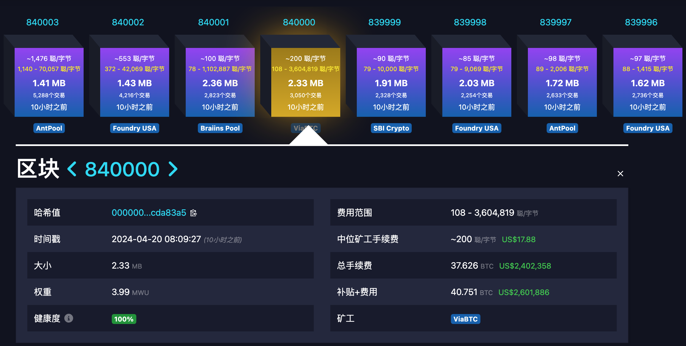
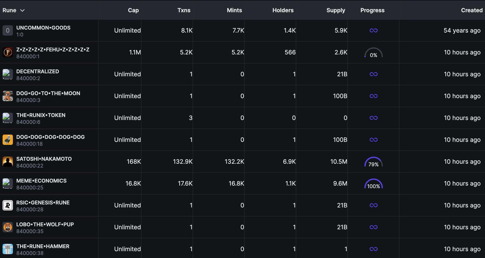

# 比特币的黄金减半

号外：教链内参4.19《比特币神龙摆尾》

* * *

2024年4月20日上午8时9分27秒(UTC+8)，ViaBTC矿池挖出了高度840000的区块，区块奖励正式降为3.125 BTC，宣告比特币成功完成历史上第4次产量减半（参阅教链2024.4.9文章《比特币产量减半简史》）。比特币的历史翻开了崭新的篇章。



虽然区块奖励从前一个区块的6.25 BTC骤降一半为3.125 BTC，但是区块高度84万的区块总激励，既区块奖励加上用户支付的费用，竟高达40.751 BTC！按现在BTC约6.4万刀的价格，该区块的生产者将为此而获得约260万美刀的收入。这大约是前一个区块收入的六倍。

这个区块可真谓是黄金区块（有趣的是mempool.space也把这个减半区块涂上了金黄色）。这次减半，也确实成了BTC矿工的收入盛宴，不可不谓是一次黄金减半。

我们不妨看一下减半前后各10个区块的区块收入数据吧：

```
839990: 6.25 + 0.727 = 6.977 BTC
839991: 6.25 + 0.788 = 7.038 BTC
839992: 6.25 + 1.069 = 7.319 BTC
839993: 6.25 + 1.023 = 7.273 BTC
839994: 6.25 + 0.953 = 7.203 BTC
839995: 6.25 + 2.483 = 8.733 BTC
839996: 6.25 + 1.006 = 7.256 BTC
839997: 6.25 + 1.183 = 7.433 BTC
839998: 6.25 + 0.863 = 7.113 BTC
839999: 6.25 + 1.045 = 7.295 BTC
840000: 3.125 + 37.626 = 40.751 BTC
840001: 3.125 +  4.486 =  7.611 BTC
840002: 3.125 +  6.99  = 10.115 BTC
840003: 3.125 + 16.068 = 19.193 BTC
840004: 3.125 + 24.008 = 27.133 BTC
840005: 3.125 + 29.821 = 32.946 BTC
840006: 3.125 + 23.156 = 26.281 BTC
840007: 3.125 + 17.685 = 20.81  BTC
840008: 3.125 + 12.183 = 15.308 BTC
840009: 3.125 +  9.474 = 12.599 BTC
```

这些数据都是在比特币区块链上公开透明可查的。事实一摆，无需教链多言，大家也都能看出来，这波减半，比特币矿工属实是赢麻了。

这一波如果能持续，大概不会有人再怀疑比特币再减半下去会导致矿工最终无利可图而全体关机，比特币失去算力价格归零了。当年疯狂质疑比特币经济模型不可持续、终将因激励不足而崩溃的人，估计是真的要发疯了。

中本聪早在2010年2月14日说过的话，竟然提前得到了应验：（参阅教链《比特币史话》第九章第38话 https://leanpub.com/history-of-bitcoin ）

「几十年之后，当区块奖励太少的时候，交易手续费将成为节点的主要收入。我敢肯定 20 年后，要么有非常巨大的交易量，要么完全没有交易量。」

中本聪当初说的是“几十年以后”，而现在才2024年，距中本聪说这话的时候仅仅过去了14年。

那么，究竟为什么忽然有这么多人在减半后愿意支付如此多的手续费呢？

这全赖一个人：Casey Rodarmor。不知此君何人的读者，可以往回翻阅一下教链去年的一些文章，比如202.3.9《与比特币一同永存》、2023.5.4《模因之王BRC-20》、2023.12.7《他想要杀死铭文》等文章。

Casey Rodarmor借鉴和发扬了比特币上古时代给比特币“聪”编序号的技巧，嫁接上2021年底上线的比特币新能力Taproot技术（参阅教链2021.11.15文章《Taproot已激活：不是比特币进化慢，而是我们进化慢》），鼓捣出了ordinal（序数）协议和inscription（铭文）技术，作为铭刻所谓“数字艺术品”到比特币链上的新方法。

推特网友一声呐喊，热情玩家齐动手，把简单的代币数据用铭文技术给铭刻到比特币链上去，嫁接空气般纯粹的模因（Meme）元素，以及草草抄袭以太坊ERC-20命名的BRC-20作为“协议”名称，杂交出了既像NFT又像模因币的东西，瞬间点爆了饥渴正愁没啥新东西可以爆炒的加密市场。以至于当人们再讲“铭文”这个词的时候，指的已经是BRC-20币，而不再是最初的“数字艺术品”了。

“比特币生态”只是拉大旗作虎皮，“一夜暴富”、“从1000刀到1亿刀”才是人性的真相。

Casey Rodarmor很生气，觉得人们辜负了他追求艺术的苦心。比特币核心开发者的部分人——比如Luke Dashjr——更生气，他厌恶铭文导致了比特币区块空间的滥用，不惜与整个铭文社区为敌而在网上被围攻。

Luke Dashjr被动防守，意图合并铭文过滤代码到比特币核心客户端。Casey Rodaramor决定主动出击，既然人们如此喜欢炒币而不喜欢艺术，那就干脆搞一个更适合炒币的协议出来吧！这就是符文（Runes）。

有人指出，铭文用隔离见证区域存储数据，揩了手续费打折的油。因为隔离见证数据每个字节仅按照0.25字节计费。

Casey Rodarmor从善如流。符文协议使用传统的OP_RETURN来定义代币数据。反正代币数据足够小，完全放得下。而这样一来，炒币的这些人就占不到便宜了，需要全额支付手续费。

符文启动的时间，正是比特币第4次产量减半的区块高度 —— 840000。

真的是永远不要低估人们对于投机的狂热，即便这投机可能要付出巨大的代价。

谜底已然揭晓：减半后给矿工支付巨额手续费的，正是抢跑符文的投机者们！

只是这符文的“长相”（名字）嘛，实在是一言难尽。丑，是真的丑。（见下图）



也许吐着吐着慢慢也就习惯了吧！

本次减半后，比特币的S2F硬度也将超越地球上最硬资产黄金的硬度，正式成为我们这颗蓝色星球诞生76亿年有史以来最硬的资产，教链称之为“巨硬”资产。（参阅教链2023.2.17文章《2024奇点将至：人类尚未准备好迎接S2F大于100的巨硬资产》）

而这轮周期也是一个比特币发展史上的转折点——向挑战黄金进发的转折点。正如教链早在2022年12月份撰写的《2022年年终复盘展望报告：2023-2025行业前瞻》（年终研报2022）中所写的：

「在2021年的牛市泡沫高峰期，比特币的市值一度跻身全球前十大资产，比肩美股头部企业市值。同时，比特币也表现出了与美股走势较强的相关性。如果定义2021年的周期是挑战美股的话，2024-2025的牛市周期则是要挑战全球第一资产品类——黄金。

「今天，黄金的总市值约为12万亿美元。比特币按17k美元的价格，市值约为3300亿美元，距离黄金的总市值还有36倍的空间。比特币今天的总量是1922万枚。估计2023-2024两年还将产出约66万枚。总量达到1988万枚。按约数2000万枚计算，市值达到12万亿美元，单价应该是60万美元一枚比特币。

「在上一轮熊市2018年底底部3000多到牛市顶部2021年底69k，涨幅约23倍。按照当前17k涨幅23倍则为39万约40万美元一枚比特币，乘以2000万枚，总市值则为8万亿美元，约为黄金12万亿美元市值的67%。

「即便按照更小的涨幅，比如17、8倍，达到30万美元一枚比特币，总市值6万亿美元，约为黄金的一半。即使不超越黄金市值，达到相近的数量级，也可称得上是比肩黄金了。」

从挑战黄金这个立意上讲，也可以把本次产量减半称之为“黄金减半”。

惜秦皇汉武，略输文采；唐宗宋祖，稍逊风骚。一代天骄，成吉思汗，只识弯弓射大雕。俱往矣，数风流人物，还看今朝！

