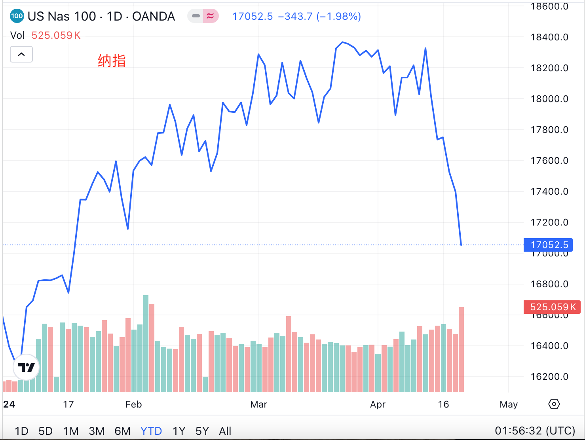
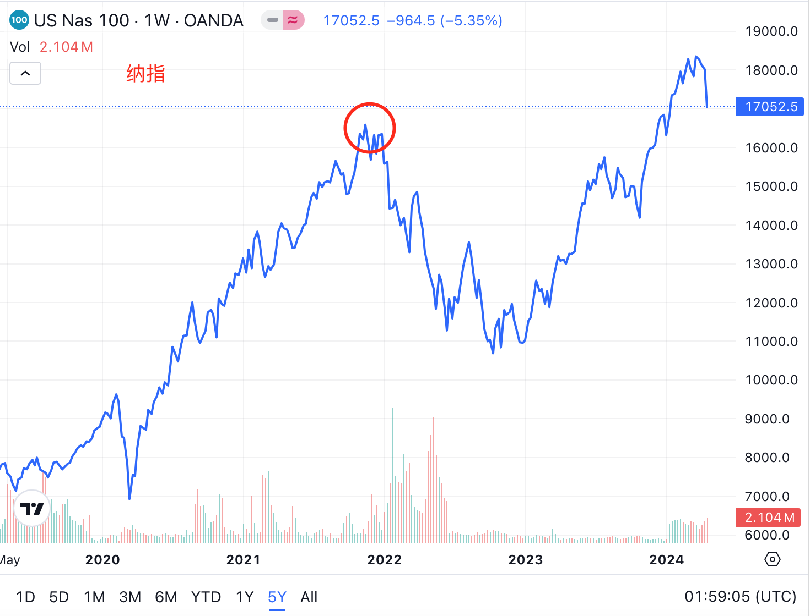
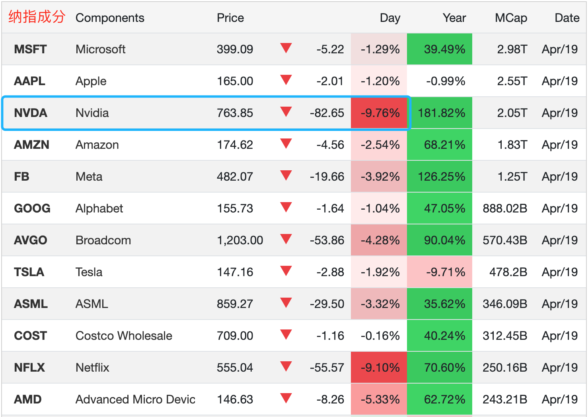

# 当你开始“定投纳指”时，纳指崩了

* * *

长亭外，古道边，芳草天。

前段时间大A身陷3000点保卫战的泥潭脱不了身，国内一众财经大V纷纷祭出传统艺能，主要法宝有如下几个：

第一，把大A的低迷归因于中国经济发展不行，从多角度唱衰中国发展，指示韭菜们抛售中国资产，出逃海外，并提出投资标的“含中量”越少越好。

第二，痛心疾首于自己大A仓位亏损，以示自己和套牢在大A中的韭菜们身处同一战壕，韭菜听后顿时心中升腾起与大V共患难的真情实感。

第三，话锋一转，洋洋得意地告诉感同身受的韭菜们，幸好自己机灵，早早就分散仓位，布局了美股和数字货币，并且收获颇丰，以此凸显自己高瞻远瞩的牛逼人设，韭菜顿时顶礼膜拜，视为上师。

第四，谆谆教诲韭菜们，爱国和投资要分开，别让自己的爱国情怀干扰了自己的投资判断，这就是暗戳戳地引导读者思考“做空中国”，并提出“相信国运，定投纳指”这样看似矛盾的口号。

上面说的就是个段子。如有雷同，纯属雷同。况且，请注意，我可没说人家的“肺腑之言”是真理还是屁话哟。别急着下结论。

我只是个寂寂无名、码字玩儿的投资爱好者，无意招惹现在人数众多、势力庞大、手眼通天的“金融跪族”。

况且，萝卜青菜，各有所爱。有人喜欢跪着赚钱，有人喜欢站着赚钱。如果站着赚不到钱，而跪着能赚钱，你会选择跪下吗 —— 这个问题只能是每个人扪心自问，自问自答。

人这辈子，赚钱固然万分重要，但是站着更重要。当然有人不同意。没关系，道不同不相为谋就好了。

就像《让子弹飞》里的张麻子对膝盖发软的一众韭菜鸣枪怒吼：不许跪。谁也不值得你们跪。我也不值得你们跪。

但是张麻子不常有，而汤师爷和黄老爷常有。于是韭菜们就总是受二茬罪：在市场上钱包被庄家收割受一茬罪，在市场外智商被大V收割受二茬罪。

当然，洗脑是润物细无声的，甚至有点儿像情感按摩，舒服的嘞。

汤师爷怎能不清楚，他分润的钱，都拜黄老爷所赐。黄老爷的钱，都是搜刮韭菜的钱。所谓，大户的钱如数奉还，韭菜的钱三七分成。

金融市场就是个分配的游戏。不收割你们韭菜，难道要收割大户，还是要让汤师爷还是黄老爷出血？

但是一心想把“公平”还给韭菜们的张麻子并不受待见。不仅韭菜不识他的好，反嫌它碍事；就连他自己的兄弟，事成之后，也纷纷离他而去。去哪儿？去浦东，去上海。

上海就是浦东。浦东就是上海。

韭菜就是镰刀。镰刀就是韭菜。

成功的韭菜变成了镰刀。失败的镰刀就成了韭菜。于是陷入无穷轮回之苦。

人本来没有阶级。但自从有了人，便产生了阶级。

镰刀要压制韭菜，使之不能翻身，挑战自身地位，一是收割掉他们的本金，二是收割掉他们的智商。

并非他们人有多坏，现实生活中的他们也可以是彬彬有礼的、温文尔雅的、幽默风趣的，但是阶级利益使得他们不由自主地出于利益驱使本能地去那样说、那样做。

从投资的朴素常识上讲，牛市的利润几乎都来自于熊市的仓位。整天忽悠你这边熊市割肉、那边高位接盘的人，真的是为你好？

人人都知道，忽悠韭菜高位接盘，为的不就是高位出货收割吗？韭菜接盘，那往往是最后一棒。

真正的长期主义者更明白，熊市低迷，才是定投建仓的良机。有更多低价的机会慢慢建仓，远胜过暴涨急速拉高定投成本。

当韭菜们被忽悠去定投纳指时，纳指崩了。17052点本周收盘，已经快要回到年初开盘16579点了，较高点18366已经跌去7%。

再拉远一点儿视角看，其实距离回到2021年11月份局部高点16591也不远了。

而看一下成分，一眼便知是科技股领跌。而其中尤为引人注目的，就是被吹上天、捧为神的英伟达，一日下挫近10%。

这个局，教链在3月25日内参《AI的本质和英伟达迷局》中谈过，本文也就不再赘述了。

在《华山论剑：最后的决战》（教链2023.9.22文章）之关键时刻，我们更应谨记索罗斯先生当年的提醒，不要“工业产出多少，金融就丢掉多少”（教链2023.8.23文章《中国去杠杆》）。
