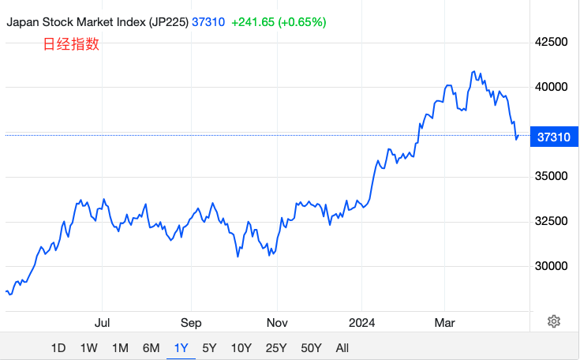
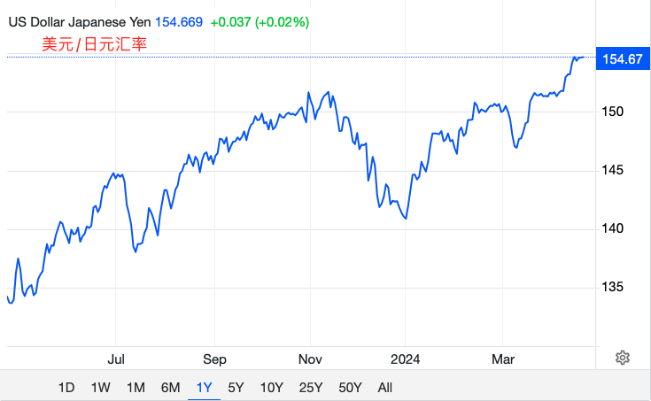
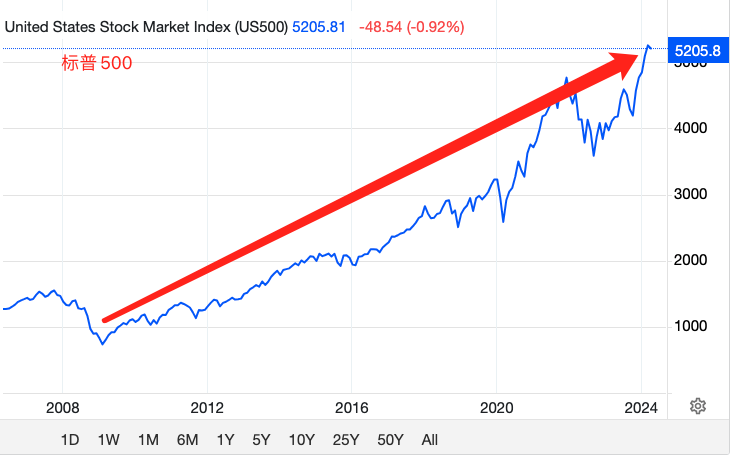
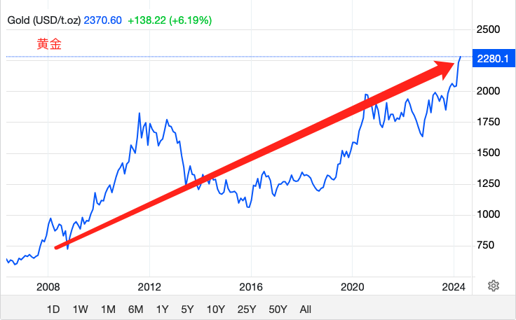

# 金融战胜美国

号外：教链内参4.21《美联储杀回马枪》

* * *

美联储突然变鹰，杀了一个回马枪（参阅4.21教链内参《美联储杀回马枪》），让对降息翘首以盼的市场遭受了万点暴击。甚至有流言蜚语传出，称美联储甚至可能要突然加息至8%，暴打全球。

不久前被很多财经大V吹捧的连连上涨的日经指数，也开始扭头向下。

但更要命的是，日元对美元的汇率开始快速下跌。

或许令很多人奇怪的是，日本央行不是罕见加息了么？为啥日元反而走弱？也许这逻辑应该倒过来想：正是因为扛不住汇率贬值的压力了，日本央行才被迫打破惯例，罕见加息。（参阅教链3.20文章《日本结束负利率，美联储是否会跪倒在渡边太太的石榴裙下？》）

其实别看日经指数涨得凶，乘上汇率贬值，其实也没涨多少。从28500点涨到37300点，汇率从1:133跌到1:155，算下来一年涨幅也就剩下12%。

保资产不保汇率，最后资产、汇率双输。不保资产保汇率，最后资产、汇率都得以保全。无视舆论骂街，任由杠杆暴雷，刮骨疗毒，这需要上等的魄力 —— 我说的是比特币。（参阅教链2.4文章《比特币从不救市》）

试图救市保资产价格，杠杆投机资本拉高出货，资本外逃造成汇率贬值压力，倒逼央行加息平抑汇率贬值，加息导致资产价格崩溃，最后资产、汇率哪个也保不住。日本央行似乎正在面临这个无解死局。

当我们谈论日本央行的这个死局时，默认参照系是美元。

现在我们把日本股市换成美股，把日本央行换成美联储，把日元换成美元，把美元换成黄金，再来推演一下这个局。

如果美股出事，美联储一定会出手救市，保资产价格。这一点在2008年金融危机、2020年疫情熔断都得到了验证。

美联储出手救市保资产价格，则资本就可以趁机拉高出货。

重要关键来了：要促使出货后的资本外逃，给美元造成汇率贬值压力。啥意思？翻译一下就是，黄金价格不断上涨。这正是目前正在发生的事情。

这就会倒逼美联储加息，至少是维持高息，以平抑美元过快贬值的压力。美联储表面上谈的是通胀问题，其实真正的压力来自于美元贬值。

继续加息（疯了）或者长期维持高息，则必然会导致银行系统危机（2023年硅谷银行暴雷已经提了个醒），以及美股等资产的崩盘。

而一旦资产出现崩盘兆头，就会立刻触发美联储出手救市，保资产价格，从而回到本局的开头，开启无尽轮回模式。这个无尽的轮回，成了推动美元贬值、黄金上涨的“永动机” —— 直到美联储把整个美国推向万劫不复之境地，最终彻底崩溃，“永动机”彻底熄火为结束。

以上所述很好验证，把2008年金融危机以来，美股和黄金的走势图拉出来就可以看得一清二楚。

上图是标普500的“15年长牛”。神奇如美联储，真的做到了经济学家梦寐以求的“熨平周期”，救市操作如此丝滑，令美股长达15年没有明显的牛熊交替。美联储真的已经战胜了经济规律了吗？

与之同期的黄金，也开始“破除封印”，重出江湖。

真正的美国精英阶级心如明镜：要维持美元的地位，就绝对不能放松对黄金的压制。从1933年罗斯福6102号法令，到2011年多德-弗兰克法案，美国对黄金的打压从未放松过（参阅教链2023.9.28文章《黄金，黄金》）。而作为黄金保有量最大的国家，美国有最大的筹码做空黄金，压制黄金市场。

有人参透了美国的这一命门。对美国的金融战，就是抓住上面的“重要关键”，持续购买黄金，拉高黄金汇率，促使资本外逃，推动美元贬值。

这正是教链在2023年9月19日文章《隔山打牛：金融大崩溃》所讲的“隔山打牛”策略。

2008年，有一个人也参透了这个“隔山打牛”之局，同时他觉得黄金太容易被美国控制，于是他希望做出一种更好的黄金，筹码从头分发，消除美国控制筹码做空打压的能力。于是这个人就发明了一种类似于电子黄金的东西，他称之为“比特币”（Bitcoin）。这个人给自己起了个化名，叫做“中本聪”（Satoshi Nakamoto）。

比特币与黄金一个很不同的地方在于，其控制权不依赖于暴力（武装力量）而仅需要数学（密码学）。暴力是很容易被国家垄断，且事实上是被垄断的。而数学则无法被国家所垄断。这样一来，黄金很容易被国家集中控制起来，因为个人不可能有足够的武装与国家力量抗衡，从而从根本上无法确保自己对黄金的所有权。而比特币则不同，个人力量与国家力量是平等的，你的私钥，即便强大如美国，也无法强制剥夺。

如此，比特币所有权的分散化就将解构国家的垄断性质。谈论作为一个整体概念的美国控制了大量的黄金是有意义的，但是，谈论作为一个整体概念的美国控制了大量的比特币是没有意义的，因为，比特币解构了美国这个整体性概念。持有黄金的美国投资者首先是一个美国人，其次才是一个黄金的持有者。而持有比特币的微策略老板Michael Saylor，则首先是一个比特币的持有者，其次才是一个美国人。

比特币是国际主义的（英特纳雄耐尔）。比特币私钥持有者是真正的国际主义者。

全世界每一个人都彻底、充分地理解这一点，可能还需要50年，甚至100年。

孙子兵法说：“我欲战，敌虽高垒深沟，不得不与我战者，攻其所必救也。”

拉升黄金和比特币，就像发射高超音速精确制导导弹，直击美国金融的命门 —— 美元。

只不过，比特币目前的体量（1.3万亿刀）相比黄金（16万亿刀）还太小，大约仅有后者的十分之一，只能作为侧翼助攻。

黄金每上涨1%，其攻击力将相当于比特币上涨10%。黄金上涨10%，则相当于比特币上涨100%。

从去年10月份到现在（2024年4月份），黄金从$1820到$2370，上涨了30%。同期比特币从约25k到如今的65k，升幅160%。

30%的十倍是300%。160%只相当于300%的一半，还有另一半约150%还欠着没涨呢。65k再涨150%那就是9万-10万刀。

如果黄金停在$2400，而比特币续涨至10万刀的话，那么侧翼助攻的战果，将会不逊于正面主攻。

一个黄金正面主攻美元，如果再加上一个比特币侧翼助攻而效果不输主攻的话，那么美元所受到的伤害，就是双倍的了。

于是乎美联储就陷入了困境：被迫硬着头皮继续高息甚至加息，以求挽回美元颓势。

可惜这一次，美联储一唱鹰，美股崩了（参阅教链4.21文章《当你“定投纳指”时，纳指崩了》），黄金和比特币却压根儿就没有跟随美股，而是一个在$2400附近、一个在65k一线，稳坐钓鱼台，翘着二郎腿，嗑着花生米，喝着小啤酒，等着看美联储的好戏呢。
