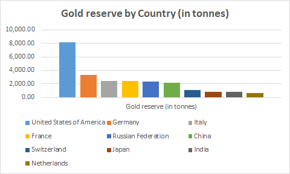
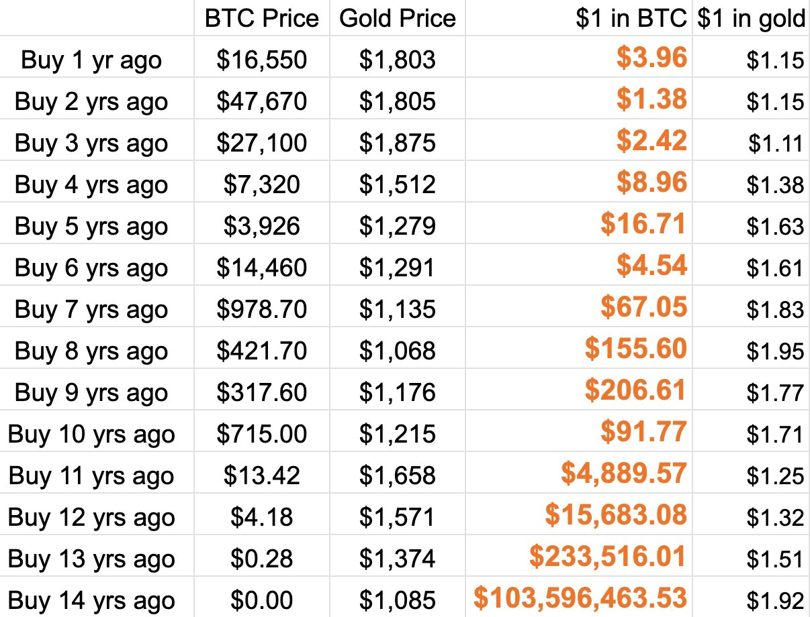

# 黄金虽好，个人不宜

号外：教链内参4.22《缺乏常识，荒谬透顶》

* * *

为有牺牲多壮志，敢教日月换新天。

任何长期的斗争事业，都不会是一帆风顺的。在前进的道路上，也无时无刻不会遭到反动力量的抵抗。昨天文章《金融战胜美国》中解剖帝国霸权之命门，以及黄金、BTC等非中心化一般等价物是如何像一柄利刃，被看透一切的厨师执之，手起刀落，把好一个帝国大卸八块，霍霍然，如庖丁解牛。话音未落，黄金背后坐庄的空头坐不住了，跳将出来，奋力迎战，一家伙把黄金干下去近100刀。

为什么说是针对黄金的出手？因为隔夜比特币（BTC）毫发无伤，还微微涨上66k。

黄金最大的空头和庄家是谁，正是帝国。前台的代理人、操盘手，便是著名的摩根大通。对，就是那个CEO经常出面接受采访、抨击比特币的摩根大通。（参阅教链1.19文章《摩根大通CEO：撒塔西将会再次现身并删除所有的比特币》）

满手BTC的人，固然有唱多的意愿，却也只有做空（抛售）的能力。持仓黄金全球第一的帝国，自然是最有能力做空黄金的。更厉害的是，拥有无限印钞能力的帝国，同时也最具做多的能力，只是它决然不会有做多的意愿。（参阅教链2023.9.28文章《黄金，黄金》）

做多黄金，那是正面战场，要掂量掂量自己的斤两，有没有和帝国的做空能力掰一掰手腕的实力。

不掌握美元印钞机的多头一方，不仅需要在印钞机被对手方控制的情况下，掌握大量美元以吃进黄金现货，还需要有能力把黄金现货安全地从美国运回本土，且有足够的军事力量，确保黄金的安全。其中难度，可见一斑。

因而个人绝难真正持有黄金。个人不仅难以鉴定黄金的真假，纯度，更是难以有足够的安保能力，保障黄金的安全。所谓“匹夫无罪，怀璧其罪”，一个人拥有太多的、可以被杀而夺之的财富，不是好事，而是天大的坏事。只要这个财富的体量足够大，甚至会诱发身边人、枕边人的杀心。不要考验人性。

假设你是一位老干部，国家每年给你发放优厚的退休金。你的子女都会特别孝顺，希望你长命百岁。而如果你是一位拥有半屋子黄金的老头子，每年就靠吃这些大半辈子积攒的巨额财富安度晚年，可能就会“树欲静而风不止”。你的子女个个都巴不得你赶紧过世，他们好瓜分你的黄金。

教链曾经说过，比特币可能是这世界上唯一的只要自己愿意就能死了带走的东西（财富）。因为私钥的本质，就是秘密。

如果你的死亡会让财富一起消失，那么想分享或得到这份财富的人，自然就会希望你长命百岁。

财不外露。不然就会令人见财起意，起了杀心。黄金的缺点，就在于它是有形的，会被看见。比特币的特点，恰恰就在于它无影无踪。

如果2024年的拜登总统，学习1933年的罗斯福总统，用10年监禁作为威胁，逼迫美国人民像当年上缴手里的黄金那样上缴比特币，恐怕他能够收上来的比特币，只会是很小一部分。更多的比特币，会在一夜之间从他的眼皮子底下消失。

如果2024年的拜登总统，学习2008年的奥巴马总统，下令像当年全面关闭美国境内的黄金OTC市场那样全面关闭美国境内的比特币交易平台，那么大部分美国人会偷偷翻墙出境跑到海外的交易平台上面去购买比特币。

如果2024年的拜登总统，学习1980-2000年代的美国总统们，授意摩根大通们像当年打压黄金价格20年那样打压比特币，摩根大通们恐怕会发现，根本就没有足够多、足够廉价的筹码可以供其在市场上做空。

有读者朋友不解地问，黄金不是比特币要赶超的对手么，怎么会是与比特币并肩战斗的同志呢？

“谁是我们的朋友，谁是我们的敌人，这是革命的首要问题。”

比特币是要追赶并超越黄金，但是从黄金到比特币，是前赴后继的关系，而不是对立为敌的关系。它们前赴后继，只为战胜同一个对手，或者说敌人，就是美元。

这么叙事其实并不准确。美元崛起实则晚于黄金。是美元打倒了黄金，踩着黄金的尸体崛起的，而若将来比特币打败了美元，踩着美元的尸体崛起，那便是为黄金复了仇。

奥地利经济学大师米塞斯在其巨著《人的行为》中心心念念地想恢复金本位的往日荣光。这已不太可能。世界已无法追求复古的金本位，而是要建立新金本位 —— 比特币本位。

从道的层面，黄金这把刀，并不适合个人。从术的层面，也不适合。下图是黄金和比特币的投资回报率对比表：

在比特币面前，黄金表现得就像一个稳定币。

革命不是请客吃饭。庖丁解牛能够行云流水，也要用一把锋利的刀。刀不够快，虽庖丁再世，而钝刀子割肉，难呀。

教链前文《金融战胜美国》中已经进行过定量计算：比特币以十分之一于黄金的体量，作为侧翼辅攻，却在近期这一场战役中取得了正面战场一半的效果。从这一战果，可窥其潜力。

帝国的金融霸权，与其军事霸权，互为表里。美元霸权支撑了美军军费。美军制霸全球又支撑了美元霸权。就像比特币的价值支撑了矿工的算力，矿工的算力又支撑了比特币的价值。

反过来，若美元霸权衰退，能够吸收（收割）并转移给美军的实际价值跌落，则美军军力衰退。军事霸权衰退，则无力支撑美元的全球霸权，将导致美元价值的进一步衰退。这就是死亡螺旋。

拯救死亡螺旋的唯一解法，就是主动战略收缩。就像比特币每一轮产量减半，都要淘汰大量算力不足的矿机和矿工。问题是，美国现在有能力、有意愿进行战略收缩，撤销海外军事存在，全面回归本土，把欧洲让给大俄，把中东让给伊朗，把亚太让给我们吗？

对于力量高度分散这一战略弱点，教员早有论断：「美国在国外有一百五十万军队，二百五十个军事基地，包括在西德、英国、土耳其，还有摩洛哥。在东方，美国也在日本、南朝鲜、台湾、菲律宾有军事基地。美国还在南越有军事人员，在泰国和巴基斯坦有空军基地。」（1960年5月27日，同蒙哥马利的谈话）「力量虽然不小，但如此分散，到处都有，结果是到处都不顶事。它越扩张得大，力量就越分散，反对的人也越多，这样，事情就会向它的意愿的反面发展了。」（1959年3月4日，会见杰克逊时的谈话）

若不能主动自己体面，也就只好洗洗干净，等待命运的最终审判。
