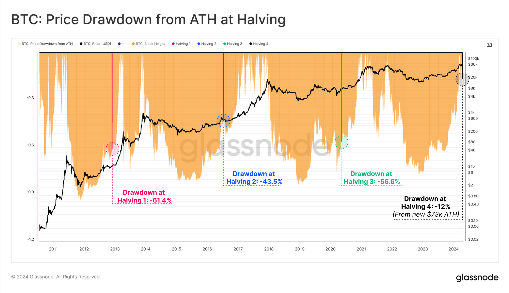
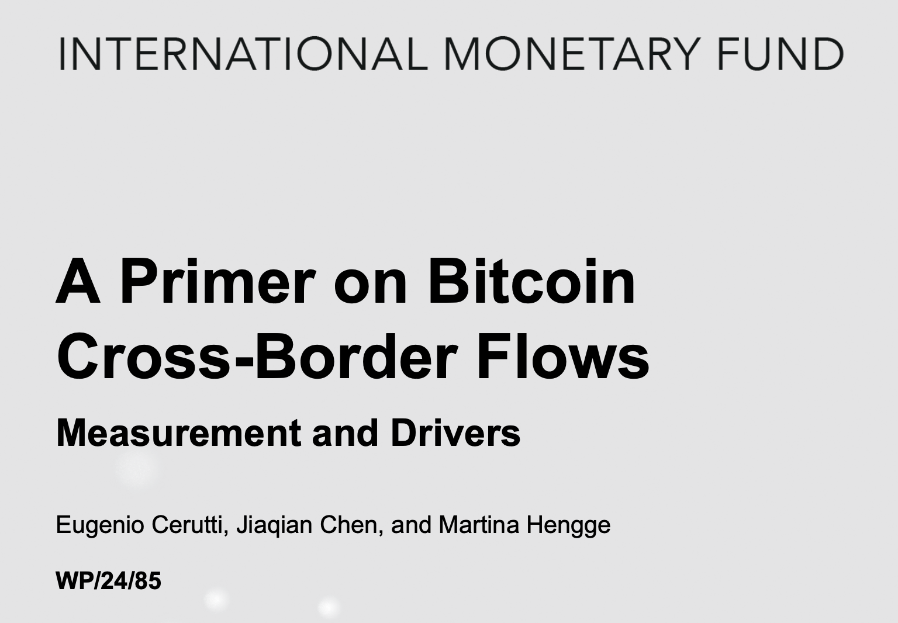
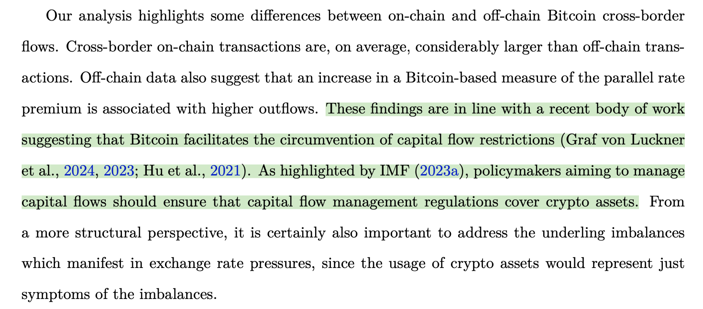
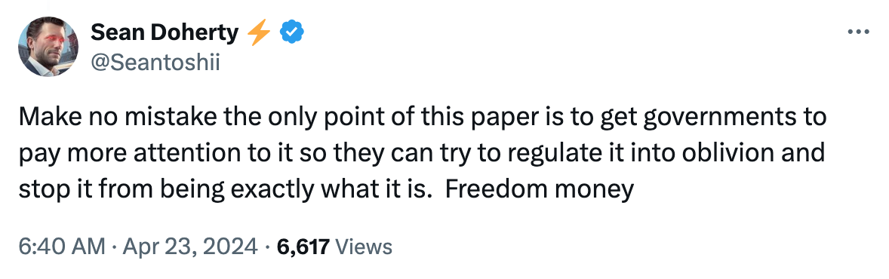
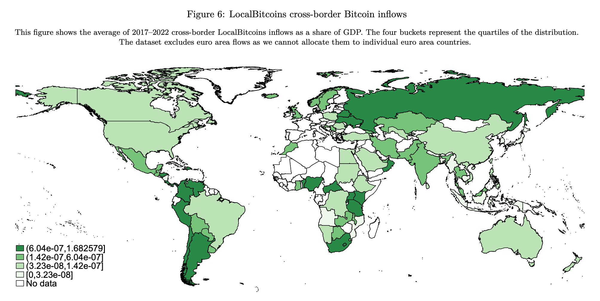
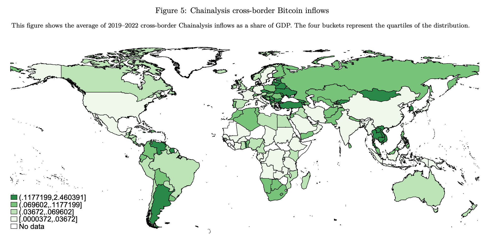
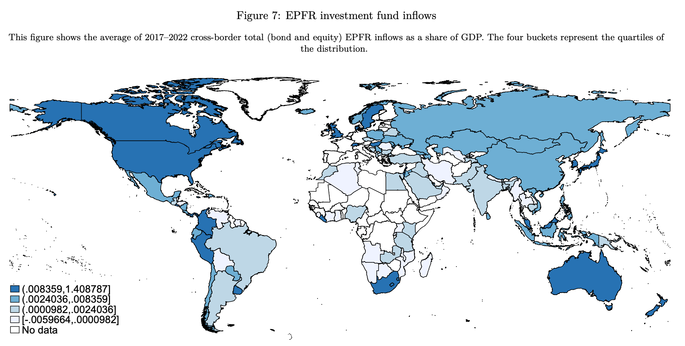
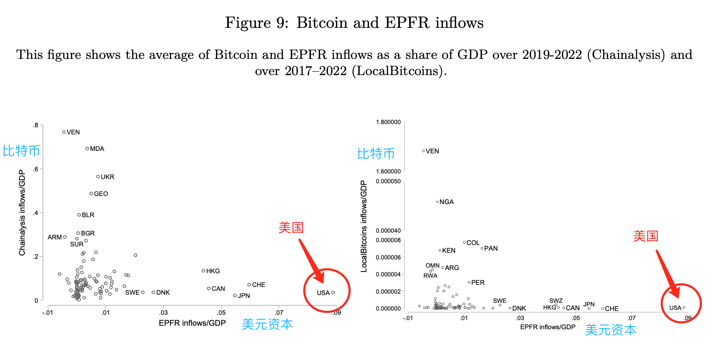

# IMF研究比特币跨境流动的目的和看点

号外：教链内参4.23《也许最大的黑天鹅就是没有黑天鹅》

* * *

小楼一夜听春雨，深巷明朝卖杏花。

自打比特币（BTC）减半之后（参阅教链4.20文章《比特币的黄金减半》），它就一直在爬升，从减半前突袭低位59.5k，一路攀升到了如今的66k。

还有多少人在盼望更大的回撤？第一次减半前后，最大回撤-61.4%；第二次减半，-43.5%；第三次，-56.6%；这一次，第四次，迄今仅完成回撤-12%。这一次，历史又将会如何完成它的韵脚？

日前，IMF（国际货币基金组织）放出了一篇论文，题目是关于比特币跨境流动的研究，研究重点在其测量和驱动力。

部分业内媒体看了标题就开始脑补，将其误读为IMF对比特币的态度发生了转折，从反对转为了支持。这实在是差之毫厘，谬以千里。让我们先看一下论文结论部分的这两句话吧：

「这些发现与近期的大量研究结果一致，即比特币有助于规避资本流动限制（Graf von Luckner 等人，2024 年，2023 年；Hu 等人，2021 年）。正如国际货币基金组织（2023a）所强调的，旨在管理资本流动的政策制定者应确保资本流动管理条例涵盖加密资产。」

正如网友Sean Doherty一针见血指出的：「毫无疑问，这篇论文的唯一目的就是让各国政府更加关注它，这样他们就能试图将其监管到湮没，并阻止它成为真正的货币 —— 自由的货币。」

不过，论文还是提供了一些有趣的发现。

通过综合链上数据分析公司Chainalysis的链上数据、现已关闭的比特币链下交易平台LocalBitcoins的OTC（场外）交易数据，得出比特币跨境流动的分析结果。然后对照研究机构EPFR以及IIF（国际金融机构）的全球美元资本流动数据，得出了几点结论：

第一、相对而言，与更广泛的全球经济接触有限的国家是比特币的大用户。

论文指出：「与一些国家的国内生产总值（GDP）相比，估算的比特币跨境流动的规模相当大，尤其是在那些资本流动相对较少的国家。」

上图是论文中的一张插图，显示的是LocalBitcoins的数据，经分析拆分到各个国家（除欧洲）的比特币流入情况。颜色越深，流入价值量占比本国GDP的比重越高；颜色越浅，则比重越低。

链上流动数据分析的结果也是类似的（这次包含了欧洲）：

很明显，如果是谈论比特币对该国跨境资金流动的影响程度，那么肯定是占比GDP越高，影响程度越大。

不过，不要忘记了，中美两个GDP数一数二的大国，它们的浅绿色（较低比重）乘上庞大的GDP之后，所对应的BTC的绝对数量，很可能要远超一些深绿色（较高比重）的小国的数量。

到底谁才是真正的大玩家呢？还是应该看清楚。

所以，对于论文的观点，说越是资本管控和受限的国家，人们越多用比特币来作为“减压阀”，我们是应该质疑和独立思考一下的。至少，美国这么一贯标榜资本自由，怎么和一贯被公知们抱怨资本管制的我国，是一样的颜色（分量）呢？

看到这里，教链不禁莞尔。这论文的意思，要么承认美国和我国的资本自由度是半斤八两（公知是错的），要么承认人们用比特币并不主要为了规避资本管制（论文是错的）。二选一，请选择吧。哈哈。

第二、美国的传统美元资本流入量特别巨大，使其成为一个“异类”。

从上图看，美国GDP是我国的1.5倍弱，而且它也不搞什么生产制造，但是美元资本流入量占GDP比重却比我国高出一个分位点。别看加拿大和它都是深蓝色的高比重，加拿大的GDP才多少？

这也导致了，当把比特币流入和美元资本流入放到一个坐标系下观察，就能明显看到美国是一个“离群点”。（如下图）

如果我们逆向思维，以比特币为参照系，认为比特币流入量测量了一国对资本流入的自然需求水平，那么，在同等需求水平的情况下（颜色深浅相同），是不是美元资本超额流入越多，说明过量的资本吸收越甚？本来并不需要吸收那么多资本用于生产，却好似资本成瘾似的疯狂吸收，这经济体到底是得了什么病呢？

所以这论文是不是也在“暗示”我们，所谓“美国借助美元收割世界”此言不虚？

第三、比特币的使用增长，是全球传统经济失衡的“症状”。

要说惊喜的一面，是比特币居然悄然间“女大十八变”，已经出落的亭亭玉立，甚至进入了IMF的视线。

要说忧虑的一面，则是IMF对比特币的关注，显然不是善意的。

IMF，作为二战后美元秩序维护工具之一，和比特币的关系，那就好比黄世仁和喜儿。只不过，给喜儿扎上红头绳的中本聪，却不似杨白劳那么软弱可欺。

因为，全世界每一个觉醒的人，都是中本聪。无数个中本聪联合起来，就一定能够打倒黄世仁，建立新世界。
