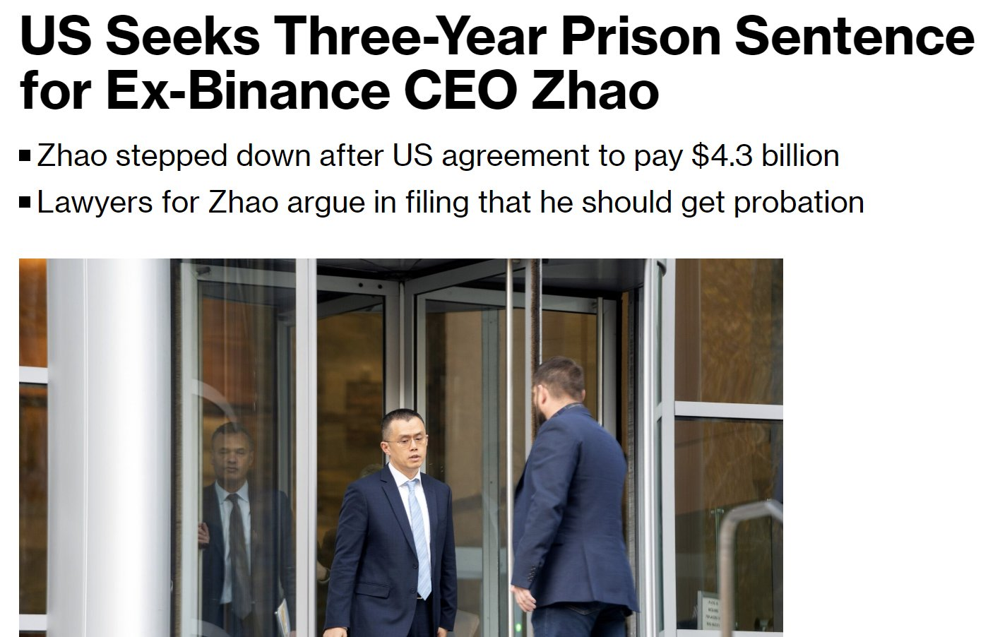
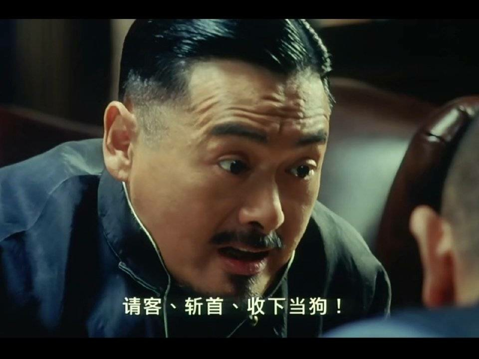

# 权力翻脸如翻书

号外：教链内参4.24《警惕Mt.Gox赔付的抛压》

* * *

昨晚4.24内参《警惕Mt.Gox赔付的抛压》提醒了一下有关Mt.Gox赔付抛压的问题，BTC（比特币）一个猛子扎了下来，从最高67k直接跳水到最低63.6k，刚刚好5个点的跌幅，这摆明了就是冲着爆掉20倍以上多头杠杆而去的。

内参中还谈到了一个事：美国司法部（DOJ）正在寻求判处全球最大加密交易所币安的创始人、前CEO赵长鹏（CZ）3年监禁，并再次罚款5000万美元。

哎，当初说好的认罪认罚43亿美刀之后可以免于坐牢的“控辩交易”呢？美国不是最最最讲“契约精神”的人类灯塔、道德楷模吗？

这美国司法部怎么翻起脸来比翻书还快？

教链早就在2023.11.22文章《美国鲸吞币安，长鹏认罪伏法》中讲过，美国此番对CZ个人重拳出击，所谋求的，绝非区区43亿美刀，而是对币安的彻底控制。「请客，斩首，收下当狗!」

所谓“请客”，不过是“请君入瓮”。美国人要学楚霸王项羽，给CZ摆上“鸿门宴”，可惜CZ却没有沛公刘邦的运气。

刘邦请项伯（项羽的叔父）传话给项羽说：我入关后，财物分文未敢动，就等着大王全盘接收呢。

何一（CZ的红颜合伙人）在写给法官的求情信中说：CZ领导币安时，诚信经营，用户资产分文不敢挪用。（还举了FTX作为反例）

刘邦是明白的，老大哥要的，恐怕不只是“分文未动”，而更是“全盘接收”。

可即便如此，就能保住性命吗？并不能。之所以刘邦保住了性命，那纯粹是历史的运气 —— 如果项羽是刘邦杀伐决断的性格，刘邦断然就死在了鸿门宴上。

但是项羽毕竟是贵族出身，心中还有一丝仁慈，一念之间，未能下定决心斩杀刘邦，从而最终落得个乌江自刎的下场。

一个组织，比一个个体，一个有血有肉的人，更加冷酷无情、利益至上。项羽作为一个有感情的人，让感性扰动搅乱了理性计算。而美国作为一个整体，司法体系作为一个机器，是绝对冰冷，绝对理性，绝对美国利益至上的。美霸王，也就决然不会犯下楚霸王那样的低级错误。

况且，刘邦带了樊哙贴身威慑项羽，带了张良留下来送礼断后，自己独自骑马偷偷溜了。

可是，CZ赴美是单刀赴会。既没有能够震慑老美的筹码，也没有能够替他挡枪的肉盾，更没有能够偷偷从美国国境溜走的飞机。而美国，既没有项羽的贵族气质和契约精神，又比仁慈的楚霸王更加理性算计一万倍。无论是脱身的实力，还是脱身的运气，CZ都不具备。

鸿门宴后。范增气得砸碎了项羽收下的宝玉，大骂项羽不可共谋大事，并断言夺取项羽天下的人必是刘邦。而刘邦呢，在酒席上套了项羽的话，知道了自己这边是曹无伤出卖了自己，告诉项羽自己有背叛的野心，于是逃回去后就马上杀了曹无伤。由此我们可以看清楚，项羽和刘邦各自的性格。一个过于仁慈而优柔寡断，一个理性算计、杀伐决断。

而CZ所赴的这场局，主宾的性格却反了过来。做东的美国冷酷无情，赴约的CZ却心存幻想。

CZ这一次属实是“把美国想得太好了”。

上了法庭，就推翻了保释约定，不让离境了。原本说好的保释期间可以返回阿联酋的承诺，也成了一张厕纸。（参阅教链2023.11.28文章《长鹏插翅难飞》）

人扣住了，那时间和主动权就完全交到了美国这一边。原定2月份的判决结果，硬是一拖再拖，一直拖到现在4月底也没个影子。时间越长，越有利于他们搜罗证据，罗织罪名。原本认罪认罚的罪名，也不再提及，而是又找到了新的罪名。一罪不二罚，这是法律精神嘛，但是找到新罪证、追加新罪名，那可是完全符合法律精神的哟。原本说的好听的“控辩交易”，只要认罪认罚，就能从轻发落，大概也就是判几个月，而且不会有实刑（真的进去蹲着）。现在新罪名有了，一下子变成3年，而且如果这么久就会有概率要服实刑。更气人的是，又追加了一大笔罚款。真是把CZ当成肉票提款机了。

CZ是一个重情重义的好男人。他举家迁往阿联酋，把加拿大国籍改成了阿联酋国籍。那边的风俗和法律，允许一夫多妻制。不负红颜不负妻，CZ做到了。财富，名分，孩子，他都照顾到了。

反观刘邦，可谓薄情寡义。公元前205年，刘邦率56万联军攻彭城，被项羽3万精兵击溃。刘邦仓皇坐马车逃跑。逃跑途中遇到刘邦的两个孩子，一个是刘盈，一个是鲁元公主。随侍夏侯婴急忙把孩子救起来。可是两个孩子加重了马车的负担，刘邦便咣咣两脚把两个孩子给踹下了车。夏侯婴见状急忙又给救起来，刘邦又抬脚给踹下去。史书说“行欲斩婴者十余”，也就是来回救起来、踹下去十几次。最后夏侯婴无奈只能让孩子趴在自己肩膀上，抱着自己的脖子，快马加鞭，凭借高超的驾驶技术，带着所有人成功逃脱。

历史早已向我们展示了这个世界底层规律的残酷性：重情重义的项羽自刎乌江，薄情寡义的刘邦开创强汉！

「力拔山兮气盖世。时不利兮骓不逝。骓不逝兮可奈何！虞兮虞兮奈若何！」

千怪万怪，就怪CZ成功得实在是太快。从2017年币安成立，短短一轮周期（4年比特币周期）就登顶世界第一加密交易所，CZ还被美国机构评了个加密首富。（参阅教链2021.12.3文章《疯子日记》）

打那时起，他就已经被“盯上了”。

成功得太快，很多地方都跟不上。最要命的是，自己大脑软件升级的速度跟不上。到了他这个地位高度和财富体量，必须彻底扬弃自小被书本灌输的那一套“三观”，什么西式民主、自由、法律、契约，此刻都已经成为捆在他思想上的重重枷锁。

他的身上，有着典型的并未真正窥探过美国意识形态核心的外族人所特有的政治幼稚。

即便是持有比特币许多年，也并没有让他洗掉这种幼稚。

常年生活在美国的比特币发明者中本聪，在认清权力本性这个问题上，显然就比CZ要成熟得多。

