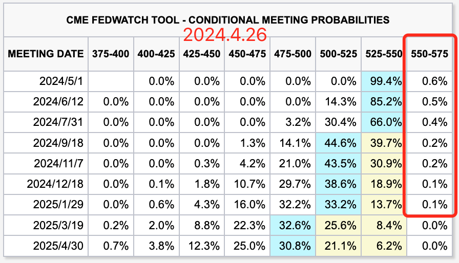

# 当心美国滞涨铤而走险

号外：教链内参4.25《美联储降息或推迟，ETF发动机熄火》

* * *

黑云压城城欲催。北风卷地百草折。

就在BTC（比特币）于65k一线徘徊振荡之际，昨4.25教链内参《美联储降息或推迟，ETF发动机熄火》讲到，现在老美的经济数据真的有点儿让人担心：GDP失速，通胀加速。这哪里是什么“经济增长极具韧性”？低增速、高通胀，这不就是经济学里妥妥的“滞涨”（stagflation）么？

目前公开的统计数据里，看起来唯一不太符合滞涨定义的，就是那被解读为“紧张”的劳动力就业市场了。滞涨高失业，数据低失业。不过，掰开数据仔细看，就会赫然发现，增加的就业统计数字，那好多都是兼职啊。一个美国人，早上开网约车，下午送外卖，晚上刷盘子，可是要被统计成三个岗位就业的。本来一个全职白领，失业了搞3份兼职，1个就业秒变3个就业。这么一统计，就业数据那是蹭蹭地涨，失业率也就刷刷地跌了。

当然，从菲利普斯曲线的角度，长期而言，通货膨胀和失业之间不存在权衡取舍，无论通货膨胀率如何，失业率都会趋向于其自然率。

滞涨的成因不易解释。经济学家通常认为，可能的原因包括：经济产能减少，货币供应过度增长，以及对商品市场和劳动力市场的过度管制。照一下镜子，很容易就猜出来老美这滞涨的原因，那基本上都是自己“作”的：

一、经济产能减少和市场管制：老美从2019年开始大搞贸易战，闭关锁国，抬高贸易壁垒，可是，空心化的自己靠谁的产能来填坑，心里没点儿数么？更可笑的是，前两天G7开会居然还有脸批评别人“产能过剩”。拜托，你这边都因为违反自由市场经济规律，对商品市场横加管制，人为阻碍产能输入，导致经济出现产能不足的问题了，却还在不谈事实谈政治，大搞意识形态对抗，属实是揣着明白装糊涂了。

二、货币供应过度增长：老美2020年管控疫情失败，教链2020年年终复盘展望报告中记载，「在整个2020年，美联储疯狂印钞，一年印出了占美元107年历史所印全部美元总量比例21%的美元。」

经济学研究认为：单纯通过美联储单纯用货币政策的手段，是无法消除滞涨的。因为货币政策在滞涨面前面临两难选择：采用紧缩货币政策，一提高利率，企业与投资人难以借钱，经营成本加大，经济就有可能更加萧条，甚至引发倒退等严重通货紧缩；但是，采用宽松的货币政策，降低利率，刺激了经济增长，但过量的钞票又会引发恶性通货膨胀，导致贫富差距趋于极端。

滞涨带来衰退。这个阶段的投资策略，通常认为应以商品、短期债券、现金、货币基金为最佳组合。黄金、比特币这种具有全球共识的一般等价商品，在此经济周期阶段具有极佳的防御性。

老美为何这一轮美元周期陷入了滞涨危机？因为加息到现在，还没有打爆、吃掉任何一个足够大体量的经济体。这头怪兽目前真的是饥肠辘辘。

由于金融具有跨时空价值转移的性质，所以，很奇妙的，通常的打劫是先抢劫、后分赃，而美元加息的“打劫”却是先分赃、后打劫。

设一个待收割的经济体，资产实际价值为10万亿美元。美元加息，美元回流，抽走流动性。美元回流美国之后参与金融空转，比如躺着吃高息，或者炒美股，这就是一个美元的再分配过程。比如张三10亿、李四100亿，炒了两年后，张三变成120亿，李四变成20亿。两三年之后，待收割经济体坚持不住崩盘，资产总市值跌到2万亿美元。美元降息，再分配之后的美元流出美国，抄底、收割被打爆的经济体。这个过程具体化就是张三冲出去再投资，用120亿买到了实际价值600亿美元的资产，李四用20亿买到了100亿美元的资产。被收割经济体资产价格随着张三、李四等炒家的买入而回升，然后再继续拉升至过热，市值超过实际价值，比如有1倍泡沫。那么张三手里的600亿美元资产就涨到了1200亿美元，李四的100亿美元资产也涨到了200亿美元。相比于他们的本金120亿美元和20亿美元，都已经涨了10倍。这时候，可能他们就要准备再次反手做空收割了。于是美元周期就要再次逆转，配合他们完成收割。如此循环往复。

这里的关键问题是，美元周期乃是美联储一己之力人为控制的，而美联储又是为张三李四这样的金融资本服务的，这是由美国资本主义的国家性质所决定的。

若说现在这一轮美元强势周期发展到了哪个阶段？看起来还在分赃阶段，而且是有些如鲠在喉，卡在了这个阶段没法继续向下进行。但是如果迟迟无法进入打劫阶段，那么再分配游戏迟早要内爆。去年底今年初一堆“金融跪族”忽悠股民去炒美股，无非就是看人家老美正在分未来的赃有些眼馋，也想去当个镰刀，虎口分食。只不过，这未来的赃如果万一没有劫到，那后果显而易见，就必然会发生劫匪火并、相互收割的情况。

人类社会行为可能没有什么新鲜事。教链还记得2017-2018年那一轮周期发币热潮，最开始韭菜人傻钱多，随便一个什么项目发个空气币，项目方、天使、机构、社群私募、上币收割，前面几个“劫匪”，从项目方到社群私募，吃人肉喝人血，吃得那叫一个脑满肠肥，多少人原地财富自由？但是到了周期末期，熊市来了，韭菜也被一茬茬割光了，韭菜根都被掘地三尺、割了个干净。这时候再来发币的项目方，就成了“吃屎没赶上热乎的”，看不清形势的所谓天使、机构、社群私募还闭着眼睛朝里面跳，最后睁眼一看，白茫茫大地真干净，韭菜去哪儿了？妈呀，赶紧偷偷开溜吧！谁先跑，谁还能保住本金。先跑割后跑，镰刀互割，各种内讧、撕逼，好不热闹，一地鸡毛。

但是，和区块链互割全凭跑得快的“实力”，也算是“公平竞赛”不同，美元收割游戏，最后如果因为打劫失败而进入镰刀互割局，那么谁先跑谁后跑恐怕就不是你想跑就能跑得了的了。

来，1~ 2~ 3~ 唱～：

「当初是你要出海 出海就出海 
/ 吃进嘴里面的肉 给我吐出来
/ 美国市场你想来 想来就能来
/ 让我没收 让你明白 你是我的菜」

这几年老美也是让世人大开眼界。这海洋法系的灵活性还真是被人家发挥到了极致！打劫？收割？没收？什么你说不合法？你等着，我连夜加班给你弄一个量身定制的法案出来！两院加紧流程批准，总统签字生效，合法没收，有理有据。你说凭啥新法律可以没收旧资产？咱们可不像大陆法系那么迂腐地“法不溯及既往”，按照需求搞个无限期追溯的法律就好了嘛！

你说一战、二战以来还没有对尚未宣战为敌国的国家没收财产的先例，两国还是和平关系就没收他国公共及私人财产，这就是光天化日之下的无耻抢劫啊！可是，人在饿的时候都会不顾吃相，何况是饥肠辘辘的怪兽呢？

据路透社报道，4月20日也就是上周六，老美参议院通过了一项援乌一揽子法案，总共拨款950亿美刀。谁来出这个钱呢？G7开会的时候，他们商量要从此前冻结大俄的3000亿美刀资产里挪用。气得克里姆林宫发言人大声呵斥：这是赤裸裸地侵犯私有财产权的行径，是非法行为。

作为资本主义核心精神之一的保护私有财产权，也让老美给揭了老底：什么保护私有财产权，还不是比谁的拳头硬？

这一二十年华人跑到老美的地盘置办的那些财产，主要是房产，还有美元资产，如果老美动起粗来，他们有拳头保护自己的财产吗？恐怕没有。

人为刀俎，我为鱼肉，说的就是这么个意思。

你看到了人家老美的高息和股市高收益，人家老美盯着的却是你口袋里的本金。到时候连本带利，都让你乖乖地吐出来。来来来，就当为“让美国再次伟大”出一份力了。

总有一天，老美会让人们认识到，除了自己掌握私钥的链上BTC，没有什么美元资产是安全的。包括美元稳定币。也包括所有被老美实际控制的中心化交易所里的数字资产。

所以这么掐指一算，老美只要还能咬牙坚持住，就一定不会放弃在官子阶段再努一把力，必须收割到一只大肥羊才能善罢甘休。

实在吃不到羊，也可以杀狗嘛。

所以我们就看到了神奇的一幕：当所有人都感觉老美忍受不了多长时间的高息了，合约市场却反常地开始押注美联储会继续加息。虽然概率还非常非常低，但却是实实在在有人开始对此下注了。

当老美内部“五四运动”风起云涌之际，美联储真的会铤而走险，怒而加息，摆出一副不是你死、就是我亡的豪赌架势吗？

