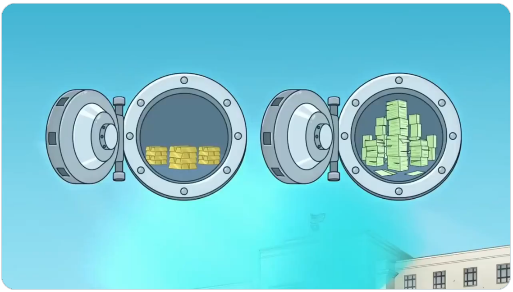
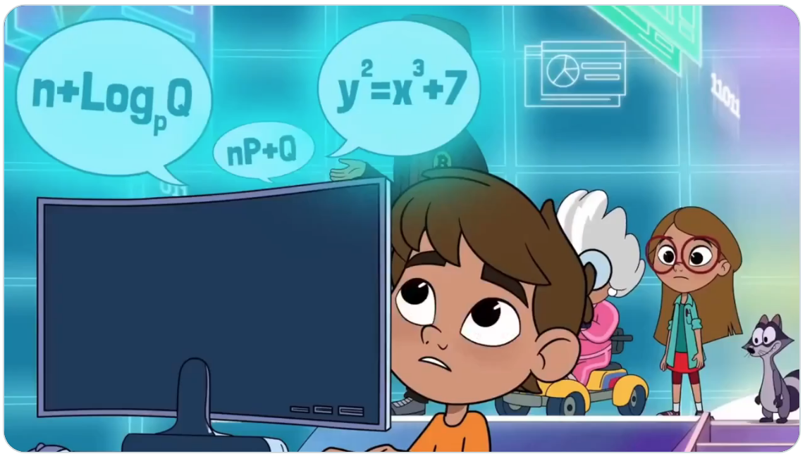
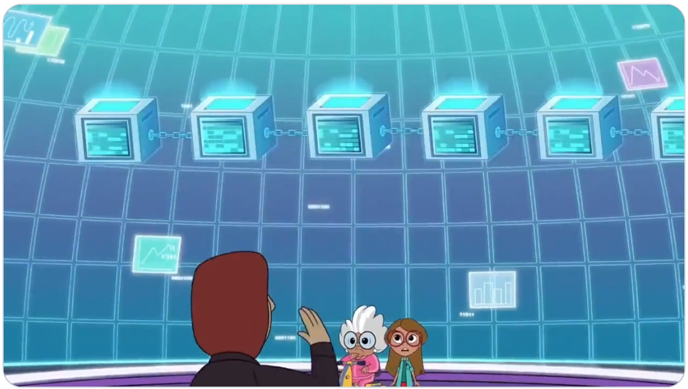
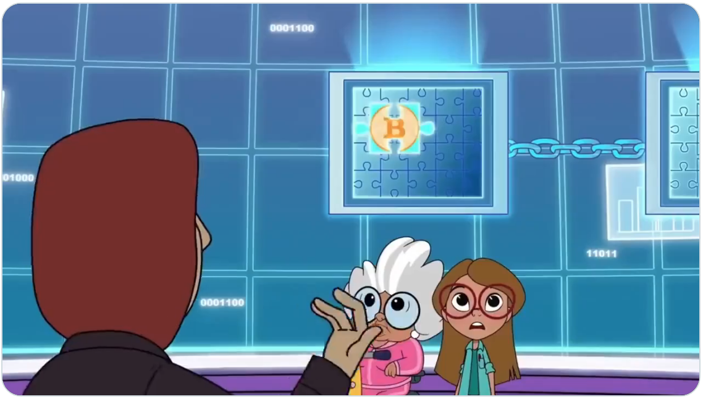
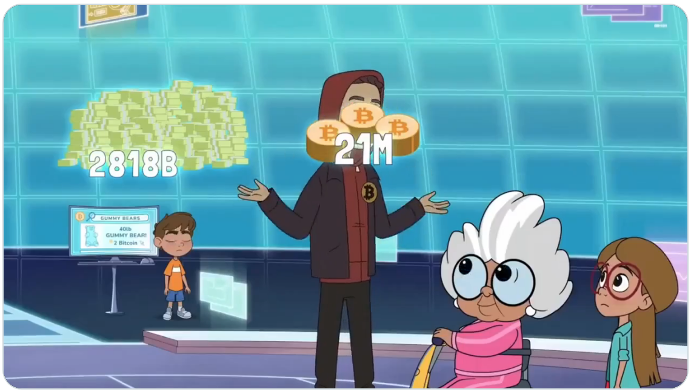
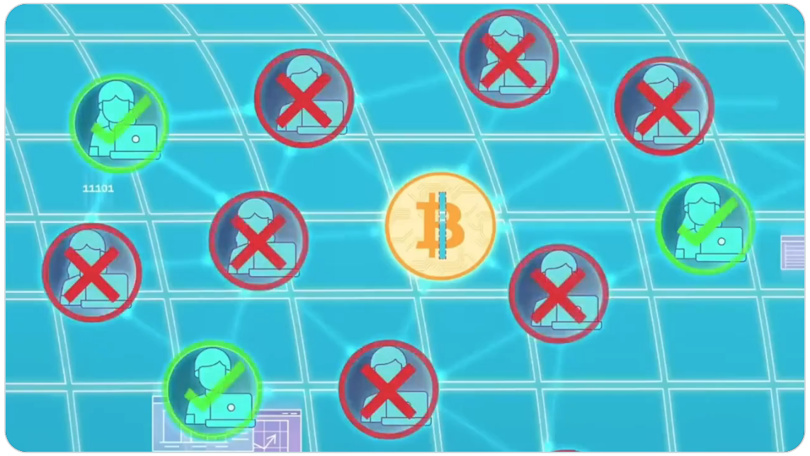
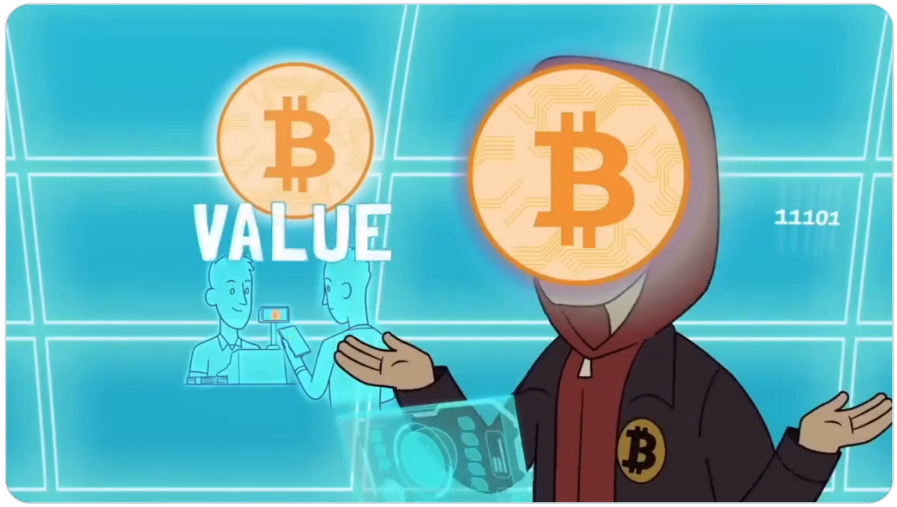

# 五分钟比特币科普（卡通版）

号外：教链内参4.26《现货比特币ETF失血扩大》

* * *

如4.26《现货比特币ETF失血扩大》所报，主力现货比特币ETF近期停止了净流入，BTC（比特币）在6万刀上方摇摆。教链也开始看到一些人的立场和信念开始摇摆，甚至诸如什么牛市将在今年下半年草草结束之类的言论时有出现。归根结底，如果只是把BTC当成和股票、基金、贵金属等一般无二的具有价格波动的符号，那么你便只能从十分肤浅的层次去参与到对价格波动的投机当中去。而要想真正深入地投资于BTC，长期拿住BTC，甚至把BTC当成一种储蓄手段，乃至于最终以BTC为本位去丈量世间一切财富，那你恐怕是非得下点儿功夫好好学习一下诸如“BTC到底是什么”这样的触及本质、触及灵魂的知识不可。

BTC所涉及的知识，广袤博大，看教链《比特币史话》（https://leanpub.com/history-of-bitcoin ）各章节所覆盖的学科领域就足见一斑。但是，“天下难事，必作于易”。下面是一个外国网友制作的五分钟动画卡通科普，直观易懂，生动形象，小学生也很容易理解。原作是英文动画，教链截取其关键场景，配以文字说明，供各位读者一观。

在纸币被发明之前，人们有很长一段时间使用贝壳作为货币。

在英国人最初到达一些原始部落的时候，他们会使用贝壳珠子作为货币。英国商人接受对方用珠子换取物品，因为将来他可以用这珠子再从对方手里换回其他好东西。

因为贝壳珠子对部落的人而言制作起来非常困难，需要很高的技巧，还要耗费大量的时间。

于是他们就会用这项工作来代表其他同等难度的劳动。而珠子制作的难度使之能够保持其价值。

但是，后来欧洲人带来了更先进的工具。这使得制作贝壳珠子变得容易了很多。

于是，慢慢地，英国商人不再愿意收取珠子制品作为货币。换言之，珠子的交易价值消失了。

你可能会问：使用黄金怎么样？

好主意！黄金很难挖掘，所以非常稀有。但是它有个缺点：太重了。

于是政府发行纸币。最初纸币是用来代表黄金。

政府根据保险柜里的黄金储备来印刷纸币。

但是，越来越多的纸币被印刷出来，大大超出了黄金的储备量。

用纸币储蓄的人们，最终一贫如洗。

当纸币太容易被印制出来，社会就要走向崩溃了。这听起来是贝壳故事的翻版，不是吗？

那么，可能你会问，是不是能够发明出一种便于携带而又难于制造的货币呢？是的。这就是比特币。

2008年，中本聪发明了比特币（Bitcoin）。这是一种数字货币，可以点对点地从一个人发送给另一个人，而无需依赖银行或者政府。没有腐败。没有操纵。

比特币只能由电脑通过计算极其困难的谜题来制造。这需要消耗很多的电能和时间。

你可能又说了：比特币是数字的，那么我是不是可以用电脑的复制粘贴功能，来轻易复制比特币呀？

答案是：不能。原因是，我们使用被称为“区块链”（blockchain）的公共记录，来记录每一个被制造出来的比特币。

而这个公共记录在每个人的电脑上都复制保存了一份。

如果有人自己复制一个比特币拿出去花费，会因无法符合谜题的要求，而被网络拒绝掉。这就是为什么比特币会如此安全的原因。

美元可以无限量发行。而比特币的最大发行量仅有2100万枚。

因此，比特币几乎不可能通胀。只有两种方法可以得到比特币：耗费电能和时间来赚取；或者，从别人手里购买。

那么，作为发明人的中本聪能像政府控制法币那样控制比特币吗？不能。没有任何一个人能控制比特币。比特币归网络共同控制，而这个网络由许多人组成，且任何人都可以开放加入。

如果有人想修改比特币的代码，那么这代码需要得到几百万比特币用户中大多数的同意，否则改变就不会发生。

时至今日，每天全世界都有数以百万计的人，点到点地相互发送比特币，更快速、费用更低，而不需要银行或政府的参与。

由于比特币是难以制造的硬货币，越多人使用它，它的价值也就越大。当然，这并不意味着你可以通过比特币暴富。比特币的采用还在发展中，价格也忽上忽下。

总结：好的货币要容易使用、难以制造。并且由于比特币是数字的，所以它速度快，而且使用方便。还有区块链使它很难通胀。

讲完这些后，中本聪先生也永远地消失了。他的消失，消除了比特币整个设计中最后一个单点问题。也许这本就是他整个计划的一部分吧！

