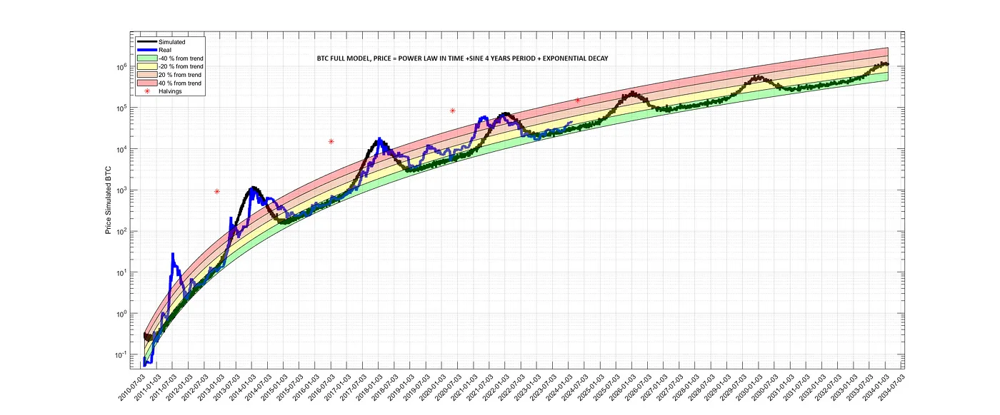
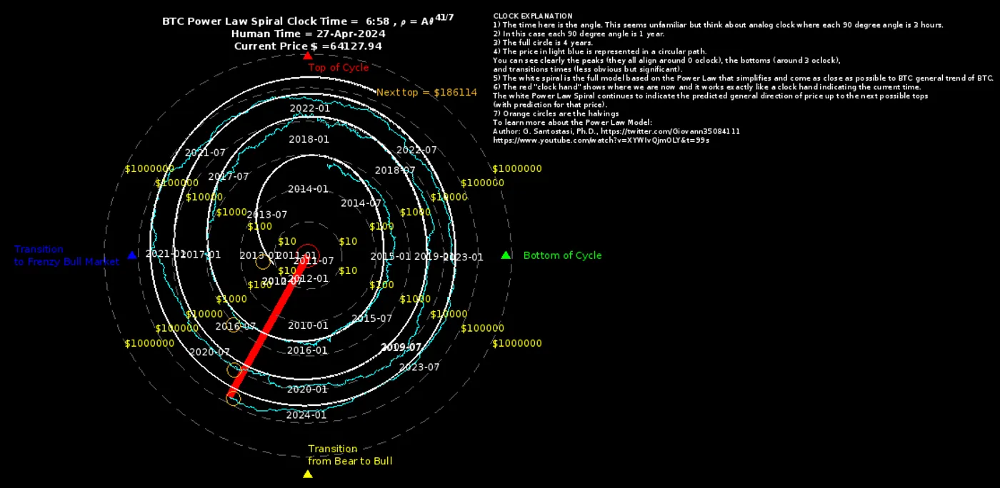
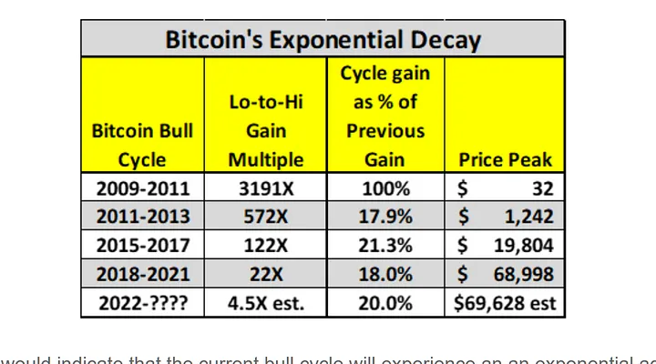
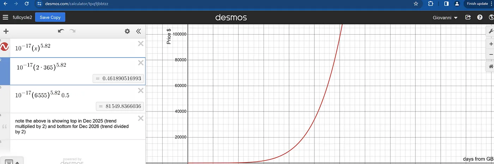
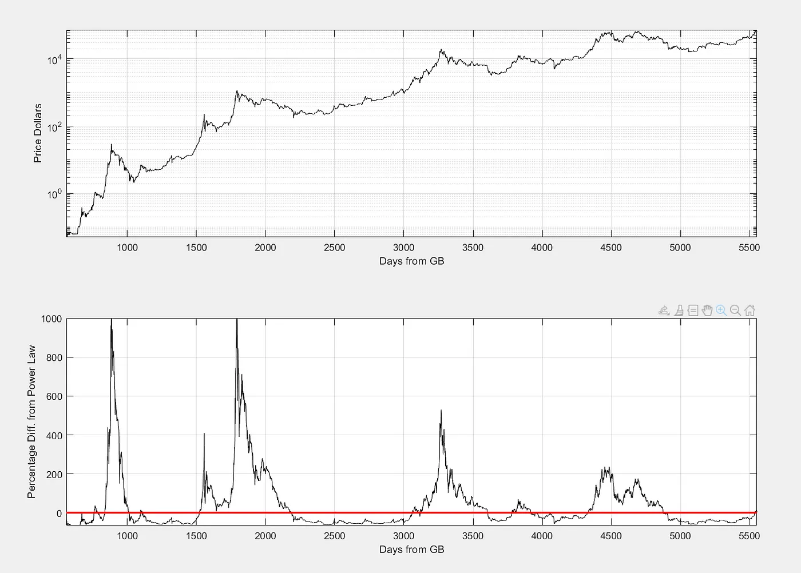
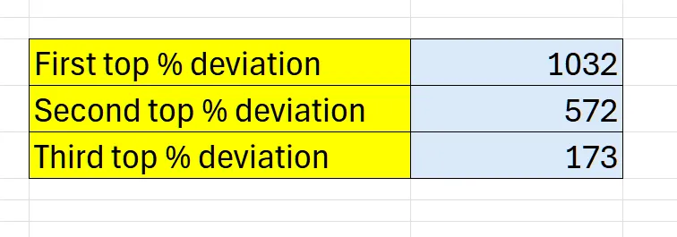
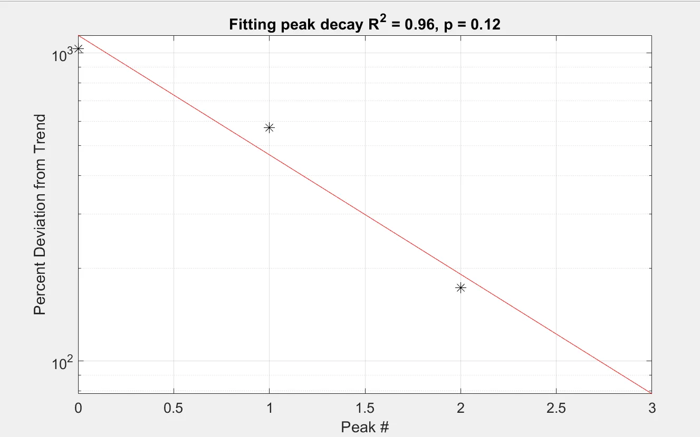
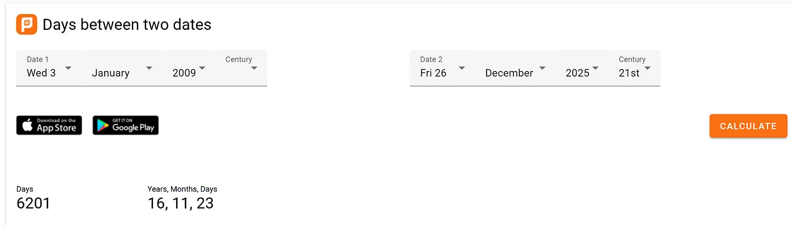
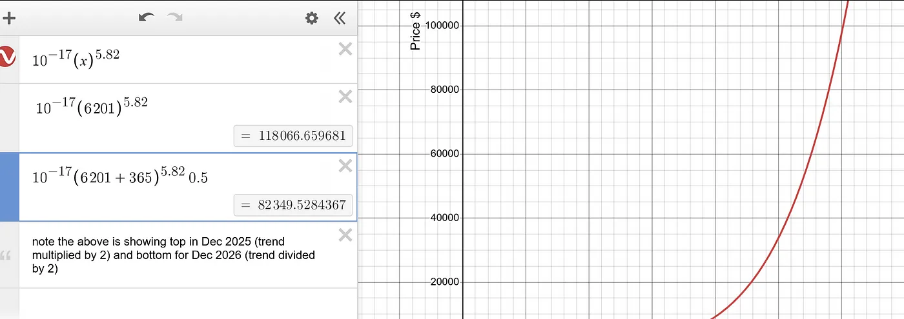
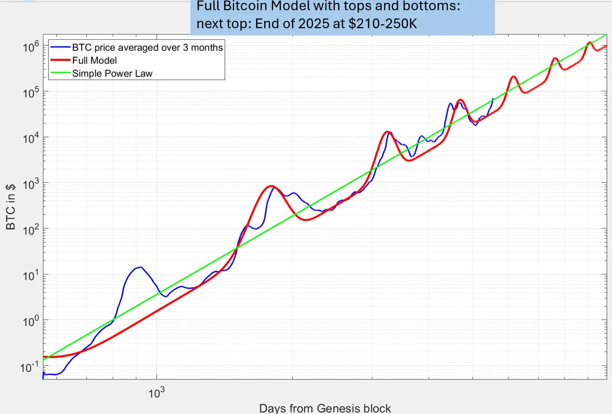

# 一种估算比特币泡沫大小的科学方法

* * *

教链按：这是幂律理论的研究者之一Giovanni Santostasi的最新文章。关于幂律相关知识，各位读者可翻阅教链之前的一些前文了解，如3.30文章《比特币幂律理论：为何其价格将继续等比例增长？》、3.25文章《比特币的时间幂律模型及其协整性再探讨》、2021.7.24文章《比特币的价格走廊》等。

下面这篇文章，则是Giovanni Santostasi针对比特币每4年一次的产量减半周期，在幂律增长模型的基础上，对周期性泡沫的微观建模。

文 | Giovanni Santostasi. A scientific approach to estimating the size of Bitcoin bubbles. 2024.4.29

我们在之前的文章中已经论证过，比特币的长期表现是时间幂律。

鉴于幂律具有标度不变的特性，这使得我们在预测下一个数量级或两个数量级的变化时有很大的把握，因为比特币已经有近 9 个数量级的标度不变性（如果我们把一些已知的最早的美元兑比特币交易包括在内，在这些交易中，1 美元兑换 10,000 个比特币）。

比特币可预测的另一个重要特性是周期性。一个具有强大的已知周期性的系统也是可以预测的。

比特币在 4 年的时间里表现出精确的周期性，即比特币周期。这些周期性与产量减半有关。

半衰期之后通常会有一个长约 1 年半的比平常更牛的时期。

在减半后的大约 1 年半时间里，会观察到与一般幂律趋势的巨大偏差，这与局部最大值或周期的峰值相对应。然后，价格又快速下跌一年左右，达到周期的最低点或最低水平。价格再次缓慢上升，直到下一次减半，然后循环往复。

在比特币 15 年的历史中，这种特殊的序列发生过 3 次，模式非常相似。

有一个减半前的泡沫与任何减半都无关。它发生在比特币诞生后的 4 年中，比第一次减半还要早。与其他泡沫相比，这个泡沫的行为不规则（时间、泡沫高度和其他细节），因此我们将其排除在分析之外。

图释：比特币的幂律行为与趋势存在偏差。图中还展示了完整模型。可以看到 4 年周期的明显振荡。

通过观察比特币的价格走势不难发现，峰值的高度似乎会随着时间的推移而降低。估算这一高度的一个自然方法是观察从趋势的常规底部开始的变化。

我们自然会问，这种峰值高度的降低是否有特定的模式。

这个问题在过去已经讨论过很多次，但最近引起我注意的一个特别的尝试是彼得·勃兰特（Peter Brandt）在 X 上所做的。[1]

[1](https://www.peterlbrandt.com/does-history-make-a-case-that-bitcoin-has-topped/)

教链注：Peter Brandt的观点是，根据每一轮周期从底到顶涨幅衰退推测，本轮周期的顶部就是72k —— 也就是说，这一轮牛市已经过顶了。而他认为后续市场或回调至2021年的中期低点30k。

如果你想用时钟时间来代替，12点 是顶部，3点 是底部，6点 是熊市向牛市的过渡，9点 是向全面牛市的过渡。

我们刚刚过了 6点，还没有进入全面牛市，离周期中通常出现顶部的时间还很远。

彼得·勃兰特的结论来自以下观察。

如果我们测量每个周期从底部到顶部的变化（他将减半前的时期包括在内，由于上述原因，我们将把这一时期排除在外），那么我们可以得出下表：（教链注：这是勃兰特的表格）

如果用从底部算起的百分比变化来表示，似乎每个周期的高度都会降低 5 倍。如果不考虑减半前的时期，我们只有 3 个数据点；如果考虑比率，实际上只有 2 个数据点。这些数据不足以进行任何重要的统计分析。但是，如果我们想对下一个可能出现的比特币泡沫规模做一些有根据的估计，考虑到我们只有这些数据，这也是一种可以接受的方法。

因此，如果我们从表面上看上表，就会得出这样的结论：本轮比特币泡沫将比历史周期的底部 16500 美元只高出 4.5 倍，也就是说，顶部应该在 70000 美元左右。鉴于我们已经达到了这一数值，结论将是我们已经达到了顶峰，因此从现在开始只是下跌而已。

除了已经观察到的周期时间问题，我们还有另一个问题。这种分析没有考虑到比特币的长期幂律轨迹。

从底部到顶部之间大约有 3 年的时间。在这些年里，比特币会沿着幂律轨迹大幅波动，然后通常会有 1 年的完整牛市。

我们可以使用 [Desmos计算器应用程序](https://www.desmos.com/calculator/tpq9jbbtzz) 来理解这一点。

应用中已输入的公式会告诉我们创世区块（Genesis Block, GB）后某一天的幂律估计价格。第一个周期的底部应该发生在创世区块之后的 3 年左右，因此趋势值约为 0.46 美元。

比特币的实际价值约为 0.3 美元。

底部 3 年后，我们迎来了第一个真正的泡沫，价值为 1242 美元。顶部和底部之间的比率应该接近 4000 倍，而不是报告中的 572 倍。这打破了所宣称的峰值从底部到顶部减少 5 倍的规律。

这是由于测量与比特币周期中的周期性事件相关的底部和顶部，而没有将减半前的泡沫作为一个真正的泡沫。

这就证明了这种选取周期底部和顶部来估计峰值大小的方法的随意性。

此外，峰值出现时的趋势值接近 100 美元。

考虑到一般幂律趋势，用偏离一般幂律趋势的程度来衡量顶部似乎更为自然。这可以通过计算价格相对于幂律趋势的百分比差来实现。

下图显示了百分比差与时间的函数关系。

我们可以观察到底部是非常有规律的，而且似乎发生在总体趋势的-60%左右。

顶部似乎显示了我们在常规比特币价格走势图表中观察到的典型衰减。

让我们测量一下这些偏差，看看是否能观察到某种模式。

让我们看看能否绘制出这些数据点并找出其中的规律，而不是计算比率。快速衰减表明存在指数趋势，在半对数图中应显示为一条直线。我们用峰值数来拟合数据，而不是时间函数。

事实上，我们看到的拟合效果不错，R² 值为 0.96。皮尔逊系数至少要达到 0.05 才能使数据具有统计学意义，但考虑到我们只有 3 个数据点，0.12 的相对较小数值即使在这一点上不太显著，也是很有希望的。

毕竟我们只有这些数据。因此，我们可以将衰减推断到下一个峰值，该峰值与趋势的偏差约为 78%，基本上接近 2 倍。

我们可以回到 Desmos 应用程序，计算下一个周期顶点的趋势值，这个顶点应该在 2025 年底。

顺便提一下，以下是一个查找两个日期之间天数的[好方法](https://planetcalc.com/274/)：

峰值的不确定性可能长达 2-3 个月，但这应该能为我们提供一个粗略的估计值。

因此，从 2009 年 1 月 3 日（创世纪区块）到预计的 4 个周期顶部之间大约有 6201 天。

让我们将其输入 Desmos 应用程序：

应用程序显示趋势值约为 118,066 美元。

因此，估计的最高值是

顶部 = 118,000 + 78 / 100 * 118,000 = 210,000 美元。

因此，如果其他一切保持不变，这似乎是一个科学有效的估算周期顶部的方法。

我们还添加了对底部的估计，通常为历史趋势的 50% 或略低于历史趋势。幂律理论对底部的预测比对顶部的预测要强得多。

趋势值接近 165000 美元，底部应为该值的一半左右。四舍五入到下一个整数，我们得出

下一个周期的底部 = 165,000 * 0.5 = 83,000 美元。

这些都是粗略的估计，但与我们的完整模型是一致的，该模型试图包含一般的幂律趋势、50-60%的硬底部、4 年周期的正弦波振荡以及与上述计算结果类似的指数衰减。

见下图：

结论

当然，这些都是粗略的估计，但都是基于我们对比特币的缩放特性及其非常可靠（迄今为止）的周期性的理解。这些预测应该谨慎对待，但希望对比特币投资者有用。

注：这不是任何金融建议，只是对比特币数据的科学探索。

