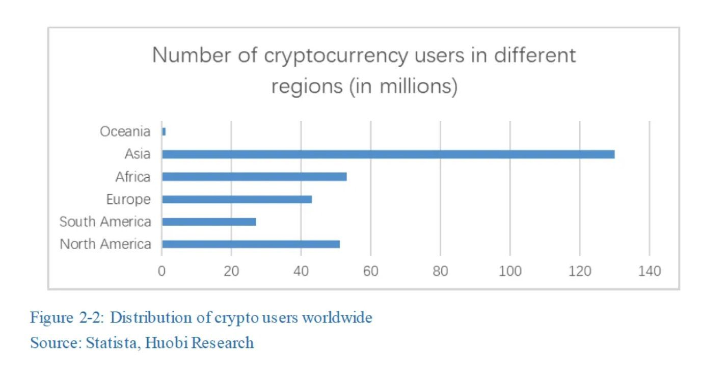
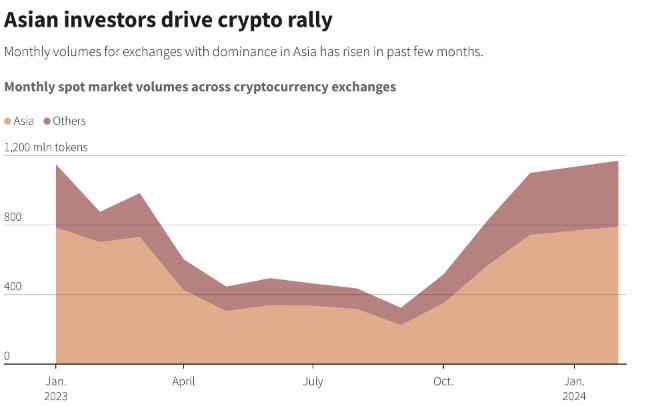
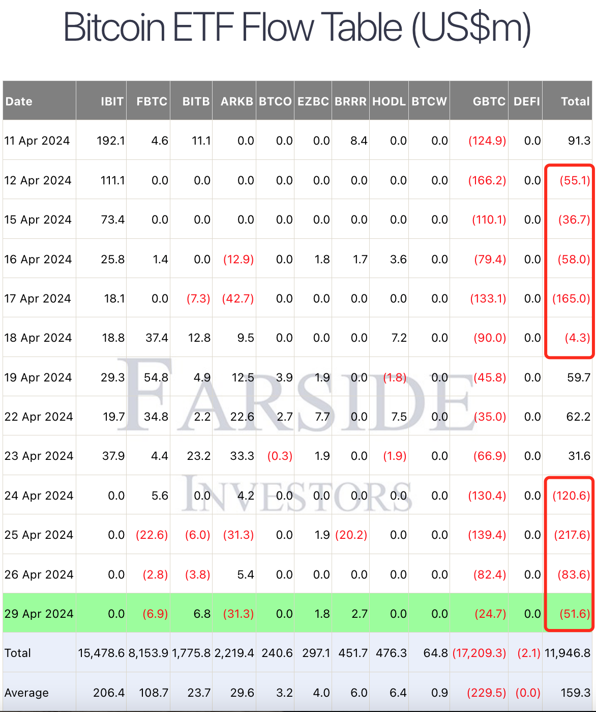

# 香港上市现货比特币及以太坊ETF，首日交易量不及预期

号外：教链内参4.29《机构分析，ETF流入短期停顿后，牛市仍将继续》

* * *

在BTC（比特币）继续回调至61k一线，眼见就要在连续7个月收涨后，终于迎来一个收跌的4月之际，香港如期上市了现货比特币ETF和以太坊ETF，成为全球继美国推出现货比特币ETF之后，亚洲首个推出现货比特币和以太坊ETF的证券市场。这个节奏，符合4.10教链内参《据称香港最快4月底前上市现货BTC ETF》的前瞻。

而且，与美比特币ETF不同的是，香港这次是同时上了比特币ETF和以太坊ETF，而且同时支持现金创建和赎回（cash create & redemption），以及现货创建和赎回（in-kind），可谓是步子迈得更大一些。这在4.15教链内参《香港批准BTC和ETH现货ETF》中有所介绍。

此前，有不少社区网友挺看好这次香港推出加密ETF。因为从数据上看，最多的加密用户在亚洲（比美国和欧洲加起来都要多），数字支付渗透率高，拥有大量掌握科技的年轻人。

比如，就在今年2月份，70%的比特币交易量都发生在亚洲。而大部分时间，也都是亚洲力量在主导现货交易。

不过，香港推出ETF的这个时间点，天时地利都比不上当初1月份美国推出ETF。最近加密市场有些强弩之末，连连回调，极显疲态。美国几支比特币ETF更是早在半个月前就全面转为净流出的失血状态。4.26 内参《现货比特币ETF失血扩大》对这一状况有所介绍。

在美ETF推出后的次月，2月份BTC从43k飙升至63k，单月收涨近45%，是过去连续7个月上涨月份中涨幅最大的一个月。

而港ETF则是在这第8个下跌的一个月月末推出，也就没有借到势。

另外就是，4月30日的次日就是五一小长假。对于传统股票市场的投资者而言，有些人的投资习惯是要在假期前清盘，空仓安心过节的。这可能也会影响到资金参与的积极性。

当然，可能最关键的是，没有打通南下通道。世界最大的两大购买力，一个被美ETF吸收消化，一个被挡在了关外。那么还能剩下多少人和资金能够参与，也就可想而知了。

于是种种因素，就造成了港ETF上市首日，数据方面的表现并不理想。可以说与预想相去甚远。曾经预计成交额会在过亿美刀，而今天直到收盘，实际成交量也仅有8750万港元，约合区区1120万美刀。

网上有人讥讽，这点儿量还赶不上土狗链上随便一个热门土狗。而若与美ETF上市首日高达46亿美刀的量相提并论，则更是连零头都没有。

毋庸置疑，这是一个战略高地。港ETF必须搞起来，搞好。“这个阵地我们不去占领，人家就会去占领；这部分人我们不去团结，人家就会去拉拢。”
