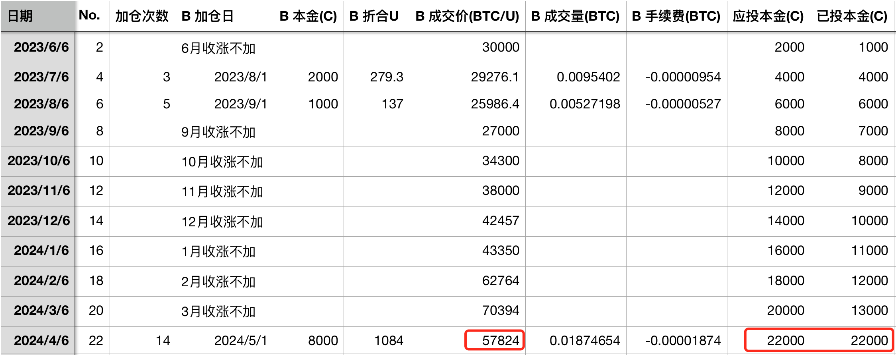
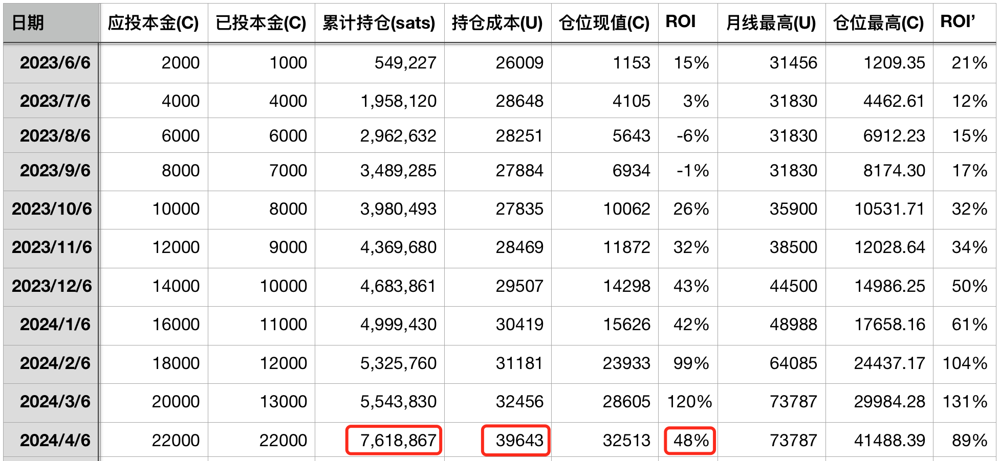

# 满上！ —— 十年之约＃22(ROI 48%)

* * *

空头在忍耐了很久之后，趁五一劳动节东方放假发动突袭，把BTC（比特币）打到6万刀以下。这使得我们终于终结了7个月七连涨的趋势，确定4月以收跌结束。

4月开盘70k，最高72.8k，最低59.6k，收盘60.8k。全月跌幅-13.6%。

这一月度收跌也使得《八字诀·十年之约》实证计划终于可以有机会把积累了7个月的B份资金投出去。7个月每个月积累了1000，总共7000；再加上4月份的一份1000，合计8000。

对逢跌加仓，宜灵活处置，而非机械地一次性全部投出去。比如，可以选择在收跌月全部满上（8000）；也可以选择先加一半（4000），留一后手待再跌再补；或者再多拆分几份，由轻到重，随着下跌的加深分层加仓；等等。

这次就不客气了。直接满上。虽然很多人预期还要再往深里跌，5万、4万甚至3万，云云，但是鉴于目前是牛市前的修复期，加仓还是不要太贪低。于是直接以57824刀的成交价把8000折合1084u子弹全部打出去了。

投后持仓总量就增长到了761万聪，持仓成本上升到了39.6k，收益率回撤到了48%。

十年之约的收益率也许是一个可以参考的晴雨指标。如果收益率短时间忽然变得特别高，那么就要当心回调风险。相反地，如果收益率忽然严重收窄，那么可能恰好是适合逢跌加仓的好时机。大致上类似于价值回归之类的东西，即市场价格总是会向十年之约有一个值为beta的长期收益率回归 —— 如果价格短时过高，就会让账面收益率ROI远超这个beta长期收益率，那么定义这个(ROI - beta)叫做alpha的话，此时就会有正的alpha，即alpha > 0。

换句话说，当alpha > 0的时候，价格就要回调，使得ROI向beta回落，alpha从正值向0回落。

反之，如果价格短时过低，就会让ROI小于beta，那么alph = ROI - beta < 0。于是价格可能在不久的将来就要上涨，使得ROI向beta接近，alpha从负数向0点靠近。

但这个beta我们其实并不知道，因此只能假设。

比如假设beta = 40%，即我们认为八字诀加仓BTC的长期年化复合回报率会达到40%。那么，3月份最高的时候，ROI曾经一度高达130%，偏离beta达110%。

高一倍，低一半。那么如果假设均值回归由于“惯性”，alpha会向负方向运动，会从另一边偏离beta。正偏离一倍，负偏离一半。40%的一半，20%。持仓成本39643刀，(1+20%)就是47571刀。也许这会是一个相对的“底部”了。

当然，要是说空头特别狠、特别猛、特别不要命，把价格推到了39643，让ROI归零，alpha变成-40%，也不是不可以。一切皆有概率，只是大小之别罢了。

无论如何，从幂律模型上看，如果资金能够持有2年以上，即到2027年初，7万刀以下的价格其实都是大概率不会亏损的价格。

