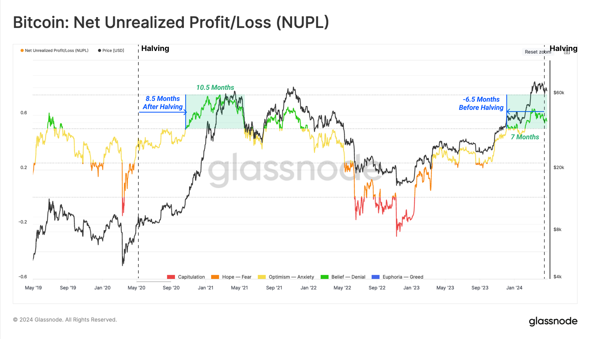

# 是谁在丢盔弃甲？

号外：教链内参5.1《BTC跌破6万，美联储5月不降息》

* * *

继BTC（比特币）跌破关键心理位置6万刀、短促急降至56.5k之后，暂时技术性反弹至58.5k一线。有悲观者说，这是牛市的结束，一切都完了。说这种话的人，或者轻信这种话的人，想必都是些“没见过什么世面”的新韭菜。就这种心理承受力，放在过去15年任何一轮牛熊周期中，恐怕都难以活下来，到今天还持有仓位、站在场内杞人忧天。

在教链星球VIP诸群中，有一个钻石手群。此群独特之处在于，只允许讲有利于坚定持有BTC的话，不允许讲不利于坚定持有BTC的话。任何违反者都会被立即请出去。其他的VIP群及读者群，则是兼容并包，自由碰撞。钻石手群的设定，看起来并不符合“芒格智慧”，即有智慧者可允许相悖的思想并行脑中，甚至不太符合自由主义价值观。但是，它的存在却着实是有一定道理的：不要高估自己克服人性弱点的能力。大多数人，是难以做到完全忽视外人言论的影响而独立思考并保持内心坚定毫不动摇的。

俗话说，三人成虎。一个人唱空，你可以毫不在意。两个人唱空，你的心里可能就要犯嘀咕。三个人唱空，恐怕你就要丢盔弃甲，仓皇割肉了。所以古时候讲一句话叫做，惑乱军心者斩。

囤BTC，的确需要坚定的信念、坚强的意志。这一次周期，不同以往之处在于，减半前就已经进入了“信仰-拒绝”阶段。这是考验人心的时刻。

你说把唱空者都斩了，盲目看多BTC，这不就失去了兼听则明，变成了偏信则暗了么？其实我们可以进行严格的逻辑证明，并不会。

这个逻辑证明就是一层窗户纸，一点就破：任何唱空者，都不能长期跑赢BTC。这就是说，他们的唱空毫无价值。如果他们的唱空有价值，他们就必然能够长期战胜BTC。但是很可惜，他们并不能。那么，他们的论调其实不听也罢。听了，除了让你浪费精力恐慌和忧虑，以及浪费时间去和他们争辩之外，也就是纯粹给你带来负面价值之外，并不能给你带来任何正面收益。

至于为什么他们必然不能长期跑赢BTC，这一点教链早已在2020年12月31日文章《为什么你的投资跑不赢比特币？》中进行过严格的证明。此处不再赘述。

而教链在2021年1月19日文章指出，《一切不能跑赢比特币的勤奋，都是愚蠢的努力》。也就是说，这些时间的消耗、精力的浪费，都是愚蠢的。

既然这都是些愚蠢的无用功，那么直接屏蔽、排斥、消灭、清除，就是十分恰当的了。

知道自己的弱点，不是硬要逼着自己克服弱点，而是要学会尊重自己的弱点。所以，对于不能在面对冲突观点保持独立和坚定的大多数人，可能最应该做的，不是逼着自己拥有芒格般的智慧，而是学会屏蔽扰乱自己心神的噪音。

四海翻腾云水怒，五洲震荡风雷激。
一万年太久，只争朝夕。
扫除一切无用功，全无敌！

在产量减半之后、牛市腾飞之前，每一次回调，都是越来越接近于“最后一次上车的机会”。

只有不惧执行八字诀之“逢跌加仓”的人，才有资格持有仓位穿越牛熊，满仓享受牛市暴涨的胜利果实。
