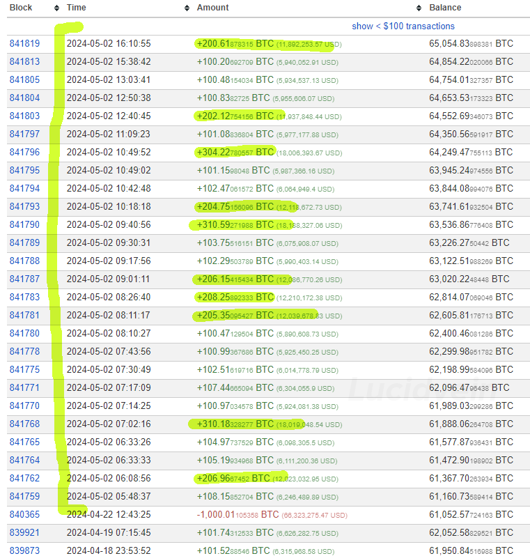
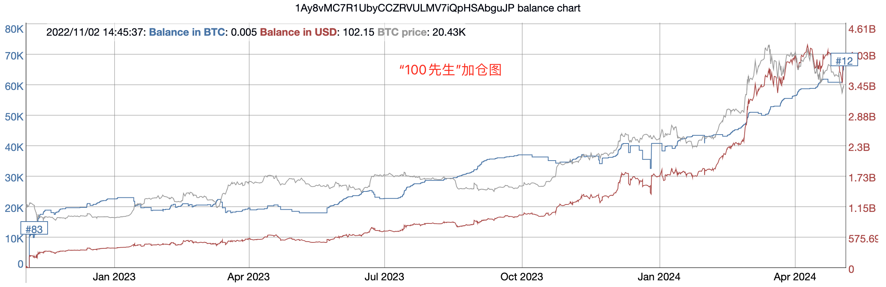
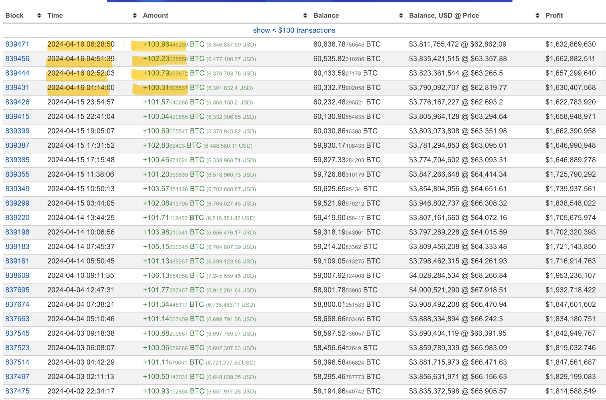

# “100先生”逢跌加仓

* * *

BTC（比特币）从前日创下的局部低点56.5k持续修复至59k上方，距离重回6万刀仅有半步之遥。

群里有群友还在等25k。还有朋友发来消息问，这次是不是有机会跌回15k？

躺下睡一觉。梦里会有的。

就在前两天ETF们疯狂抛售的时候，神秘的“100先生”突然加大了加仓力度和频率！接连买入4000多枚BTC。

要知道，减半后每天矿工总共才能挖出来450个BTC。这个“100先生”一天买入量是当日产量的近9倍。

这个神秘的身份未知的“100先生”，从2022年11月2日以来，一直坚持每天定投100枚BTC。被网友发现后，便称呼他为“100先生”。

短短一年多，他就加仓了6万多枚BTC。（“100先生”的囤饼地址：1Ay8vMC7R1UbyCCZRVULMV7iQpHSAbguJP ）

4月22日，他在小幅减持1000枚BTC后，暂停了定投。至于他为何减持，可能是他觉得4月份加仓的有些过多了吧？

有网友推测这个神秘的、坚定的“100先生”可能是一个多金的主权国家在偷偷建仓。

分析机构Arkham则认为，这根本就是一家成立于2017年韩国交易所的冷钱包。至于它为何如此规律性地流入BTC，那是它们的归集程序在从散户的充币地址收纳零散的BTC。

但是被Arkham怀疑的交易所并没有出来澄清。

如果它真的是交易所的冷钱包，规律流入是程序化归集。那么，在大幅回调时，归集量大幅增加，说明散户在恐慌性充币和抛售。

有趣的是，自从这个地址开始加仓BTC以来，它整体上已经积累了超过14亿美刀的浮盈。换句话说，那些充币抛售的散户总体上亏损或错过了14亿美刀。

无论“100先生”究竟是一个大户在偷偷加仓，还是一个机器人在囤积BTC，它的故事都生动地向我们诠释了一句经典名言：在别人恐慌时贪婪，就能战胜绝大多数人。

