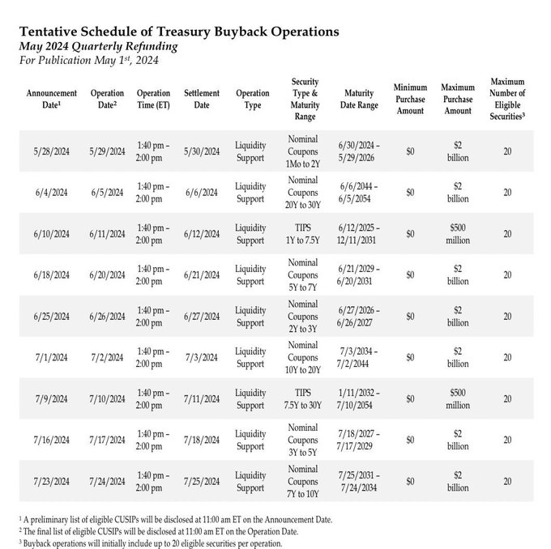
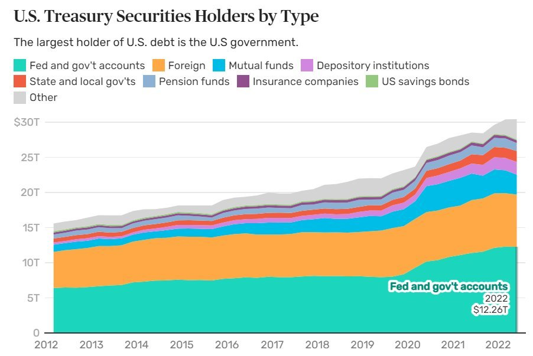
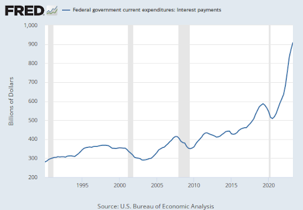
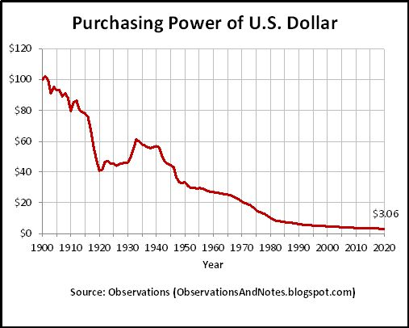

# 529，美债左手倒右手

号外：教链内参5.5《手滑转丢了1155枚比特币》

* * *

将来回头看，2024年的这个5月，可能是美元流动性受限的最后一个月。6月，降息未至，洪水先行。

一是今日教链内参《手滑转丢了1155枚比特币》介绍了，6月1日期美联储每个月的缩表规模要骤降约四分之三，从950亿刀减少到250亿刀，另外就是每个月把350亿刀从MBS换仓成美债。来回抵消之后，美联储表内美债部分从净缩减600亿刀突然就逆转为净增持100亿刀了。只是要苦一苦房地产大兄弟了。

二是美国财政部自2002年开始的美债回购项目，执行回购的时间将近了。第一笔回购已确定会发生在5月29日（见下表）。

在此期间，财政部计划每周举行一次流动性支持回购，每次行动最多 20 亿美元，其中最多 5 亿美元分配给 TIPS（国库通胀保值证券）。这一举措旨在确保国债市场仍然是世界上深度最深、流动性最强的市场，解决市场功能和弹性方面的问题。

对此有网友评论道：在我看来，这就是对银行的救助（bailout）。

这不由得又一次令人回想起，2009年1月3日比特币创世区块中镌刻的《泰晤士报》的那个标题：财政大臣正处于再次救助银行业的边缘。

同一版面上方，是以军派遣地面部队准备进攻加沙的照片。

历史本身就是一个巨大的回旋镖。每每会看，总会令人有Déjà vu（似曾相识）之感。

网友Cole Walmsley对于财政部回购美债一事发表了如下评论：

这太疯狂了。

这太疯狂了。

这是美元和所有法定货币末日即将来临的明显标志。

美国财政部发行债券和其他投资证券。

他们称之为“国债”。

当美国联邦政府的支出超过预算，造成“预算赤字”时，美国财政部就会发行国债。出售国债可以弥补亏损。

国债被出售，并作为债务附着在国债上。这就是美国 34 万亿美元巨额债务的实质。

划重点： 美国联邦政府在过去 53 年中有 49 年出现预算赤字，上一次盈余是在 2001 年。

然而，即使在 2001 年这个 “预算盈余” 年，债务总额也在增加。

为什么呢？

因为过去几年的一大堆债务到期了。

美国财政部发行国债的期限从 4 周到 30 年不等。

因此，2001 年，政府有 1971 年、1981 年、1991 年、1994 年、1996 年、1998 年、1999 年和前一年向投资者发行的债务到期。

2001 年到期的债务超过了预算盈余（债务发行不是预算的一部分），因此，政府不得不发行新债来偿还旧债，进一步增加了债务总额。

划重点：美国财政部是美国联邦政府的一部分，它必须向新投资者出售新债，以偿还旧投资者的旧债。这是因为：1）持续的预算赤字；2）过去几年的债务即将到期。

划重点：庞氏骗局的定义是：“用新投资者的钱偿还旧投资者的投资计划”。......美国联邦政府正在实施庞氏骗局。金额高达 34.7 万亿美元，而且还在不断增加。

“万亿”只是一个词。我们一定要注意其中的意义。

“十亿”秒前是 1993 年（31 年前）。

一“万亿”秒前是公元前 3 万年。

然后用万亿乘以 34.7。

这就是美国债务法案的规模。

但是，等等。情况更糟。

划重点：美国财政部的债务总是要有买家，因为如果没有买家，他们就无法偿还：1）赤字支出；2）即将到期的旧债（以及债务利息）。如果无法偿还这些债务，政府就会违约并崩溃。

那么，谁来购买所有的美国政府债务呢？

划重点：美国联邦政府债务的最大买家和所有者就是美国联邦政府自己。

不要相信，请验证：(Don't trust, verify)

花点时间想想这是多么疯狂。

美国政府在预算赤字的情况下支出，然后发行国债来支付支出，再以高于其他人的利率购买国债来弥补损失。这是一个令人难以置信的庞氏骗局。

美国政府是庞氏骗局的导演、老投资者和新投资者。这是真正的大手笔。

但他们是怎么做到的呢？他们有一台印钞机。就这么简单。债务仿佛不存在。

划重点：并非只有美国在玩这套把戏。世界上 222 个国家中有 182 个出现预算赤字。庞氏骗局无处不在。

美国是现代货币世界的霸主。他们是首脑，是大祭司，是大奶酪。

当前的全球金融经济是建立在美国的基础之上的。

如果美国出现债务买方问题，就会出现巨大的问题。

简而言之，越来越多的投资者对美国的债务状况感到恐惧，从而放弃购买美国国债。

最近的头条新闻：

“国债拍卖需求疲软，市场担心美国债务飙升将压垮华尔街” -- 2023 年 10 月 12 日

“30年期国债拍卖惨淡，股市下挫” -- 2023年11月9日

“世界将淹没在美国债务中；穆迪下调美国债务评级” -- 2023 年 11 月 17 日

“5年期国债拍卖乏善可陈” -- 2024年1月24日

“财政部 160 亿美元 20 年期债券拍卖结果‘非常难看’” -- 2024 年 2 月 21 日

“本年度最高国债收益率未能吸引买家参加拍卖” -- 2024 年 4 月 11 日

随着需求的减少，正如上文所说的，美国财政部开始了 “国债回购行动”，正如他们所说，旨在 “改善国债市场的流动性”。

实际情况是，财政部正在使用印钞机直接购买他们发行的国债，以确保那些低需求的国债拍卖不会继续下去。这导致了货币供应量的膨胀，这是一个危险的结果。

问题就在这里：

美国中央银行美联储的通胀目标是 2%。最近的通货膨胀率并没有达到 2%，事实上，通货膨胀率已经连续三个月加速上升。

美联储设定了高利率，目前为 5.25%，以此来抑制借贷、消费和通胀。

但这并没有奏效。还有一个更大的问题。

划重点：美国联邦政府向持有国债的投资者支付利息，而利息是预算的一部分。更高的利息支付 = 更多的联邦支出 = 更大的预算赤字 = 更多的债务发行 = 更高的国债供应 = 更低的需求 = 更少的买家 = 印钞（教链注：原贴写的是Treasury printing，疑似笔误，应为Money printing） = 更高的通货膨胀 = 更高的利率 = 更高的利息支付。

这是一个灾难性的反馈循环。

近年来，联邦政府支付的利息飙升： 

美元完蛋了。

美联储设定了高利率来抑制通货膨胀，但这并没有奏效。高利率导致利息支出增加，造成预算赤字增加。

这导致美国财政部发行更多的债务，而投资者开始害怕这些债务（因为通胀失控和债务水平不断复利），这使得财政部现在不得不印钞，提供 “流动性” 来稳定国债市场，再次为通胀火上浇油。

美联储可以进一步提高利率来抑制通胀，但这会增加利息支出和赤字支出，需要发行更多的债务和 “流动性”，从而加剧通胀。加息还可能导致大规模衰退或萧条，使经济陷入停滞，这意味着政府的税收收入减少，但仍在根深蒂固的政府项目和刺激措施上花费巨大，这只会再次增加预算赤字和债务发行。

美联储可以降低利率，但这将立即导致通胀上升，因为人们在较低利率的鼓励下借贷和消费，这将迫使美联储再次提高利率。

美联储可以承认失败，并将通胀目标提高到 3% 或 4%，但这将发出系统失灵的信号，从而导致人们进一步丧失信心，这将导致美债购买者减少，从而导致更多的通胀，并将产生对更高利率的需求（因为美债投资者希望跟上通胀），这又将导致更多的利息支出，等等。

这就是债务螺旋。

没有出路。

你们正在现场见证这一切。这些年将载入史册。

每一种法定货币都失败了，原因都是一样的。打开印钞机太诱人了。

别忘了，美国政府永远不会让国债市场崩溃，因为那将导致债务自动违约和令人难以置信的混乱崩盘。

他们总是会求助于印钞机来救市。财政部将继续印更多的钞票来维持系统的运转，他们即将进行的 “回购行动” 就是证明。但通货膨胀是致命的缺陷。

庞氏骗局已进入尾声。终局就在这里。

通货膨胀的列车已经驶离车站，再也不会回来了。

疫情让废墟进入了超速状态。通货膨胀跑起来了，现在它无法被驯服。它自食恶果，并将继续这样做，一次又一次，先是渐渐地，然后突然地。

然后，噗！它消失了。

毫无价值。

如果你没有注意到，美元走向 “一文不值” 的方向已经有一段时间了。

这是不可避免的。美元和所有法定货币都将消亡。

凤凰涅槃，浴火重生。

一个创新的、专门设计的、全球性的、不可超发的、无法操纵的、可验证的、即时的数字货币系统将出现，一劳永逸地摆脱银行家和政府的控制。

......世界从此被修复。

修复货币，修复世界。

比特币。

