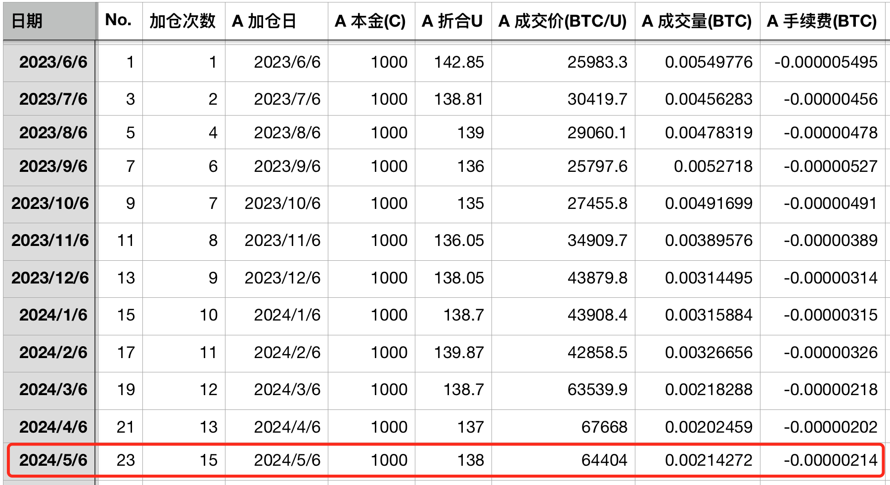
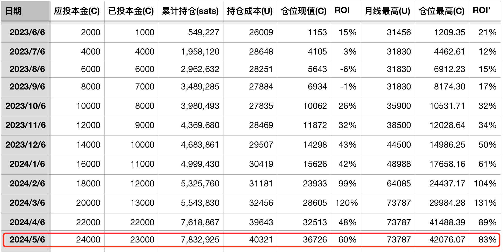

# 乘胜追击 —— 十年之约＃23(ROI 60%)

* * *

又到6号加仓日。BTC（比特币）反弹连涨4天后，在30日均线64.6k处遭到阻击，多空双方暂时僵持在此。

前次5月1日《满上！ —— 十年之约＃22(ROI 48%)》在57.8k的“加满”很快就收到了回报。此次是第23次记录、第15次操作，以64404刀成交价加仓。

投后ROI（收益率）恢复到60%。累计持仓783万聪。平均持仓成本升高至4万刀。

转眼间，《八字诀 · 十年之约》实证计划已经执行近一年。一年间，多头从不到3万刀，如今已经一路打过了6万刀。

宜将剩勇追穷寇，不可沽名学霸王。

到6月份，对数走廊支撑线升至近3万刀。十年之约的持仓成本线是4万刀。这个线是很难破的。如果破了，那只会是千载难逢的加仓良机。

有趣的是，如果我们把第一张表格中的定投价格加和求平均，是41657刀。这个数字代表了简单定投法（DCA）的持仓成本。而八字诀操作下来，持仓成本40321刀，略低于简单定投法的成本41657刀。

这一事实表明，教链的“八字诀”策略，至少在过去一年的真实行情中，略微跑赢简单定投。而如果做过回测的朋友就知道，跑赢定投有多难。没做过的，可以翻阅一下教链的文章，2023.3.24《跑赢定投有多难？》。

从实际操作记录来看，也许还可以进一步优化机动加仓的策略。比如在急涨行情的头部，如果判断趋势有可能延续较久，涨幅有可能涨的较高，那么可以稍微跟随一下，这样可能会更佳。不过当然，这样也会带来更大的不确定性。

一年60%多吗？看起来好像也不算太多，特别是对于加密投机者而言，没有个5倍10倍都不好意思拿出来说。

但是，教链要验证的，是确定性，是胜率，是长期的可重复性（稳定的复利），以及横向（人人）的和纵向（规模）的可复制性。

对于BTC日交易额近200亿美刀的交易规模而言，这个策略大概可以放大到一亿美刀而不失真。也就是说，一亿美刀的资金体量来做同样的操作，一年赚6000万刀，是可行的。

如果能够10年稳定复利，那么10年的总投入是10亿美刀，第11年十年之约计划结束后一年，总回报是 1.6^10 + 1.6^9 + 1.6^8 + 1.6^7 + ... + 1.6 = 1.6 x (1 - 1.6^10)/(1 - 1.6) = 约290亿刀。姑且算是约等于300亿刀，那么收益大约是总投入的30倍。

当然，如果可投资本金不是10年间慢慢积累的，而是现在就有，一把满仓，最后收益率肯定高得多，大概是 1.6^10 = 109倍，10年百倍这个样子。

不能对于如此之高的收益率还能长期稳定复利有非分之想，盲目追求。谨记：命里有时终须有，命里无时莫强求。

要知道，人类社会长期生产力进步速度才每年2%，而跑赢法币物价的通胀也仅仅需要每年10%的增长率就够了。

“祸莫大於不知足，咎莫大於欲得，故知足之足，常足矣。”

最大的祸害是不知足，最大的过失是贪得的欲望。知道到什么地步就该满足了的人，永远是满足的。

所以，知足常乐，才是根本。

