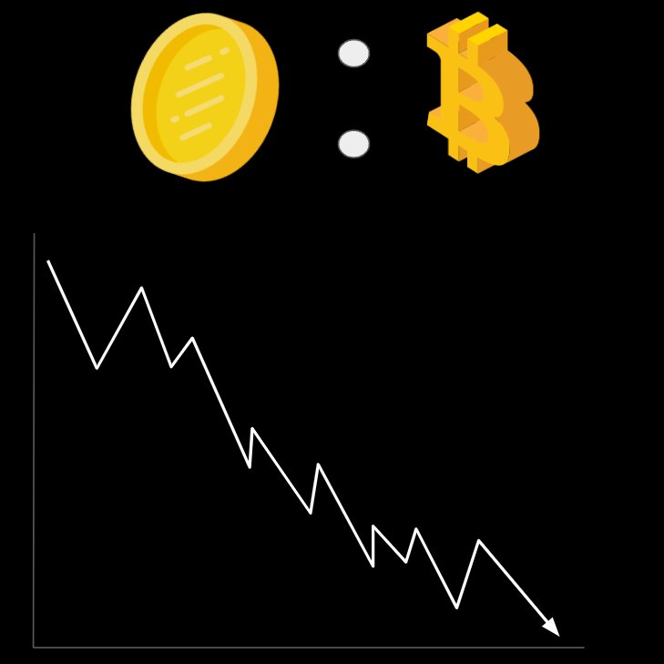

# 比特币即将再次超越黄金

号外：教链内参5.8《期货押注BTC 9月10万刀，警惕鲸鱼抛售风险》

* * *

昨5.8内参《期货押注BTC 9月10万刀，警惕鲸鱼抛售风险》报黄金现货$2300多，这乘以公斤对金衡盎司的比例32.15，约等于74k美刀/公斤。BTC（比特币）目前从74k暂时回落至62k附近，与1公斤黄金相差不到20%。

历史上，BTC曾在2021年的两个小牛顶时，1枚BTC短暂追平甚至赶超1公斤黄金的价值。

在这个减半周期，S2F硬度（或者稀有度）已经超过黄金的BTC，将要开始与这颗蓝色星球上最具全球共识度的硬通货展开角逐。（参阅教链2023.2.17文章《2024奇点将至：人类尚未准备好迎接S2F大于100的巨硬资产》，2024.4.20文章《比特币的黄金减半》）

最终，谁会胜出？思考这个问题，我们需要充分理解货币的诞生和选择进化过程。网友Anil画的几页幻灯片，有助于我们快速理解这个问题。

最初，没有货币可用时，我们采用“易货”交易。

其实，大家看到近几年我们和很多国家签署了特别多的货币互换协议，其实质就是在「美元不存在」的情况下开展一种易货贸易。这是为美元霸权退出历史舞台未雨绸缪。

不过易货交易有个显然的缺点，那就是组合爆炸问题。即便是对于如下仅有6件商品的情况：

两两交换的话，也会出现高达15种“汇率”。

不过，上面教链说到的货币互换协议，能大大减轻组合爆炸问题。货币互换协议的两国法币，起到了“代理”的作用。只是参与互换的各国间需要两两确定互换汇率。

如果整个货币互换网络有一个特别大的主导国，是其他各国的主要贸易伙伴，那么就会进一步简化为“总线”结构，以该主导国与其他诸国两两签署互换协议即可。这样，就把协议数量（网络连接数）进一步减少到签约国数量。

其实，对于易货交易演化出一般等价物，逻辑相似，但一般等价物比互换协议更简单、更方便。只不过，全球共识不是轻易就可以建立起来的。

那么，具备什么特性的商品才能被选作一般等价物呢？

通常认为，如下几个特征是非常关键的：

1. 稀缺。非常难以生产，可以抵抗对供应量的人为操纵和贬值。
2. 可分割。在任意尺度上都可以组合或者分割。
3. 便携。价值密度高，非常容易在空间中移动。
4. 耐久。不会磨损，经久不坏（即容易在时间上移动）。
5. 可辨识。很容易鉴定真伪，任何人都很容易验证其价值。

具备这些特征的一般等价物就可以行使货币的职能。

为了寻找最优的货币，人们在漫长的历史中，用这些关键标准检视所有的商品。

首要的问题是，我们必须扪心自问，哪一个是贮藏价值的最佳选择？如果选择了错误的价值存储，那么你相对于作出正确选择的人就会变得越来越穷。

人们会一直重复这个比较和筛选的过程，直至找到最终胜出的那一个。

你可能会想：我可从来没有主动选择过，货币一直都在那儿。

这正是跳出窠臼并认清法币这个旧把戏变得从未如此重要的原因。旧把戏在全世界一个又一个地方，尝试了一次又一次，每次都以超级通胀而告终。

三点确保了货币垄断：1、物理疆界；2、资本控制；3、法币律法。

为何政府们都偏好于让公民采用它们的货币呢？因为这样你的储蓄就会成为政府的存钱罐，在需要的时候通过贬值（过去的铸币时代）或者通胀（当今的法币时代）来提取价值。

这就是为何当今世界主权政府广泛反对私人发行货币并游离于银行系统之外的原因。

现在你可以稍微思考一下：为什么它们会允许BTC存在呢？

它们不会。只不过它们没有可行的办法来阻止一种思想，当这种思想的时代到来的时候。

人类社会最具有力量的，不是金钱，也不是权力（暴力），而是历史。历史大势浩浩荡荡，不可阻挡。而创造世界历史的动力，不是神仙皇帝，不是达官显贵，而是你，是我，是他，是全世界几十亿普通、平凡的人民群众。

当每个人都思想觉醒，当每个人都认为不合理需要被改变，那就一定会改变。一切愚昧和反动，都终将被历史扫进垃圾堆。
