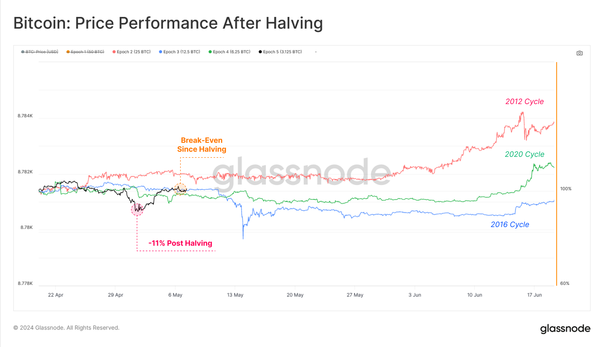
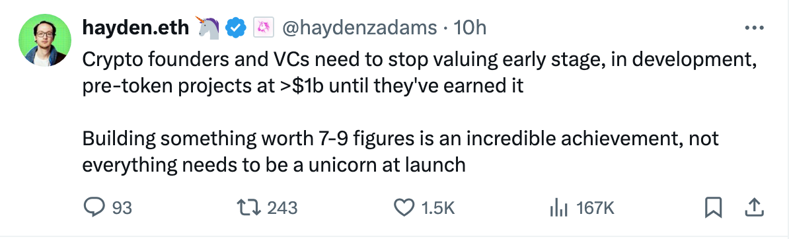

# 比特币永不坠落

号外：教链内参5.8《渣打银行重申BTC看多观点》

* * *

近期BTC（比特币）被30日均线压着向下走，抬不起头来。从3月中旬到现在已经过去快2个月，一些高位进场的人快被磨没了精神。无论是美ETF还是港ETF，都因为行情的低迷而转入了净流出，显示出散户的纸手。但正如5.8教链内参《渣打银行重申BTC看多观点》中所讲的那样，应该学习央妈，做一个战略买手，而不是战术买手。

在过往历次产量减半后，战略买手们大概有2-3个月的时间逢跌加仓。2、3个月后，发令员就会扣响扳机。

上面这图是历次减半的减半日后60天的走势图。如果想看的更真切，拉大视野，看到更前和更后的走势，不妨再重温一下教链在2024.4.9写的复盘文章《比特币产量减半简史》。

也许有人会觉得，这次不一样。尤其是唱空者，更是极尽所能，试图否定历史的韵脚。

历史却总是给人们意外。当你切盼历史重演时，它偏不按常理出牌。当你觉得这次不一样时，它又偏偏要押韵。

减半后的冷静期是必不可少的。一是为此前的过热降温减负，二是为未来的起飞养精蓄锐。

减负是什么意思？就是对山寨、土狗、模因、NFT实施全面打击。在牛市前，它们都是牛市起飞的负担。在牛市时，它们都是透支牛市的杀手。

对抗地心引力是困难的。必须非常努力，还不一定能够办得到。山寨、土狗、模因、NFT，等等一切，自诞生起，其命运就是被地心引力捕获，无限坠落。

在穿越牛熊的惊险旅途中，数不清的人坠机身亡。

高势能启动的项目是滑翔机。开盘即巅峰。此后终其一生只有一个方向，那就是向下。

Uniswap创始人Hayden Adams说：「加密项目创始人和风险投资人需要停止将早期、开发中、代币发行前项目的估值定在 10 亿美元以上，直到它们（发展到）值这个价为止。创建价值 7-9 位数的项目是一项了不起的成就，并非所有项目在推出时都需要成为独角兽。」

代币销售时，哪个项目方不是极力鼓吹自己的项目，以求买个好价钱？

吹得越高，势能越大，向下坠落时，动能也就越强，着地时摔得也就越惨。

比特币零势能启动，从地面起飞，越飞越高，直冲云霄。“好风凭借力，送我上青云。”

比特币永不坠落。

不是比特币在克服地心引力。比特币就是地心引力。不是比特币在起飞，而是美元在坠落。

比特币永不坠落。

一切势能本质上都是债务。唯一的区别只是这债务需不需要偿还，代价由谁来承受。美元，更是明明白白的债务信用。比特币不基于任何债务发行，比特币系统也没有资产负债表，所以《比特币永不破产》（教链2020.11.28文章）。

比特币永不坠落。

从比特币本位视角来看，比特币一直都在那里，1 BTC = 1 BTC。脚踏实地。
