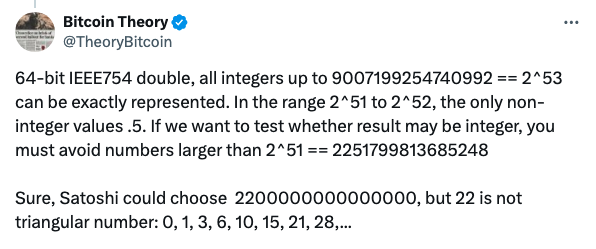

# 比特币总量2100万枚的来龙去脉

号外：教链内参5.11《024美总统大选前，加密游说风起云涌》

* * *

一片花飞减却春，风飘万点正愁人。且看欲尽花经眼，莫厌伤多酒入唇。

五月的加密市场，BTC（比特币）在6万刀踟蹰不前，春去花落一片红。无甚热闹，但徜徉湖边，看绿水青山，心底宁静，仓位致远。

BTC乃加密行业之根。总量2100万之上限，乃BTC之本。一切都从这个神奇的数字展开。可是它，为何是这样一个数字呢？

教链在2020年12月5日文章《为什么比特币最多只会有2100万枚？》中，就曾介绍过这个数字的计算方法。简而言之是这样的：

1. 每区块产量 50 BTC
2. 每21万个区块，产量减半

使用等比数列求和可以轻松算出，最终BTC的总产量为：(50 + 25 + 12.5 + 6.25 + 3.125 + ...) x 21万 = 2100万枚。

进一步的，调节“挖矿”难度使得大约每10分钟产生一个新区块，即每小时6个新区块，21万个区块就大概是人间4年。

这也就是比特币4年产量减半周期的来历。

但是，如此只是对既定事实的一个铺叙而已。一是缺乏一些细节的考察；二是并未真正揭示比特币发明人中本聪为何要选择和设计这样一个数字的原因。

先说细节。

首先，2100万并非2100万，而是2,099,999,997,690,000。对，后面这个数字比2100万要大1亿倍，即大约是2100万亿。在比特币系统内部，都是这个万亿级的整数。

当我们把BTC“展示”为这个整数点上8位小数位，也就变成了2 0,99 9,99 9.97 690 000。这里我用空格提示了上面作为整数时的千分位分割点。我们一眼就会看到，中本聪选择8位小数位其实有些奇怪的，因为这样会导致8位小数的BTC整数部分的逗号分割点，和系统内真正的整数的逗号分割点不一致。

8位小数位，也就是1亿分之一，这个就不太西方。众所周知，英文里对数字采用千分位分割，所以计数法的单位是千（thousand）、百万（million）、十亿（billion）、万亿（trillion）。英文里并没有“亿”这个单位。而中国的计数法略有不同，是以4位数字也就是万分位为分割的，乃有万、亿、万亿。

2100万亿用万分位分割就是这样的：2099 9999 9769 0000；2100万带8位小数则是这样的：2099 9999.9769 0000。都是4小节，每小节4位数字，没有任何混乱。所以看起来，8位小数位，1亿分之一，嗯，这很东方。

其次，2100万亿之所以是2,099,999,997,690,000而不是精确的2,100,000,000,000,000，也正是因为8位小数位的精度限制。

上文的等比数列(50 + 25 + 12.5 + 6.25 + 3.125 + ...)并非真正的无穷数列，而是当它减小到0.0000 0001之后，再减半就归零了。因此，这是一个截断了的有穷数列，其加和就要小于无穷数列求和的结果100。所以，乘以21万之后，最终结果也要略小于2100万。

第三，注意第一点的叙述，8位小数位和小数点仅仅是一个“展示”层面的设计。在系统内部只有那个万亿级的整数。

既然仅仅是“展示”，那么其实小数点是可以任意挪动的。现在点在8位小数的位置，以后也可以点在5位或者4位小数的位置。

比如，20,999,999,976.90000（5位小数），或者2099 9999 9769.0000（4位小数）。

那么，8位小数时的1枚比特币，当移位到5位小数时，就显示为1000，移位到4位小数时，就显示为10000。相应的，原来的0.001或者0.0001 BTC现在就会显示为1。

这移位的想法并非教链杜撰的，而是中本聪真实的想法。在2009年4月12日中本聪给Mike Hearn的回信[1]中，他这样写道：

"My choice for the number of coins and distribution schedule was an educated guess.  It was a difficult choice, because once the network is going it's locked in and we're stuck with it.  I wanted to pick something that would make prices similar to existing currencies, but without knowing the future, that's very hard.  I ended up picking something in the middle.  If Bitcoin remains a small niche, it'll be worth less per unit than existing currencies.  If you imagine it being used for some fraction of world commerce, then there's only going to be 21 million coins for the whole world, so it would be worth much more per unit.  Values are 64-bit integers with 8 decimal places, so 1 coin is represented internally as 100000000.  There's plenty of granularity if typical prices become small.  For example, if 0.001 is worth 1 Euro, then it might be easier to change where the decimal point is displayed, so if you had 1 Bitcoin it's now displayed as 1000, and 0.001 is displayed as 1."

“我对硬币数量和发行时间表的选择是经过深思熟虑的。这是一个艰难的选择，因为一旦网络开始运行，它就会被锁定，我们就会被它困住。我想选择一种能让价格与现有货币相近的（数字），但在不知道未来的情况下，这很难做到。最后，我选择了中间值。如果比特币仍然是一种小众货币，那么它的单位价值就会低于现有货币。如果你想象比特币被用于世界商业的某个部分，那么全世界只有 2100 万个比特币，所以它的单位价值会更高。币值是小数点后 8 位的 64 位整数，因此 1 枚硬币在内部表示为 100000000。如果典型（应用场景的）价格变小，则有足够的粒度。例如，如果 0.001 价值 1 欧元，那么改变小数点的显示位置可能会更容易（查看和使用），所以如果你有 1 个比特币，现在显示为 1000，而 0.001 显示为 1。”

有人说，对于普遍的64位计算机而言，如果我们使用64位二进制数同时表示整数和小数（又称浮点数），那么最安全的做法是把整数限制在浮点数的整数部分可表达的上限内。

稍微了解计算机原理的朋友都知道，计算机内部并没有什么小数，都是0和1的数位。所谓64位整数，就是指64个0或者1所组成的二进制整数。对应10进制就是2^64 = 18446744073709551616。这个数字要远大于2100万亿。但是，如果要让计算机能够处理浮点数，那么就要把64位中拆出一部分用来表达小数部分，还要留出1位来表示正负号。这就成了IEEE 754浮点数编码标准。其中标准定义，双精度浮点数用64位二进制是这样编码的：

这样一来，整数部分就只能使用53位，也就是最大不超过2^53 = 9007199254740992。而如果希望容易测试结果是否为整数，则最好不要超过2^51 = 2251799813685248。如此，可以选择22（百万亿），但是22不是一个“三角数”（triangular number），所以中本聪选择了21（百万亿）。

据此许多人认为中本聪选择2100万亿，大大地方便了各种编程语言处理比特币数量相关的计算。

不过，教链看了中本聪的邮件后，觉得中本聪也许并没有这么复杂的想法。或者他的确思忖过，但是并没有讲透他的全盘考虑。他只是讲，也曾经考虑过其他数字，比如4200万亿，但是感觉太大了，于是就折中成了2100万亿。在2011年1月10日中本聪回复Mike Hearn的邮件[2]中，他是这样写的：

"It works out to an even 10 minutes per block:
21000000 / (50 BTC * 24hrs * 365days * 4years * 2) = 5.99 blocks/hour
 
"I fudged it to 364.58333 days/year.  The halving of 50 BTC to 25 BTC is after 210000 blocks or around 3.9954 years, which is approximate anyway based on the retargeting mechanism's best effort.
 
"I thought about 100 BTC and 42 million, but 42 million seemed high.
 
"I wanted typical amounts to be in a familiar range.  If you're tossing around 100000 units, it doesn't feel scarce.  The brain is better able to work with numbers from 0.01 to 1000.
 
"If it gets really big, the decimal can move two places and cents become the new coins."

“这样算来，每个区块的平均时间为 10 分钟：
21000000 / (50 BTC * 24 小时 * 365 天 * 4 年 * 2) = 5.99 区块/小时
 
“我把它修订成 364.58333 天/年。 将 50 BTC 减半为 25 BTC 是在 210000 个区块之后，即大约 3.9954 年。
 
“我想过 100 BTC 和 4200 万，但 4200 万似乎太高了。
 
“我希望典型的数额在大家熟悉的范围内。如果你在 10 万个单位左右折腾，就不会觉得稀缺。大脑能更好地处理 0.01 到 1000 之间的数字。
 
“如果数字真的很大，小数点就会移动两位，‘分’就会成为新的硬币。”

看起来，中本聪是先定了时间诸参数，而后调整区块产量和总量，并思考多大的数字较为适合。

依中本聪的意思，大多数人手里的BTC数量最好在0.01到1000之间，不要动辄就搞个6、7位数的币，那样会缺乏稀缺感。

以上就是关于2100万枚总量数字的来龙去脉。

---
[1] https://www.bitcoin.com/satoshi-archive/emails/mike-hearn/1/#selection-25.3033-25.3034
[2] https://www.bitcoin.com/satoshi-archive/emails/mike-hearn/11/

