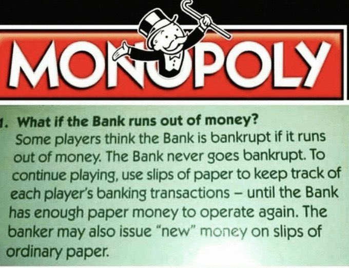
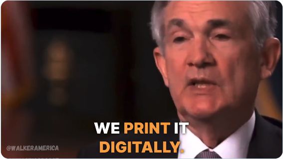

# 大富翁和钞能力

* * *

淫雨霏霏，连月不开，阴风怒号，浊浪排空；日星隐曜，山岳潜形；商旅不行，樯倾楫摧；薄暮冥冥，虎啸猿啼。

潜行于30日均线之下多时的BTC（比特币）近日在60k上方小幅反弹，与30日均线相向而行。照此趋势，5月下旬相交，则或为变盘时刻。

美元印钞的真相，是公开的阳谋。大多数人熟视无睹，少部分人被高深莫测的金融术语和复杂的指标数据迷乱了双眼，极少部分人看清了真相，但也是无计可施。

1903年，美国反垄断活动家Lizzie Magie设计了一款游戏，“地产大亨”，这就是如今“大富翁”（Monopoly）游戏的前身。

游戏的常见问题解答中有这样一个问题：如果银行没钱了会怎么样？

答：一些玩家会以为如果银行没钱了就会破产。银行永远都不会破产。要继续游戏，可以使用纸片来记录每位玩家的银行交易 —— 直到银行再次拥有足够的纸钞来运转。银行家也可以在普通的纸片上发行“新”钱。

电动汽车公司特斯拉创始人马斯克（Elon Musk）转发这个答案并评论道：这就是美联储的运作方式。

在某次接受采访时，美联储主席鲍威尔（Jeremy Powell）直言不讳：我们印钞，以数字的形式。（we print it digitally）

紧接着他补充道：作为中央银行，我们有能力创建金钱，以数字的形式。（we as a central bank have the ability to create money digitally）

这就是全部：你努力赚钱。而中央银行家们凭空打印钞票。

曾几何时，美元只不过是黄金的代金券。

诺奖经济学家哈耶克曾经说过：“人们时刻会以发钞者所发行的货币赎回黄金的可能性，不过是对发钞者施加了一种纪律约束而已，这能迫使他们将货币数量控制在适当的水平”，“金本位制只是在我们还没有找到约束政府的纪律的时候才勉强使用的一种办法而已”。

1971年8月5日，美国总统尼克松宣布中止美元与黄金的固定兑换比率，放弃金本位，从此美元发行不再受到黄金储备的约束。美国的这一行动，也宣告了创立于1944年的、承诺美元与黄金挂钩的布雷顿森林协议（Bretton Woods Agreement）体系的解体。

你的工作能力再强，赚钱速度再快，能比印钞机的钞能力更强，能比印钞机印钱的速度更快？

根据国家外管局收支分析小组的《2022年中国国际收支报告》，经常账户顺差4019亿美元。而仅仅在2020年一年，因为美联储的紧急无限QE，美元容量就扩充了超过4万亿美元（参考教链2023.9.28文章《黄金，黄金》）。美国一年印的钱，够中国努力打工赚10年。

有人说，如果美国不印钱，你中国赚什么？这个反问听起来有些荒谬和魔幻，但却是正儿八经的经济学理论。这个理论就是美国经济学家特里芬（Robert Triffin）在1960年代提出的“特里芬难题”（Triffin deilemma）。

特里芬早在黄金-美元本位的布雷顿森林体系如日中天的上世纪5、60年代就极具前瞻性地断言：当一个国家的货币同时作为国际储备货币时，有可能造成国内短期经济目标和国际长期经济目标的利益冲突，从而推动货币体系走向崩溃。

美元，既是一国货币，又是国际货币，行使世界货币的功能。根据特里芬的理论，将必然崩溃。而在特里芬的理论发表之后，布雷顿森林体系的土崩瓦解，就成了验证该理论的一个注脚。

但经济学接着就给出了一个荒谬的逻辑解释：因为世界经济增长对国际支付手段和储备货币的增长需要，所以美元的供应应当不断地增长。仔细品品这句话，不就是和“如果美国不印钱，你中国赚什么”这句大白话一个意思，只是改用经济学术语和文绉绉的语言来表达这样一个极其荒谬的道理么？

如果接受了这样的解释，那么岂不是很容易有下一个推论：敢情这美联储大肆印钞，都是中国人拼命努力赚钱给逼得咯？

仔细想想，是不是荒谬透顶？

关于经济的很多洗脑式的谎言，都是像这样悄无声息地隐藏在每一句平平常常的话语里，渗透到教材、网帖，以及大众的脑袋里面去。

破除思想封印，是一件抽丝剥茧的细活儿，任重道远。

货币的职能是充当一般等价物，充当交换媒介，而不是供人直接消费。试问给出上述解释的经济学者，为什么对货币的需求越大，货币的供应数量就要越多呢？这不就是偷换概念，把作为交换价值的货币和作为使用价值的商品混为一谈吗？

供需关系，对于作为使用价值的商品，的确存在数量关系。比如1人一顿饭要吃1个馒头，1万人就要吃1万个馒头；如果需求增长，比如人口增长到10万人，那么就需要把馒头供应量扩大到10万个，否则就不够吃。

但是，对于作为交换价值的货币，却并不是从供需关系直接映射到数量关系。比如1人一顿饭要拿1块钱去买1个馒头吃，1万人就需要1万块钱去买1万个馒头吃；如果有10万人，难道必须扩增到10万块钱，才能让他们买到馒头吗？错，大错特错！

很显然，10万人，仍是1万块钱，每人拿0.1块钱去买1个馒头，共买10万个馒头吃，也是没有问题的。这时候，馒头不是1块钱一个，而是0.1块钱一个。

人们吃的是馒头，而不是钱。1人1个馒头是重要的，1人拿多少钱，是1块钱还是0.1块钱，是不重要的。

“不，不，不。馒头不重要。重要的是钱。” 金融资本家心里想。

“对，对，对。馒头不重要。重要的是钱。” 资本主义经济学家嘴上说。

“丧家的”“资本家的乏走狗”！鲁迅先生如是讲。「凡走狗，虽或为一个资本家所豢养，其实是属于所有的资本家的，所以它遇见所有的阔人都驯良，遇见所有的穷人都狂吠。不知道谁是它的主子，正是它遇见所有阔人都驯良的原因，也就是属于所有的资本家的证据。即使无人豢养，饿的精瘦，变成野狗了，但还是遇见所有的阔人都驯良，遇见所有的穷人都狂吠的，不过这时它就愈不明白谁是主子了。」

早前卖掉1万个馒头，就能赚1万块钱。现今卖掉10万个馒头，却还是只能赚10万块钱。怎么得了？！这断然是无法被资本家所接受的。

于是乎，资本家的意志，就变成了货币经济学的思想钢印，并体现在美联储货币政策上：要通货膨胀，且最好是2%。这一控制目标黑纸白字地、明明白白地、堂而皇之地写在官网上。

美联储印出9万块新钱，流转到美政府财政部手上。社会上1万人有馒头吃，还有9万人没钱买馒头。美政府对这9万人说，去XX战场填线送死，给你发钱吃馒头。

MMT（现代货币理论）说：印钞 + 没有（恶性）通货膨胀 = 胜利！看上面馒头的例子，印钞，美元数量十倍，没有通胀，馒头还是1块钱一个，但是，成功实现了让9万人去填线，被美政府背后的深层意志所支配。这是深层意志的胜利，却是庶民的失败。

印钞 + 通胀控制 = 通往奴役之路。哈耶克的预言，终于在帝国手上变成了现实。惊不惊喜，意不意外？

在这一点上，比特币与美元截然不同。“供应量是预先确定的，价值是变化的，而并非改变供应量以保持价值稳定。” —— 比特币的发明者中本聪在2009年2月18日如此说道。

中本聪解释：“实际上，没有人可以充当中央银行或美联储来随着用户数量的增长调整货币供应量。否则将需要一个受信任的第三方来确定价值……”

如果中美贸易用的是BTC而不是美元，那么由于美国不能超发BTC，钞能力消失，它手上的BTC会被中国赚走。它如果想继续购买中国商品，就需要出卖自己的高科技给中国，以换取中国手里的BTC，而不是像现在这样一边从空气中印刷美元来买东西，一边大搞各种制裁和禁售（例如芯片）。

如果吃馒头的人们储蓄BTC而不是美元，那么当美联储十倍扩容美元之后，他们储蓄的BTC将对美元增长十倍，足够买下十倍馒头养活自己的家人，而不必让自己的亲人去填线送命，只为吃一口馒头。

毫无疑问，比特币的发明及其普及，对于消除人类社会普遍的奴役，减少不道德的掠夺和战争，以及推动实现人类和平，有着重要的意义和价值。

