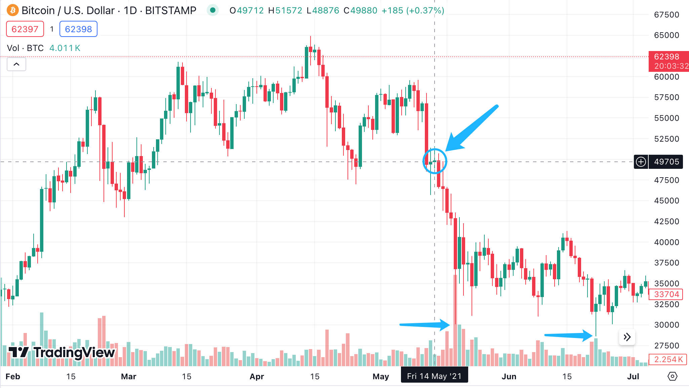
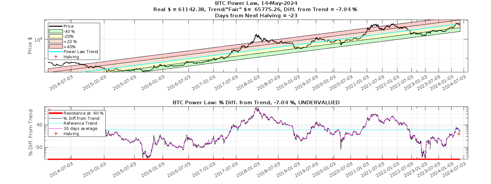

# 中本聪的上帝之手

号外：[教链内参5.13《90%的BTC地址盈利，你呢？》](http://rd.liujiaolian.com/i/20240513)

* * *

昨夜小楼又东风。

昨日BTC（比特币）多头突然发力，低开高走收在63k，即30日均线62.9k上方。据5.13内参报，《90%的BTC地址盈利，你呢？》可知这里是高位区间。空头不甘示弱，今晨发起反攻，又将战线推回30日均线下方。

今天5月14日。经历过2021年牛市的朋友可能会想起，距离5月19日也没有几天了。当年2021年5月19日的情形，或许已被时光模糊了记忆。教链在519崩盘之后次日曾写了一篇《519，残阳如血》，以作纪念。

当年，BTC在冲击第一小牛顶后，高位震荡，至5月14日时勉力维持在5万刀一线。但就在15日便开始闪崩，接连几日闪崩，至5日后，5月19日，最低跌至29000刀，精准狙击，把埋伏在3万刀下方的多头杠杆一扫而空。5日跌幅超40%！

教链知道，现在BTC孤悬于6万刀日久，又有不少空头在切盼“519”史诗级大崩盘昨日重现。这就属于是“不知有汉，无论魏晋”，妄图开历史的倒车了。

在2021年初冲第一小牛顶6万多刀至“519”前，教链就多次提示注意回调风险。在5月11日《开盘即万亿》中，更是直接写道：「开盘即万亿，就是市场周期阶段性见顶的标志。压垮疯牛的最后一根稻草，为我们开启痛苦的回调之旅。」

但是，同样是刚刚经过2024年初冲局部小牛顶6-7万刀后的现在，教链却要说完全相反的话：现在可不是什么疯牛，市场也远未见顶，好戏才刚刚开场。目前BTC根本就不具备长期下跌的条件，空头早已被釜底抽薪。在现在这个位置做空的空头，必将为他们的不智付出沉重代价。他们灰飞烟灭的仓位，将成为献祭本轮牛市的贡品。

待上～待上浓妆/好戏开场/台上悲欢空头独吟唱/偏上杠杆开空仓/一夜爆仓发染霜

当年2021年初冲第一小牛顶，6万刀距离价格走廊中轨2万刀，那可是超涨了200%！即便是到了519大崩盘的时候，中轨也不过才刚刚运行到2.2万刀。所以所谓的“大崩盘”，不过是超涨的BTC向中轨的正常回归罢了。即便是崩溃的低点2.9万刀，还在中轨上方 —— 也就是仍处于牛市趋势之中呢。

而如今，时移势易，如今的价格中轨已运行至7.9万刀，而当前的BTC却仍在6万刀徘徊。这意味着BTC的市价相比于“公允价值”处于负溢价之中。这应称之为加仓良机。

如果是唱空的多头，只是觉得负溢价还不够，还想等更大的折扣力度，那么这就是另一种形式的“贪心”。贪心过度会折损自身的运势，千万不可让自己陷入过度贪婪的情绪之中。

退一万步讲，即便是出现像2020年“312”大崩盘那样百年不遇的黑天鹅，那么要跌穿3万刀，也是十分困难的 —— 因为，现在价格走廊的低轨已经约2.7万刀，到7月下旬就会正式升至3万刀的高度。

是谁把空头釜底抽薪？正是中本聪。或者说，是中本聪早在2008年发明比特币的时候就定下的机制 —— 产量减半。

影响市场的因素，有超短线投机者的博弈，波段投机者的对抗，长线囤积者的进出，以及外部宏观多空因素的冲击，等等。假若这些因素多空达到均衡状态，即中性化，那么，决定市场力量对比的，改变战场局势的，就只剩一个，那就是空头的超额弹药供应量 —— BTC的增发。

在2021年5月份的时候，每个区块将向市场超额投放6.25枚BTC。平均约十分钟一个区块，那么1小时就是6个区块，一天就是144个区块。这意味着，空头每天可以额外获得900枚BTC的超额弹药。900枚BTC，在6万刀的时候大约足以每天“消灭”5400万美刀的购买力。

而现在，每个区块的超额投放直接少了一半，只有3.125枚BTC了。那么，同样是6万刀的BTC，空头每天的超额弹药量就下降到450枚BTC，仅够每天“消灭”2700万美刀的购买力。

也可以反过来想象一个等价的情形，那就是中本聪成为了一个无限美刀的购买者。相比于2021年，2024年5月份的他每天都要多买入450枚BTC并销毁（！！！），无论BTC的价格是多少！

中本聪的上帝之手，托举着BTC，上九天揽月。
