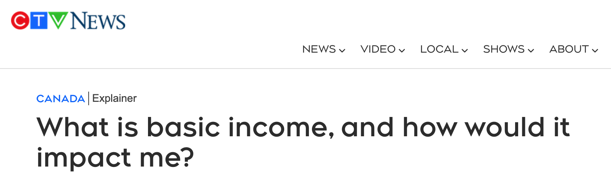

# 无条件发钱，是不是骗局？

号外：教链内参5.14《减半后矿工面临抛售压力》

* * *

隔夜BTC（比特币）在61k上方继续盘整。昨5.14教链内参《减半后矿工面临抛售压力》中提到，有国外网友发现了前段时间被热炒的所谓Worldcoin的一些问题，诸如通胀严重、内部人割韭菜、顶着如日中天的OpenAI/ChatGPT的Sam Altman的名号其实后者早就公开宣称不再关注该项目了，等等。而这些问题，教链在从去年年中到今年年初一系列内参中皆已有所剖析，不再详述。

这Worldcoin所举的旗号，就是无条件发钱。即所称UBI（全民基本收入）的概念。与其他区块链匿名使用不同，它需要扫描你的虹膜来确保你是一个活人。只要你获得了一个活人账号，就能定期领钱——当然，你所领的钱是Worldcoin的代币，而不是美元。不过，你可以把它的代币拿到二级市场上去卖掉，换成美元。你若疑问，如果人死了继续领钱吃空饷怎么办？那只能说，认真你就输了。

搞了这么多吃白食的用户，谁来养活他们呢？指望画大饼的蓝图，即AI代替人类工作来养活人类，恐怕一时半会儿还不太靠谱。扯上一面大旗，攒了这么大的局，究竟是谁和谁受益，谁又是那个代价呢？

目前看起来，解锁抛售的项目方和内部人，将会是最大的获利者。毕竟，他们是割韭菜的镰刀嘛。至于出卖个人生物隐私（虹膜）而换取代币的人肉矿机们，则是获得小利的一个广大群体。为这一切买单的，自然就是二级市场上被这个概念打动，纷纷买入Worldcoin的韭菜了！

知道真相、醒悟过来的韭菜，总是在亏光之后，唱起那句歌谣：为什么受伤的总是我 / 到底我是做错了什么 / 为什么受伤的总是我 / 如何才能找到我的梦 ......

分配不能创造财富，但是却可以让设计和运作分配体系的人作为“中间商赚差价”，赚得盆满钵满。

把未来的利润预期卖给二级市场，这是华尔街1.0，P/E估值。

把人头（活跃用户数）卖给二级市场，这是华尔街2.0，数据估值。这种估值思想被包装为“互联网思维”，当作普遍真理进行兜售。

融资，把业务做好，上市卖个好价钱，这是Web1.0。

融资，偷偷买量刷业务数据，上市卖个好价钱，这是Web2.0。

上市（上所），直接给用户/羊毛党发代币，用韭菜的钱拉起数据，更好的数据吸引更多韭菜投钱，更多韭菜投钱拉起更好的数据，进入正向庞氏循环...... 这是Web3.0。

Web3.0的先进思想，是去中心化刷量，是去中介化的刷量，是韭菜自high的刷量。

从数据到利润，隔着天堑。而且，靠发钱吸引来的用户量，能有什么商业价值？何况，UBI是为了免费广发福利，绝不是为了榨取这些用户量的商业价值。你说韭菜真的认这套估值逻辑？你笑韭菜太疯癫，韭菜笑你看不穿。韭菜们赌的，其实是有更傻的新韭菜接盘。此所谓博傻。

Worldcoin要大搞分配，就必须解决分配的财富从哪里来的问题。要么靠生产，要么靠骗。还有一个靠抢的办法，但是它作为一个守法企业做不到。

Worldcoin做不到的事，加拿大政府能做到。后者可以合法征税。

日前，加拿大CTV新闻网报道，加议会正在审议两项法案（S-233和C-223）。法案内容正是关于给全体加拿大人民无条件发钱：每位年满17岁的公民，每月可以获得无门槛收入。

领导了加拿大安大略省UBI试点项目的Jim Dunn教授说：有了无条件基本收入，工人和企业都会感到更安心、更有生产力。

加拿大政府本身并不创造财富，所以它的无条件发钱，只能是再分配。

如果发钱的来源是国内的税收，那么它就是再分配全体纳税人的上缴的财富。

如果发钱的来源是加印钞票，那么它就是在利用通货膨胀来获取隐形的税收，并进行再分配。

生产极度匮乏的时候，政府要使用粮票、油票来控制消费，这是一种按需分配。只是这需求量，不是你自己决定，而是政府决定。

生产极度富足的时候，政府直接无条件发钱，这也是一种按需分配。加拿大这是要跑步进入共产主义？

UBI的供给线，会消灭这条线及以下的工作岗位。比如UBI每月发1万元，那么社会上月薪1万元以下的工作可能就没有人愿意干了。

因此，实施UBI(1万)的前提是整个社会不再有1万元以下的工作岗位。

这可能带来另一个效果：原本希望争取2万元月薪的求职者，因为UBI已经发给他1万元，他对企业的要求就下降到月薪1万元了。这意味着企业的用工成本将会下降。

不过，代价是所有人、所有企业的税负——显性的税收或者隐性的通胀成本——会提高。

UBI系统，一言以蔽之，就是强制“贡献”，强制受益。

对比来看，BTC（比特币）也是人们之间相互贡献和受益，只不过，一是遵循自愿，二是按持币量受益，而不是按人头受益，三是必须先贡献、后受益，四是全球化而非局限在一国，五是无摩擦，即没有项目方、内部人、政客等中介群体居间揩油“割韭菜”。可见，BTC并不是一个UBI系统。

从法理上讲，一个民主国家，人民可以视作国家的股东。只是这些人民股东们都是一个人头一股。那么这时候UBI就可以看作是国家对人民股东的分红。

加拿大印钞，征的还是加拿大人民的税。如果美联储印钞，那么征的就是全球人民的税。如果美国实行UBI制度，直升机撒美元，征全球人民的税，给美国人民发福利，会更酸爽。只是总被薅羊毛而不能享受福利的外国人，要么想走线去美国享受福利，要么想掀了桌子不再被薅羊毛，二者必居其一。

只分红，不征税（没能力征税）的系统，是骗局。区块链里面，这样的骗局数都数不过来。

但是，征税的能力必然是强制力。要具备强制力就必须中心化。这和区块链的“去中心化”性质是显然违背的。

因而，宣称自己既有分红能力，又是去中心化的区块链项目，在底层逻辑上就是自相矛盾的。二者必有一假：要么分红是虚幻的（分红收益填不上本金的亏损），要么去中心化是虚假的（有或明或暗的中心化控制点）。

比特币系统既不征税，也不分红。
