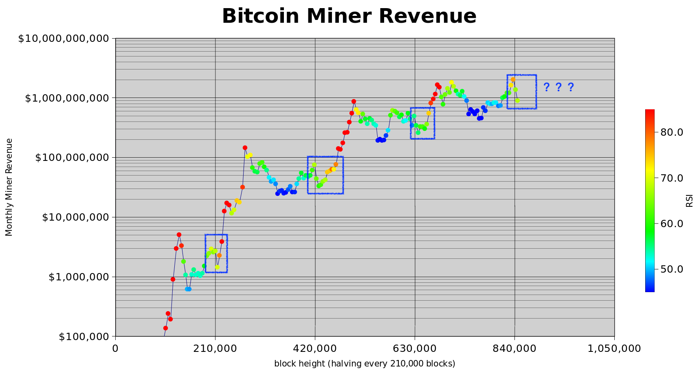
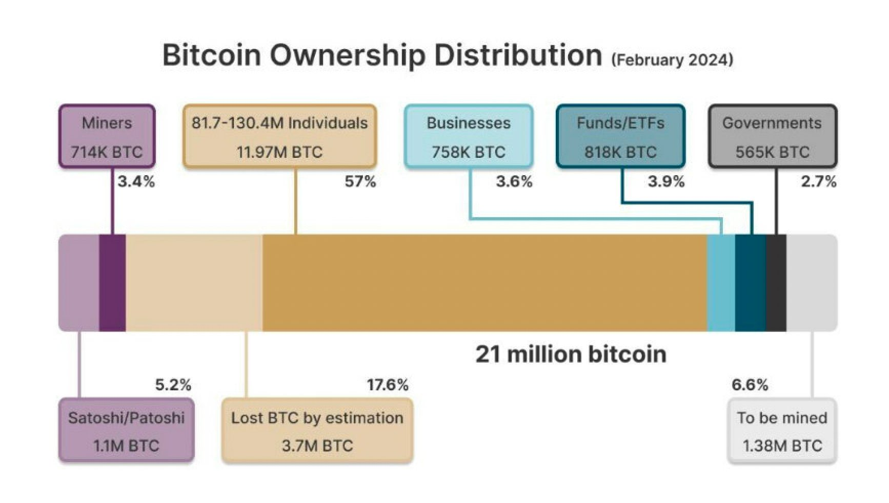

# 矿工淘汰赛阶段之后，BTC火箭发射

号外：[5.17教链内参：抗量子的傻X和坏X](http://rd.liujiaolian.com/i/20240517)

* * *

纤云弄巧，飞星传恨，银汉迢迢暗渡。金风玉露一相逢，便胜却人间无数。

自15日突破30日均线压制以来，《比特币趋势大反转》，连收三根阳线，一路挺进到了67k。

我们看到，自从4月20日《比特币的黄金减半》以来，目前我们正在经历一个震荡调整的时期。那么，这是一个什么样的阶段呢？

对此，匿名分析师PlanB指出，从过往历次减半来看，每次减半之后，矿工收入都要经历2～5个月的跌落和修复的阶段，而后进入快速上升的通道。（见下图）

请注意这是矿工收入图，不是BTC（比特币）价格图。

这是BTC的“阳谋”。在短期价格水平基本不变的情况下，产量减半就意味着区块奖励立刻腰斩。这一次虽有符文（Runes）热了一阵子，但是也早已归于沉寂。

这是一个痛苦的阶段 —— 至少对于矿工群体而言是如此。

内力不够深厚的矿工直接就被“卷”死了。实力雄厚、家底殷实的矿工需要一段时间来“疗伤”。幸存者踩着被淘汰者的尸骨站了起来。更少的人一起分享变少的食物，每个人可以重新恢复健康和活力。这个阶段也可以称之为矿工的淘汰赛。

被淘汰者在死亡之前垂死挣扎。他们会在死前把积累的BTC全部抛售，以图续命。

他们的抛售却不幸起到了与他们期望相反的效果：抛售中和了减半本应带来的供应冲击和价格上升。被压制的价格像一道催命的绳索，死死地勒在他们的脖子上。他们越是挣扎，绳索就勒得越近，反而加速了自身走向死亡的速度。

当孱弱者被淘汰殆尽，吐出了他们的全部积累之后。强者笑纳了所有的剩余，开始恢复健康并变得更加强壮。

那杀不死你的，将让你更强大。

剩者为王。

残酷的淘汰赛后，存活下来的矿工获得利润。利润由BTC系统用BTC按时支付。矿工只需要抛售一部分，就可以足以覆盖其采矿成本。剩下的BTC，他们会囤积起来惜售。

毕竟，在这个行业，活得越久，越深知BTC仓位的珍贵。

抛压减少，惜售增加，此消彼长，效果加倍。

更妙的是，二级市场此时开始感受到减半带来的供应紧缩冲击。同等美元的购买力现在可以产生更大的拉升作用。

价格的升高让惜售的矿工得以抛售更少的BTC就可以覆盖同等美元的采矿成本。于是这进一步减轻了抛压。

价格上升和抛压减轻相互促进，进入了一个正反馈循环。

这个正反馈循环的推力，叠加二级市场普遍存在的“反身性效应” —— 即更多购买和更高价格形成正反馈循环，进一步彼此共振，效果大大增强。

于是BTC火箭发射。Ta Da Moon.
