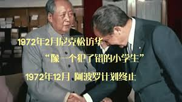

# 比特币的“国防开支”

* * *

今天是2021年“519”崩盘3周年。当年“519”的崩盘，和马斯克“跳反”、惊呼BTC不环保，以及随后的大国打击挖矿等一系列事件密不可分。

前文《矿工淘汰赛阶段之后，BTC火箭发射》（5.18文章）谈到了产量减半前后，矿工收入的问题。

这个问题反过来看，就是比特币系统给算力记账工作拨发的预算开支。

众所周知，矿工负责记账，其实是“会计”。但是记账并不是必须靠算力。写一个账本（区块）本来是一件轻而易举的事。只是中本聪觉得，要故意把这件轻而易举的事变成一件十分困难的事。于是通过所谓的PoW（工作量证明），让记账变得困难重重。

PoW像一个（全自动）保险箱，能够把新旧账本数据一并牢牢地保护起来。写一个账本很容易，但制造这个坚不可摧的保险箱，十分不容易。

很多人觉得保险箱太累赘，制造起来太费时费力，浪费电能，不够低碳环保，于是提出要搞绿色区块链，要搞没有保险箱的PoS。

写到这里，不禁想问一个回旋镖式的问题：这两年欧洲都要退回去烧煤了，甚至见风使陀的科研论文都发出来了，开始鼓吹雾霾是一件好事。一向被人当成小姑娘的历史摇身一变，变成了抠脚大汉，把前几年的环保激进人士的脸都抽肿了。不知道贩卖“BTC不环保”论调还有没有市场和经费哈？

教链想起2023年12月份内部发布（尚未解密）的“2023年终报告”中，对以太坊的断言是：「以太坊转PoS之后未遭市场 认可，结算层和低碳叙事仍需找到买单方」。如今，对BTC汇率深陷泥潭、跌落0.05的ETH，还在这个问题中苦苦挣扎。苦海无边，何日上岸？

PoS这东西，抛弃了全自动保险箱，代之以一群人的私钥签名 —— 打个比方就相当于是换成多个锁头，每个锁头的钥匙都在不同人手里。它的理论，假设：第一，人肉掌握的钥匙，比没有钥匙的全自动更可靠；第二，足够多的锁头，比消耗电力铸造的铜墙铁壁更可靠。

写这些不是要辨经。从现实主义的角度看，任何一套理论，甭管对的错的，都需要能够“忽悠”和笼络住一群有实力的人，才能生存。现在眼见的欧美环保主义的脸都被抽了，这低碳叙事还能找到几个人买单呢？

蠢人买单是因为真心相信，聪明人买单是因为聪明到觉得会有很多蠢人会信。但是蠢人可能往往是笨蛋，所以实力不行。因此，成功的欺骗最重要的还是让聪明人相信会有很多蠢人会信。

当然，比成功欺骗更好的策略，是实事求是。实力到位，就不怕任何质疑。所有聪明而有实力的人，都真心相信。这是最强大的理论。这套理论的胜利，不是靠口头辩论，而是靠实践检验。

只有做不到的人才会在面对汹涌的质疑时气急败坏。能做到的人只会对无理的质疑不屑一顾。更重要的是，做给全世界看看。这就是行胜于言的道理。

中本聪2008-2009年凭一己之力发明比特币的事，后人回看都会觉得不可思议，像个神迹。但是，让人们相信这不是“神迹”而是实实在在的真实历史的，是人人可以看、可以编译运行、能够正常工作的C++源代码，是遍布全世界成千上万台比特币的节点和矿机，24小时仍在不间断地产出着新区块……

相反的，某些几十年前令人瞠目结舌的“神迹”，也许只是神迹罢了。其科学程度，或可作比咱们古代神话“嫦娥奔月”。

“老叟坐凳。嫦娥奔月。走马观花。” —— 教员看破不说破：既然你主动求字，那我就点你一下，写一写我老来坐凳吃瓜看你演的这出活人奔月大戏。

实力永远是正义和真理的基础。没有实力为后盾，哪怕你说的是正义的，是正确的，也不会有人相信。这并非是正义蒙羞，也不是人类愚蠢，而是人类趋利避害的天性。

相反，实力碾压，哪怕你说的是双标，是谎言，也会获得山呼海啸的拥护和信任。甚至于，你的实力是精心虚构和包装出来的假象，只要足以蒙蔽人们的双眼，就能获得同等的地位和好处。

这就是为什么90年代一些人下岗后下海，借钱先置办高价衣服、轿车司机，谈生意就能提高成功率。

还记得有一个人说脱口秀，讲他当年初到巴黎，把所剩不多的房租饭钱全掏出来，买了一套阿玛尼，穿上之后昂首挺胸走进大公司成功应聘。他认为，全靠那套阿玛尼，让他从落魄的难民一跃变成了主流社会的白领。

货币的本质就是社会关系。如果你不需要和任何人发生经济关系，那么货币对你毫无用处。

货币本身没有任何实用价值。货币是所有商品中最赤裸裸地对于你在所处社会关系网中实力地位的量化。

主权货币的价值来自于实力的支撑，也就成了实力的象征。

主权国家的实力体现在多个方面。军事实力，是所有的“0”前面的那个“1”。

军事，military，听起来有些咄咄逼人。内敛一些，叫做国防，defense。现代政治话语中则更喜欢用一个抽象的词汇，（国家）安全，security。

（国家）安全，听上去所涵盖的范围就很广了。外延扩大，所以常常把超出国防、军事领域的议题也要涵盖进来。比如，现在美国非议日久的tiktok和新能源汽车议题，都被其归入了“安全”的范畴。

但是，把安全议题的范畴随意扩大化，未必是一个好事。任何事情都要受到经济基础的约束，毕竟钱就那么多，能干的事有限。把时间和预算都拿去干一些无关整体利益、只关某一集团利益的烂事，最终导致的后果，可能就是整体国防的真正实力不断下滑和衰退。

而如果把全部的安全预算都集中到一个单点上，那么是不是会获得极高的“压强效应”，从而用更少的“国防开支”，实现无人能敌的效果呢？

这正是比特币的安全策略。

众所周知，BTC把全部的安全预算都用来做一件事，那就是制造上文讲过的PoW自动保险箱。从数学上讲，就是计算哈希值这一个任务。

让我们来做一个有趣的对比：

查数据，统计一下，2023年BTC矿工收入，也就是系统支付的“国防开支”，是多少。

教链手工数了一下数字：

2023 milion$
1 601.24
2 627.12
3 755.41
4 800.4
5 919.22
6 783.76
7 865.26
8 807.01
9 753.6
10 885.05
11 1160
12 1560
sum 10518.07 (10.5 billion)

这样一加我们就知道了，2023年全年BTC的“国防开支”大约折合105亿美刀（当然都是以BTC支付的）。

我们交叉验证一下：2023年还是6.25 BTC/区块的奖励，一年下来就是328500个BTC，目测粗估一个平均价格3万刀，乘起来就得到98.55亿美刀。十分接近上面的105亿美刀。考虑到这只算了区块奖励，而没有计算手续费收入，所以实际应该更接近。因此，105亿美刀应该是一个比较可信的数字。

根据斯德哥尔摩国际和平研究所（SIPRI）的数据，2023年全球国防开支排名表，鹰酱家肯定还是第一（超过9000亿美刀！）。而105亿美刀，大约能够排到第26名，略高于伊朗。要知道，后者可是能发射高超音速导弹的人。

那么，问题来了，虽然鹰酱的开支是BTC的100倍，但是它要干的事情、要维持的东西何止多了百倍千倍，而它的花钱效率和贪腐问题则根本无法和全透明、全自动、零贪腐的BTC系统相提并论，此消彼长，就算是鹰酱拿着独占全球1/3以上的军费开支，也决然难以在“计算哈希值”这项任务上挑战和战胜BTC系统。

读罢此文，亲爱的读者朋友，你该明白了，究竟是什么，让每一个持有私钥的BTC人，在面对外界的无理质疑甚至恶意中伤时，永远坚定不移，永远不屑一顾。答案只有两个字 ——

实力。
