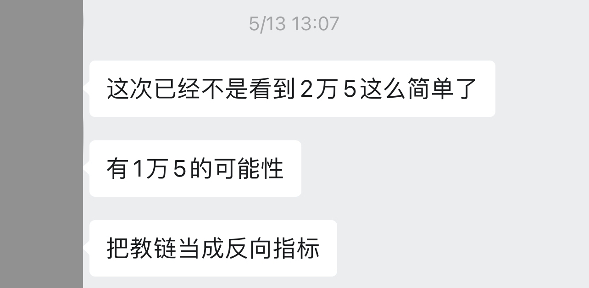
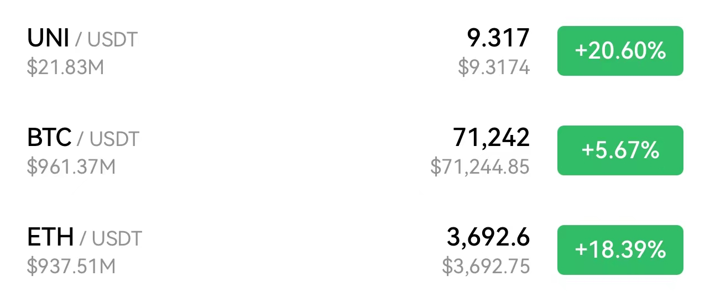
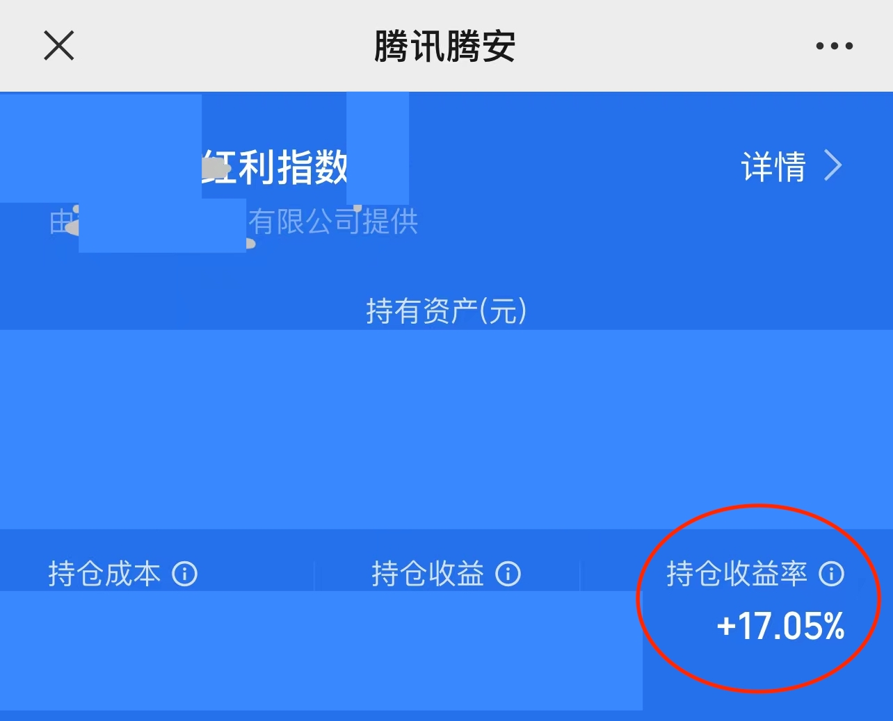
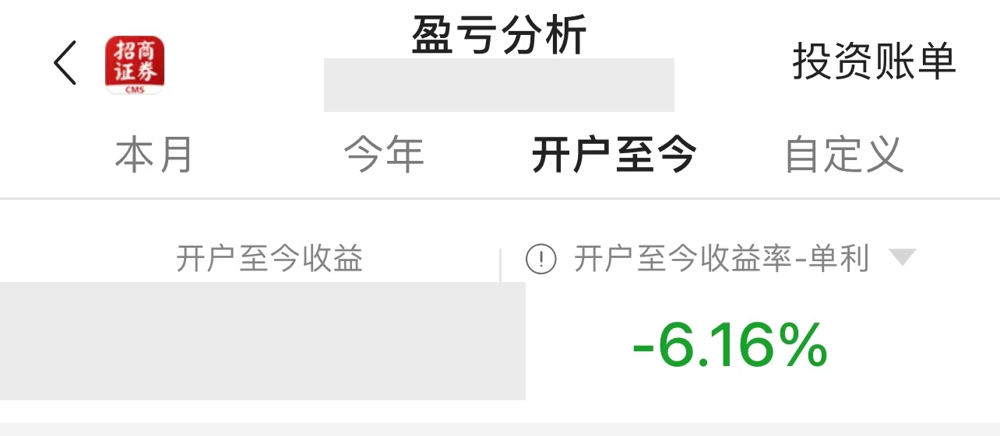

# 全面上涨！

号外：[5.21内参：5个指标表明BTC牛市才刚刚开始](http://rd.liujiaolian.com/i/20240521)

* * *

昨天傍晚的5.21内参《5个指标表明BTC牛市才刚刚开始》让一些看空的朋友有些许恼羞成怒了。不过，鉴于教链在5.16内参《BTC强势突破30日均线》及次日文章《比特币趋势大反转》早有提示，18日更是紧跟着写了一篇《矿工淘汰赛阶段之后，BTC火箭发射》，该有的心理准备也早该有了。

至于坚持把教链当成所谓“反向指标”的朋友们，我只能是在心里笑笑了，一笑而过。

早上一看，全面上涨。大饼BTC（比特币）更是强势突破7万刀，站上71k。教链的三大主要仓位BTC、ETH、UNI尽皆强势上涨。

有些朋友是真没把教链的话吃透呀。在2021.6.30《小杂感》一文末尾，教链就这样写道：「不要听取任何人给你的投资建议。包括我。」

把教链当“反向指标”，其实正是把教链的话当成投资建议听取，只不过是“反着听”罢了。反着听，和正着听，有什么区别？逻辑功底扎实的朋友秒懂 —— 没有区别。

所以说，总是盯着教链的身和形，而不是体悟教链的意和道的朋友，劝告一句：你着相了。

《金刚经》里有偈：「应无所住，而生其心。」无所住，不着相，才能有一颗平常心。

教链所写和分享的只言片语，不过算是些个人投资笔记。它首先为个人的仓位服务。其次才是共享给一路同行的有缘人，交个朋友。至于别人怎么看，不太重要。只要仓位跑在盈利的轨道上，你会在乎别人喜不喜欢你的投资观点吗？市场才是检验的唯一标准。

只有靠贩卖消息吃流量饭的自媒体，才会在乎别人喜不喜欢它所传播的消息。只有想通过编织信息忽悠韭菜上车配合收割的KOL，才会在乎所发的喊单言论能不能忽悠到尽可能多的韭菜。

当BTC站上71k之际，教链BTC实盘6年CAGR超30%，累积复利近400%，其中去年年中启动的“十年之约”实盘见证计划浮盈75%以上。

另外两个主要仓位ETH浮盈约45%，而UNI目前浮亏约15%。关注教链内参的朋友们知道，4.15内参《香港批准BTC和ETH现货ETF》中已经汇报过，「这波下行，我看UNI回调深度比SHIB大，于是就把SHIB清仓补仓UNI了。」

实事求是，知行合一。

教链在大A上的持仓主要通过两个工具：第一是红利指数基金，第二是金融股。至于为什么要配置大A，主要还是尝试一下很多人嘴里的“地狱级难度”，能否复用已经在加密市场验证过的理念。如果能成，那么就可以把它当作是场外资金的一个辅助配置方法。场外资金是生活备用金，兼应急备用金。这个安全垫必须有。它是场内仓位能够稳稳拿住10年、20年的重要后盾。

从2021年高位换仓入市起算，经历2022-2023两年熊市，目前基金仓位收益率约17%。

而个股仓位收益率目前浮亏约6%。

仓位规模相似，收益覆盖亏损后，总体上大A三年盈利4%多一点。在“3000点保卫战”的硝烟滚滚过后，能有所浮盈，已是惊喜。

2022年底大饼16k，2024年初大A 2700点，这两个节点都胜利地穿越过来了。过来了也就过来了。往前走，就更加一马平川。

逢跌加仓坚如铁，而今迈步从头越。
路途虽远且坎坷，壮志凌云吞山河。

