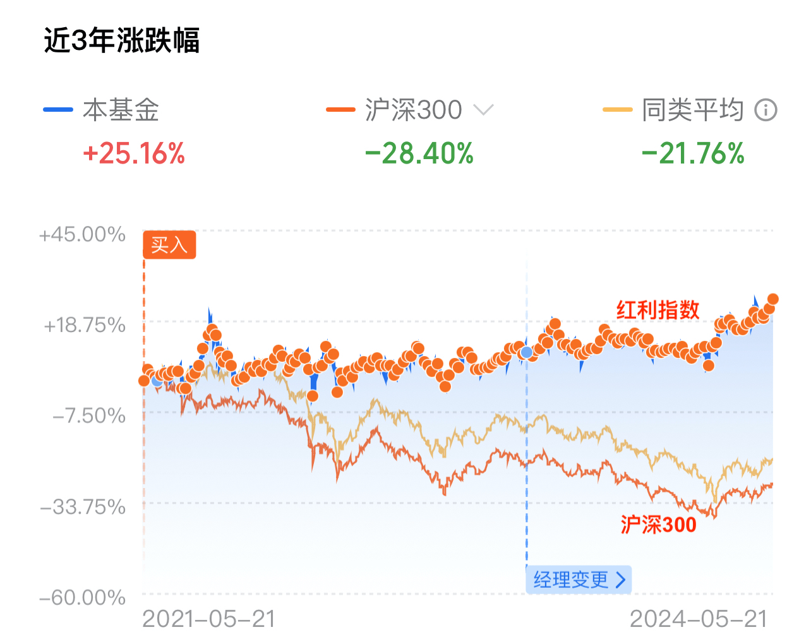
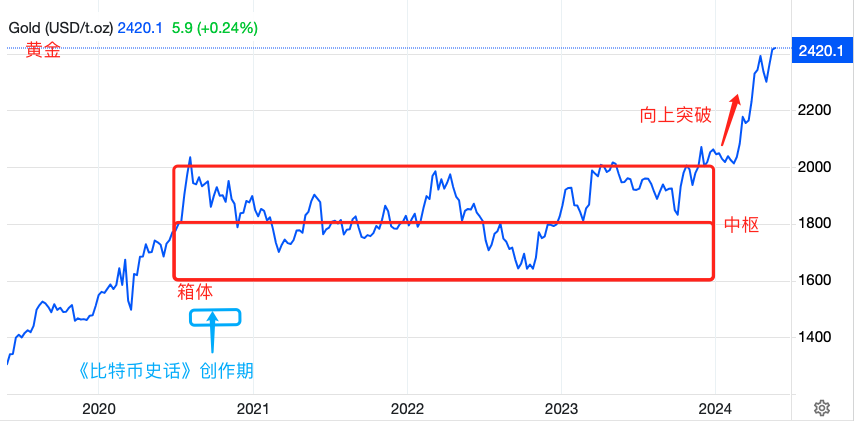

# 人生发财靠康波

号外：[5.21教链内参：ETH爆拉超20%的原因](http://rd.liujiaolian.com/i/20240521)

* * *

BTC（比特币）站上7万，ETH（以太坊）径追4000。SEC一个小小回应，市场便敏锐解读，有可能SEC会妥协认定ETH不是证券，质押ETH是证券。昨晚5.21内参《ETH爆拉超20%的原因》给出了更多维度的解读，从宏观到微观，不再赘述。

BTC站上7万刀，这就又一次站在了山巅之上（2021前高6.9万刀）。徒手无防护攀岩家托马斯·布本多尔夫说，“人生如登山”。《比特币史话》作者刘教链说，囤饼（BTC）亦如登山。

我登山，因为山就在那里。我囤饼，因为饼就在那里。

徒手无防护攀登悬崖，身处百米高空，脚下万丈深渊，生死只在一念间，我心中便只有当下，一切外界纷攘、过去未来，都不复存在。囤饼亦如此：我聚精会神，只在当下，走好这一步，不瞻前顾后，无喜怒哀乐，心无挂碍，无有恐怖，走好每一步，宁静致远，必达终点。

若将囤饼作比徒手无防护攀岩这般的极限运动，那么“八字诀”的每一次加仓，就是一次次向前迈出的坚定不移、踏踏实实的一小步。

饼是同样的饼，山是同样的山。但是用不同的方法去进出市场，就像用不同的方法去攀登山峰，那会是完全不同的运动项目。

只有在登上一座山，站在山巅之上时，才会发现，山外有山，前面还有更高的山，等着你去挑战、征服。

人生之短暂，如刹那之花火。人生的全部乐趣和意义，在登山的过程中，而不在最终的结局。结局无尽头，山也无尽头，饼也无尽头。

逝者如斯夫，不舍昼夜。吾生也有涯，而知也无涯。以无比短暂的人生，在无尽头的历史长河中漂流、起伏，无论是想要有所成就，还是仅求安身立命，都不得不对当下所处历史之大势有所认识，清醒的认识。

往小里说，想投资成功，也需要搞明白当前经济周期所处的阶段和接下去的演进方向。2016年初，已故“周期天王”周金涛在一场演讲中说，“人生发财靠康波”。

“康波”，是苏联经济学家尼古拉·康德拉季耶夫在1926年发表的《经济生活中的长期波动》中所提出的50-60年的长经济周期，又称“康波周期”，或“康德拉季耶夫周期”。在教链2020年完成的《比特币史话》一书（https://leanpub.com/history-of-bitcoin ）第十章第40话“大萧条”专门进行了介绍。

在这一节中，教链写道，「2019年是人类第五次康波周期中衰退期转向萧条期的连接点。」当然，这个节点的判断，身处当下，不同的人各有不同的见解（比如周金涛就认为2016年就开始进入萧条阶段了）。只有等到一整个周期走完，人们回顾过往，才会心生恍然大悟之感，对繁荣、衰退、萧条、复苏的分界点作一个划分。

教链在书中写的是预判和应对之策。「在萧条期，对抗资产缩水的办法就是防御，从积极进取的资产（如股票）转为防守保值的资产（如黄金）。」

因此，在2020年下半年完稿后，教链就把大A的300股指基金清仓，开始转而建仓更具防御性质的红利指数基金。昨5.21文章《全面上涨！》提及大A仓位。3年多过去，如今回顾起来，当年的这一策略转换，让基金仓位幸运地、完美地躲过了2022-2023大A的大回撤。到今天大A的仓位劫后余生，有所盈利，全赖于此。细心的读者可以对比一下2021至今沪深300和红利指数的涨跌幅差异。我不知道大A有没有像tradingview那样棒的免费图表网站，只能截实盘图来看一下了：

你说红利指数涨了很多吗？其实也并没有很多。所以在2024年之前，炒大A的论坛上基本上都是像“为什么不建议你买红利指数”这样的帖子。券商也绝对不会像现在这样开始“好心”给你科普红利指数。等未来某一天，进攻型的300股指翻身大涨的时候，估计股圈大V和券商们又该集体转向，狂踩红利指数了。独立思考，别信大V。

至于黄金，是更偏向防守的资产。在2021-2022年间，它大概在1800刀/盎司上下波动。在2024年初开始突破1600-2000的震荡箱体，打开了新的上升通道。

教链分析过，黄金适合国家储备，适合个人储备的黄金其实是“电子黄金” —— BTC（比特币）。2024.4.23教链还专门写了一篇《黄金虽好，个人不宜》来再次阐释。

在《比特币史话》“大萧条”这一话中，教链也明确地指出了，「也正是从 2008 年开始，全球主要央行黄金储备从净流出逆转为净流入。其中，俄罗斯央行和中国央行，都是黄金大买家。」

写罢此句，教链新开一个自然段，开始“以史为鉴”，写道：「1929 年是人类第三次康波周期中衰退期转向萧条期的连接点。」

书中介绍了1929-1933年的经济大萧条，以及其后果，「导致了“第二次世界大战”(1939—1945)的爆发」。

2019是否又是一个1929？

从2019至今，贸易战(2019)，大疫情(2020)，金融战——美联储加息(2022)，俄乌冲突(2022)，巴以冲突(2023)，…… 人们开始日渐感到，这个世界的动荡正在加剧。以至于网上关于所谓“S3赛季”的说法广为流传。

康波萧条期能有多么惨烈？在《史话》里教链摘录了《光荣与梦想》一书中的一句话：「千百万人只因像畜生那样生活，才免于死亡。」请注意这句话可不是形容第三世界，而是说的美国，1929-1933年的美国。

随后，教链在书中概述了百年前的那一场大变局的演化路径：「这次深厚的经济危机，促成了倡导政府干预经济的凯恩斯主义的登场，促进了自由主义者被经济危机中毫发无伤的苏联吸引而转变为马克思主义者，也推动了保守主义者向法西斯主义的转化，政治光谱两极分化，意识形态不断撕裂，最终走向了战争。」

今天，美国的干预主义已经更加登峰造极：贸易方面，肆意立法加征关税，干预自由贸易；金融方面，操弄美元周期，试图收割世界；产权方面，肆意单边制裁，甚至直接没收他国人士海外财产，撕碎了资本主义私有财产神圣不可侵犯的遮羞布；言论方面，不惜违宪，通过“反犹太主义意识法案”，以及抢夺Tiktok，进行言论控制和思想控制；科技方面，不搞科学发展却搞舆论战，试图通过压制舆论来掩盖为何无法再次载人登月的隐疾；……

当年，发了疯的小胡子把德国和欧洲带向了深渊。如今，美国人民必须勇敢地站起来，打断美国走向黑化的历史进程。

1933年，罗斯福总统上台。他铁腕没收了美国人民的黄金，并贬值了美元，完成了对内的洗劫，并借此走出了大萧条。关于这段历史，以及著名的“6102号总统令”，在《史话》中“大萧条”之后紧接着的第41话“黄金大劫案”进行了详细的记述。

今天的美国似乎还没有走到这一步。但是，美联储加息依然下不来台，收割世界撞到南墙，某一群人是不是会对另一群人起了杀心，开始磨刀霍霍，准备刀口向内，进行收割，那可能近乎于一种必然吧？

美国内部各族群势力也早已开始了布局，为的是在不久后必然到来的内部火并中抢占一个比较有利的生态位，当镰刀而不是当羔羊，上餐桌而不是上菜单。

“反犹太主义意识法案”为犹太人预定了一个餐桌的上等座。而“亚裔细分法案”则为华人预定了菜单上的一个条目。

不过，咱们先圣的智慧是，物极必反。上等座又如何？谁有实力掀了桌子，谁就能随时把坐上餐桌的贵宾变成摆在餐桌上的一道菜。

所以，上等人和下等人都要给自己留条后路，准备随时跑路。朝哪里跑？当然是美军鞭长莫及之处。这一就是东大（东方大国），二就是BTC。这时候，就看出来BTC为什么是更好的黄金了。带着黄金，是决然跑不动路的。《潜伏》里余则成最后撤离时，都只能把金条藏在鸡窝里。如果是BTC，他早就可以通过电台发给组织了。

「东方欲晓，莫道君行早。踏遍青山人未老，风景这边独好。」

东大和BTC有什么相似之处？两个字 —— 稳定。东大稳定地发展经济，造军舰，搞登月。BTC稳定地造区块，造区块，造区块。

在这一次康波萧条周期中，谁能够保持稳定，就能吸引全世界人民的目光，吸引全世界的自由资本。

如果美国在下一步内部火并、内部收割之后，还是无法走出危机，那么是不是或许就有可能继续走下一步，当年纳粹德国的路，直接对外输出战争？

当年，1929大萧条，1939德国闪击波兰。2019的十年之后是2029。这是一个关键节点。刚巧，2030年前，按照我们的规划，大概会实现载人登月。

当灯塔熄灭，东方一轮红日冉冉升起的时候，天亮了。太阳出来了，也就不再需要灯塔。

但是，拂晓之前的夜，是最黑、最冷的。那是夜在突破临界点之前的最后疯狂。

一个拥有航母和核弹头的小胡子对全世界而言都是极其危险的。

我们必须提前准备，卸掉他的力量，并尽快拥有迅速制服他的武力。

如果有更多人觉醒，吸取1929-1939那一次康波周期的历史教训，打断历史进程，阻止疯子上台，也许能让世界和平度过这一次康波之劫数。

还有5年时间。时钟开始了无情的倒计时，嘀嗒，嘀嗒，嘀嗒，……
