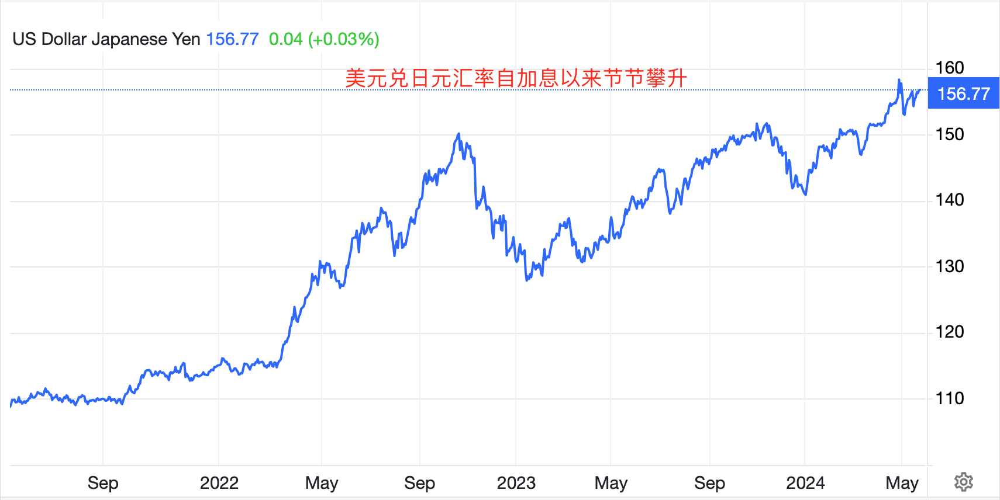
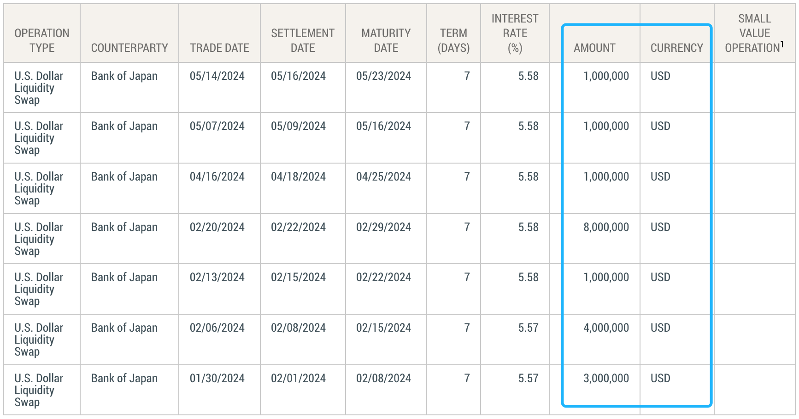

# 大泄漏 —— BTC通往百万美元之路

号外：[5.22教链内参：BTC的最终成功需要世界多极化](http://rd.liujiaolian.com/i/20240522)

* * *

隔夜美联储放了个炮，把5月份议息会议的纪要公布出来了。不出意外，纪要的口吻略显强硬，市场心里一惊，赶紧乖乖回撤。BTC（比特币）暂时退守69k-70k。你说BTC又倒车接人了，那些空仓者会上车吗？他们不会。涨了，他们等回调。回调了，他们等进一步回调。不跌到25k甚至15k，恐怕他们是上不来这车了。可是你想想啊，如果BTC出现大问题，比如致命bug导致集体恐慌，或者真出个什么量子计算机给攻破了，跌到了15k甚至10k、5k，他们会买吗？敢买吗？愿意买吗？不，确定一定肯定不！他们早已经吓得屁股尿流仓皇逃窜了。

前日5.21内参《ETH爆拉超20%的原因》中提到，BitMEX创始人Arther Hayes发了一篇文章，主要观点是，美联储有可能通过日元作为管道，在自己维持高息紧缩的情况下实现大放水，推动BTC到达100万美刀。

他的逻辑推理是这样的：

一、美元加息并长期维持高息，日元对美元大幅贬值，给长期维持负利率的日本造成了输入性通胀，使得日元被迫退出负利率。这个事件教链在3.20文章《日本结束负利率，美联储是否会跪倒在渡边太太的石榴裙下？》就介绍过。

二、日元不可能大幅加息。一方面，日本央行持有大量日债，大幅加息会导致内爆。二方面，日元若胆敢大幅加息，恐将触发中国对美国的“金融核打击” —— 迅速清仓所有美债持仓，全部换成黄金，并宣布RMB换锚黄金。这会打爆美国几家裸做空黄金的大型机构，以及向全球输出通缩，包括美国。美国的制造业就业岗位将进一步流失，而就业问题会让现任总统在即将到来的选举中遭受质疑。

教链虽然赞赏Arther Hayes同学“擒贼先擒王”的思路，但是并不很同意他的判断。中国不会像他以为的那样莽撞行事。至于他看到的拉升黄金可以成为打爆美国的一个点，其实就是教链在去年2023.9.19文章《隔山打牛：金融大崩溃》中指出的“隔山打牛”。

三、既然日元大幅加息的路被堵死了，那么日银就只剩下另外一条路：找美联储借美元，到市场上去抛美元、拉升日元。

四、日本作为美国小弟，日银作为日本央行，和美联储有无限货币互换协定。理论上，日银只要自己无限印日元，拿给美联储就能换回来无限量的美元。这一点教链3.20文章也有介绍。其实美联储的钦定小弟除了日银，还有英、加、欧、瑞几家央行。这就像美联储的官方后门和漏洞，几根粗壮的管道，随时可以通过货币互换定向放水。

五、日银大量抛售超发的美元，拉升日元，就能同时起到几个效果：一是稳住了日元兑美元的汇率，这是解救了自己；二是可以继续购买美债，这是帮了美国；三是避免了大幅加息及其不良后果。

六、大家一看就明白，这不就是美联储在变相通过日银这根管道在印钱放水嘛。美元贬值，流动性注入市场。美联储虽然没有亲自下场购买美债，但是通过借钱给日本这个小弟实现了变相购买呀。这不就是“代理人战争”在金融领域的翻版？“代理人QE”（proxy QE）？哈哈哈～

别急，教链还贴心地帮美联储找到了启用另外两根管道放水的好理由呢。这不前段时间加拿大、英国都在立法或者讨论UBI全民发钱的问题吗，正好这俩小弟也可以和美联储无限量换美元，不如小弟们这全民发钱的事，也别从税收里挤了，都找美联储大哥印钱买单好了！

这样通过小弟的管道放水的“代理人QE”，比美联储亲自下场的官方QE还要好！为什么？美联储官方QE，印的美元都给了财政部，被美国政府拿去买军火，或者支付医疗保险去了。而代理人QE，印的美元给了小弟，小弟又变相发给了民众，民众拿着钱除了吃喝，剩下的不就会做些投资，比如，买点儿BTC什么的？

显然，从货币传导路径上讲，代理人QE通往BTC的路径更短，新鲜美元从美联储的印钞机抵达加密市场拉盘BTC的速度更快！

但是，金融市场都是超前预判，买的是预期！投机资本如果发现美元即将出发，去往拉盘BTC的路上，它们一定会立刻抢跑，提前抢购当下被低估的BTC。这就起到了提前拉升的效果。这在金融市场上的术语叫做“定价”（price in）。

所以，Arthur Hayes建议，盯紧美元日元货币互换的数据，以便于提前发现异动。

他认为，一旦这个数据有异动，那么各机构的投机资本一定会蜂拥而上，把BTC迅速推高至100万美刀。

教链查了一下今年1月份至今的美元日元货币互换数据。

5个多月，总共就换了7笔，累计金额只有区区1900万美刀…… 呃，这也有点儿太少了，枉费了Arthur Hayes同学一番慷慨宏论。当然，他也坦承，如果日银真要誓死大幅加息，或者任由日元贬值放任不管，那么他的推理就不会成真。

这不仅让教链想起了2023年上半年另外一位激进推理BTC将很快到达100万美刀的人 —— 知名合规加密交易平台Coinbase的前首席技术官Balaji。忘了的朋友可以回看一下教链2023.3.19文章《Balaji与Medlock的百万美元对赌》，以及2023.5.6文章《Balaji豪掷150万刀，愿赌服输！》。

当年Balaji的逻辑推理和今天Arthur Hayes有类似之处。当初，硅谷银行等倒闭事件，迫使美联储紧急救市，推出了对国内银行的无限借钱工具BTFP。不了解BTFP可以再温习一下刘教链公众号2023.3.14号文章《美联储加息拐点乍现，比特币单日暴涨近20%！》，这里不再赘述。Balaji同学认为这是美联储开了一个无限放水的“后门”呀，于是他推断变相的大放水即将开始，天量美元涌入市场，BTC将被迅速推高至100万美刀。

当然，后来的事实情况大家也看到了，BTC并没有在三个月内升至100万美刀。Balaji也为此输掉了100多万美刀的赌注。

所以这一次，Arthur Hayes同学看到了另外一个美联储的放水“后门”，并同样提出一个唱戏的本子。在唱本中，美联储通过这个后门大肆放水，滔滔美元洪流从这些个口子泄露出去，灌入市场，汹涌澎湃，把BTC推高至100万美刀。

不过，Arthur Hayes同学聪明的地方是，他并没有给出具体的时间表。而且他提出，这一切是否会发生还要有赖于美元日元的互换数据情况。

好嘛，那就骑驴看唱本 —— 走着瞧咯！
