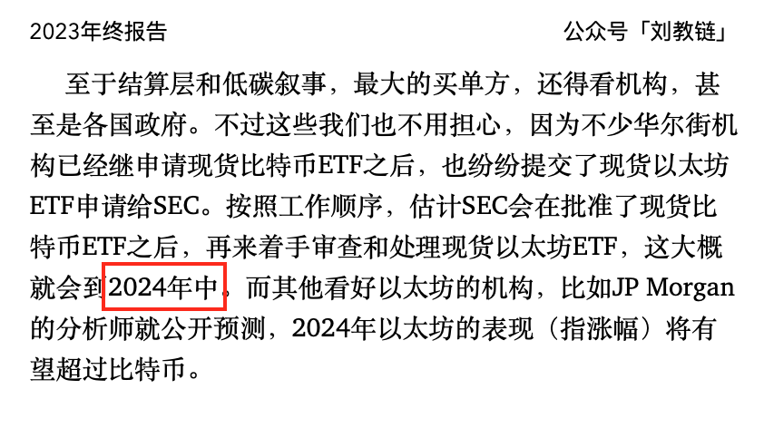
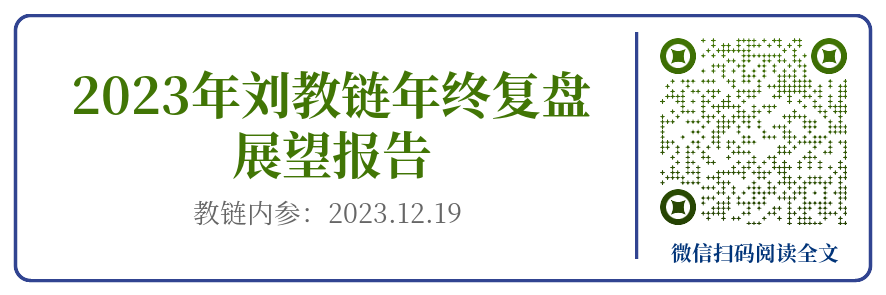

# SEC批准以太坊ETF了吗？

号外：[5.23教链内参：万事俱备，只欠东风](http://rd.liujiaolian.com/i/20240523)

* * *

隔夜BTC击穿了5日均线，回落至67k一线。凌晨传来美SEC批准以太坊ETF的消息，但是ETH上下插针，杵在3.8k，微微下跌。定睛仔细一看，SEC批准了，但又没完全批准，这特么是薛定谔的批准哈！全然应了昨晚5.23内参《万事俱备，只欠东风》之言，竟一语成谶。

从现货BTC ETF的经验来看，需要批准两个文件，一个叫19b-4，另一个叫S-1。这次SEC批准的，是次要一些的19b-4，而更核心的S-1，并没有获批。

S-1是关于ETF产品本身的，19b-4是关于交易所上架的。19b-4是监管交易所的。S-1是监管发行商的。狭义地讲，S-1没有通过，你可以说ETF产品并没有获批，一点儿毛病没有。

SEC 19b-4 是一种表格，用于向证券交易委员会（SEC）通报自律组织（SRO, Self-regulatory organization）根据《1934 年证券交易法》第 19b-4 条提出的规则变更建议。自律组织是对某一行业或专业行使某种程度监管权的非政府机构。金融业自律性组织的例子包括纽约证券交易所 (NYSE) 或纳斯达克 (Nasdaq) 等证券交易所、存管信托与结算公司 (DTCC) 等注册结算机构以及市政证券规则制定委员会 (Municipal Securities Rulemaking Board)。

SEC S-1 是美国证券交易委员会要求美国上市公司提交的新证券初始注册表格。任何符合标准的证券在纽约证券交易所等全国性交易所上市前，都必须提交 S-1 文件。公司通常会在首次公开募股（IPO）前提交 SEC S-1 表格。S-1 表要求公司提供有关计划使用资本收益的信息，详细说明当前的商业模式和竞争情况，并提供计划证券本身的简要招股说明书、发行价格方法以及对其他上市证券的任何稀释。美国证券交易委员会 S-1 表格也被称为 1933 年《证券法》下的注册声明。

所以，那些着急忙慌通报喜讯，说以太坊ETF获批的，无疑是夸大其词了。

严格地说，SEC批准了美股交易市场，比如纳斯达克，可以上架获批的以太坊ETF产品了。但是，对于所有要发行的以太坊ETF产品，对不起，目前还没有一个获批上市。所以，目前的状态就是，交易所可以上了，但是没有什么可上的。

只不过，在21号提前3天抢跑爆拉ETH，从31k一路拉到39k，在24日隔夜高位出货，做得好一手内幕交易的各路庄家们，的确是利用这一波割了不少韭菜。

至于什么时候S-1能获批，据说至少也要一两个月，那眼瞅着就奔着7、8月份去了。

不过，这2024年中前后能上市，相比年初一度认为可能延宕到2025年底的悲观预测，已经是一个不小的惊喜了。

这就无巧不成书地把时间节奏和教链当初2023年底在《2023年刘教链年终复盘展望报告》里关于以太坊ETF的时间表给对上了。哈哈～

当然，SEC的态度从此前坚决认为ETH涉嫌证券，到如今妥协为ETH质押涉嫌证券、不质押就不是证券，这其中必然有各方博弈，以及，我港抢先在4月底就通过了以太坊ETF，给贝莱德们游说SEC也提供了一些支撑。毕竟，高地我们不占领，就会被别人占了去嘛。

不过，美式ETF和港式ETF不同，并不提供现货退出 —— 即所谓现货赎回（in-kind redemption），真到需要的时候，还是可以对境外ETF投资者来一个瓮中捉鳖。

SEC主席虽然反复讲过，不是你的私钥，不是你的币（Not your keys, not your coins）。但是真到了国家利益问题，他也只能做出妥协，否决了现货赎回，只准美元赎回。

美式加密ETF，就是电子纸黄金。这东西和你自己链上持有私钥，乃是天壤之别。这一点希望大家务必保持清醒的认识。

可能有不少朋友会沉醉于美ETF的大力建仓，对于加密市场的带动作用，甚至于要生出一种感恩戴德之情，这就完全背离了加密朋克的初心。这些朋友，思想上依然停留在把BTC、ETH当作是一种和股票无二般的投资品种来炒作获利的阶段。

我们必须对美ETF的规模保持充分的警惕。它的规模越大，对BTC的威胁也就越大。如果有一天，它的规模大到足以控制整个BTC生态，那么就是BTC的死期。

像微策略、特斯拉这样自托管的持有者，则与此略有差异。

当然更重要的是，脱离美司法管辖区之外的分散化持有。比如萨尔瓦多，比如不受美管辖的加密交易平台，比如其他国家和地区的其他ETF，等等。

更更重要的是，美国的全球长臂管辖能力需要进一步削弱，世界需要更加多极化，这样才能确保分散的持有实体真的是自主持有，而不会被一个强大的美国所威胁。

对于每一个散户、个人，能够掌握私钥的话，务必亲自掌握私钥。毕竟，BTC的指导思想就是：不要相信任何人。请注意，是“任何”！

BTC若要取得最终成功，就不可能容许一个集军事霸权、科技霸权、金融霸权、货币霸权、文化霸权于一身的过于牛逼的单一实体的存在。就像它不可能容许一个矿工算力超过全网算力50%。牛逼哄哄、彼此不服但又无法奈何彼此的多实体世界，才是BTC理想的、多元制衡的世界格局。

BTC的终极目标是成为真正的超主权货币。它必须屹立于各民族国家层面之上，而不可以被任何一个单一强国驯服。

“请客，斩首，收下当狗”，这是强国驯服加密货币的三部曲。批准ETF是“请客”，司法重拳出击譬如抓捕CZ、控制binance是“斩首”，组合拳的最终目的是“收下当狗”。

其他加密货币是不是眼巴巴地想当狗咱们不管，但是BTC不能。如果BTC成了华尔街的狗，那就可以宣告中本聪货币试验的失败。

毕竟，如果满眼只有“小利”而没有“大义”，那么就只会在两个选项中纠结：做狗不得（哎呀呀，ETF没被批准～），终于做狗（啊哈哈，ETF被批准了！）。

持有BTC，做一个人。
