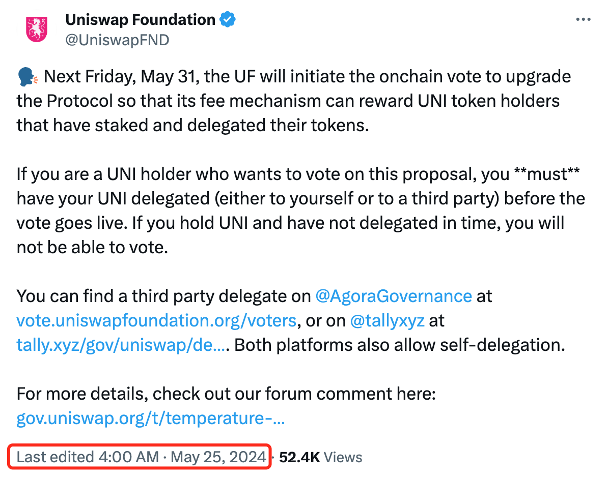
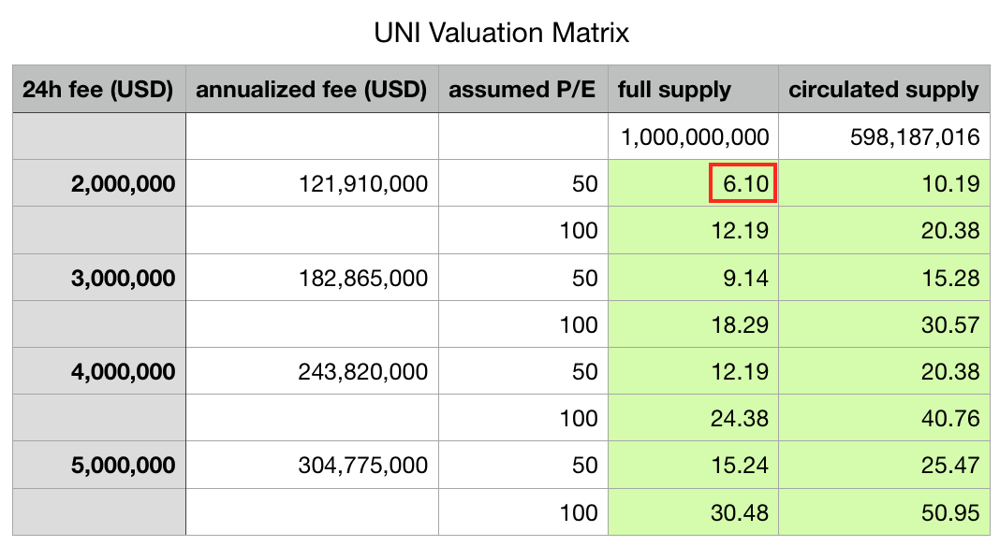

# Uniswap(UNI)为何骤升突破10刀？

号外：[5.24教链内参：请注意，尽快提币！](http://rd.liujiaolian.com/i/20240524)

* * *

隔夜BTC沿着5日线下方修复至69k上下。凌晨，UNI (Uniswap)突然骤升超15个点，突破10刀，并向11刀逼近。从盘面上看，这一波4/14-5/15所筑三重底，底部大约是6.6刀。从6.6刀到10.7刀，最近这十来天的涨幅超60%。

凌晨这突然一冲，大概率是和Uniswap基金会宣布5月31日要就治理分红进行投票有关系。

教链看了一下分时线，凌晨1点二级市场就开始抢跑了。这妥妥地是有内幕消息老鼠仓啊！4点消息发出，利好落地，前面抢跑的明显有一次出货，这导致4-5点在10刀这个位置出现了一次回踩，但是利好的传播扩散引来了二级的接盘侠，继续把价格给拉上去了。

市场对一些人来说是发财梦，但是对某些人来说就是提款机。

关于这个治理分红提案，教链在3个月前、2.24文章《Uniswap(UNI)骤升超50%》就有过详细介绍，不了解的读者朋友可以点击进去回顾一下，本篇这里就不再赘述了。

需要补充说明的一点是，Uniswap这个治理分红提案，分配的是协议收取的手续费，也就是交易者所付的各种代币，而不是增发UNI来激励。这和很多PoS质押挖矿，比如质押ETH获得增发的ETH，或者DeFi种地，比如Compound借贷获得平台币COMP补贴，是不一样的。挖矿和种地，都是在释放平台代币进行激励，后果就是不断地稀释平台币的价值。但Uniswap的分红，不会导致UNI的超发和稀释。

继2.24拉升回调的这一波，底部筑在6.6刀，大幅高于2022-2023熊市底部的4刀（最低甚至一度触及3.3刀）。这是一个好兆头。要知道，绝大多数的山寨币，一生的命运就是一路向下，鲜有能够穿越牛熊，筑底回升的。

这一波筑的三重底6.6刀，也印证了教链在2.25文章《Uniswap团队逢高出货100万刀之后……》中所给出的估值矩阵中的底线数字：

注意教链计算的这个6.1刀是按照全流通市值即所谓的FDV (Full Diluted Value)来推算的。UNI的代币模型很简单，前四年10亿总量，合约写死，不能增发。之后每年固定2%增发，增发部分进社区金库，由治理控制。

今年团队和投资人的40%应该全都解锁完毕了。社区金库的60%已经花掉了大约20%，还剩不到40%，链上看大约是3.8亿枚。所以流通量（Circulating supply）就是10亿减去3.8亿约等于6亿枚。对照看一下cmc，给出的流通量是5.99亿枚。嗯，和咱们估算的十分接近。

估值矩阵中，如果还是6.1刀的基本面，不算FDV而是算流通市值，那么估值就是10.19刀，和现在拉升之后的价格刚好差不多。

所以看起来，6-10这个区间，大概就是UNI比较坚实的底部了。基本面是用的熊市真实数据，不可能再差了。P/E倍数50x比股票可能是要高很多，但是加密市场是新兴市场嘛。这里的市梦率泡泡更加绚烂多姿。毕竟，空气币、模因币的市梦率可是无穷大，热炒的时候有人在意吗？

前段时间圈内刮起一阵批判高FDV、低流通市值的旋风，称这些VC币就是等着割韭菜，市场上的韭菜也不傻，不愿引颈向刀，于是宁可去炒空气一般的模因币，也不去接盘VC重仓的所谓价值币。

毕竟，VC来加密市场也不是做慈善的。要把他们手里的高FDV释放给市场，变成流通市值，就需要足够多、足够勇的韭菜给他们高位接盘。

在这些VC币中，UNI算是流通市值和FDV很接近的了，特别是，考虑到非流通部分还是社区控制而非VC控制的话。
