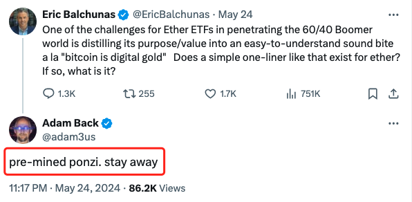
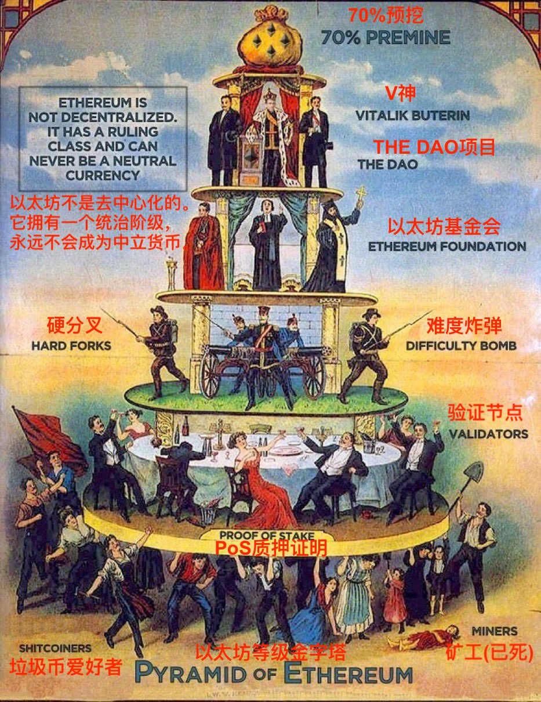
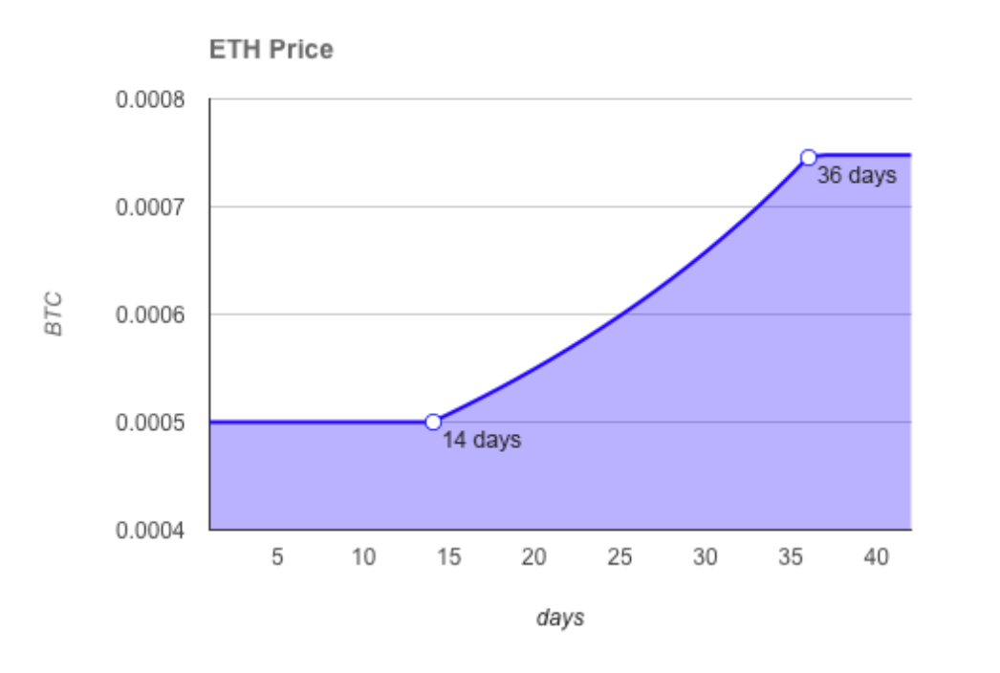

# 假象和谎言

号外：[5.25教链内参：BTC ETF持仓即将超越中本聪](http://rd.liujiaolian.com/i/20240525)

* * *

隔夜BTC（比特币）徘徊在69k一线。5.25教链内参报告，《BTC ETF持仓即将超越中本聪》。ETH ETF的尘嚣逐渐散去，复归于平静。戏刚唱了个开头，结尾还留着悬念。4000刀之于ETH看来是个关键阻力位，最近两次冲刺都没能有效突破。

密码学家、Blockstream创始人、中本聪比特币白皮书第6引文作者、hashcash发明者Adam Back在回复彭博ETF分析师Eric Balchunas关于ETH ETF的言论时，说：「预挖的庞氏骗局。请远离」

Eric Balchunas说了什么？他说的是：「以太坊 ETF 要打入按60/40配置传统股票/债券的婴儿潮一代的世界，面临的挑战之一是如何将其目的/价值提炼成一句通俗易懂的话，就像“比特币是数字黄金”那样。如果有，是什么？」

于是有网友嘲笑Adam Back说：「在 ETF 已获批准的情况下，这位老兄仍在试图推行“预挖的庞氏骗局”路线。无与伦比的应对」

对此Adam Back不甘示弱，回复道：「我说错了吗？一个ETF就能否定事实吗？」

网友回怼：「你真的以为一个庞氏骗局能获批ETF？」

Adam Back回复：「是的，看起来这个庞氏骗局（估计之后还会有几十个到几百个庞氏骗局）确实在搞 ETF。另外，各种高风险的传统金融(tradfi)也有 ETF :) 」

网友继续紧追不舍：「白痴的 tradfi 可能有 ETF，但没有真正的庞氏骗局......因为那太疯狂了（即使 tradfi 也没那么蠢） 。不管你用什么半截逻辑把 ETH 归类为庞氏骗局，在我看来也适用于BTC，所以感觉你是在自寻死路」

该名网友继续补充说：「我个人认为ETF应该止步于以太坊，但你也可能是对的，我们可能会看到更多的ETF（可能不是一件好事，即使它让我的钱包鼓起来）。所有证据都表明，比特币和以太坊已成为主流，我认为持有这两种币的人（或同时持有这两种币的人）都应该感到高兴。」

Adam Back毫不客气地回应：「你需要一个公平的竞争环境，所以如果他们给一个预挖的 ICO 提供 ETF，他们也需要给其他人提供 ETF，否则这就是香蕉共和国。」

Adam Back提到的“香蕉共和国”（banana republic）是一个政治学术语。

据维基百科解释，在政治学中，“香蕉共和国”一词指政治和经济不稳定、经济依赖自然资源出口的国家。1904 年，美国作家欧-亨利（O. Henry）创造了这个词 ，用来形容危地马拉和洪都拉斯在经济上受到美国公司（如联合果品公司（现在的金吉达公司））的剥削。通常情况下，香蕉共和国的社会阶层极其分化，通常是一个庞大的贫困工人阶级和一个由商界、政界和军界精英组成的统治阶级财阀。统治阶级通过剥削劳动力控制第一产业。因此，“香蕉共和国”一词是对奴役性寡头政治的贬义描述，这种寡头政治为了回扣而教唆和支持大规模种植农业，尤其是香蕉种植业的剥削。

香蕉共和国是一个实行国家资本主义经济的国家，根据这种经济，国家作为私人商业企业运营，为统治阶级谋取独家利润。这种剥削是通过国家与受青睐的经济垄断企业之间的勾结实现的，在这种情况下，私人开发公共土地所获得的利润属于私人财产，而由此产生的债务则由公共财政负责。这种不平衡的经济仍然受到城乡经济发展不平衡的限制，通常会使国家货币沦为贬值的银行券（纸币），从而使国家失去获得国际发展信贷的资格。

而Adam Back所说的“预挖的ICO”则是指通常认为由以太坊2015年问世所开创的一种启动区块链项目的方式，即通过预先铸造出一批零成本的代币，然后对市场发售（称为ICO，首次代币发行），以此为项目启动融资。

有网友说，「比特币也是预挖的」。对此，Adam Back大笑道，「当然不是」。

这里稍微解释一下，虽然常常有人偷换概念，说（疑似）中本聪早期挖的100万枚BTC，和以太坊团队预售ETH，本质上没有区别。中本聪挖BTC，虽有成本但很低。以太坊团队前期筹备工作也付出了劳动，所以预挖ETH，也是公平合理的。其实关键还不在于这些BTC或者ETH背后的付出，而在于有没有预售，也就是ICO。

有人说，这种预售是一种等价交换的销售行为，而不是融资行为。错。预售定价所包含的，绝不仅仅是它已经发生的成本加上合理的商业利润，而是主要包含了对于未来预期的溢价，这溢价预期是由未来的努力所创造出来的。所以，ICO的代币发售，更接近于公司股权融资行为，而不是卖馒头这样的基于等价交换的普通商业销售行为。

中本聪从未进行过比特币的ICO。中本聪的BTC，既不是零成本铸造的，也从未出售过。这就是BTC和ETH在创世一刻最重大的区别。

从美国证券法规的角度讲，ICO预售的ETH，妥妥地是证券。质押生息的ETH，也是证券。只有中间几年PoW挖矿挖出来的ETH，才是商品。现在这些ETH混在一起，就成了浑水摸鱼。美SEC也无法区分这些不同性质的ETH，在批准ETH ETF一事上，就干脆来了个“葫芦僧乱判葫芦案”。

有网友劝Adam Back别嚷嚷了，毕竟ETH已经算是次好的区块链项目了。

对此，Adam Back态度坚决。他说：「实际上，它就是一款热门的垃圾。但是小白用户常常会搞不清楚实用性(utility)和可投资性(investability)的区别。带宽是有用的，但它很便宜，而且随着技术的进步，价格会越来越低。同样，空气是免费的，没有空气你会死的，没有比这更有用的了！」

最初的那位网友不依不挠：「我认为，如果我们能找到将空气装瓶出售的方法，我们就会像对待水一样......据我所知，有很多水 ETFs」

Adam Back回怼：「有些人把垃圾币称为“空气币”(air tokens)是有原因的。就是那些被销售给韭菜的毫无投资价值的东西」

另一位网友对Adam Back表示支持：「蜜蜂不会和苍蝇争论为什么蜂蜜比大便好。“白银永远无法取代黄金” —— 卡内基，1891 年。」

教链检索了一下当年ETH ICO的销售资料。当时的销售定价在1 ETH = 0.000508 BTC ~ 0.000746 BTC这个范围。

再看一眼目前的二级市场。1 ETH 约等于 0.05456 BTC。近10年过去，以BTC本位而言，相比于ICO有接近100x的增幅。

不过，当前这个ETH/BTC的汇率水平，和6、7年前2017年底的水平差不多。距离2018年初0.1228的历史高点，还有不小的距离。

之后的2021年牛市顶部，ETH/BTC的汇率水平最高也只回到了0.08836，没有能够回到2018年初的历史高点。

按照今天BTC大约69k的价位计算，如果ETH/BTC回到历史高点0.1228，那么它的价格应该是8473刀，这比现在3760刀要高出一倍多。

本文不是要告诉你一个是非对错的简单结论，而是要启发各位读者的独立思考。

据说乔治·索罗斯有句名言：「世界经济史是一部基于假象和谎言的连续剧。要获得财富，做法就是认清其假象，投入其中，然后在假象被公众认识之前退出游戏。」

“Economic history is a never-ending series of episodes based on falsehoods and lies, not truths. It represents the path to big money. The object is to recognize the trend whose premise is false, ride that trend and step off before it is discredited.”

