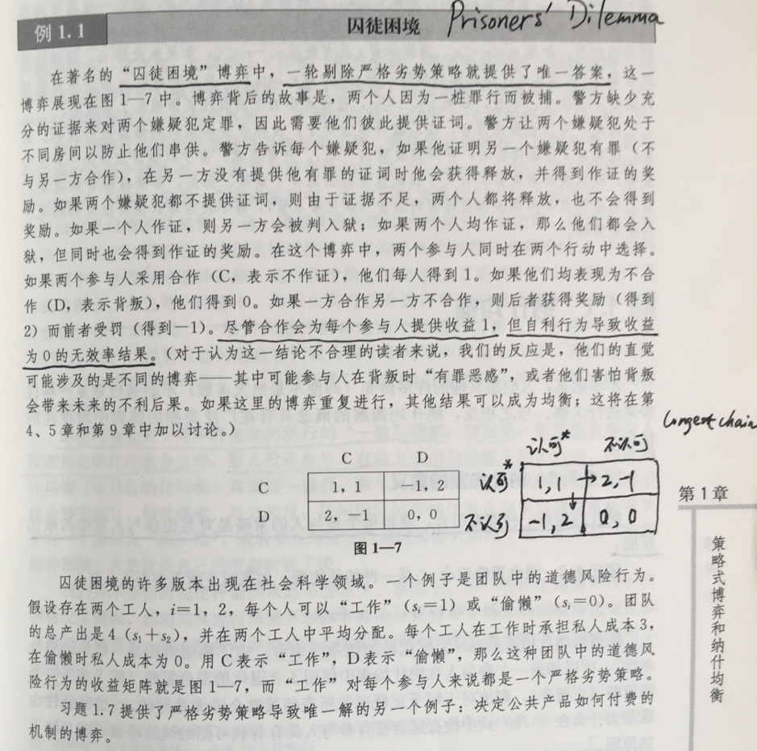
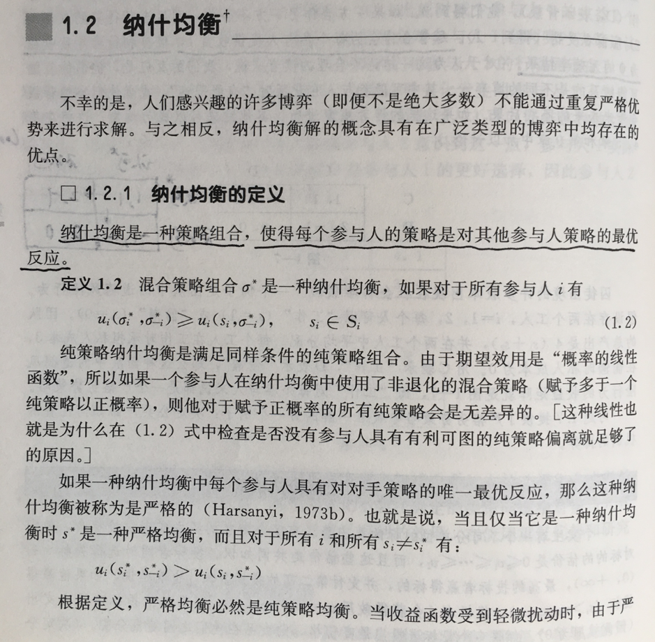
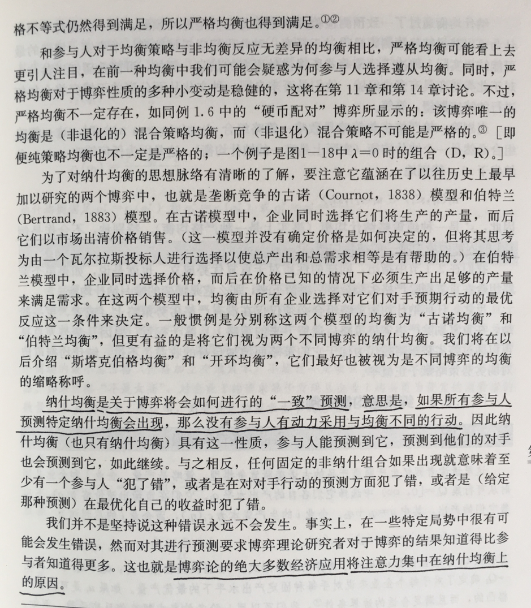
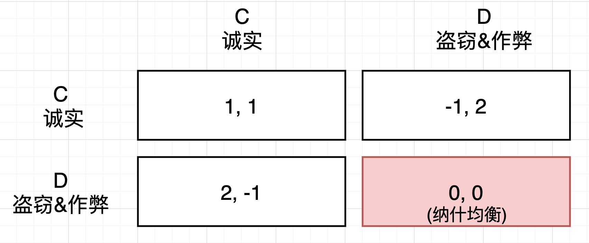
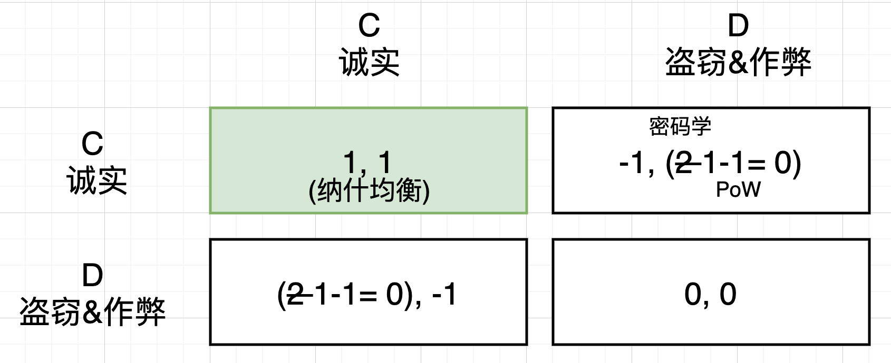
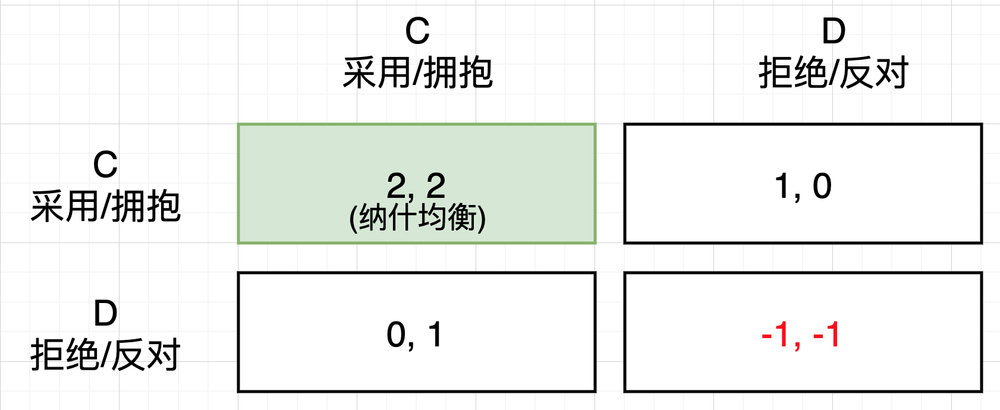

# 特朗普入局中本聪设计的“逆囚徒困境”

号外：[5.26教链内参：特朗普加密立场大反转](http://rd.liujiaolian.com/i/20240526)

* * *

昨5.26教链的超级小白课3期班顺利结业。有趣的是，小白3期班上课的4、5两个月，恰逢局部回调的两个月。最低时，BTC从7万刀多的高位下探到了5.6万刀左右。课程结束了，BTC现在又回升到了6.9万刀，走出了一个美丽的盆地地形。学习亲自掌握私钥囤BTC，就赶上BTC打折，且链上费用骤降，给动手实践创造了特别好的条件。（注：小白课相关资料均已在github开源，点击文章末尾左下角阅读原文即可跳转）

不仅是BTC，ETH也在这两个月下探2800然后现在回升至近4k，UNI也一度下探6刀以下，现在回升至11刀以上。教链的三个主要仓位又全面转入盈利状态。按照过往经验来看，小白课仿佛是一个不期而遇的初级市场信号：招生开班对应wyckoff模型的SOS（强势信号）。SOS之后一般就是LPS（最后支撑）的回调测试，对应于上课期间的市场局部回踩。小白课结束，正是LPS之后，下一阶段上升行情的开启……

5.26教链内参《特朗普加密立场大反转》提到，美国前总统特朗普最近公开发表声明，表态积极拥抱加密货币。他的一些具体表态和行动承诺，内参中已有报告，此处不再赘述。值得注意的是，他在任时曾经做出过完全不同的表态，声称必须坚决捍卫美元的地位不容挑战。现在摇身一变180度大反转，声称要成为首位拥抱加密货币的美国总统。这固然与其在野之地位不同往日有关，但另一方面，即博弈论所决定的历史必然性，或许更加接近本质。

五年多以前的2019年1月23日，教链应邀做过一次关于比特币中的博弈论相关的主题分享，题目就叫做《比特币中的囚徒困境》。对于“囚徒困境”（Prisoners' Dilemma），教科书中给出的定义是这样的：

「在著名的“囚徒困境”博弈中，一轮剔除严格劣势策略就提供了唯一答案，这一博弈展现在图1-7中。博弈背后的故事是，两个人因为一桩罪行而被捕。警方缺少充分的证据来对两个嫌疑犯定罪，因此需要他们彼此提供证词。警方让两个嫌疑犯处于不同房间以防止他们串供。警方告诉每个嫌疑犯，如果他证明另一个嫌疑犯有罪（不与另一方合作），在另一方没有提供他有罪的证词时他会获得释放，并得到作证的奖励。如果两个嫌疑犯都不提供证词，则由于证据不足，两个人都将释放，也不会得到奖励。如果一个人作证，则另一方会被判入狱；如果两个人均作证，那么他们都会入狱，但同时也会得到作证的奖励。在这个博弈中，两个参与人同时在两个行动中选择。如果两个参与人采用合作（C，表示不作证），他们每人得到1。如果他们均表现为不合作（D，表示背叛），他们得到0。如果一方合作另一方不合作，则后者获得奖励（得到2）而前者受罚（得到-1）。尽管合作会为每个参与人提供收益1，但自利行为导致收益为0的无效率结果。（对于认为这一结论不合理的读者来说，我们的反应是，他们的直觉可能涉及的是不同的博弈——其中可能参与人在背叛时“有罪恶感”，或者他们害怕背叛会带来未来的不利后果。如果这里的博弈重复进行，其他结果可以成为均衡；这将在第4、5章和第9章中加以讨论。）

「囚徒困境的许多版本出现在社会科学领域。一个例子是团队中的道德风险行为。假设存在两个工人，i=1,2，每个人可以“工作”（si=1） 或“偷懒”（si=0）。团队的总产出是4（s1+s2），并在两个工人中平均分配。每个工人在工作时承担私人成本3，在偷懒时私人成本为0。用C表示“工作”，D表示“偷懒”，那么这种团队中的道德风险行为的收益矩阵就是图1-7，而“工作”对每个参与人来说都是一个严格劣势策略。」

在上面的情形中，每个个体出于谋求自身利益最大化的目的所做出的“最优选择”，却使得所有人——包括自己——必然滑入最糟糕的结局。这个最糟糕的结局，博弈论术语叫做“纳什均衡”（Nash Equilibrium）。

「纳什均衡是一种策略组合，使得每个参与人的策略是对其他参与人策略的最优反应。」

「纳什均衡是关于博弈将会如何进行的“一致”预测，意思是，如果所有参与人预测特定纳什均衡会出现，那么没有参与人有动力采用与均衡不同的行动。因此纳什均衡（也只有纳什均衡）具有这一性质，参与人能够预测到它，预测到他们的对手也会预测到它，如此继续。与之相反，任何固定的非纳什组合如果出现就意味着至少有一个参与人“犯了错”，或者是在对对手行动的预测方面犯了错，或者是（给定那种预测）在最优化自己的收益时犯了错。」

于是我们明白了，在“囚徒困境”博弈中，囚徒们的“纳什均衡”就是双双入狱，打工人的“纳什均衡”就是人人摸鱼。

应用到区块链记账中，矿工也就是记账者们的“纳什均衡”是什么？当然是盗窃比特币，或者偷偷超发比特币，损害公共利益，中饱私囊。

这种以人人损公肥私为纳什均衡的囚徒困境，又被称为“公地悲剧”。公地悲剧，是公有制系统（体制）需要克服的最关键问题。

比特币系统的账本，恰恰就是公有的、共有的、无主的，而且还是无政府管理的。如果不能克服公地悲剧问题，那么比特币系统分分钟就会因人性的扭曲和道德的沦丧而崩塌。

中本聪找到了这个问题的解决办法，成功逆转了囚徒困境的博弈矩阵：

他的解法在今天看来十分明显且简单：

第一，用密码学电子签名确保记账者无法通过篡改账本直接盗窃他人的比特币。收益从2降为1。

第二，用PoW工作量证明来约束比特币发行，如果记账者作弊，将会损失他为计算PoW所耗费的高昂电力成本。收益从1减去成本1，收益为0，变得无利可图。

第三，在比特币发展早期，通过区块奖励，让每一个诚实记账者获得正收益。

这三板斧下来，盗窃和作弊就成了严格劣势策略，而诚实记账就成了系统的纳什均衡。根据博弈论，如果每个人都预测到这个纳什均衡会出现，那么就没有人会有动力去采取和均衡不同的行动。

那么，不仅仅是在底层记账层面，而且在比特币的流行和采用上，也存在着类似的囚徒困境博弈。

上图教链画出了这个采用/拒绝的博弈矩阵。

如果大家都拒绝BTC，那么所有人的收益都是 -1 。小于0的原因在于，中本聪曾经也说过，“没有比特币就是一种净浪费/损失”，因为法币的持续超发和贬值，所有人的财富都会受到劣币系统的损害。

如果你拒绝BTC，而别人拥抱BTC，那么你的收益是0（如果你是法币超发的既得利益者的话，如果不是，那么向下修正为-1），而别人的收益为1，因为BTC相对贬值法币的持续升值。

如果大家都拥抱BTC，那么BTC的共识进一步加强，所有人都获得更大的收益，因此设定为2。

很显然，在这个博弈框架下，纳什均衡正在于人人都或早或晚地采用和拥抱BTC。这就是中本聪为所有还没有拥抱BTC的人所设计的“逆囚徒困境”。

所以，教链说，美SEC批准ETF，不必感激它的仁慈，特朗普立场大反转，转而高调拥抱BTC，也不必太过于惊讶，一切都是中本聪在2008年就已经布下的局，历史只会沿着这个方向走，今天不批准，明天也必然会批准，不是这个总统拥抱，就是另一个总统拥抱。具体的人，具体的机构，在历史的面前，都是可替代的符号而已。谁把脚踩进了历史下的套，青史留名，那是他的荣幸，不是人民和历史的荣幸。

请记住，历史是千千万你我这样的普通人所共同创造的，是创造历史的人们给了帝王将相、精英政客表演的舞台。「俱往矣，数风流人物，还看今朝。」囤BTC的人，要从身体上到精神上都站直了。站直了，才是顶天立地的人。

既得利益的精英集团要破掉中本聪设下的逆囚徒困境，就要打击纳什均衡的收益。而这就要求，或与全体民众为敌，禁止任何人投资于BTC，支撑记账者的收益；或对比特币系统实施“斩首”，直接摧毁其“大脑”或“神经中枢”，瘫痪其网络，让资金无法顺畅地转移给记账者。

与民众为敌损害统治根基，斩首系统就成了唯一选项。这一点，中本聪早有所料。2009年1月16日，中本聪在论坛这样写道：（《比特币史话》第44话 https://leanpub.com/history-of-bitcoin ）

「我们可以在（数字货币的）军备竞赛中赢得一场重要战役，并在几年之内攻占一片自由的新领地。

「政府擅长对像 Napster 这样的中心化控制的网络实施斩首，但是纯粹的 P2P 网络，如 Gnutella 和 Tor，似乎可以立于不败之地。

「由于自 20 世纪 90 年代以来所有那些失败的公司的缘故，很多人自动地把电子货币看作是注定不会成功的事情。很明显，仅仅是因为那些系统的中心化控制的本质让他们注定失败。我认为这是我们第一次尝试去中心化、基于非信任的系统。」

