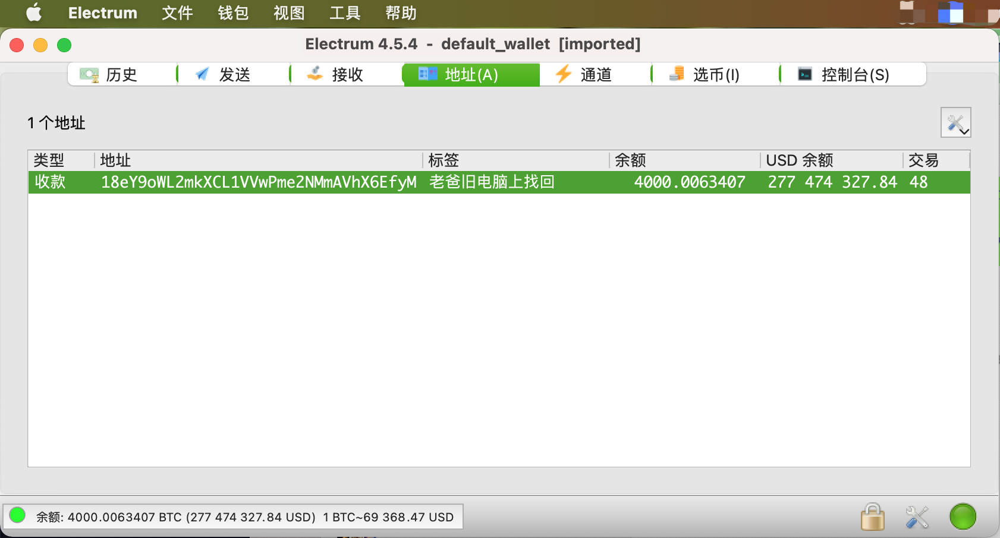

# 小伙找回老爸旧电脑上的4000个比特币！

号外：[5.27教链内参：做多ETH/BTC汇率赚了800多万刀](http://rd.liujiaolian.com/i/20240527)

* * *

上周ETH相对BTC的比价反弹了不少，从接近0.045的低位，最高攀升到了0.057。这让做多ETH/BTC汇率的多头赚了不少。昨5.27教链内参《做多ETH/BTC汇率赚了800多万刀》就是一个例子。不过，每当我们听到加杠杆的投机者大赚的消息时，市场可能就要有动力反方向运动了。「反者道之动。」这是不变的规律。28号一早儿，市场开始全面回落。BTC刺穿69k，向68k下坠。

昨天网上有一些人在疯传某小伙自称从老爸的旧电脑上找回了丢失多年的4000个BTC的消息，还放出了钱包截图。

看看，看看，4000个BTC现价折合多少钱？小3亿刀，20多亿RMB。啧啧～

不过，上面这张钱包截图可不是小伙贴的图。上面这个是教链刚刚把这4000个BTC导入到自己电脑上的比特币钱包软件然后截取的图片。

怎么样？是不是以假乱真？不懂《比特币原理》的小伙伴们，可能很容易被这类的自嗨型谎言所欺骗。

为啥容易被欺骗？因为语言本身就是一种障眼法。就像上面，教链除了放出一张图，还用了“把这4000个BTC导入到自己电脑上的比特币钱包软件”这样的话术。懂得比特币原理的人一眼就能识破这话术就是一个障眼法。但是不懂的人却很难识破，再加上被图片交叉印证，就很容易被忽悠而轻信谎言。

这里教链不解释怎么把这4000个BTC导入自己钱包的（不是P图哦）。留给学过我的原理课或者小白课的同学们去自己思考，自己得出结论。

要想识破谎言，教链总结了几个要点：

首先，需要先搞清楚待质证的命题是什么。

比如小伙找回4000个BTC这个问题，本身可以提出两个命题进行质证：第一个命题是，小伙真的找回了4000个BTC。第二个命题是，小伙找到4000个BTC是谎言。

对于第一个命题，你会发现，它的特点是，证明（证实）它极其容易 —— 只需要小伙转一个大家指定数量的BTC出来就可以证明，而证伪则几乎不可能 —— 教链在5.17文章《比特币的存在就是对美元的质疑》中就介绍过这个逻辑上的原因：证明“不存在”，或者说，否证存在性，是一件极其困难甚至几乎不可能做到的事情。这就是说，让网友去证伪小伙找回4000个BTC，即证伪第一个命题，也就是等价于让网友去靠小伙公布的所谓证据来证明小伙说的是谎言，即证明第二个命题，是一件极其困难的事。

因为，无论广大网友提出任何有关小伙撒谎的质疑，比如他说是“索尼电脑”而截图却是苹果系统，又比如他说是2015年买的BTC但是查看链上记录却是2011年就转入了4000个BTC等等，小伙 —— 或者那些出于不可告人的动机支持小伙的人，就会为每一个质疑找出一堆理由来解释。

比如，可以援引一大堆唧唧歪歪的FBI关于审讯心理学的权威资料，拍到质疑者脸上，说小伙是听他爸说的，他爸记忆出现了偏差，而不完美证词恰恰符合人类遗忘的特点，反而证明了他们并没有撒谎！然后还可以反问质疑的网友一句，你不信我还不信权威机构、学术研究、专业论文吗？！

想一想为什么那么多人从未见过上帝，却相信上帝存在？就是因为人类不具备从逻辑上否证存在性的能力。

第二个命题就是第一个命题的否定命题。所以，很显然，第二个命题的特点是，证明很困难，而证伪很简单。

如果我们把证伪很困难的命题称为“不具备可证伪性”，而把证伪很简单的命题称为“具备可证伪性”，那么，第一个命题就是“不具备可证伪性”的命题，而第二个命题则是“具备可证伪性”的命题。按照索罗斯的老师、哲学家波普尔的理论，第一个命题这一类的命题就不是科学命题，而是非科学命题，或者神学命题，第二个命题那样的第二类命题才是科学命题。

教链在5.17文章里拿的另一个最近热门的美国载人登月的话题举例，这尼克松任期内美完成人类首次载人登月，和小伙找回4000个BTC，或者上帝是存在的，这些都是第一类命题，也就是非科学命题，或者神学命题。神学命题的第一性原理是什么？信则有，不信则无。

真正严肃的科学家是不会去参与这一类话题的讨论（“辩经”）的，不只是因为所有的“证据”都是辩论对手提供的，更是因为，从逻辑上讲，科学家永远无法向一个信上帝者证明上帝不存在。

所以，信上帝者会说，你看看，迄今全世界没有一个科学家、专家、院士、国家政府公开证明或者声明上帝不存在，所以他们都是承认上帝是存在的嘛。如果你是无神论者，你可能会觉得可笑。但是换个话题，换个你相信的如上帝一般存在的、信仰一般的东西，你立马就会觉得，说的真有道理。

可是，如果小伙是不是真的找回了4000个BTC，根本就无法被证伪，那么我们岂不是要看着谎言流传而无计可施了吗？

并不是，我们还有下面的步骤。

第二步，厘清举证责任归属。

上面我们搞清楚了一个命题的证明和证伪的难易不对等，具有天壤之别。

从经济学原理上讲，谁证明更简单（或更有能力去做这件事），举证责任就归谁。因为只有让证明简单的一方去举证，总体的成本才最低，也才更经济。

比如，“上帝存在”这个非科学命题，证明简单，证伪困难。那就应该让相信上帝的人来担负举证责任。他只要能让上帝出来走两步，展现一下全知全能的威力，就可以说服很多人。而不应该让质疑上帝不存在的人来举证证明上帝不存在。

其实反过来也一样。对于“上帝不存在”这个科学命题，证明困难，证伪简单。因此，应该让否认“上帝不存在”，也就是相信上帝存在的人，来承担举证责任。

所以亲爱的读者，你看到了，按照教链所讲的责任归属方法，无论摆出的是神学命题，还是科学命题，举证责任都会被正确地归到同一批人身上去，那就是相信上帝存在的那批人。

同理，相信“美载人登月”——即，否认“美载人登月为假”——的人，负有举证责任。相信“小伙找回4000个BTC”——即，否认“小伙找回4000个BTC为假”——的人，负有举证责任。

这也就是说，怀疑“上帝存在”，怀疑“美载人登月”，怀疑“小伙找回4000个BTC”的人，是没有举证责任的。也就是说，如果你是怀疑或者不相信的一方，你是没有任何责任去证实或证伪这件事情的！你可以享有保留你的意见和观点的充分自由。

所以，对于小伙是不是找回了4000个BTC这件事，教链没有任何责任和义务去证实或证伪这个事情。

不承担举证责任的一方，肩膀上和心态上都应该是十分轻松的。

第三步，不要相信任何非实证的证据或证明。

所谓实证，就是做给大家看看。所谓非实证，就是出示各种旁证、材料、论文、专利、专家站台、政府文件，或者“神迹”，进行各种巧舌如簧的论证，来进行证明。

好了，上一条我们厘清了，举证责任在谁的肩膀上。那么对于另一方，要坚持的原则就是实证主义原则。

科学只讲一个原则，就是实证主义。

小伙找回4000个BTC，举证责任在小伙，他进行实证的办法很简单，就是转几个BTC出来给大家看看。或者，网友发一段文字，他用该地址的控制私钥对这段文字做一个数字签名，也可以证明他的所有权。这就是实证。

至于什么回忆啦，故事啦，截图啦，语音啦，证人证言啦，统统都不是实证。

不是实证的证据和证明，就算拿出来再多，也统统不作数的。

最后一步，对于不能给出实证的，一律怀疑原命题为假命题。

请注意，这种怀疑是无需理由的！

人们常常喜欢说什么“有理由怀疑”这样的话，其实，如果经过上面三步判断后，到了这一步，就可以直接“无理由怀疑”其为假。

如果小伙不能证实他的确拥有4000个BTC的所有权，那么我们就可以怀疑小伙撒谎或者造假了。

除非有一天，小伙能够证实，那么我们就可以随时解除我们的怀疑。

相信一个无法证伪的非科学命题，叫做“迷信”。

在一个可证伪的科学命题被证伪之前，暂时相信它，这才叫做“科学”。

对于非科学命题，我们要在它的主张者能够证实它之前，一直保持怀疑，这才是科学的态度。

一个个“迷信”的人，到处给别人扣“反科学”的帽子，这本身就是一件特别滑稽和可笑的事。

对于网上很多吹水的话题，迷信也好，科学也罢，除了浪费时间打打嘴炮，可能并不会给个人造成什么实质性的损失。但是，如果事关自己的投资仓位，那么就会变得严肃起来。如果不能用严谨的逻辑，识破骗局和谎言，轻信甚至迷信镰刀，那么就很有可能沦为被收割的韭菜，让自己的切身利益受到损害。

至于咱们最开始解剖的这只“麻雀” —— 小伙到底有没有这4000个BTC，其实也算是一个吹水话题。教链拿这个案例，洋洋洒洒写了4000字，不是为了简单地得出一个结论或者给出一个答案，而是为了掰开来、揉碎了，启发大家的思考，和大家一起锻炼科学思维。

要说这事儿的结论或者答案，其实也很简单：在他能证实之前，你可以认为就是假的，吹牛逼罢了。
