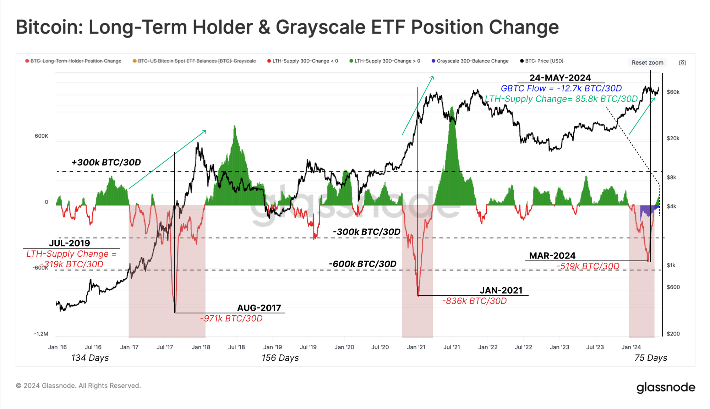

# 风平浪静的牛市

号外：[5.28教链内参：门头沟14万枚BTC异动，会造成市场崩盘吗？](http://rd.liujiaolian.com/i/20240528)

* * *

昨5.28教链内参《门头沟14万枚BTC异动，会造成市场崩盘吗？》提到，倒闭日久的门头沟（Mt.Gox）交易所突然异动，把市场吓了一跳，BTC轻轻一跃，从69k回落到68k。

要说这一轮牛市，起得那是又早又猛。2024年3月11日就突破2021前高69k，并很快就攀升超过了72k的高度。长期持有者（LTH）群体“逢涨就卖”，派发筹码。所以我们也是罕见地这么早就看到了长期持有者的抛售小高潮（如下图，向下指的红色尖尖）。2024年3月，比2019年7月的抛售小高潮还要早4个月！

如果按照牛市的其中一种定义，即超越前高视为牛市开始，我们可以从历史过往大致看到，每轮周期，牛市启动的时间越来越早了。

上一轮牛市，那可是一直熬到2020年12月16日——相当于这一轮的2024年的12月16日——才突破2017前高19.8k。

上上一轮呢，一直拖过年到了次年2017年的1月4日——相当于这一轮的2025年1月4日——才突破2013前高1100多。

再上一轮呢，也是直到次年2013年2月28日——相当于这一轮的2025年2月28日——才突破2011前高31。（前推法，早期或不适用）

换句话说，每轮周期，熊市的时间越来越短了。

仔细一想，这也很容易理解：说明人们对BTC是越来越有信心了呀。这信心就是相信BTC一定会重新回到前高并继续成长的。那么这信心越强，逢跌加仓的动机也就越强。越多人敢于逢跌加仓，那可不就是更快地推动BTC回到前高嘛。

但是，起早了、起猛了，也不由得让我们会担心，这一轮牛市能坚持多久。

上一轮牛市，2021年11月9日-10日见顶。牛市跑了1年零一个月，即13个月。

上上一轮，2017年12月17日见顶。牛市跑了11个月。

再上一轮，2013年11月30日见顶。牛市仅仅跑了9个月。

很明显，不仅熊市缩短了，而且牛市奔跑的时间也延长了。这同样说明了人们对BTC的信心每经过一轮周期就更加增强一分。

前高定牛市。上面两个结论实为同一。

但是这一轮还是起得太早了。牛市从2024年3月起，如果一直奔跑到2025年12月，那可是21个月！

看此前，每一轮也就延长2个月左右。照此外推，这一轮15个月，也就从2024年3月跑到2025年5月，即大概2015年中就得见顶。这可比另一种刻舟求剑，牛市总要到年底见顶，要提前半年（6个月）。

所以，这轮牛市到底是跑到2025年中就见顶结束，还是能坚持到2025年底才见顶结束，只有让市场的实践来回答了。

现在是5月份。刚好还有一年到一年半的时间。

现在是7万刀。翻倍是到14万刀。3倍是到21万刀。4倍到28万刀。5倍到35万刀。这是小学数学，没什么好说的。

幂律价格走廊模型上，2025年年中中轨11万刀、上轨43万刀，2025年年底中轨14万刀，上轨51万刀。不了解这个模型的读者，翻翻此前教链的文章。

如果，我们依然假设牛转熊、顶到底的时间是1年左右。那么，2026年中的下轨是58k，而2026年底的下轨刚好是70k左右。(58+70)/2 = 64k，这是平均数学期望。

这向我们展现了一个“残忍”的可能性，那就是，在现在牛市开启信号发出后才匆忙进场的朋友们，买入持有，穿越这一轮牛熊，到达下一个熊市底部时，很有可能不赚钱，甚至是亏损的。

于是心思活泛的小伙伴可能就想搞一些“骚操作”了。对此，教链不予置评，也不作任何建议。

2026年年中到年底的中轨是160k-200k。在此区间或以上适时执行适当的空头策略，譬如波段减持策略，抑或币本位做空策略，等等，或有相对较高胜率。这些“艺高人胆大”的策略，需要更高超的技巧，更强大的定力，更早的提前布局和筹码准备，缺一不可。绝大多数普通玩家，不是因准备不足无法出手，就是因心理崩溃而功亏一篑。所以“玩火自焚”很多时候并不是一句空话。

常人很难建立对冲思维，根本无法在大脑中同时执行两套策略，一套做多，一套做空。不信的朋友可以试试，会不会自己和自己打架，最后思维完全乱掉。乱了之后就容易完全搞反，该多做空，该空做多，最后亏得一塌糊涂。

归根结底，市场要怎么走，是无法准确把握的。教链掰手指头在小本本上记下几个零星的数字，也只是为了让心里有个数。各人仓位不同、策略不同、目标不同、资金生命周期也不同，并不能一概而论，生搬硬套。本文不是什么投资策略，更不是任何投资建议。

平和的心态，持久的耐力，正确的方法，在市场上赚点儿小钱，并不是一件很困难的事情。
