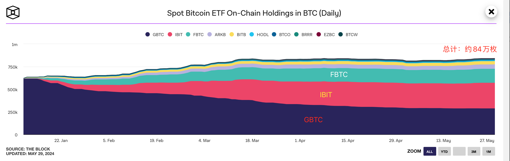
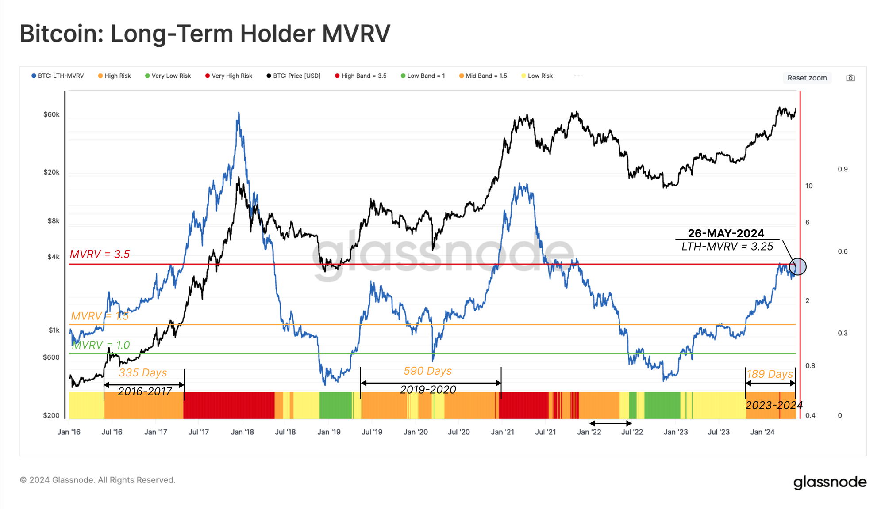

# 长期持有者(LTH)真的都是钻石手吗？

号外：[5.29内参：逆转！贝莱德IBIT持仓超越灰度GBTC](http://rd.liujiaolian.com/i/20240529)

* * *

隔夜BTC（比特币）回调至67k-68k区间附近后暂时企稳。美版各BTC ETF产品持续净流入，扛把子贝莱德终于取得了决定性胜利，即如昨5.29内参所说：逆转！贝莱德IBIT持仓超越灰度GBTC[链接]。

书接上文，昨日文章《风平浪静的牛市》[链接]谈到了所谓LTH（长期持有者）经过前段时间的出货后，重新转入了积累。那么，问题是，LTH这一次的逢涨抛售，会打断本轮牛市进程吗？

教链注意到，有分析师和媒体搬出了另外一张图表，MVRV数据，来论证LTH们在面临平均3.5倍利润时，依然在“钻石手”，即克制卖出的冲动。

我们当然要时刻保持怀疑精神。质疑一切，独立思考，批判性地吸收。所以，我们先来看一下这个所谓的MVRV数据吧：

要辨明问题，先辨明概念。这里有三个细节：

第一，所谓的LTH长期持有者，“长期”是多长？其实只有155天而已——链上持币155天不动就会被分类进LTH。相对于教链常说的5-10年甚至20-50年的“长期”，LTH定义里的“长期”其实相当短期了。在教链看来，LTH远远称不上“钻石手”。

第二，3.5倍利润是错误的数学。链上移动，视为一卖一买。以当时的BTC价格作为买入价，以现在的价格作为市场价。买入价为1，市场价为3.5，这其实不是3.5倍利润，而是2.5倍利润。准确的说法应该是2.5倍利润加上1倍本金。比如，“十年之约”第15次加仓后持仓成本是4万刀[链接]，按目前市价6.8万刀计算，是(6.8-4)/4 = 70%利润（浮盈）。

民间口头语常说赚到5倍、10倍、100倍，很多时候其实也是一种不太严谨的说法。这5倍、10倍、100倍，并不是收益率（利润率），而恰恰是下面要讲的MVRV。即，赚到100倍是指仓位增长到了本金的100倍这个意思。

第三，这个MVRV指标究竟是什么含义？这是我们理解此问题最核心的概念点了。

所谓MV，全称Market Value，即市值。指的是，当前的市场价格，乘以这些LTH持仓的BTC总数量，所得到的总价值。

所谓RV，全称Realized Value，即已实现价值。这指的是，LTH持仓的BTC，按照它们在链上移动时的市场价格计算价值，然后全部加起来，得到一个总的价值。站在持有者的角度来看，这就是持仓成本。

因此，MVRV就等于MV除以RV，LTH的MVRV就是用他们持有BTC仓位的当前市值除以持仓成本。

可见，本质上MVRV就是一个收益率指标的变体。传统的平均收益率（浮盈）正是等于MVRV减去1。

因此，MVRV = 1 的时候，代表仓位正好不赚不赔。MVRV > 1，代表仓位处于浮盈。MVRV < 1，代表仓位处于浮亏状态。

好了，搞明白这些细节，我们再来回看上面的LTH MVRV图。

可以很容易看出：

一、当LTH MVRV < 1，即LTH也陷入浮亏的时候，恰恰是抄底的良机。譬如图中的2018年底、2020年“312”崩盘时、2022年底，等等。

二、当LTH MRVR 超过 10，即LTH普遍赚到超过10倍的时候，往往是市场见顶的时候了。

三、请仔细观察2021年两个小牛顶。它们的顶部价格是类似的水平（65k+），但是它们的MVRV却大相径庭。年初顶部MVRV达到甚至超过10。年底顶部MVRV却只有3.5 —— 恰好和现在一样！

因此，我们可以谨慎怀疑，破解当前LTH MVRV密码的途径，就在于搞清楚2021年的这个差异背后的逻辑。

从MVRV的定义上，可以知道：

如果LTH保持不动，那么作为分子的MV会跟随价格上升或下降，而作为分母的RV则保持不变，于是MVRV会随着价格上升而上升，随着价格下降而下降。

如果LTH跟随价格买入：

在价格上升期，价格升高叠加仓位增长，MV会升高地更快；在价格下降期，价格下降但仓位增长，MV会下降的更慢。也就是说，LTH的买入会对MV产生“托举”效果。

那么对于RV呢？LTH的买入肯定也会导致RV的增长。这么一来，MV/RV就要看是分子增长的更快，还是分母增长的更快了。

让我们换个思路。MV = nBTC x pBTC（持仓数量 乘以 市场价格）。RV = nBTC x cBTC（持仓数量 乘以 平均成本）。所以，MVRV = MV/RV = (nBTC x pBTC) / (nBTC x cBTC) = pBTC / cBTC。

可见，要考察LTH买入对于MVRV变化的影响，其实并不需要考虑仓位规模的变化，而只需要考察cBTC，即持仓平均成本，随LTH的买入的变化情况就可以了。

那么，很显然的：当MVRV > 1时，LTH的买入会提高持仓成本，即导致cBTC增加，从而让MVRV的变化率相比价格的变化率要更小。

这就可以回答，为什么2021年底，价格回去了、甚至创新高了，但是MVRV没回去，反而还差好多（差了近2/3）的原因。这原因就是由于LTH在年中“519”崩盘之后大量买入，使得cBTC，也就是持仓成本大幅上升，而导致的。

那么，如果LTH跟随价格卖出呢？同理，在MVRV > 1的情况下，LTH的卖出会导致cBTC也就是持仓成本下降，这就会相对放大MVRV的变化率。

所以我们可以看到，在上面的MVRV的图里面，当MVRV回归到绿线（MVRV = 1.0）上方之后，无论是2021年初的牛市冲刺，还是2023年底、2024年初至今的这一波拉升，MVRV的增速看上去都要比价格增速略快，这就体现了LTH在这一期间“逢涨卖出”的动作。

逢涨就卖的LTH肯定难称“钻石手”。但是，他们卖卖卖，MVRV也只是回到了2021年底同等价位时的水平（3.5），而远未到达2021年初同等价位时的水平（10），这显示出LTH的分化：逢涨出货的那些已经卖无可卖了，更长期持有的真正钻石手作为压舱石依然稳如泰山，彰显了他们对于BTC后市的坚定信心。

