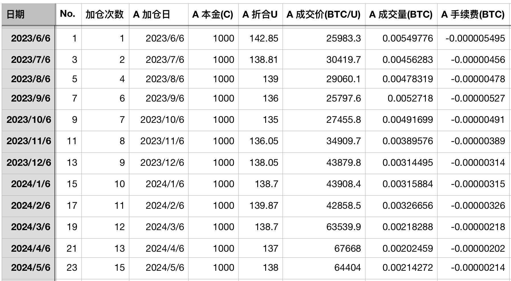
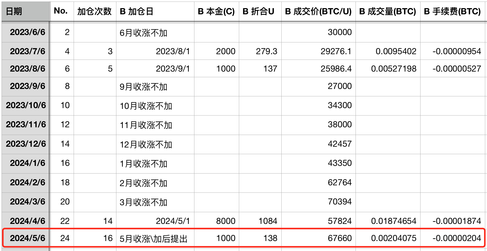
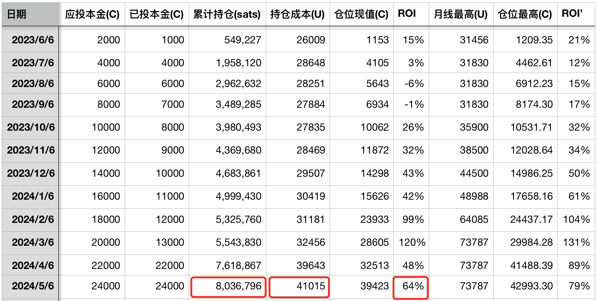
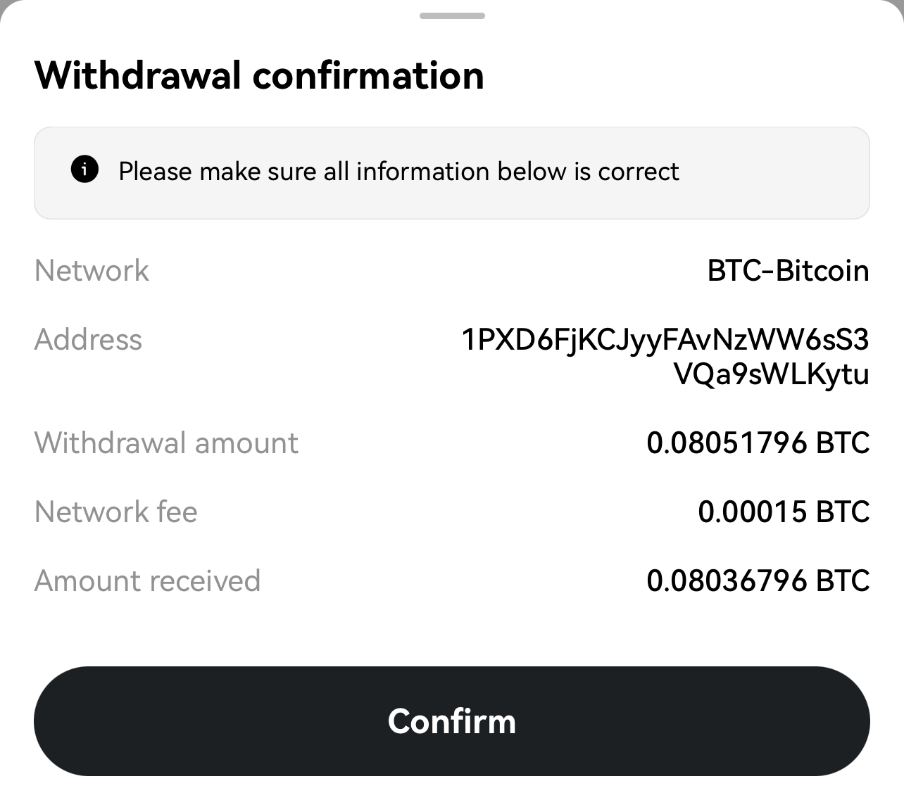
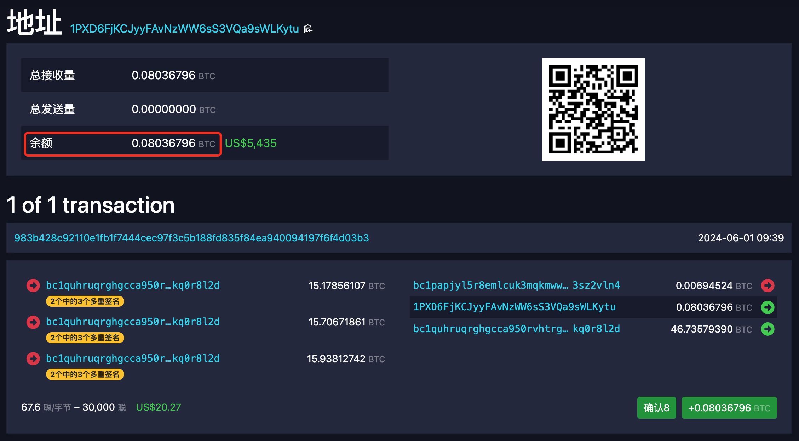

# 十年之约＃24：首战告捷，成功提币！第一年收益率64%

号外：[5.31教链内参：美核心通胀放缓，利好宽松周期落地](http://rd.liujiaolian.com/i/20240531)

* * *

各位读者朋友，儿童节快乐呀！随着年龄的增长，各种节日、聚会过了不计其数，返璞归真，到头来才知道，心中无事的儿童节，才是最快乐的。几千年前老子就曾发问：能如婴儿乎？

不知不觉间，我们已经从一个儿童节，到了又一个儿童节。启动于2023年儿童节之后的“十年之约”实盘公开见证计划[链接]，也迎来了第一年的首战收官。

隔夜BTC继续回落至67k上方。虽然如此，5月份仍然是收涨的：开盘60.8k，最高72k，最低56.5k，收盘67.2k。按照计划，收涨月不应进行“逢跌加仓”。但是，为了给年度收官画上一个逗号，于是破例把B份给加上了。

下面是过去一年全部24次实盘记录：

A份：

B份：

投后：

过去一年积累了800多万聪，平均持仓成本是41k，收益率64%。高收益率带来了一个明显的坏处，那就是实际积累的BTC数量远小于最初计划的估算值。

按照最初的计划，每囤积满一年就从平台提出一次，提到链上地址 1PXD6FjKCJyyFAvNzWW6sS3VQa9sWLKytu （该地址已在第一篇计划启动文章中公示）。这有两个好处：第一，独立私钥保管，不怕平台倒闭。第二，公开见证。

大家可以看到，由于平台要收取0.00015 BTC（约10刀！）的提币手续费，为了让到账数量恰好是 0.08036796 BTC，所以提币数量要把手续费加上，即提取0.08051796 BTC。当然，这意味着我们需要额外再付出一点儿成本，多购买一些BTC用来付这个提币手续费。

BTC一旦提到链上，就对所有人公开透明了。人人可以查看、监督。任何人都可以使用任何一个BTC的区块浏览器，比如mempool.space，粘贴上面的链地址，就可以查看该地址的当前余额，以及全部转入、转出的历史记录啦！就像下面截图这样子：

教链曾在2020.10.20写过一篇小文《如何使用私钥保管比特币》。不过文中没有多讲，多久提一次币比较合适。

首先，每次买完都提币，大概是不太合适的 —— 除非你每次都买的特别多，比如1 BTC以上。否则，过于频繁提币至少有两个缺点：一、要交很多次提币手续费，很不划算（当然，平台也用这招，尽可能长时间地占有你的BTC）；二、每次提币都会在链上生成一个新的“硬币”UTXO，多了就会形成“碎片化”，将来花费他们的时候就要支付更多的链上手续费。

所以，十年之约定的是一年提一次币。当然，如果中途发生任何安全警报，那就要机动灵活，随时提出，尽快避险。

十年的时间，好像很长，其实不长。光阴之间，一年就过完了。1/10的时间已经永远逝去了。10、9、8、7、6、5、4、3、2、1，十个1/10，光阴似箭，倏地也就到了终点。

站在第一年的里程碑处，回顾过往24篇文章，24次实盘记录和彼时心境，白云苍狗，又何感怀？

1. 八字诀 · 十年之约 
2. 内参：「十年之约」浮盈29%，B份6月收涨不加 
3. 「十年之约」7月实证，浮盈20%，继续加仓
4. 「十年之约」实证#4：7月收跌，触发双倍加仓，浮盈回撤至3%
5. 「十年之约」实证#5：八月A份加仓，浮盈转为浮亏
6. SEC推迟ETF，BTC跌破26k，十年之约#6逢跌加仓
7. 十年之约#7，ahr999囤币指标辨析
8. 十年之约#8：格物致知
9. 十年之约#9：放长线，钓大鱼
10. 十年之约#10：桃李不言，下自成蹊
11. 十年之约#11：积累的力量
12. 【实盘实证】十年之约#12：熊市坚持加仓可以摊低成本
13. 【十年之约#13】比特币在呼吸
14. 教链的2023：写了190余万字，投资收益率143%（十年之约#14）
15. 如果BTC达到100万刀（十年之约#15）
16. 十年之约＃16：逢跌加仓不如无脑定投？
17. 加仓！
18. 你没有错过比特币，更不会错过山寨币 —— 十年之约＃18 (ROI 99%)
19. 万刀斩：BTC拉至前高，暴跌一万刀 —— 十年之约＃19 (ROI 95%)
20. BTC连续7个月收涨，三月收超7万刀——十年之约＃20（收益率120%）
21. 比特币和黄金联手痛击美联储 —— 十年之约＃21 (ROI 104%)
22. 满上！ —— 十年之约＃22(ROI 48%)
23. 乘胜追击 —— 十年之约＃23(ROI 60%)
24. 十年之约＃24：首战告捷，成功提币！第一年收益率64%

天若有情天亦老，人间正道是沧桑！

