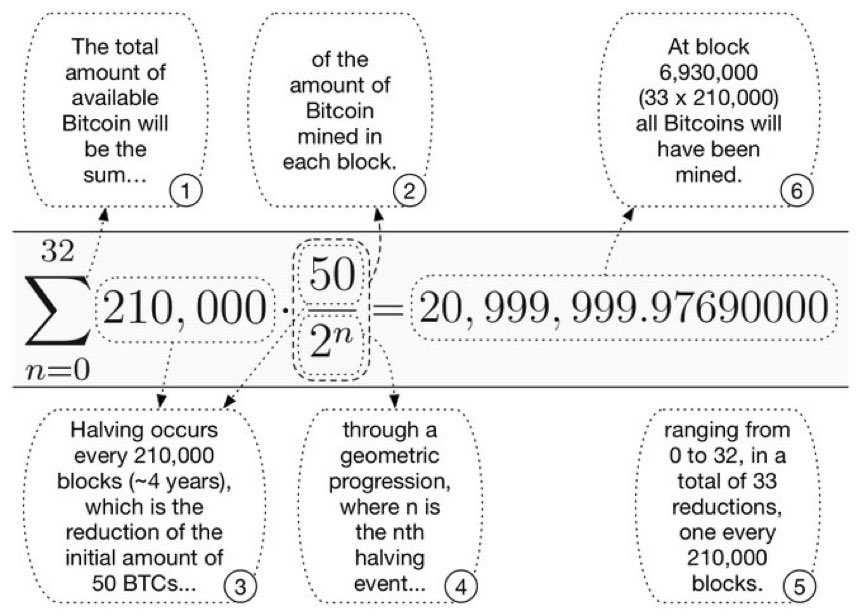
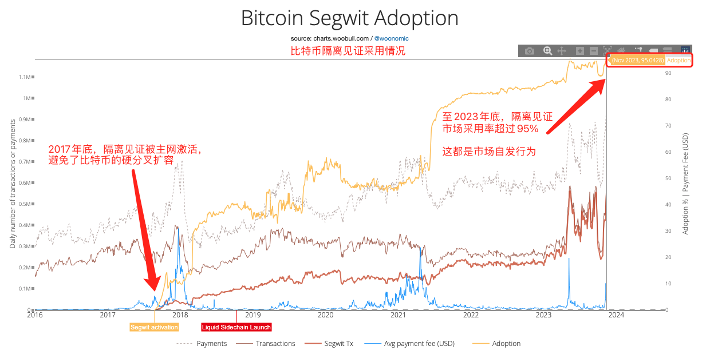

# V神的傲慢与偏见

* * *

隔夜BTC（比特币）小幅回升至5日线67.7k附近。前日[5.31教链内参“美核心通胀放缓，利好宽松周期落地”[链接]](http://rd.liujiaolian.com/i/20240531)提到，以太坊创始人Vitalik Buterin（V神）新发表了一篇长文，主题是关于他“对于比特币区块战争的一些反思”[1]。

他讲的话题，自然是众所周知的，2017-2018年爆发的有关比特币扩容的社区大战。那一次剧烈冲突，导致了社区的撕裂，一小群支持所谓“大区块”的人搞分裂，硬分叉出去了BCH（比特币现金）。人心涣散，牛市见顶。而后，到了2018年下半年，臭名昭著的、假冒中本聪的骗子“澳本聪”在BCH基础上再次硬分叉，搞出了所谓BSV（比特币中本聪愿景）。市场崩盘，进入了2018年底的“死亡之谷”。

不计其数的加密投资者被这股历史洪流所裹挟，被BCH甚至BSV的“宏大叙事”所迷惑，清仓BTC，把全副身家all-in（全部投入）到这些分叉币中去，为自己的认知和“理想”买单。如今，6年过去，是不是当年很多“背叛者”仓位的坟头草已经两丈高了呢？

扛BCH分裂主义大旗的吴忌寒已经失去了他的比特大陆。拿BSV招摇撞骗的澳本聪也被法院判定为骗子并全球追缴罚金。

意图扩充BTC编程能力被拒绝、愤而出走搞以太坊(ETH)的V神，至今仍在絮絮叨叨地述说着比特币的“失败”。

只剩下重仓它们、跑输BTC的韭菜们，风中凌乱。部分凌乱的韭菜，患上了斯德哥尔摩症候，转而为它们摇唇鼓舌，自欺欺人。

性格决定命运，认知决定财富。精英的性格改变了千百万生灵的命运，精英的认知影响了成千上万人的财富。

V神的傲慢与偏见，势必会拉着全世界信仰他的人为之买单。

买单者要供养的，有初期发币融资时的“预挖者”，有不断逢高出货的“基金会”，有质押在PoS中吃息食利的“大资本”，……

ETH从来就没有一个稳定的代币经济模型，更别提如BTC那样严格、简洁、优美的发行公式一般的“百年大计”。

因为Vitalik和他领导的以太坊基金会，事实上垄断了整个以太坊生态最重要的“武器” —— 硬分叉（hard fork）。

在教链看来，主导以太坊的硬分叉，正是Vitalik这篇帖子，顶着所谓客观中立反思以及略偏向于支持大区块的名义，所要捍卫的最重要的权力。

为此，他不惜强烈反对比特币核心开发者当年的审慎原则，甚至反对“软分叉比硬分叉更好”的技术价值观。

垄断以太坊硬分叉的权力，台面上冠冕堂皇的理由是持续改进技术，台面下的隐秘之举则是控制和任意更改ETH的发行规则 —— 你猜的没错，或许这也正是Vitalik和基金会从未正式明确过ETH的发行模型、未来似乎也不打算学习BTC采取固定不变模型的真正原因。

**「只要我能控制一个国家的货币发行，我不在乎谁制定法律。」—— 梅耶·罗斯柴尔德**

博学多才的Vitalik，在文章中大谈博弈论的囚徒困境模型，却闭口不提，在《博弈论》教科书中，明确无误地指出，确定性越高的货币发行政策，具有越好的经济效率。

比特币的全部技术都是为了捍卫其货币模型千年不变。以太坊搞了那么多酷炫的技术，只是为了捍卫对于硬分叉和货币发行主导权和控制权的垄断和独裁吗？

为了强调“技术改进”这个冠冕堂皇的理由，Vitalik在其文章中甚至直接写了一节“更少冲突、更多技术“（Less conflict, more technology）来抨击比特币“不思进取”。

他这样写道：政治分歧的最终消融靠的不是妥协，而是新技术。（The ultimate diffuser of political tension is not compromise, but rather new technology.）

他质疑比特币：比特币未来的一个关键问题是，比特币能否成为一个技术领先的生态系统。（One key question for Bitcoin going forward is, will Bitcoin be able to become a tech-forward ecosystem.）

他用技术至上主义去否决他所谓的“赛勒主义”（应该是为了嘲讽微策略创始人迈克·赛勒的比特币最大主义而创造的词汇）。他声称希望ETH获批美国ETF会导致赛勒主义的死亡，并促使人们认识到，比特币需要改进其技术。

教链读到这里不禁哑然失笑。一群多年装作鼓吹去中心化、抗审查的人，竟然拿美国监管机构SEC的批准来背书自己的正统性、合理性，以及攻击比特币社区的武器，真可谓是可笑至极了。

教链虽然也是一名技术人员，但是却从不迷信所谓的技术主义。

**「这就是所谓“唯武器论”，是战争问题中的机械论，是主观地和片面地看问题的意见。我们的意见与此相反，不但看到武器，而且看到人力。武器是战争的重要的因素，但不是决定的因素，决定的因素是人不是物。」—— 毛泽东，《论持久战》，1938年5月**

时隔6年，Vitalik又要为大区块翻案。他批评segwit（隔离见证）技术，虽然该技术使得软分叉扩容成为可能，从而平息了当年的争论，让争吵不休的人们迅速转向了支持软分叉的隔离见证扩容方案，抛弃硬分叉扩容方案。但Vitalik在文章中就是要认为，硬分叉扩容区块尺寸更简单、更好。

他甚至还搬出了比特币创始人中本聪当年的论坛发言，来佐证他的硬分叉扩容论。一个反对比特币的人，搬出比特币创始人的话来给自己的观点背书，略显滑稽。这和澳本聪宣称自己才是中本聪正宗思想，比特币核心开发者都是修正主义的调调，真是异曲同工。

可是在他的文章里，对目前隔离见证超过95%的采用率“装作”视而不见。

Vitalik还要一声长叹，慨叹当年大区块派在技术研发能力上“不争气”。他也间接承认了一个历史事实，即当年搞分裂主义、搞硬分叉大区块的那群人，技术不过硬，不断搞砸，丧尽人心。

但他就是要错误解读这一事实，进行错误的历史反思。他看到的不是无限大区块的客观不可行，而是将其失败归结于搞大区块的人技术能力不行。这就是大讲唯心主义，不讲历史唯物主义。

Vitalik甚至为此不惜运用“发明唬人黑话”的传统艺能，把背叛者的无能颠倒黑白，起了个酷炫的词组，叫做“单边胜任陷阱”（one-sided competence trap）。

好家伙，美国五星上将麦克阿瑟看到了都得直呼“好家伙”！原来搞分裂主义的大区块派的无能，全怪所谓支持小区块的比特币核心开发者那一边技术能力太强，太胜任比特币开发工作！于是这就成了“单边胜任”，而不是两边都胜任。Vitalik给定性了，这是非常不好滴，是“陷阱”！“陷阱”啊，同学们！

他说，因为这种胜任能力的一边倒差异，导致比特币陷入了“专制主义”。批评比特币陷入专制主义，是为了给以太坊的独裁洗白吗？

难道这不是因为技术能力强的优秀人才，更加理性客观，作出了正确的“站队”和历史“选择”么？Vitalik知道什么叫人心所向，民心所向吗？如果不是大区块派太拉垮，把投机和分裂主义写在脸上，为什么它无法吸引到超越原班比特币维护者的更优秀人才呢？

因为不得人心，吸引不到人才，所以不能胜任。非要讲成因为不能胜任，做不出好东西，所以失去人心。这不就是倒因为果，就是颠倒黑白吗？

深层次地讲，奉行群众创造历史的人，很容易认可前一种叙事逻辑（人民史观）。而奉行精英创造历史的人，则会凡事归于后一种叙事逻辑（精英史观）。Vitalik所巧言善辩的，正是后一种精英主义的叙事逻辑。

精英史观的叙事，是资本主义统治阶级的叙事。人民都是乌合之众，必须由精英来使用和养活他们。没有资本家，谁来给工人发工资啊？到底是工人拼命加班加点，赚取超额利润供养了资本家，还是资本家给工人发工资，养活了工人？

所以说，我们可以十分清楚地看到，Vitalik是深陷在当今这个时代的主流意识形态之中的，而中本聪是超越当今时代的。

以他们两位各自底色完全不同的思想所打造的以太坊和比特币，根本就不是同一个时代、同一个层次的产品。

为硬分叉扩容招魂的Vitalik，只有在谈及“矿工”是否应该主导硬分叉这个问题时，才会忙不迭地坚决否认和反对一个客观事实：矿工之间达成足够广泛的共识，即可实施硬分叉。

为什么？因为，Vitalik及以太坊基金会，正是通过各种手段，包括难度炸弹，包括宣扬所谓的“正统性”，来从技术上、思想上绑架矿工群体，把硬分叉的主导权牢牢掌握在基金会的手中。

一方面要鼓吹硬分叉就是好，一方面又要时刻警惕其他势力篡权，这就是封建“皇权”的扭曲心态。为了垄断硬分叉的主导权，进而控制货币发行，可谓是无所不用其极，就像封建皇帝，生杀大权在握，却时刻不能安眠。

Vitalik可能是个思想纯洁、没有权欲的好同志。但是，当以太坊一起步就预挖代币发币融资，当以太坊PoS存币生息，他和以太坊的领导者们，就已经把资本主义的幽灵引入到以太坊里面来了。这个幽灵一旦进入，就会寄生到每个人的脑袋、血液和骨髓里，再也无法除去。

而Vitalik的一切言论，表面上说的是自己想说的话，实际上不过是为这个幽灵代言；表面上说的是技术，实际上捍卫的都是这个幽灵的根本利益；表面上是在为比特币大区块派招魂喊冤，实际上只是在为以太坊幽灵通过主导硬分叉进而垄断货币控制权这一终极统治权力澄清、辩解和洗白罢了。

不过，我们还是应该相信，人民群众的眼睛是雪亮的。历史也终将给出它公正的审判。

[1] https://vitalik.eth.limo/general/2024/05/31/blocksize.html
