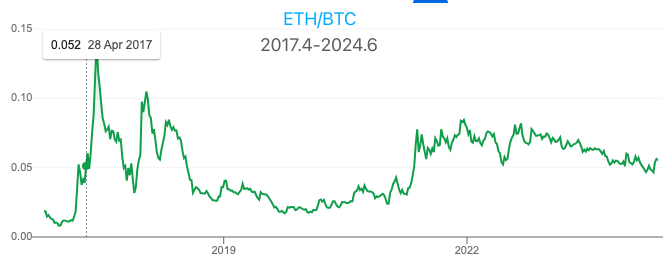
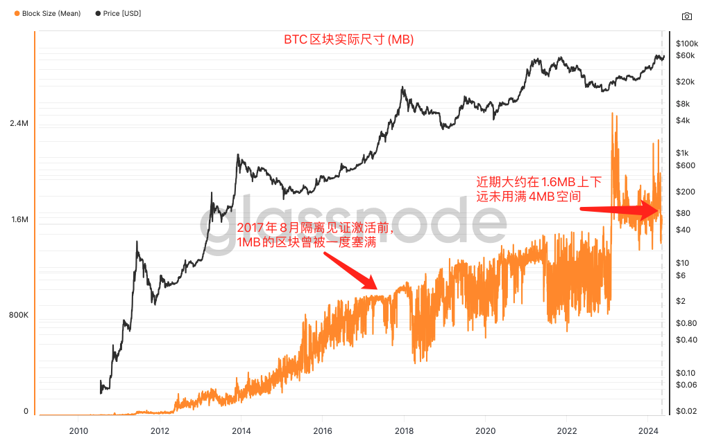
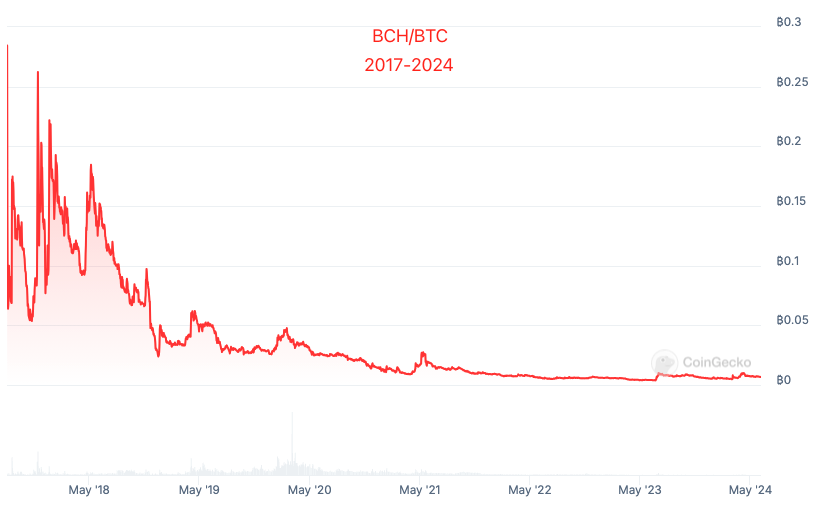
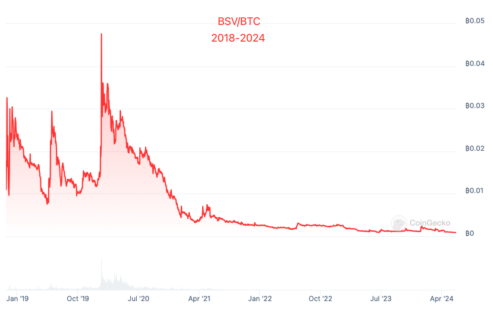
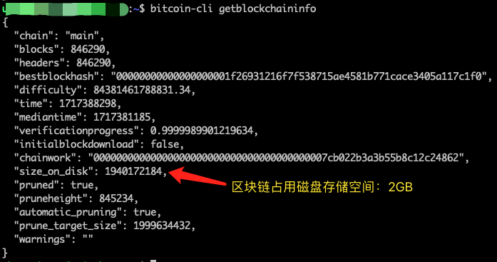

# 大小区块之争永不止息

号外：[6.2教链内参：降息的囚徒困境](http://rd.liujiaolian.com/i/20240602)

* * *

隔夜BTC（比特币）继续在30日线上方修复，带动5日线掉头向上，向69k逼近。此前教链内参已经多次指出，6月份美联储就要正式开始减缓缩表了，在不降息的烟雾弹掩护之下，进行宽松试探。毕竟，正如昨晚6.2内参：降息的囚徒困境[链接]所说的，如果美联储下半年还是咬牙不降息、不宽松，其他经济体却顶着强美元逆势宽松，率先降息放水，这些非美元资本一窝蜂地冲向全世界去抄底优质资产，那么等美联储宽松姗姗来迟，美元资本再冲出去就只能赶个晚集，痛心接盘了。当然，这逆势宽松不是你想干就能干得成的，最重要的是得顶住对美元汇率不大幅贬值。实力，包括军事实力，决定了顶得住还是顶不住。

有人的地方就有利益。有利益的地方就有利益的冲突和对抗。有利益冲突对抗就会有各种形式的战争。在确保相互毁灭的核威慑之下，核大国间直接热战的可能性非常低。但是战争，会在其他维度、以各种各样的形式体现出来。其激烈、残酷之程度，不亚于热战。

昨日教链文章《V神的傲慢与偏见》，解剖了以太坊创始人Vitalik Buterin最近写的一篇小作文。小作文的主旨思想，乃是借反思比特币6年前大小区块之争的成败得失之名，为当年的大区块派招魂喊冤，否决比特币核心开发者所坚持的“尽量不要硬分叉”以及部分比特币人的“比特币最大主义”的理念，实则是为了捍卫以太坊基金会对于主导以太坊硬分叉，以及随意变更（“优化”、“改进”）以太坊货币经济模型的权力垄断。

在国际政治中，我们知道，当一个资本主义国家的内部矛盾激化到无法化解时，其统治阶级就会向外寻求冲突甚至战争，制造假想敌，以此转移人民的视线，借此凝聚人心，稳固自身的统治地位。这就是资本主义国家的帝国主义阶段。

而当ETH/BTC的汇率（比价）7年过去依旧徘徊在0.05的水平，迟迟无法突破新高时，在2017和2021两轮牛市高位入场的ETH投资者眼巴巴看着自己的仓位相对于持有BTC“跑输”和“缩水”的时候，已经抛弃PoW、经由PoS升级而彻底完成金融资本主义化改造的以太坊，就被一种内部的张力推动着向外发起“战争”。这就是以太坊的帝国主义阶段。

对于帝国主义阶段的以太坊而言，最佳的“敌人”，显然，正是比特币。一切都是历史的必然性，而不是任何个体好恶的一时兴起。这就是教链在前文结尾所阐释的，Vitalik的小作文，看似吐露的是他作为个人的观念和心声，但透过现象看本质，实则是历史赋予他吹响战争号角的不二使命。

帝国主义要做的事有两件：一、对外收割；二、对内收买。其中，对外成功收割是对内有效收买人心的重要条件。对外打不赢、割不到，内部就要掀起反对声浪，此起彼伏，甚至分崩离析。

抨击BTC，就是要对BTC开战，就是要收割BTC持有者，让你们抛弃BTC、转投ETH，让资本流向ETH，去接盘，去推高。把ETH/BTC推到历史新高，把ETH跑赢BTC变成铁的事实，也就为ETH生态内部注入了“ETH最牛逼”的思想钢印。

一旦接受了“ETH最牛逼”的思想钢印，那么推而广之，人们就很容易相信，ETH灵活多变的货币政策比BTC的固定不变更好，ETH的频繁硬分叉比BTC不要硬分叉更好，ETH技术进步主义比BTC技术为货币服务的保守主义更好，ETH由一个大权在握的基金会领导比BTC的群龙无首更好，ETH有活跃的Vitalik Buterin写小作文比BTC的创始人中本聪永远沉默更好，…… 

甚至于延伸到具体技术和设计层面，ETH的PoS比BTC的PoW更好，ETH的生息比BTC的无息更好，ETH的燃烧比BTC的不燃烧更好，……

以及更进一步的，ETH高达数TB的节点数据量比BTC仅几百MB的节点数据量更好，ETH灵活扩容的大区块比BTC死板保守的小区块更好，ETH更中心化比BTC更不中心化更符合“去中心化”，……

你接受的，决不会只是一个简单的“ETH跑赢BTC”的事实，而是以上一系列或正确、或荒谬的命题。这一系列命题打包成一套价值观体系，侵入到你的思想中，彻底重塑你的加密“三观”。

BTC的大小区块问题就像是一个“G点”，一触碰就高潮迭起。可是急着为大区块招魂的人似乎忘记了，以下三个历史的和目前的客观现实：

一、即使是目前隔离见证扩容出来的4MB区块，平常也用不完。既然4MB都用不完，提出继续扩大意义何在？是真心为BTC好，还是别有用心？

从上图中可见，近期区块空间使用也就在1.6MB上下，还不到4MB的一半。

二、BCH和BSV两个硬分叉就是对大区块理念的直接验证。市场用脚投票的结果是，大区块事实上就是失败了。BCH和BSV远远跑输BTC。理论辩经永远没有胜利。当理论与事实不符时，是理论错了，还是事实错了？

BCH/BTC:

BSV/BTC:

三、请你亲自花钱购买一台云主机，运行一个比特币全节点，实际体验一下节点的磁盘空间占用、带宽消耗以及账本数据同步所花费的时间。扪心自问，你会希望这些数据尺寸再膨胀10倍吗？如果膨胀10倍，你要多花多少主机费用，浪费多少时间来同步账本呢？你浪费的金钱和时间，只是为了同步和存储某些人塞到链上的一些乱七八糟的小图片？

教链亲自实操了一下。花几百块钱买一台低配云主机，仅几十GB的磁盘存储空间，2GB的内存，几MB的共享带宽。用的是能过滤掉铭文、符文等“垃圾数据”的Bitcoin Knots v26.1.0客户端。打开裁剪功能，实测花费11天完成了对600多GB比特币全账本数据的同步。同步后实际占用磁盘空间14GB，其中区块数据2GB，链状态数据（即UTXO等数据）12GB。

比特币账本数据共有，不是一句凭空的漂亮话，而是建立在人人都能以极低成本获得和存储这套账本数据的基础上的。比特币自由民主的根本，也不是易于操弄的所谓“民主投票”。只有大多数人都能自由地拥有自己的节点，才能在每一次诸如是否过滤某些“垃圾数据”的实际操作中，实现广泛的、真正的民主。投票民主的本质，是多数人对少数人的暴政。比特币的自由民主，是“我的节点我作主”，任何人都无权强迫我在自己的硬盘上存储不喜欢、不想存的数据。

实践是检验真理的唯一标准。任何对这一标准的有意无意的无视和诡辩，都违背了实事求是的思想，从而沦为忽悠和欺骗。
