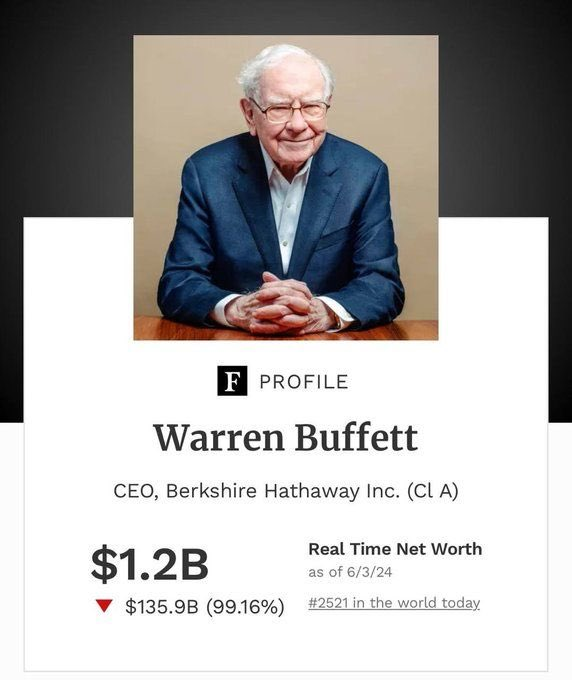
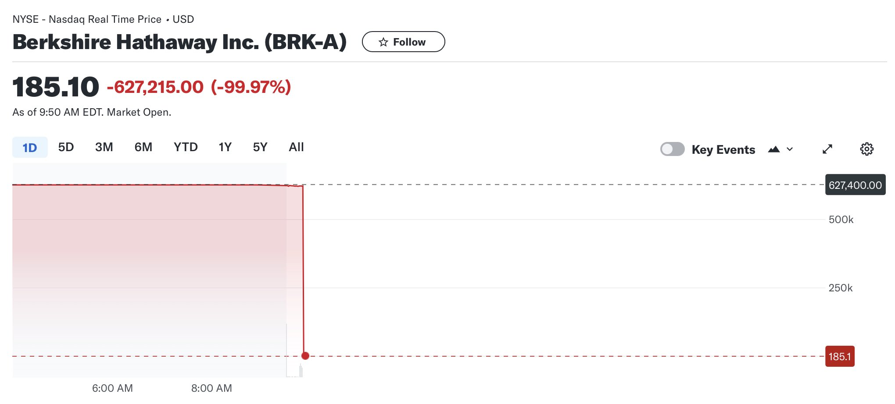
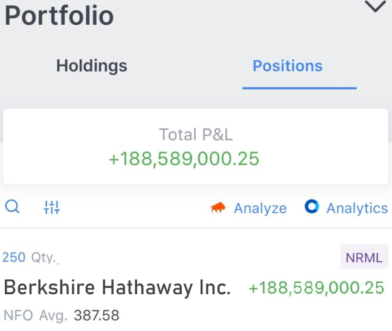
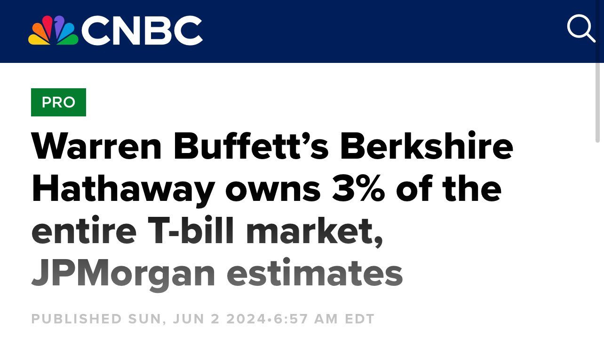
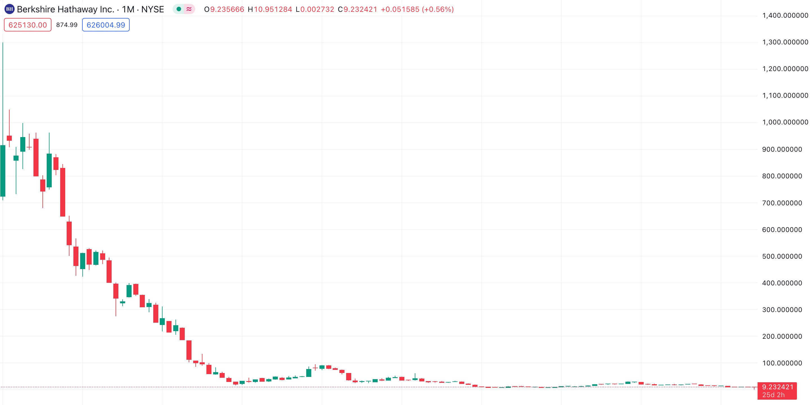

# 伯克希尔意外暴跌99%

号外：[6.3内参：加密行业庆祝ETF令人深感不安](http://rd.liujiaolian.com/i/20240603)

* * *

隔夜BTC（比特币）回升至69k一线。一直看不起BTC、蔑称之“老鼠药”的投资大师、“股神”巴菲特个人身家一夜缩水99%，因为他是自家牛股伯克希尔的最大持有者，持仓38%，而伯克希尔隔夜暴跌99%。

不过，贫穷的确限制想象力：普通韭菜崩盘，手里的仨瓜俩枣可能就要归零了；而巴菲特崩盘，却仍然是亿万富翁。缩水99%之后其个人财富居然还高达12亿美刀！惊不惊喜，意不意外？这也让众网友见识了，韭菜到股神的距离，比地狱到天堂的距离还要远。

话说这伯克希尔·哈撒韦的A类流通股，为啥突然暴跌了99%呢？难道是好像去年教链《暴跌99%》(2023.3.29)一文所介绍的，因美联储缩表加息而崩溃破产的签名银行、硅谷银行一般的遭遇吗？

并不是。

纽交所（NYSE）很快发表声明，迅速把锅甩给了CTA（整合行情协会）。CTA赶紧解释，是软件问题。这一问题影响了约有40家股票。

CNBC报道了它们各自的阐述。大致是这样的：

「纽约证券交易所称，问题源于整合行情协会（Consolidated Tape Association）发布的报价带，该协会是各大交易所共同提供实时股票报价的组织。纽约证券交易所在美东时间上午 11:45 左右表示，问题已经解决，交易恢复正常。

「CTA 表示，在美东时间上午 9:30 至 10:27 期间，限涨限跌价格带出现了问题，这是一种旨在消除市场波动的机制。CTA 表示，问题可能是由新发布的软件造成的，该组织将在周二的交易时段恢复使用其主数据中心以前的软件程序。」

但是，为什么同样是新软件，纽交所那么多股票，就偏偏是这40家出问题呢？这就没看到更深入、详细的解释了。

估计CTA也不知道。因为它们给出的解决方案是：先回滚到旧版本软件，容后再慢慢研究具体故障究竟出在什么地方。

这一夜，几家欢喜几家愁。有人仓位陷入巨额亏损，被券商追缴保证金。有人眼疾手快，成功“逢跌加仓”（buy the dip），一夜暴富。

不过，估计纽交所稍后可能会把故障期间的交易数据全部视为“错误”数据，然后通通回滚，予以撤销。

手快小哥将会体验一把什么叫作“最残忍的不是奋斗一生却仍遥不可及，而是先把暴富放到你手中然后却又无情剥夺”。

不过，我们从这个意外事件，是不是也可以管窥一下“高处不胜寒”的美股市场的成色呢？为什么失去了“数据操纵”——限制涨跌、消除波动的实质就是人为数据操纵——的保护，区区3、4000手交易（该股是1股1手）就把如此大体量的伯克希尔的市场深度直接给击穿、击溃了呢？

做市商的资金是不是根本没有真正的放在市场的深度里，而是挪用、抽走，拿去别的地方追逐收益去了呢？我们看到的美股流动性和深度数据，是不是都是这种虚假的、操纵出来的“假数据”呢？

在uniswap里做过LP（流动性提供者）的朋友都知道，如果要做市，就要把资金锁到交易合约里，来给交易者提供流动性。客观上，我把100万美刀放进去做市，就不能把这100万美刀再拿去买美债吃高息收益了。所以，做市对于做市商而言，是有资金的机会成本的。

人性上，我肯定会希望这100万美刀，既能一边做市赚手续费，又能存美债吃高息。那么我会怎么办呢？对于链上交易系统uniswap，透明公开，我没有办法作弊。但是如果是中心化平台如纽交所呢？如果纽交所们通过CTA人为控制数据波动性，把涨跌幅度修正到一个很窄的价格区间之内呢？

比如，伯克希尔市场价63万美刀一股，日常波动性不超过3%（假设），即61万刀-65万刀的波动区间。做市商正常情况需要在每个交易价格上挂单，来提供深度。显然，61万刀以下的买单，65万刀以上的卖单，这些挂单几乎不会被使用，却白白占用了宝贵的资金！

聪明的人一定想到了，如果我们通过人为操纵数据，不允许超出波动区间的数据出现，以某种方式平滑处理掉，从而100%向做市商保证，价格不会超出61-65万刀区间。那么试问做市商会怎么做？当然是把61万刀以下、65万刀以上的做市资金全部抽出，拿去干更“有用”、更赚钱的事情啦！

其实这也正是uniswap V3的“区间做市商”算法的基本原理。

于是我们可以很容易推理出，对于资本效率的极致追求，会导致他们合谋来操纵数据，压缩在一个尽可能窄的波动区间之内。这样就可以释放和抽离最多的资本金，以实现资本收益的最大化。

在链上交易系统uniswap V3里，所有的区间流动性都是公开透明的。而在中心化交易系统里，完全可以虚构出没有真实资金支撑的流动性，因为人们会觉得这些流动性永远不会被“使用到”嘛，而且对数据的操纵也使其对此充满信心。当然，我们没有调查和审计这些黑箱系统内部资金的权力，这些推理只是出于对人性和利益的猜测。

于是，不出意外地，意外发生了。

因为新版本软件的程序员可能是不太了解这个精巧的“操纵”，写入了一段过于“诚实”的报价代码。软件上线后，仅仅3、4000手交易，就让价格波动超出了控制区间。

在控制区间之外，出现了几乎就像是外太空的真空一样的资金真空！

虚构的做市单、虚假的流动性根本就无力与真实的卖单成交。

托不住，根本托不住！

价格扶摇直下，“疑似银河落九天”，从摩天大楼顶部自由落体，结结实实地摔到了马路上，中间没有遇到任何阻力。

幸运的是，只有大约40支控制区间过窄的股票，因限制区间被击穿而坠落。其他大部分股票，则因为没有超出限制区间而表面上安然无恙。

反思：为什么华尔街机构比你小散户赚钱多？你的100万美刀本金只能当100万美刀本金使用，而它们的100万美刀本金，却可以通过这样的操弄和挪用，反复用上10次。（10是虚数，仅供示意）那就相当于是1000万美刀本金了。

就算你们都能拿到市场平均收益率10%。你100万美刀赚了10万美刀，ROI（投资回报率）10%。华尔街机构用100万美刀却可以赚到100万 x 10 x 10% = 100万美刀，ROI 100%！

为什么要玩区块链？因为区块链是透明游戏，至少你可以选择只玩其中的透明游戏。在这些游戏中，不会有人能够通过数据操纵来获得不公平的非对称优势。

在所有的金融游戏中，最顶格、最终极的游戏就是印钱游戏。而当今全球，美元印刷游戏的庄家就是美联储。而伯克希尔就是这个不透明游戏的大玩家。

摩根大通估计，巴菲特的伯克希尔·哈撒韦持有全部美债T-bill总量的3%！可称之为深度绑定，一荣俱荣，一损俱损了。

小散户、小玩家，在美股市场上被华尔街碾压，在更为高深莫测的美元游戏中，岂有不被巴菲特这种大玩家碾压之理？

不公平日久，物极必反。天降猛人中本聪，以一己之力，未曾向任何资本大玩家进行任何融资，独立发明和制造出了零资本寄生的比特币。

比特一出天下反。原本颠倒的，被反转过来。原本隐秘的，被显现出来。原本虚假的，被揭露出来。

巴菲特的伯克希尔·哈撒韦，的确“暴跌”了99% —— 以BTC计价。自2015年至今，从每股约900 BTC跌至每股9 BTC。而且，还将继续跌落下去，永无止境……

老鼠被老鼠药药死了。
