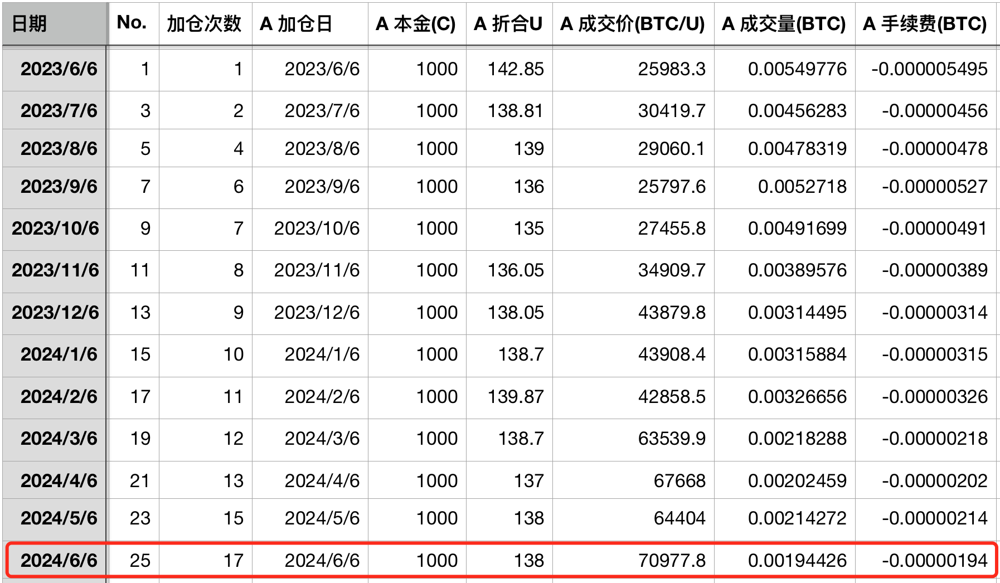
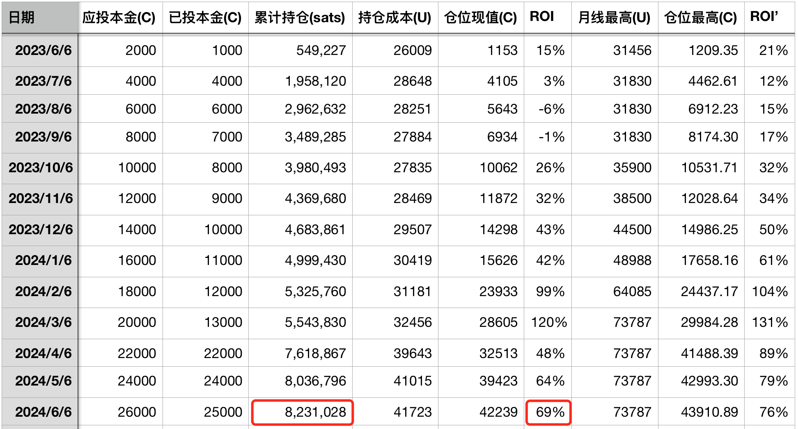
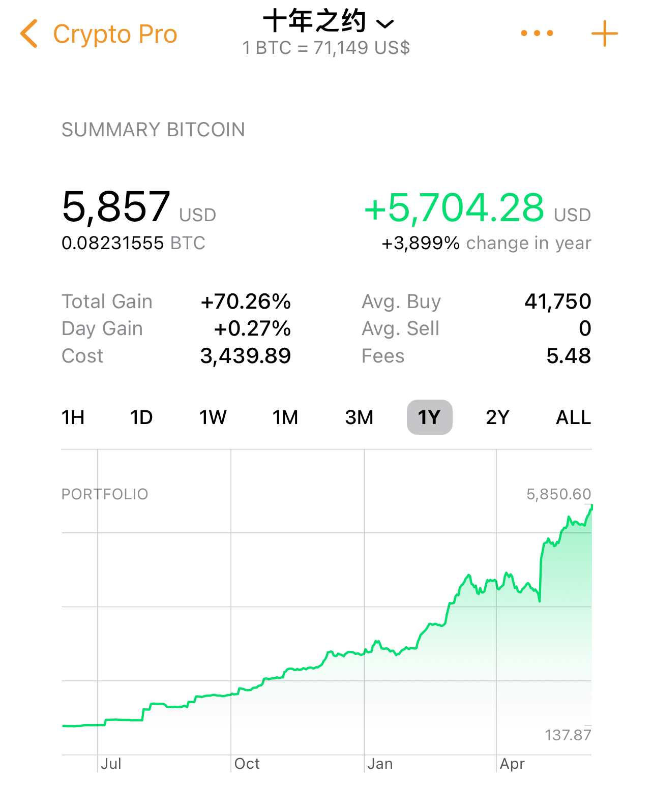

# 7万刀，新的起点。 —— 十年之约＃25（投后ROI 69%）

号外：[6.5内参：银河数字CEO称BTC年底有望10万刀](http://rd.liujiaolian.com/i/20240605)

* * *

隔夜BTC（比特币）冲上71k，距离3月中旬突破2021前高后靠惯性站上的新高73.8k还有区区不到3000刀。有不太懂BTC的读者会会把73.8k的新高叫做“前高”，这是错误的。BTC不同于股市，在这里有一个默认的参照系——中本聪周期。也就是大约4年一次的产量减半周期。只有2021年底的69k会被称之为“前高”，而2024年3月中旬的那个局部新高则不被这样称呼。

今天是2024年6月6日。五天前的6月1日，教链报告了“十年之约”首年度的收官情况，具体写在了6.1文章《十年之约＃24：首战告捷，成功提币！第一年收益率64%》里，没看到的读者可以点开重温一下。

去年6月6日，教链决定开启这个“十年之约”实盘实证计划。千言万语，有时候不如真刀真枪更有说服力。这就是“批判的武器不能代替武器的批判”的道理。教链的文章，就是“批判的武器”。教链的仓位，就是“武器的批判”。

如今，又是一年6月6。BTC历经风雨，再次站上7万刀。“十年之约”也开启了新一年度征程的起点。今天，如约加仓194,426聪，持仓增长到823万聪，投后ROI 69%（详见下表）。这是该计划第17次加仓，第25次报告。

有些朋友喜欢看图说话。教链找了个能画图线的软件，大致画了一下（如下图）。绿色曲线呈现的，就是“十年之约”仓位价值的增长图。不要在意那点儿误差，但是这就是第三方软件的问题，所以教链坚持使用最最朴素的电子表格来手工记账。

有些朋友比较粗放，直接就把仓位放在交易平台上，然后看平台的报数。这不是严肃的投资行为。平台通常少则几个月、多则半年一年就把历史记录删掉了，无法回溯，更无法准确追踪提币后的情况。

要想投资成功，先从记好每一笔账这个基本功开始做起吧。记账这项枯燥乏味的工作，就像少林寺和尚每天挑水扫地，或者解放军士兵每天把被褥叠成整整齐齐的“豆腐块”，看似不起眼的小事，却是练就绝世武功、取得卓越战绩的根本所在。

也还是常有读者问，看这数据一年也就攒了0.08个大饼，而且未来价格水涨船高，十年下来估计都攒不到一个大饼呀。这样的思维就叫做“绝对量值思维”。一开口就暴露了，还是站在投资门外的纯纯小白。小白这个词儿不是贬义或者批评，只是客观描述所处的一种状态。什么时候抛弃了绝对量值思维，建立了“相对比例思维”，或者说叫做“百分比思维”，什么时候才算是把一只脚迈进了投资的大门。

什么是“相对比例思维”？就是说，对于“十年之约”这个实盘模型，你把其中的数值等比例放缩，比如放大10倍，或者缩小成1/10，这个模型的结果都是不变的。第17次加仓的投后ROI该是69%还是69%。上面图中绿色曲线的增长形态也不会有丝毫变化。钱多，就放大几倍。钱少，就缩小一些。收益率、增长曲线统统保持不变。当然，你不能放大太多，比如一次加仓你要买1亿枚BTC，那不行。

你的思维是什么样子，你眼中看到的世界就会变成什么样子。所以，建立正确的思维，用正确的眼光看世界，很重要。至于教链当初为何选择这个数值？据说目前咱国家还有6亿人月收入不到1000元。BTC应该也可以成为穷人的理财工具，甚至成为穷人对抗收割的“护身符”。“十年之约”要站在最广泛的的普通人一边，站在“韭菜”一边。教链此前也反复论证过，BTC掌握在越少的富人手里，它的价值就越低；BTC掌握在越多的穷人手里，它的价值就越高。去中心化的价值必然要通过最广泛的分散持有来实现。

还有一个普遍的问题是，既然未来十年看涨，那么为什么不在最开始趁着价格尚低，一次性“梭哈”、全仓买入，然后长期持有呢？这个问题的答案其实十分简单：因为对于绝大多数人来说，工资是按月领的，生意的钱也是一点点挣的。所以，积跬步，致千里。一夜暴富固然爽快，但是最适合绝大多数普通人的，还是与岁月同行，慢慢变富。
