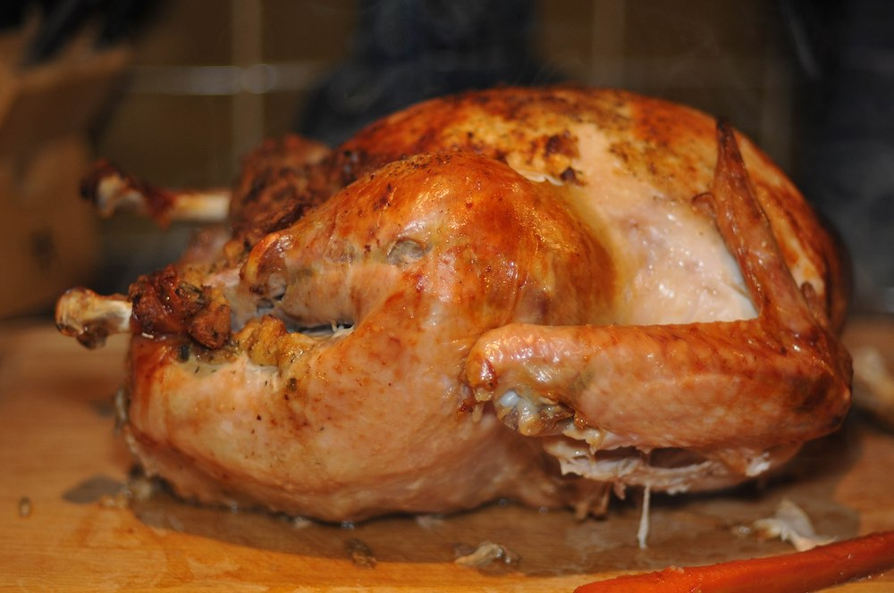
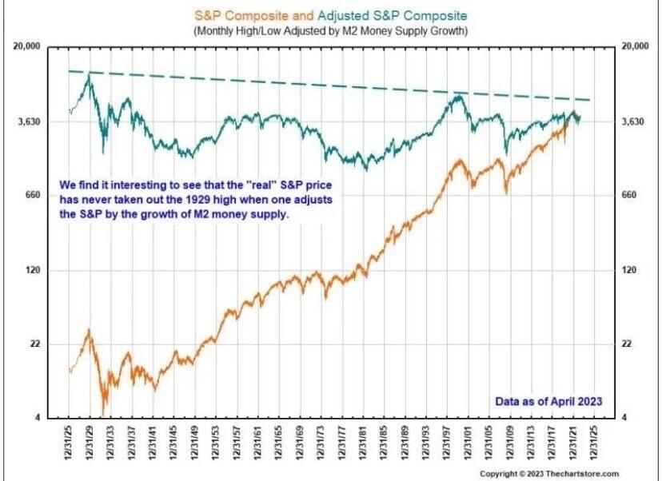

# 货币洪水时代的诺亚方舟

号外：[6.6内参：资管公司上调ETH目标价至2.2万美刀](http://rd.liujiaolian.com/i/20240606)

* * *

隔夜BTC（比特币）小幅撤下71k，回守7万刀上方一线。最近各机构、KOL热衷于“猜测”BTC什么时候能到10万刀，昨[6.6内参[链接]](http://rd.liujiaolian.com/i/20240606)以及前[6.5内参[链接]](http://rd.liujiaolian.com/i/20240605)等最近几期内参都给出了追踪介绍，有兴趣的朋友可以翻阅一下。

虽然绝大部分刚刚涉足BTC的人，甚至是很多持有许久的人，还是把BTC当作是一种“投资”。教链的体会是，要把BTC当作一种独特的“投资品种”来看待，完成思维的转变，把囤积BTC看作是“储蓄”而不是“投资”。教链在几年前写过一篇文章《理财、投资和储蓄》(2021.11.3)，辨析过这三个概念。

如果我们按照占有财富的量对社会简单分层，分成穷人、中产和富人三个层级，那么，现代社会金钱（资本）游戏的规则本质上是为富人服务的：

对于穷人，企业开出的工资是量入为出的。这个工资水平把穷人控制在耗尽全部精力和时间、挣的还是不够花销的程度。如此穷人打工一辈子也攒不下翻身所需的资本金。同时，市场的总工资支出一定是小于100%就业率情况下的总工资需求的。这样就能永远保证一定的失业率，给就业造成竞争压力，一石二鸟：一，劳动力自由竞争，压制市场工资水平；二，制造失业恐惧，驱使打工人为了不丢工作而拼命干活。

对于中产，一方面用失业和阶层滑落给他们制造恐惧，二方面利用他们对奢侈品和富人生活方式的向往鼓励消费升级、掏空他们的钱包，三方面对于那些勤俭节约、努力积累资本金，试图实现翻身做主、财务自由、阶层跃升的，要格外防范，因为他们这些拒绝堕落者最容易挑战富人的既有地位。对付这种潜在威胁的最好办法，就是利用他们进步的“欲望”，有针对性地开发出各种投资产品，然后派出金融销售人员，忽悠他们把家底子都投资进去。然后，制造和利用金融周期，在适当时候果断收割，让他们倾家荡产，阶层滑落，打入十八层地狱，并把全部责任都推卸给大环境不好的“不可抗力”。

对于富人，最重要的任务是保护住自己的财富地位，也就是时刻提防穷人和中产。可以利用他们向上爬的欲望来鼓励他们为自己拼命，也可以适当给予少量机会让少数几个爬上来，作为典型成功案例，以达到安抚和鼓舞的双重效果。但是绝不可能任由大量底层爬上来，因为所谓的穷富，本质上就是相对的，就是“人上人”的概念。如果人人都有100亿，百亿富翁就变成“穷人”了。只有99.99%的人都穷得叮当响，才能显得出你这个百亿富翁是“人上人”，是个富人嘛！

从逻辑上讲，富人阶层是必然反对共同富裕的，因为共同富裕，对他们这个阶层而言其实是共同贫穷。

富人要保住财富，保住人上人的地位，最重要的是确保自己对财富的所有权和控制权，不被剥夺。无形财富也许还可以通过隐匿做到，但是大量的实体财富，确保权力却不是一件容易的事。这就使得富人阶层只要够富，财富体量只要够大，就必然要谋求染指甚至掌握最强暴力机器——国家。

一个把穷人、中产都涵盖进来的共和政体，对富人阶层而言肯定是不太爽的。他们的最佳选择是润到一个只由富人共和的国家去。但是现代国家又多数都是民族国家，你一个富人，跑到别的民族的国家去，当一个扎眼而有钱的外族人，在别人眼里恐怕是和一只肥的流油的感恩节火鸡并无二致吧？

西方的感恩节其实是一个很有趣的节日。历史上从来都靠自己勤劳奋斗、逆天改命的中华民族，没有感恩节。在感恩节，西方人宰杀火鸡，然后对上帝祈祷，Oh，感谢上帝赐予我们又大又肥的火鸡，让我们全家吃饱！感恩节不感谢火鸡，感谢上帝。杀火鸡有没有负罪感、愧疚感？没有。原罪文化其实是脱罪文化，再大的罪过，只要上帝原谅即可免罪。杀火鸡是上帝同意的，感谢上帝就好了。

连宰杀火鸡都不仅不会有任何愧疚感，甚至还能搞个节日来每年庆祝，那就更何况，创新开发出各种投资理财，用金融工具收割略有积蓄、心有不甘的中产和小资，一定是觉得天经地义，凭本事收割，没有丝毫不公平之处了。

但是仅仅是造好了口袋，仅靠守株待兔，那是等不到几只兔子的。必须放洪水，把兔子驱赶到陷阱这里来。

这凶猛的洪水，就是系统性地货币超发。

可怜的兔子，瞬间发现自己陷入了两难的境地：呆在原地不跑吧，眼看就要被洪水淹死（兜里的钱要贬值）；跑吧，前面处处是陷阱，总有一款适合你（进入投资理财被吃干抹净）。

不跑是个死，乱跑也是个死。这群中产兔子，也就只能纷纷成为富人烧烤架上的美味了。

兔子拼命飞奔，一跑就跑过了一个世纪，却惊讶地发现，费尽心机躲避陷阱，一刻不敢停歇，洪水却始终如影随形，根本就无法摆脱。

从1929年至今，美股标普指数走出百年长牛（下图橙色图线）。但是，如果把它用美元M2的发行量调整，你就会发现，1929年仍是美股的历史高点，至今从未突破（下图青色图线）。

投资，积极进取，其实不过是原地踏步。

存钱，被动缩水，就变成了逆水行舟，不进则退。

不是每个人都是金融专家、投资专家，于是越积极投资，踩中陷阱、上当受骗的概率也就越大。甚至不是人人都能成为专家，所以花钱学理财、学投资的绝大部分人，不是成了专家，而是又当了一次韭菜，被割了二茬。

你难道就没有想过，为什么要拼命学习自己不熟悉的金融知识，为什么要做自己不擅长的投资，为什么要上当受骗被反复收割？

不就是因为你没有一个可以安安稳稳拿着不动就能安心工作、安心生活、安心躺着睡大觉而不用担心被货币洪水淹死的储蓄工具么？

抵御洪水，抵御超发，抵御通胀。没有门槛，来去自由，代代相传。这样的储蓄，才是真正的储蓄。

这样的储蓄工具，必然是一种安全资产。

现在，你懂得“不要投资、要储蓄”的道理了。闭上眼睛，自己独立思考一下，什么东西符合上面说的这些，会成为货币洪水时代的诺亚方舟？

比特币。
