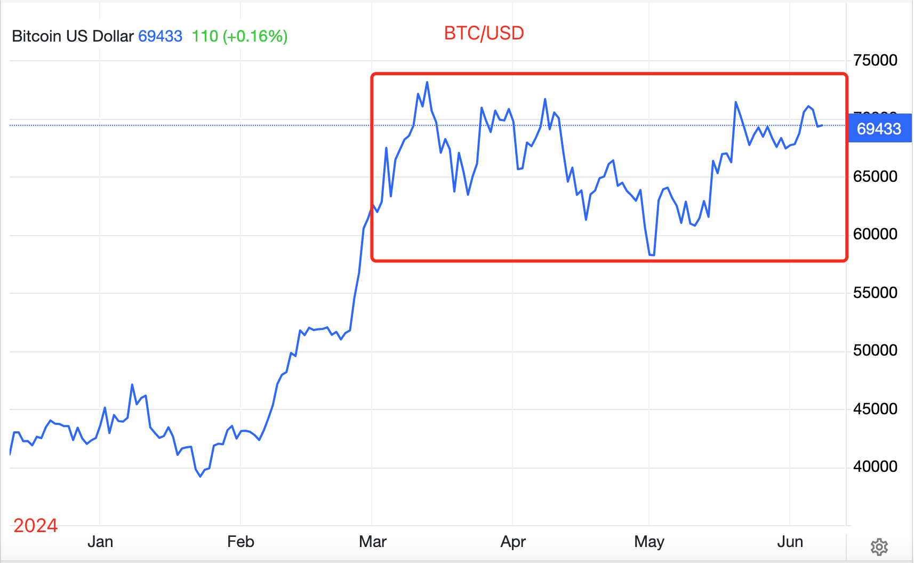
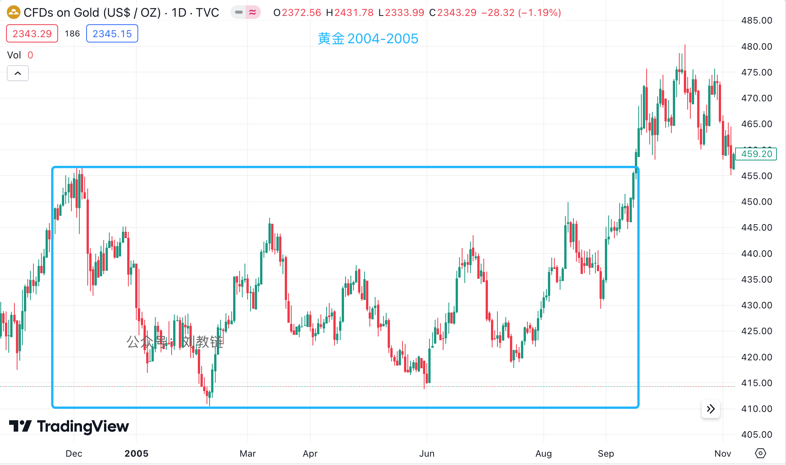
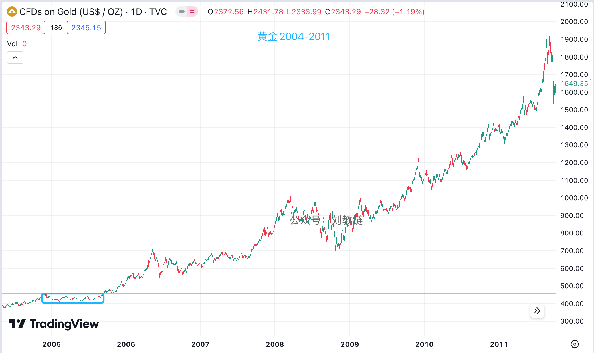

# 大分歧：2024年底，向上还是向下？

号外：[6.7内参：周五，一声惊雷！](http://rd.liujiaolian.com/i/20240607)

* * *

[“周五，一声惊雷！”[链接]](http://rd.liujiaolian.com/i/20240607) 隔夜美劳工统计局同时发布了大超预期的非农就业，以及略超预期的失业率数据。令人错愕，四座皆惊。详细拆解，没看过的朋友可以点击链接，打开6.7教链内参[链接]，一览究竟。BTC（比特币）面对此数据带来的预期冲击，先短时大幅波动，而后开始跳水，现已跌回7万刀下方，近69k一线。

华尔街机构纷纷配合数据表现，乖乖地把降息预期推迟到了今年年底11月份。教链看着自3月以来横盘至今的BTC，不禁陷入沉思。

看图中教链画的红框。横盘整理通道。从3月份直达11月份？几个月？8个月。惊人的巧合？不知道你想起来什么没？

回顾一下教链1.9文章《比特币大伏大起》和4.14文章《炮弹击沉仓位》。你会看到同样是8个月左右的箱体。就是下面这幅图：

这幅图，是当年黄金ETF获批上市之后，经历的一段横盘整理时期。箱体长度也是8个多月。

但是我们都知道，当最终箱体向上突破，黄金开启了一段波澜壮阔的5年大牛市。

不过，昨 6.7教链内参[链接] 还提到，Bitfinex分析师团队称，BTC本轮牛市在年底就要坚定转熊、草草收场了。

于是这里就产生了一个巨大的分歧：2024年底，当美联储调转船头，逆向行驶时，BTC的2025，究竟是一飞冲天，开启狂牛，还是堕入地狱，进入漫漫熊途？

Bitfinex的观点，教链感觉，逻辑有些不够通顺。这在内参文中已经做了解剖，不再赘述。

2025牛市、2026熊市，则是 幂律的标准模型[链接]，也是4年减半周期的驱动节奏。不过，每一轮周期，都有人会批评这过于刻舟求剑。

实际上，这也是事关本次不同寻常的产量减半周期的一大迷思，即 2024减半之辩：涨幅消退，还是超级周期？[链接]

毕竟，2024年4月份BTC的这一轮“黄金减半”[链接]，让BTC的“资产硬度”大幅超越了黄金，成为地球上已知硬度最高的资产。

3月份的7万刀，是年初美现货ETF获批上市给送上去的。4月份的产量减半所带来的供应紧缩效应，或许还没有得到体现。

过往每次减半，都会在1年半左右的时间把牛市送上快乐的巅峰。然后精准地用一年左右的时间“去杠杆”，彻底洗盘。

精确地像一个时钟。滴滴答答。

每一次，都有人试图证明，BTC的4年周期不过是宏观外因的巧合，而不是减半内因的效应。但是每一次，所有试图扰乱BTC内生时钟和周期节奏的尝试都失败了。

2020年底-2021年初的狂牛，碾过空头爆仓数不清的尸体。2021年初三箭资本的永恒牛市，如今已无人记起。2022年夏初，教链认为BTC可以顶着美联储的缩表复苏走牛，但直到2023年才开始应验，市场早已物是人非。

BTC一直在倔犟地在减半前1.5年见底，减半后1.5年见顶，3年上行、1年下行，4年周期。这一次，它时钟一样精确的节奏，会被打破吗？
