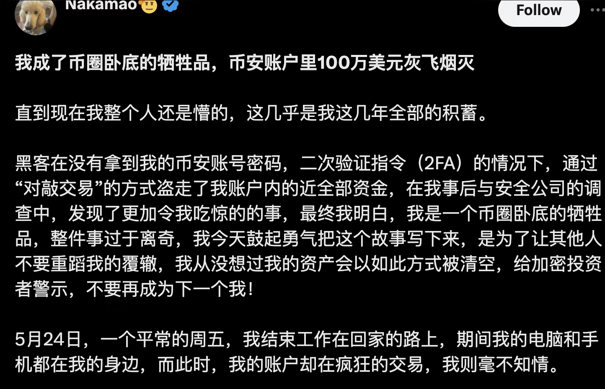
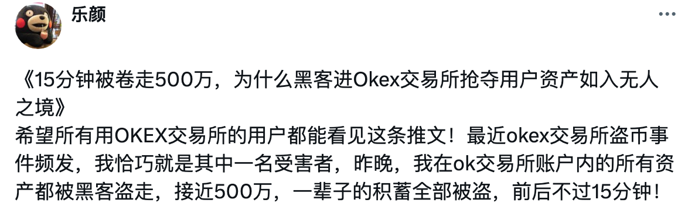
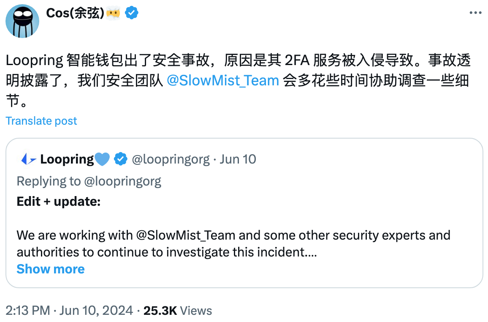
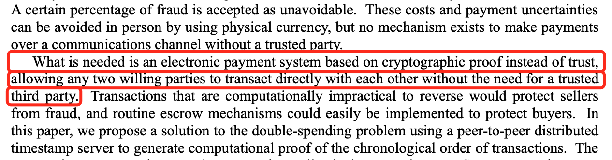
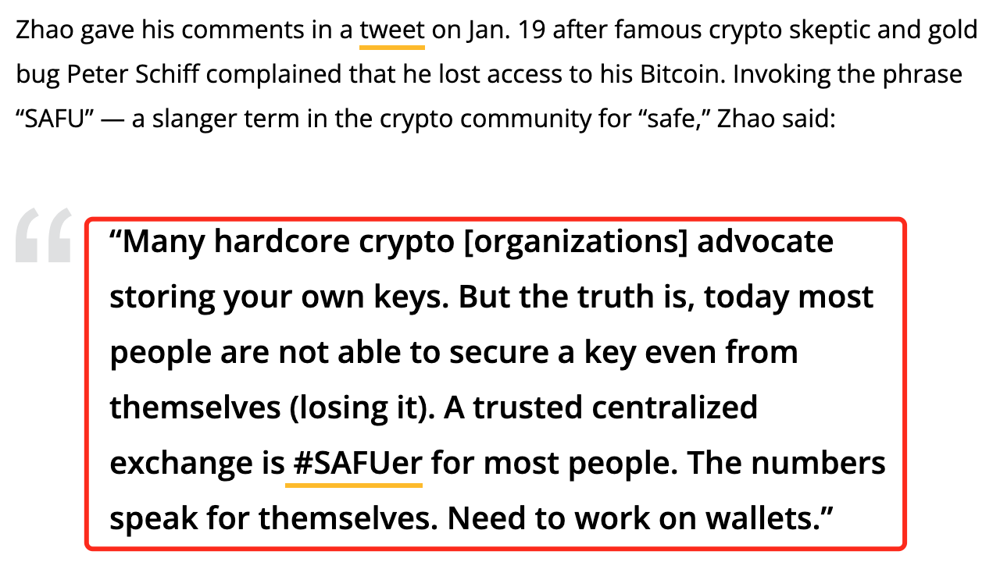
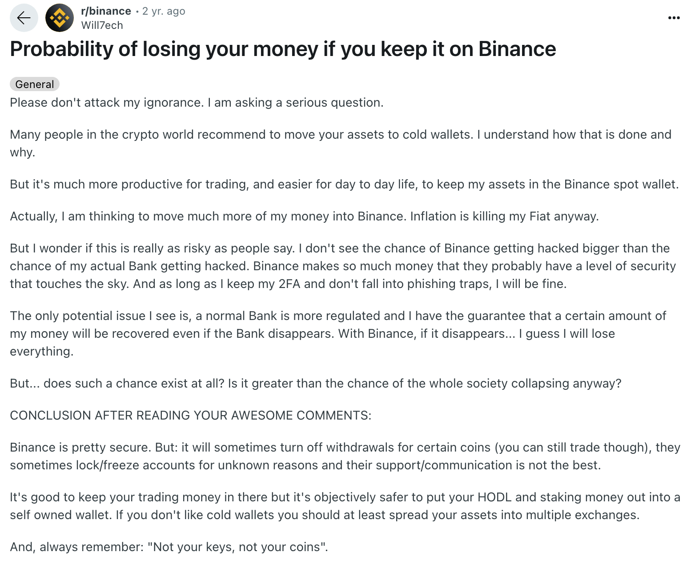

# 你要丢几百万刀才能学会不把币放在交易所？

号外：[6.10内参：全球BTC ETF持仓已超中本聪](http://rd.liujiaolian.com/i/20240610)

* * *

近期接二连三的几例盗币事故令人揪心，不仅事主们丢币金额普遍在百万刀以上的量级，几乎就是失去了全部身家，而且所涉及的平台并非二线、三线小平台，而是这么多年深受广大用户信赖的一线大所（交易所），或者一贯以技术实力标榜的知名品牌，真的是触目惊心。

首先是教链在{6.4内参}中介绍的5.24被盗百万美刀资产的binance用户。教链还在6.5就此撰文{《区块链安全“猜疑链”》}，告诉各位读者朋友一个分析区块链资产安全性的模型和方法。

然后是昨晚{6.10内参}中提到的，okx用户的账户资产被洗劫一空，损失近500万（rmb还是usd，事主没说清楚）。这是6月9号的事。

第三个案例就是{6.9内参}所说的，loopring（路印）的智能钱包遭黑客攻击。黑客不知道用了什么手段，攻破了路印的双因子验证(2FA)系统，成功偷走了部分路印智能钱包用户存放的资产。这对于整个智能钱包赛道，包括以太坊创始人Vitalik Buterin一直强烈推荐的“抽象钱包”相关的产品，可能都是一个不小的打击。

被盗币一夜返贫，和合约爆仓一样，直面冲击的当事人一定是瞬间大脑空白，整个世界骤然变得无比安静。就像{《美国内战》}开头的人肉炸弹，突然爆炸的冲击波把幸存者的双耳瞬间致聋，背景音乐和嘈杂的人声戛然而止，场景突然变得安静的可怕。（也许只有在电影院里，才会获得这种骤静的反差感体验，很棒）

回过神来之后，心头又涌上什么滋味？心痛？无助？迷茫？

愿天下无贼？那是不可能、不现实的。

怎么办？提币。自己保管私钥。尝试一下，{《如何使用私钥保管比特币》}。{“猜疑链”理论}已经告诉你了，不要试图依赖于任何第三方平台。

比特币的发明者中本聪早已在{2008年的白皮书}上就已经明示各位，比特币诞生的唯一原因就是“摆脱第三方”：「我们需要的是一个基于密码学证明而非信任的电子支付系统，允许有意愿的任意双方互相直接交易而无需一个受信任的第三方。」

自称“去中心化”坚定信仰者的前binance老板cz却曾在2020.1.19发推（原推已删除，下图是cointelegraph的报道截图）告诫小白用户：把币放在我们平台是更安全的。

他的原话是这样说的：「许多硬核加密人士[组织]都提倡存储自己的密钥。但事实是，如今大多数人都无法确保密钥的安全，甚至无法防止自己丢失密钥。对大多数人来说，可信的中心化交易所才是更安全的。统计数字本身就说明了问题。需要在钱包上下功夫。」

教链就要问一个问题：统计数据表明，100%的人类婴儿刚出生时都无法直立行走，这就可以得出结论说，所有的婴儿都不要再学走路，一直使用大厂制造的婴儿车来代步吗？

婴儿们在出生后需要婴儿车固然是一个事实。但是比这个事实更重要的事实是，他们在1岁左右的时候都需要学会独立行走，否则就将永远是一个弱者。

什么叫“独立”行走？就是不再需要依靠任何第三人，任何辅助工具，比如拐杖，比如轮椅。长大了仍然不能独立行走的人，我们称之为残疾人。

自己掌握私钥，不存在任何生理上的限制，唯一的限制是知识上的，以及心理上的。

心理上的那根拐棍扔不掉，就永远需要依靠它才能勉强行走。

可是这心理上的依靠，却并不是永远100%可靠。于是依靠、依靠，终将无依无靠。

中本聪发明比特币，就是想要让每个人都能独立地站起来。

千年之后再回首，也许后人会感叹，今天的人类学会掌握私钥，学会自己控制比特币，在人类进化史上的地位，不亚于300万年前南方古猿学会直立行走，或者几十至百万年前人类学会控制和使用火。

2022年初，一位网友在reddit上的帖子可以看作是一个总结。帖子的标题是，“如果把钱放在币安（Binance），有多大可能性丢掉？”

原帖如下：

「请不要攻击我的无知。我在问一个严肃的问题。

「加密世界的很多人都建议将资产转移到冷钱包中。我理解他们的做法和原因。

「但是，将我的资产保存在 Binance 现货钱包中，交易效率更高，日常生活也更方便。

「事实上，我正在考虑将更多的资金转移到 Binance。无论如何，通胀正在扼杀我的法币。

「但我不知道这是否真的像人们说的那样有风险。我觉得 Binance 被黑的几率并不比我的银行被黑的几率大。Binance 赚了那么多钱，他们的安全级别可能已经达到了天文数字。只要我保持 2FA（双因子验证），不掉入网络钓鱼陷阱，我就不会有事。

「我认为唯一的潜在问题是，普通银行受到更严格的监管，即使银行消失，我也能保证收回一定数额的资金。而 Binance，如果它消失了... 我想我会失去一切

「但是......这种可能性存在吗？比整个社会崩溃的几率大吗？

**「看了你们的精彩评论后得出的结论：**

「Binance 相当安全。但是：它有时会关闭某些币种的提现（但你仍然可以交易），有时会因不明原因锁定/冻结账户，而且他们的支持/沟通不是最好的。

「把你的交易资金放在那里是不错，但客观来说，把你的 HODL（长期持有）和质押资金放在自己的钱包里更安全。如果你不喜欢冷钱包，至少应该将你的资产分散到多个交易所。

**「而且，请永远记住：“不是你的私钥，不是你的币”。」**

