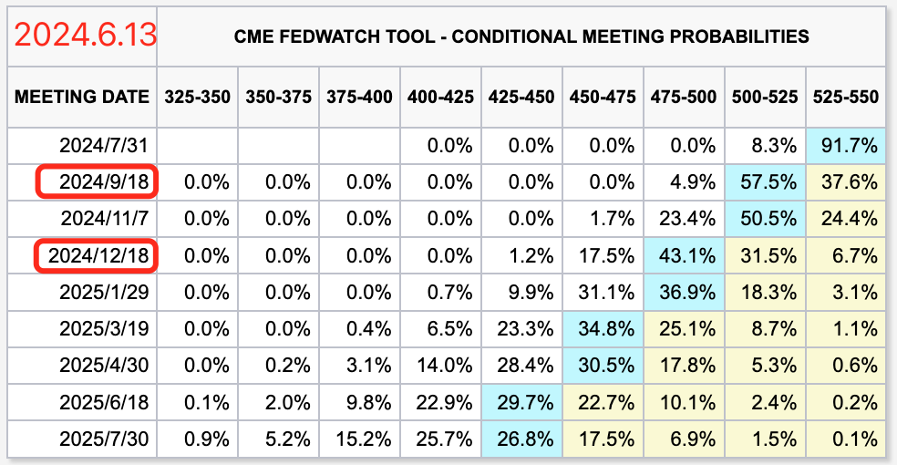
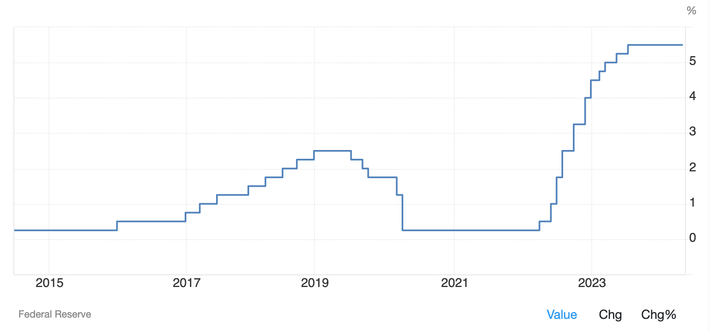

# 中美迫近临界点，美联储欲毕其功于一役

号外：[6.12内参：美现货BTC ETF资金端真相](http://rd.liujiaolian.com/i/20240612)

* * *

隔夜美联储6月份议息会议结束。平平无奇的结论，符合市场预期，保持联邦基金利率525-550不变。美联储官员们通过点阵图向市场传达了今年只降一次25bp的决心。但是市场依然预期要降两次。一次在九月，另一次在12月。

开会之前，过于强劲的美国非农就业数据把市场吓得不轻（参见{6.7教链内参：周五，一声惊雷！}）。随后，BTC（比特币）一度跌穿30日均线，撤到66k附近，创造了逢跌加仓的机会。开会期间，超预期缓和的CPI通胀数据又把市场情绪重新点燃（参见{6.12教链内参：美现货BTC ETF资金端真相}）。BTC应声爆拉，一度杀回7万刀。

如教链所言，美联储主席鲍威尔肯定要在会后发布会上对市场情绪进行“安抚”。过热就破点儿冷水，过冷就给几颗甜枣。果不其然，面对高昂的市场情绪，鲍大爷用话术进行了降温，称通胀虽已大幅缓解，但仍然过高，对通胀缓解的信心还没有达到足够进行降息的程度，现在没有人会把降息作为基本预期，云云。

于是，BTC便又再次回撤，丢掉了大半涨幅，暂时重新回撤到68k以下。

美联储顽强地保持货币紧缩，就是在赌，它可以赢得2019-2023对中国的这一场金融战。

亲身经历过1929-1933年“大萧条”的美国，对资本主义生产危机了解透彻，并想借用这一周期性危机的力量，击溃对手。

1929年的美国，是当时世界第一的工业国（始于1894年超越英国）。2019年，世界第一制造业国家是中国（始于2010年超越美国）。

借助经济周期，打败工业国的策略是公开写在教科书上的。当今世界主流的生产方式是资本主义生产方式。资本主义生产方式，简单讲就是通过工资雇佣制生产利润（剩余价值）的生产方式。其软肋就在于，这样的经济循环会天然走向通缩。也就是产能越来越大，也就是商品造的越来越多，而购买力越来越小，直白的说就是消费的钱越来越少。到达一个临界点就会出现这样的“死亡螺旋”：

1. 商品太多，消费不足，于是商品被迫降价（亏损）或者干脆卖不出去。于是：
2. 工厂减产，企业裁员，员工下岗，或者留岗降薪。于是：
3. 大量的人收入减少甚至没有收入了，于是更加没钱消费。于是：
4. 商品更加卖不出去，…… （陷入死循环）

我们的中学课本里也曾写过一个生动的故事，教链至今记忆犹新：

煤矿工人失业了。冬天，家里没有烧壁炉，屋里很冷。
女儿问爸爸：为什么不烧壁炉呀？爸爸答：因为家里已经没有煤了。
女儿问：为什么没有煤了？爸爸答：因为没钱买煤。
女儿问：为什么没钱买煤呢？爸爸答：因为我失业了。
女儿问：为什么爸爸失业了呢？爸爸答：因为煤生产的太多了。

因为煤太多了，所以爸爸和女儿一家人没有煤烧火取暖。讽刺吗？现实就是如此魔幻。

教链在《比特币史话》第十章第40话“大萧条”中说过，2019，仿佛是又一个1929。（参见2024.5.22《人生发财靠康波》）

1929，第3次康波萧条；2019，第5次康波萧条。

如今，一百年过去，早已完成去工业的化的美国，相当于已经练成了“葵花宝典”，自宫了。既然自宫了，就对上面的通缩螺旋有了免疫力，不会再度陷入1929-1933年大萧条时，牛奶倒入密西西比河的窘境。自宫了，也就可以对其他生产国实施“降维打击”了。（注：刘慈欣《三体》里的降维打击，说的就是先无底线摆烂，从而打败不好意思突破底线的对手。）

既然自己已经立于不败之地了，那么打败一个工业生产型对手的办法很简单，就是想方设法让对方生产的东西卖不出去，于是产能过剩，商品滞销，工厂倒闭，员工失业，经济崩溃。

于是美国就可以通过下列三招组合拳，趁着康波萧条的良机，加速工业生产制造经济循环系统的通缩螺旋，以图把中国干趴下：

第一招，“禁”字诀。提高贸易壁垒，人为迟滞商品销量。直接用政治手段干预，阻止中国商品销往世界第一大消费市场——美国。失去了消费市场，生产出来的海量商品眼瞅着就要滞销，企业就要破产。2018年，特朗普总统就发起了对华贸易战。该项政策被拜登政府延续至今。

第二招，“紧”字诀。实施货币紧缩，人为减少货币数量。通过美联储加息缩表，发起金融战，和贸易战相互配合，让全球的钱都减少，购买力减少，消费力下降，进一步削弱了整个世界购买中国商品、消化中国产能的能力。

下图是美联储自2016年开始加息以来的利率走势。可以看到，中间出了一次意外：2020年疫情。如果不是这次意外，也许美联储本来是想直接一口气拉爆利率，拉爆中国的。

金融和实业，在货币上，是竞争关系。钱跑去趴在账上吃美联储给的高息，就不会跑去实业上面变成生产资本。同时，市场上的钱变少了，消费也会萎缩。于是，美联储紧缩货币，对生产国的实业造成双重打击：一方面，是从投资端，釜底抽薪；另一方面，是从消费端，令商品滞销。双重打击，企业扛不住就裁员、破产，人员失业，消费进一步萎缩，“死亡螺旋”被助推加速，经济陷入通缩……

第三招，“金”字诀。重金收买，远程养殖，发动心理战、学术战、舆论战。决定战争胜败的是民心。通过操纵思想，操纵民意，比如收买专家、媒体、科普大V给民众灌输不抵抗思想（包装成“经济自由”等话术），炮制“产能过剩”等误导性概念（过剩其实是相对概念，多、好、省反倒成了坏事了），以图裹挟国家政策，让堡垒从内部被攻破。

《西游记》第八回说到，「如来又取出三个箍儿，递与菩萨道：“此宝唤做‘紧箍儿’，虽是一样三个，但只是用各不同。我有‘金、紧、禁’的咒语三篇。…… 」

“今日欢呼孙大圣，只缘妖雾又重来。” 妖魔鬼怪不足惧，头上金箍似千钧。

如果2019-2023就像当年的1929-1933，那么今天的中国，虽然深陷通缩之中，但是状态显然比当年“大萧条”中的美国要好不少。

现在临界点越来越近了。到底是美联储拉爆中国，美国不战而胜。还是中国抗住了金紧禁三道咒语，成功复苏，走出通缩，美联储黯然落败，转入降息宽松周期。我们拭目以待。

经济基础决定上层建筑。这一次互掰手腕的胜负结局，将决定中美两国、东西两方，未来百年（接下来一两个康波周期）的运势升降。

中国的脱困之法，在教链看来，既不会是当今西方左派的直升机撒钱拉动消费，消化商品产能，饮鸩止渴，埋下未来更大危机的隐患；更不会是当今西方右派的自由放任，让杠杆自由落地，应爆尽爆，刮骨疗毒，企业破产去产能，然后坐等经济爆破后自行缓慢修复。

这两种思路其实都是围绕着通缩打补丁。就像一个人不会游泳掉水里了，前一种方法是拼命挣扎，试图延缓溺水的过程，后一种方法则是干脆放弃，等沉底之后，尸体就会自然飘起来的。

就是没有人（经济学家）想过，为什么不能提前学会游泳？

这就叫做“解铃还需系铃人”。

要破解资本主义生产方式的通缩死亡螺旋陷阱，就不能围绕着解决通缩问题打补丁，而是要把资本主义生产方式，即通过工资雇佣制的手段、以生产利润为目的的生产方式，改造掉。

要么，改造成为，仍然借助工资雇佣制的手段，但是以积累资本（共同资本）为目的的，社会主义生产方式。

要么，改造成为，彻底扬弃了工资雇佣制的手段，也不再以生产利润为目的的，共产主义生产方式。这种生产方式，以目前的社会生产力水平可能还做不到，暂不讨论。

也就是说，我们可以通过有计划地组织大基建项目，通过招工，以按劳分配的形式把钱发到劳动者——即消费者手中，这就仍然是工资雇佣制，但是，不同点在于，此类项目的目标，或者说考核KPI，不是年度财报里面的利润指标，赚了多少钱，而是资本——共同资本，不是私人资本——的增长和积累。

这里的资本，指的是奥派大师米塞斯所说的“资本财”（资本财货）或者“资本品”，是与适用于消费者的“消费财”、“消费品”相对立的特殊商品。比如，汽车是消费品，而汽车生产线就是资本品。

米塞斯把“资本”一词用于专指资本品的货币化（定价），我们不采用这个定义。我们当然知道，金融资本、货币资本也是资本的一种。但是我们更明白，金钱只是数字游戏，并不是真正的财富。如果没有汽车生产线，你有再多钱也无法造出汽车。

当然，米塞斯认为，社会主义因为缺失了价格体系指导而无法对资本财进行最优配置。他认为资本财恰恰是因生产手段的私人占有而出现，否则就没有交换比率或货币价格这回事。如果把眼界局限在资本主义生产方式的圈子（紧箍儿）之中，的确应当同意他的部分观点。但是，他的观点再怎么正确，也不能对跳出通缩死亡螺旋有丝毫帮助。相反的，按他的理论，你能做的只有等死，死了之后尸体自然就会漂浮起来的。

但我们中国人自古以来的思维就从来不是等死。天破了，就要补天。水滥了，就要治水。山挡了路，就要移山。太阳太多了，就要射日。

《西游记》开篇诗云：「欲知造化会元功，须看西游释厄传。」何谓之“造化会元功”？那正是长生不老的功夫。

国家要“造化会元”，就须在经济上能够遨游于康波周期起起伏伏的海洋，任浪奔浪涌、狂风巨浪，始终屹立风口浪尖，而不会被海浪拍死在沙滩上。活着穿越一个个牛熊周期、盛衰周期，也就实现了国家共同体的“长生不老”。

要想活着穿越周期，就只能是练好水性。跳出当今主流经济学（资本主义经济学）的条条框框，用美国人的话说就是“think out of the box”（在盒子外面思考）。于是就可以得出一个反直觉的推论：

解决所谓产能过剩、经济通缩、死亡螺旋的方法，是进一步扩大产能。

—— 当然，需要仔细选择扩大哪些产能。比如袜子、玩具的产能就不用扩大了。要扩大的是，导弹、航母、无人机的产能，高端芯片的产能，航空航天的产能，新能源的产能，……

如果逆向思维一下，用社会主义生产方式代替资本主义生产方式，就会发现，你可以进入到下面这个正反馈循环了：

1. 更大的产能带来更多的就业。于是：
2. 更多的就业带来更多的消费。于是：
3. 更多的消费拉动更多的生产。于是：
4. 更多的生产产出更多、更便宜的商品。于是：
5. 更便宜的商品刺激更多的消费…… （进入正向循环）

而且，这个模型的逻辑闭环是通顺的：更多物美价廉的商品让人们过上更好的生活。而不是资本主义生产方式的“煤越多，我家越没有煤可烧”的魔幻现实。

如果美联储持续紧缩货币，却不能阻止中国继续积累能够生产真正财富的生产性资本，那就会让美国自己受到更大的“反弹”伤害：美债将在持续的高息之下把美国自己送往西天极乐世界。
