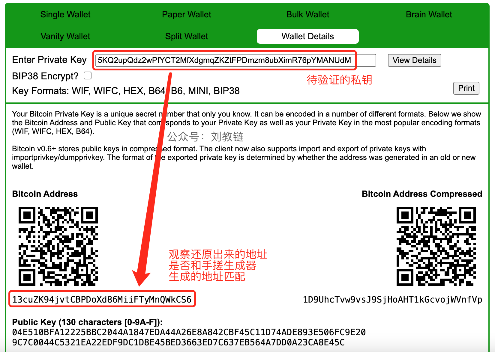

# 自己手搓一个比特币私钥地址生成器，不到百行代码，不依赖第三方库！

号外：[6.14内参：今年上半年迄今加密空投规模40亿刀](http://rd.liujiaolian.com/i/20240614)

* * *

隔夜BTC（比特币）抹去前日反弹全部涨幅，回撤到66.6k一线。这几天宏观面变局丛生，市场有些无所适从，急上急下，拉出了长长的红柱子和绿柱子。

前几日，教链介绍物美价廉“真·冷钱包”的两篇文章，2024.6.11《你要丢几百万刀才能学会不把币放在交易所？》以及2024.6.12《哪里能买到冷钱包？答案你肯定想不到！》引起了广大读者的广泛共鸣和热烈讨论。

读懂了文章的朋友这下子都了解了，这链上自己真正持有比特币，可以分成两部分操作：一个叫做存币，另一个叫做动币。

其中，“存币”指的是怎么把比特币从交易所里提出来，放到自己秘密生成的比特币地址里长期存储起来。而“动币”则指的是把存在比特币地址里的币给转出去，或者叫做花费掉。

这两部分，无论是存币，还是动币，都涉及到一系列独特的操作环节和安全问题。而教链之前的文章，其实也仅仅简单谈了谈“存币”这个环节的安全和实践问题而已。

整个“存币”流程，又可以大致划分为几个步骤：

生成私钥 - 生成地址 - 保管私钥 - 提币到地址

对应的工具分别为：

生成器 - 生成器 - 纸和笔 - 交易所

安全链分析：

开源工具 - 开源工具 - 自己的 - 第三方平台

这其中首要环节，就是秘密生成足够安全的私钥。

教链讲过了，私钥本质上就是一个数字，一个巨大的正整数。更重要的是，私钥是一个随机数。“随机”是非常关键的，只有足够无规律，足够乱七八糟，才能确保它不被黑客轻易猜出来。

所以这也是为什么如果你去尝试一下教链之前文章介绍的bitaddress网页生成器，它会在一开始要求你晃动鼠标，收集一些混乱的数据的原因所在：产生足够无规律的随机性，以增强私钥的安全性。

把这个巨大的随机数进行一定格式的编码，就变成了我们抄写的私钥。

有了私钥，进行一定的规律运算，就会得到一个对应的比特币地址。一个私钥，对应一个地址。换一个私钥，对应的地址也不同。

此前教链文章谈过，中本聪之所以要发明比特币，就是要消除对第三方，或者叫做受信任第三方（trusted third party）的依赖。

对比一下，如果我使用硬件钱包产品或者App的话，它们的背后是一家公司在开发和维护，那么安全链就退化成了：

公司产品 - 公司产品 - 公司产品(私钥存在产品里)&个人物品(助记词抄在本子上) - 第三方平台

记住，从可靠性、稳定性以及反锁定性上讲：公开算法 > 依赖开源产品 > 依赖公司产品 > 依赖封闭产品 > 依赖第三方平台（云服务）。

所谓“反锁定性”，就是指你一旦用了这家公司的产品，就被它牢牢捆绑，再也摆脱不了。它如果倒闭破产，可能你使用多年积累的资产就化为乌有了。

从企业的心态上讲，为了获得市场竞争优势，它们一定会千方百计设计各种套路，来留住用户，把用户锁定在自己的产品或者平台上。这是经济利益驱动的，不可能避免这个倾向。而这对于你安全地、不受第三方“绑架”的、个人掌握最大权利的长期保存自己的比特币资产，是非常不利的。

所以，首先就应该尽量减少对任何单一企业产品的依赖。能用真正社区维护的开源产品，就不要用企业生产的产品和服务。

如果一家企业向你推销它们的加密产品，你不妨问一下他们，有没有竞争对手能做和他们一样的甚至比他们更好的产品。如果他们很骄傲的说，全世界就他们独一家能做这东西，是近乎垄断的存在。那你可千万能跑多远跑多远！千万千万不要用它们的产品。

而如果他们很谦虚地告诉你一个比他们做得更好的竞争对手。那么你不妨先去试试那个竞争对手的产品，哈哈。所以，从这个思想实验我们也可以看出，比特币天然是反垄断的。

每个独立个体、每个比特币人对于自己比特币资产的高度所有权的要求，就必然会推导出对于任何单一企业垄断任何一个环节的反对。

在教链此前介绍的“真·冷钱包”的生成环节中，使用了开源网页生成器（可下载保存，离线使用），但是仍有部分读者表示疑问，这工具可靠吗？

本文教链就教给大家一个进一步消除第三方依赖，自己秘密生成比特币私钥和地址的办法。

因为私钥就是随机数，而地址就是用私钥通过一个公开的算法计算出来的，所以完全可以自己写一段代码就可以搞定。

下面贴出了一段还不到100行的完整python代码。这代码不需要依赖第三方库。

你只需要在电脑上安装python这个语言的编程环境（https://www.python.org/）——这个语言在AI时代已经非常非常主流了。

把文末的代码复制粘贴到记事本里，然后随意起个文件名比如叫 bitcoin-address-generator.py 保存一下，用python环境运行这个代码文件就能输出类似这样的结果了：

```
Address: 13cuZK94jvtCBPDoXd86MiiFTyMnQWkCS6
Privkey: 5KQ2upQdz2wPfYCT2MfXdgmqZKZtFPDmzm8ubXimR76pYMANUdM
```

上面一行是比特币地址。下面一行是比特币私钥。每次运行都会生成一对不同的地址和私钥。取之不尽，用之不竭。

这段简单的代码没有提供验证功能。你可以把它生成的私钥，输入到此前教链介绍过的bitaddress网页生成器中，进行验证，看看地址是不是匹配。交叉验证，你也就更容易知道它们有没有骗你。也可以通过验证一致，确保自己没有抄写错误。



这样一来，我们的安全链就进一步增强了：

生成器代码 - 生成器代码 - 纸和笔 - 交易所

自己的 - 自己的 - 自己的 - 第三方平台

那么，这段代码的安全性如何呢？主要看其中私钥生成的随机性是不是足够安全。从下面的代码显然可知，它用的是python的os.urandom()函数取得随机数。而根据python文档，该函数的随机性足以达到“密码学安全”的要求。文档原话：Return a bytestring of size random bytes suitable for cryptographic use.（返回适合加密使用的随机字节大小的字节字符串。）

所以，虽然这段代码没有像bitaddress网页生成器那样需要你晃动鼠标添加随机性（因为受网页环境限制，它不得不这样做），但是它通过对系统底层随机性的获取，足以产生密码学安全的随机数作为安全的私钥。

下面，就是这段生成器的完整开源代码：

```python
import os
import hashlib

def sha256(data):
    digest = hashlib.new("sha256")
    digest.update(data)
    return digest.digest()

def ripemd160(x):
    d = hashlib.new("ripemd160")
    d.update(x)
    return d.digest()

def b58(data):
    B58 = "123456789ABCDEFGHJKLMNPQRSTUVWXYZabcdefghijkmnopqrstuvwxyz"

    if data[0] == 0:
        return "1" + b58(data[1:])

    x = sum([v * (256 ** i) for i, v in enumerate(data[::-1])])
    ret = ""
    while x > 0:
        ret = B58[x % 58] + ret
        x = x // 58

    return ret

class Point:
    def __init__(self,
        x=0x79BE667EF9DCBBAC55A06295CE870B07029BFCDB2DCE28D959F2815B16F81798,
        y=0x483ADA7726A3C4655DA4FBFC0E1108A8FD17B448A68554199C47D08FFB10D4B8,
        p=2**256 - 2**32 - 2**9 - 2**8 - 2**7 - 2**6 - 2**4 - 1):
        self.x = x
        self.y = y
        self.p = p

    def __add__(self, other):
        return self.__radd__(other)

    def __mul__(self, other):
        return self.__rmul__(other)

    def __rmul__(self, other):
        n = self
        q = None

        for i in range(256):
            if other & (1 << i):
                q = q + n
            n = n + n

        return q

    def __radd__(self, other):
        if other is None:
            return self
        x1 = other.x
        y1 = other.y
        x2 = self.x
        y2 = self.y
        p = self.p

        if self == other:
            l = pow(2 * y2 % p, p-2, p) * (3 * x2 * x2) % p
        else:
            l = pow(x1 - x2, p-2, p) * (y1 - y2) % p

        newX = (l ** 2 - x2 - x1) % p
        newY = (l * x2 - l * newX - y2) % p

        return Point(newX, newY)

    def toBytes(self):
        x = self.x.to_bytes(32, "big")
        y = self.y.to_bytes(32, "big")
        return b"\x04" + x + y

def getPublicKey(privkey):
    SPEC256k1 = Point()
    pk = int.from_bytes(privkey, "big")
    hash160 = ripemd160(sha256((SPEC256k1 * pk).toBytes()))
    address = b"\x00" + hash160

    address = b58(address + sha256(sha256(address))[:4])
    return address

def getWif(privkey):
    wif = b"\x80" + privkey
    wif = b58(wif + sha256(sha256(wif))[:4])
    return wif

if __name__ == "__main__":
    randomBytes = os.urandom(32)
    print("Address: " + getPublicKey(randomBytes))
    print("Privkey: " + getWif(randomBytes))
```

亲自手搓的好处是，就算全天下的加密产品企业都倒闭破产了，被取代了，也和你毫无关系。铁打的私钥，流水的企业。你的私钥在，你的比特币就在。

通过亲自手搓代码，离线秘密生成独属自己的比特币私钥和地址，聪明的读者也就领悟到了，为什么所谓封杀比特币近乎于一个无知的笑话。
