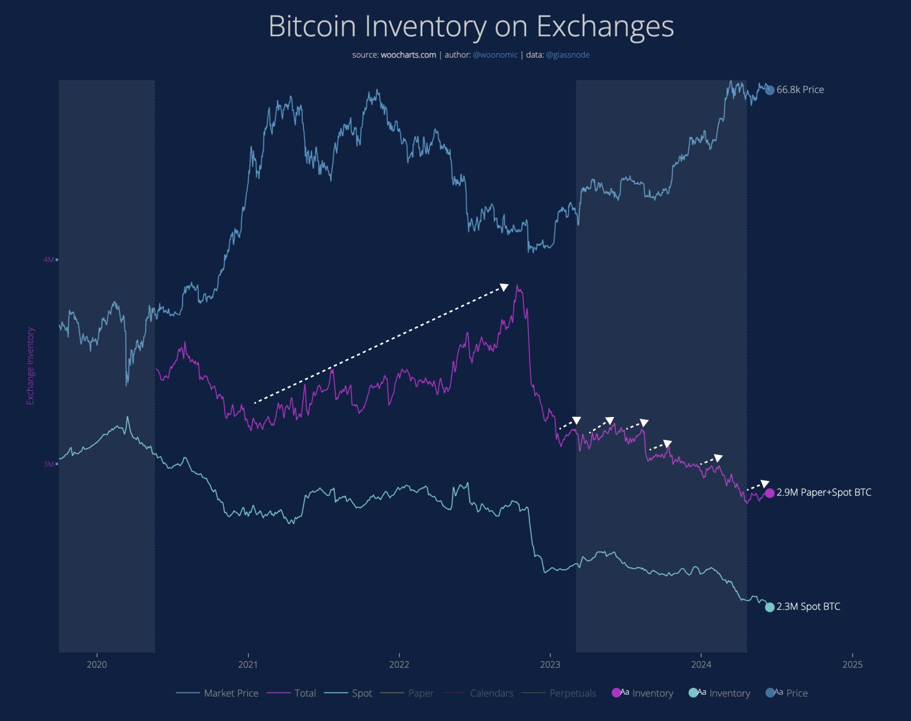
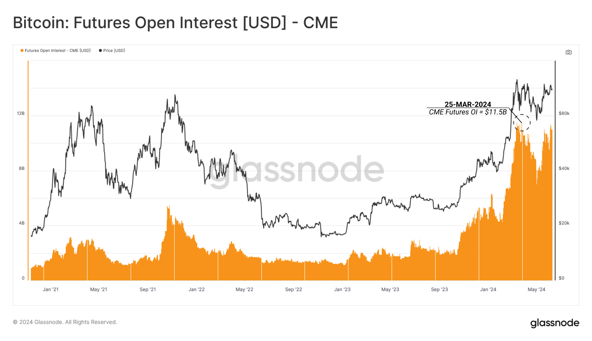
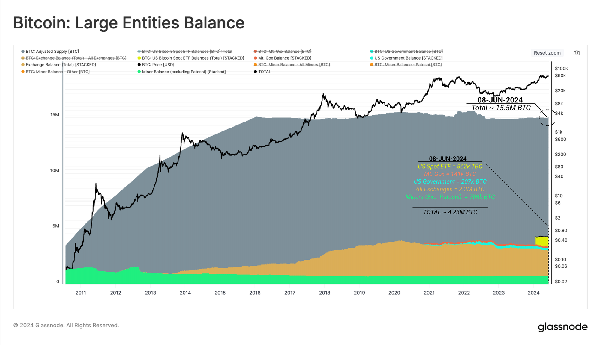

# 是谁，在卖出BTC？

号外：[6.14内参：福布斯评估加密首富cz财富超600亿美刀](http://rd.liujiaolian.com/i/20240614)

* * *

隔夜BTC（比特币）向下测试65k支撑，未能击穿，复又拉回66k一线。自3月新高、4月减半以来，BTC在60k-72k区间持续横盘震荡。5月初曾短暂向下击穿60k，下探56k，但只经两日，就又拉回震荡区间。

通常而言，市场上的非中性卖出者有两类：一是OG（老炮）群体，特指古早的BTC参与者，手上囤积了大量低成本筹码；另一类是miners（矿工）群体，他们会净生产BTC，并受到算力消耗带来的成本压力强迫抛售BTC，从而造成市场供应量的增加。

本质上，如果把市场交换看成是自由的，那么它是中性的。上面两类，实则是一类，都是矿工开采出来的增量。只是一个年代久远，一个新鲜出炉罢了。也就是说，对于市场，非中性的事件其实就是BTC的生产，也就是数量的增加。（丢失可能也是，但是你通常无法将其与长期HODL相区分。）

当4年一度的产量减半事件发生时，矿工就会或主动调整生产计划，或被动应对成本骤升，而向市场抛售大量的BTC，从而常常造成减半前后的市场价格回撤。如果此时恰巧叠加外部宏观经济负面因素，则可能会造成较为剧烈的回撤，从而发生激烈的去杠杆（爆仓）。

自从2017年那一轮牛市之后，情况有了变化。合约（期货）市场的兴起，为市场引入了大量的“裸空头”卖家。他们不持有任何BTC现货，只持有美元（稳定币），在市场上卖出“不存在的”BTC。这些BTC，亦被称之为“纸BTC”（paper BTC）。这是比喻的说法，实际的操作是，以稳定币或其他资产作超额抵押，借出BTC抛售，期待价格下跌后低价买入BTC偿还，从而获利。

下图向我们展示了，从2020年熊市以来，一轮牛熊周期中，“纸BTC”在整个市场中产生的影响。

从图中最下方的浅蓝色曲线可以看到，2020年至今，交易所中的现货BTC数量就开始了持续的减少。但是，如果加上“纸BTC”的话，我们会看到，在2021年牛市后期直至2022年熊市见底，紫色曲线所展示的纸BTC加上现货BTC的总量达到了一个局部的峰值。

可以说，每一次纸BTC的卷土重来（图中白色虚线箭头），都会导致市场局部的回撤。

裸卖空的投机行为透支了市场的购买力，使得市场在同等购买力涌入的情况下，无法再重复过往周期那种指数级增长。

另一方面，根据{6.12 内参：美现货BTC ETF资金端真相}所说的，迅速积累了近百万BTC的美现货ETF，根据最新的数据分析，绝大部分也不是长期囤积者持仓，而是对冲基金拿来做投机套利的工具。据估计，有高达2/3的ETF流入都是源于对冲基金们的期现套利交易。

对于这类套利交易而言，现货ETF持仓只是一个对冲期货市场做空的工具而已。这使得一大部分ETF的资金流入其实是中性的，而没有真正囤积者所带来的流动性紧缩和拉升效应。

这样一来，加密交易所的现货净流失，又有一部分其实是去往了ETF。这就是换汤不换药，把原本在加密交易所的套利交易，挪到了ETF和美股市场。

玩法没变。赚钱的人和赚手续费的人变了。原本是加密交易所们赚钱。现在是华尔街赚钱。

只是苦了现货市场。眼巴巴盼望着BTC能续创新高的人，还要多一些耐心，等待更多真正长期囤积者和长期投资资金的进入。

