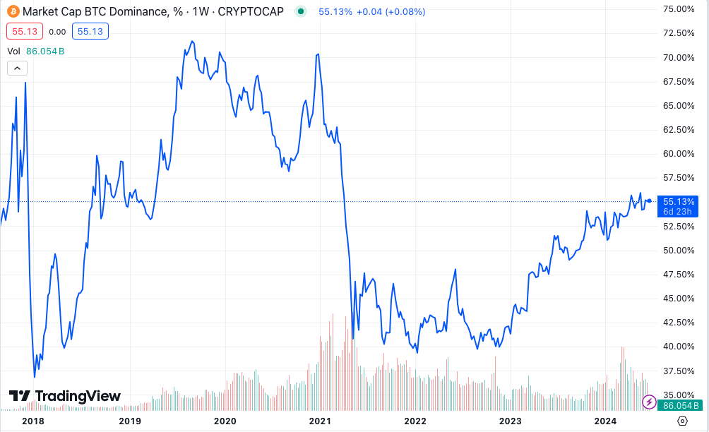
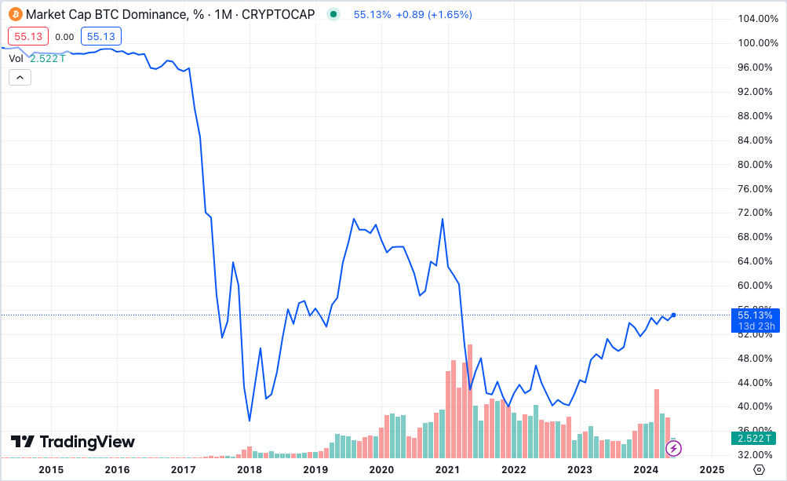
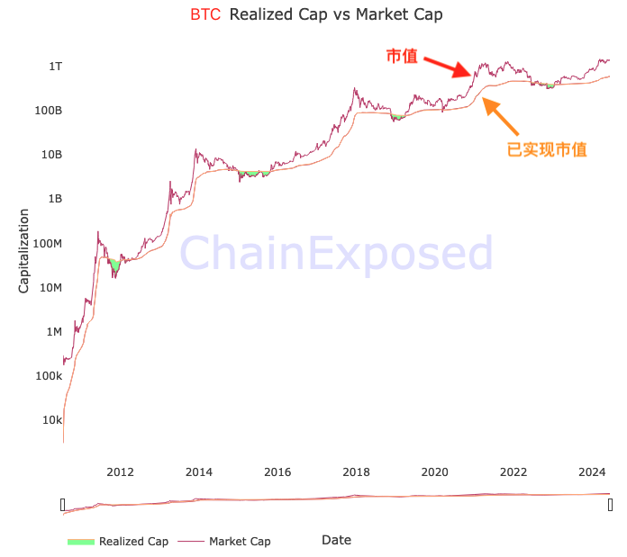

# BTC收复失地的背后，估值真相令人震惊

号外：[6.16内参：年中私董会召开，深谈价值闭环](http://rd.liujiaolian.com/i/20240616)

* * *

一周开始，周而复始。BTC（比特币）在66k一线徘徊。BTC近3个月的横盘震荡，在无声无息之间，竟悄然干了一件大事！看下图：

BTC市值占有率已从2022年底的40%局部低点，大举收复失地，回升至55%以上。

可以看出，山寨相对于BTC的强势，从2021的牛市见顶开始，一直延续到2022年熊市最底部。山寨开始走弱，反而要待到熊市复苏期，一直延续到牛市开始前。对于现在就大致相当于2023年底到2024年底。

也就是说，2022年底的熊市底部，应该抄底的，绝不应该是山寨，而应该是BTC。

而如果是对于押注山寨感兴趣的朋友，那么不应当错过2024年的窗口期。这一点教链早在2023年年底的VIP私董会上就谈过，具体可以回顾一下{2023.12.24教链内参：年度私董会干货总结}。

但是要玩押宝游戏那就要牢记十六字谶语：押对了宝，乐极生悲；押错了宝，万劫不复。

拉远视角看历史，山寨发币潮起源于2017年那一轮加密牛市。

在2017年之前，BTC市值占有率一直高达96%以上，甚至接近100%。

到了2017年底，疯狂的空气币泡沫和虚市值，把BTC的市值占有率一度干到低于40%！

虚市值泡沫是怎么人为制造的？发一个币，高度控盘，只有1%的流通盘在散户手里，在二级市场用极少资金就可以控制其价格。设总量100亿枚，99亿枚掌握在庄家手里，1亿枚真正在换手交易，把换手价控制在1美刀，那么瞬间就在市场上虚增出100亿美刀的山寨市值出来。这就是估值泡沫。

一个小区有1000套房子。其中一套最近以500万元成交。那么这个小区的估值就是50亿。这也是估值泡沫。当供需关系变化，需求减少，急于脱手的卖家竞相打折抛售的时候，泡沫的幻象就会被戳破。

与这种边际估值的市值（market cap）相对应的，有一个指标叫做“已实现市值”（realized market cap）。它追踪每一次BTC的移动，并认为这代表一次换手，乘以换手时的价格，最后汇总得出已实现市值。它更直观地反映出所有持有者的实际成本累积。我们不妨认为这更接近于一种“真实市值”。

像上面的高控盘小盘币的例子。可能1亿枚真正的换手就那么2亿枚乘以1美刀等于2亿美刀的真实市值。它仅仅是泡沫估值的1/50。

而对于小区房产估值的例子也是类似。可能该小区房价最早只有5万一套，绝大部分都没有再次出售过。1年才成交1套。累积下来，整个小区的已实现市值可能只有区区1个亿而已。比按边际估值的泡沫市值缩水了50倍！

从这个角度看，为什么我们说BTC的市值最坚实？看看已实现市值和市值的多么接近就十分清楚了。从下图可知，当前BTC的泡沫程度约为 1 - 0.414 = 0.586。

所以说，我们不要被泡沫估值方法计算市值的障眼法给迷惑了。

由于山寨大多数都是在中心化交易所里交易，很难追踪统计全球那么多交易平台的成交数据，它们也不会向统计机构提供数据。所以，我们只能凭经验做一个猜测。

比如，如果按照上面的思想实验里面1/50的比例来算，那么当前BTC市值占有率55%换算成已实现市值会是多少呢？

55 * 0.414 / ((100 - 55) / 50 + 55 * 0.414) = 96.2%

BTC的真实市占率高达96.2%！

震惊吗？的确令人感到震惊。

事实真相也许就是，BTC从未被一浪高过一浪的山寨狂潮击退。从未！

就算极度放宽参数到1/10，也就是说我们只认为目前各种乱七八糟的山寨、模因、土狗、空气，统统加在一起，仅仅只有10倍的估值泡沫！那么换算成已实现市值的话，BTC的市值占有率又会是多少呢？

55 * 0.414 / ((100 - 55) / 10 + 55 * 0.414) = 83.5% 

也有83.5%，超过80%。

我想，已无需多言。
